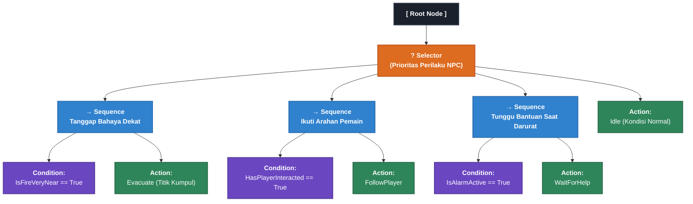

# 📋 CATATAN AUDIT & PANDUAN REVISI PROPOSAL SKRIPSI

**Kepada Mahasiswa:** Ahmad Dhafin (NIM: 2209106122)  
**Program Studi:** S1 Informatika, Fakultas Teknik, Universitas Mulawarman  
**Judul Proposal:** *Pengembangan Mini Game Edukatif Simulasi Penanganan Kebakaran Berbasis Roblox Menggunakan Behavior Tree*  
**Tanggal Audit:** 26 Agustus 2026  
**Status Evaluasi:** **Diterima dengan Catatan Revisi (Perlu Perbaikan Sebelum Seminar Proposal)**

---

## 🌟 1. Apresiasi & Catatan Positif

Secara keseluruhan, draf proposal kamu memiliki fondasi yang **sangat baik dan menarik**:
1. **Topik Sangat Relevan & Aplikatif:** Penggunaan Roblox Studio untuk simulasi keselamatan gedung baru FT UNMUL merupakan pendekatan modern yang efisien biaya (tanpa ketergantungan perangkat VR mahal).
2. **Kajian Literatur (Bab 2) Sangat Kuat:** Ringkasan 10 penelitian terdahulu dan **Tabel 2.1 (Matriks Perbedaan Penelitian)** disusun dengan sangat rapi dan berhasil menunjukkan *research gap* yang jelas.
3. **Penyusunan Alur Cerita & Lingkungan Jelas:** Konsep lingkungan 3D eksterior/interior gedung dan perancangan *wireframe* sudah memberikan gambaran simulasi yang konkret.

Namun, ada beberapa aspek **metodologi AI, konsistensi data, dan kerapian dokumen** yang harus kamu perbaiki agar proposal ini kokoh saat diuji di Seminar Proposal.

---

## 🚦 2. Ringkasan Status Kesiapan Naskah

| Komponen | Status | Catatan Utama |
| :--- | :---: | :--- |
| **Format & Halaman Depan** | ⚠️ *Perlu Perapian* | Hilangkan *Error Bookmark*, lengkapi placeholder template & komentar Word. |
| **Bab I: Pendahuluan** | ⚠️ *Revisi Sedang* | Sinkronkan kata "performa" pada Rumusan Masalah dengan metode pengujian di Bab 3. |
| **Bab II: Tinjauan Pustaka** | ✅ *Hampir Siap* | Perbaiki salah nomor gambar di teks dan hilangkan paragraf berulang. |
| **Bab III: Metodologi & AI** | 🚨 *Revisi Mayor* | Ganti diagram Flowchart biasa (Gambar 3.2) dengan **Diagram Hierarki Behavior Tree yang sesungguhnya**. |
| **Daftar Pustaka** | ⚠️ *Perlu Perapian* | Sesuaikan kapitalisasi judul dan perbaiki format DOI sesuai kaidah APA 7th. |

---

## 🔍 3. Rincian Catatan Revisi Bab per Bab

### 📄 Bagian Awal (Halaman Judul s.d. Daftar Singkatan)

1. **Hilangkan "Error! Bookmark not defined" di Daftar Isi & Daftar Gambar:**
   * Pada Daftar Isi (hal. iv–v) dan Daftar Gambar (hal. vii), beberapa subbab/gambar masih bertuliskan *Error! Bookmark not defined*.
   * **Solusi:** Di Microsoft Word, pastikan heading telah ditandai dengan benar, lalu klik kanan pada Daftar Isi > pilih **Update Field** > **Update entire table** sebelum menyimpan ke PDF.
2. **Lengkapi Template Kata Pengantar (Halaman iii):**
   * Masih terdapat teks bawaan template: *`Nama dan gelar akademik Dekan...`*, *`Nama Dosen Pembimbing...`*, dan *`Samarinda, ........... 2026`*.
   * Ada balon komentar Word yang ikut tercetak: *`Commented [1]: Menggunakan sapaan Bapak atau Ibu...`*. Pastikan semua komentar di-delete.
3. **Halaman Pengesahan (Halaman ii):**
   * Isi nama lengkap dosen pembimbing beserta gelar dan tanggal pembahasan.
4. **Daftar Lampiran (Halaman viii):**
   * Tertulis *`Lampiran 1 contents 42`*, padahal halaman lampiran belum ada. Jika belum ada lampiran, hapus sementara atau lampirkan instrumen kuesionernya di lembar paling belakang.

---

### 📘 BAB I – Pendahuluan

1. **Perbaikan Redaksi Rumusan Masalah (Subbab 1.2, Hal. 4):**
   * **Masalah:** Pada Rumusan Masalah, kamu menulis kata *"Bagaimana **performa** Behavior Tree..."*. 
   * **Penjelasan:** Kata *"performa"* menuntut adanya pengujian teknis komputasi (misal: *latency pengambilan keputusan*, *frame rate (FPS)*, atau konsumsi memori script). Sedangkan di Bab 3, pengujian yang kamu lakukan berfokus pada **kesesuaian fungsionalitas (Black Box)** dan **penerimaan pengguna (UAT)**.
   * **Rekomendasi Revisi Rumusan Masalah:**
     > **1.2 Rumusan Masalah:**  
     > 1. Bagaimana merancang dan mengimplementasikan arsitektur *Behavior Tree* dalam mengendalikan perilaku dinamis *Non-Player Character* (NPC) pada *mini-game* simulasi penanganan kebakaran berbasis Roblox?  
     > 2. Bagaimana hasil pengujian fungsionalitas sistem menggunakan *Black Box Testing* dan tingkat penerimaan pengguna menggunakan *User Acceptance Testing* (UAT) terhadap media simulasi yang dikembangkan?
2. **Sinkronisasi Tujuan Penelitian (Subbab 1.4, Hal. 5):**
   * Buat butir-butir Tujuan Penelitian menjawab secara simetris butir-butir Rumusan Masalah di atas.
3. **Penulisan Istilah Asing:**
   * Pastikan istilah asing seperti *mini-game*, *Non-Player Character*, *Behavior Tree*, *serious game* dicetak miring (*italic*) secara konsisten di seluruh naskah.

---

### 📗 BAB II – Tinjauan Pustaka

1. **Salah Nomor Gambar pada Teks (Subbab 2.6.1, Hal. 15):**
   * Di teks tertulis: *"Gambar 2.6 menunjukkan struktur dasar Behavior Tree..."*, padahal caption gambarnya adalah **Gambar 2.1**. Mohon dikoreksi.
2. **Format Sitasi Rusak di Tengah Kalimat (Subbab 2.7, Hal. 17):**
   * Tertulis: *"...digunakan sebagai (Lonteng et al., 2024)acuan dalam pengembangan..."*. Rapikan posisinya di akhir kalimat.
3. **Duplikasi Nama Pengarang (Subbab 2.9, Hal. 18):**
   * Tertulis *"Aliyah Aliyah et al., 2024"*, perbaiki menjadi *(Aliyah et al., 2024)*.
4. **Paragraf Berulang pada Subbab 2.10 (Black Box Testing, Hal. 20):**
   * Kalimat *"Teknik yang umum digunakan dalam Black Box Testing meliputi equivalence partitioning, boundary value analysis, dan use case testing..."* tertulis dua kali di paragraf 1 dan awal paragraf 2. Hapus salah satu pengulangannya.

---

### 📙 BAB III – Metodologi Penelitian

#### 🚨 1. REVISI UTAMA: Gambar 3.2 Bukan Diagram *Behavior Tree*
* **Masalah:** Gambar 3.2 (hal. 27) saat ini berupa **Flowchart IF-ELSE bersyarat**, bukan arsitektur pohon hierarki *Behavior Tree*.
* **Penjelasan Ilmiah:** *Behavior Tree* dievaluasi dari **Root** ke bawah melalui node komposit (**Selector `?`** untuk prioritas, **Sequence `→`** untuk aksi berurutan), di mana setiap cabang memeriksa kondisi (*Condition Node*) lalu mengeksekusi tindakan (*Action Node*).
* **Solusi Wajib:** Ganti Gambar 3.2 dengan diagram pohon hierarki *Behavior Tree* standar (Mermaid) seperti di bawah ini:

> **Cara Membaca Alur Evaluasi (*Tick*):**
> 1. Pohon dievaluasi secara periodik dari **Root** ke **Selector Node `?`**.
> 2. Selector mengevaluasi cabang dari **kiri ke kanan** berdasarkan prioritas:
>    - **Prioritas 1 (Bahaya Dekat):** Jika `IsFireVeryNear == True`, NPC langsung melakukan aksi `Evacuate`.
>    - **Prioritas 2 (Interaksi Pemain):** Jika pemain mengajak/berinteraksi (`HasPlayerInteracted == True`), NPC menjalankan `FollowPlayer`.
>    - **Prioritas 3 (Alarm Aktif):** Jika alarm menyala tapi belum ada interaksi (`IsAlarmActive == True`), NPC menjalankan `WaitForHelp`.
>    - **Prioritas 4 (Fallback):** Jika semua kondisi di atas False (tidak ada kebakaran), NPC tetap berada pada status `Idle`.

#### 2. Sinkronkan Jumlah State / Status NPC (Bab 2 vs Bab 3)
* Di Bab 2 (Tabel 2.1 baris 8, hal. 11), kamu menyebutkan *"enam (6) state perilaku"*.
* Di Bab 3 (Tabel 3.3, hal. 24), kamu hanya menuliskan **4 status**: `Idle`, `WaitForHelp`, `FollowPlayer`, dan `Evacuate`.
* *Pastikan jumlahnya konsisten di seluruh bab.*

#### 3. Perbaiki Nomor Referensi Tabel di Paragraf Penjelas
Periksa kembali teks penjelas tabel yang tidak cocok dengan label tabel aslinya:
* Hal. 24: Di teks tertulis *"Tabel 3.5"* ➔ Seharusnya **Tabel 3.3**.
* Hal. 25: Di teks tertulis *"Tabel 3.6"* ➔ Seharusnya **Tabel 3.4**.
* Hal. 28: Di teks tertulis *"Tabel 3.7"* ➔ Seharusnya **Tabel 3.5**.

#### 4. Tambahkan Penjelasan Teknis Implementasi Roblox Studio (Bahasa Luau)
Tambahkan 1–2 paragraf penjelasan singkat di Bab 3 mengenai:
* Bagaimana logika *Behavior Tree* ini dikodekan di Roblox (misal: apakah membuat script OOP modular sendiri atau memanfaatkan *module script open-source* seperti *BehaviorTree3*).
* Bagaimana pergerakan NPC saat evakuasi/mengikuti pemain (apakah menggunakan layanan bawaan `PathfindingService` Roblox untuk menghindari rintangan api/objek).

#### 5. Lengkapi Waktu & Tempat Penelitian (Subbab 3.7, Hal. 36–37)
* Isi titik-titik lokasi penelitian (misal: Gedung Baru FT UNMUL dan Laboratorium Informatika).
* Ganti judul `Tabel 3.x Jadwal Penelitian` menjadi `Tabel 3.9 Jadwal Penelitian` dan isi kolom rincian kegiatannya secara lengkap.

---

### 📚 Bagian Akhir: Daftar Pustaka

1. **Gunakan Huruf Kecil pada Judul Artikel (*Sentence Case*):**
   * Standar APA Style mengharuskan judul artikel jurnal/prosiding ditulis dengan huruf kapital hanya di awal kalimat (dan setelah tanda titik dua), bukan di setiap kata.
   * *Contoh salah:* `Virtual Reality Simulations For Effective Fire Safety Training In Passenger Trains`
   * *Contoh benar:* `Virtual reality simulations for effective fire safety training in passenger trains`
2. **Standarisasi Penulisan Tautan DOI / Web:**
   * Ubah `Https://Doi.Org/...` menjadi huruf kecil `https://doi.org/...`.
3. **Rapikan Rujukan dari Berita Web / Media:**
   * Referensi no. 8, 12, 14, dan 19 yang tertulis `(N.D.)` mohon dilengkapi nama instansi/redaksi dan tahun penerbitan yang sesuai.
4. **Referensi No. 20 (Bahasa Korea):**
   * Rapikan nama penulis dan gunakan judul versi bahasa Inggrisnya agar terbaca jelas oleh pembaca/penguji.

---

## 🎯 4. Pertanyaan Latihan untuk Persiapan Seminar Proposal

Coba siapkan jawaban untuk pertanyaan-pertanyaan yang kemungkinan besar ditanyakan penguji ini:

1. **"Kenapa memilih Behavior Tree, bukan Finite State Machine (FSM) yang lebih sederhana?"**  
   *Petunjuk Jawaban:* Jelaskan keunggulan BT dalam aspek modularitas (mudah menambah cabang perilaku baru tanpa merusak transisi logika yang ada) dan reaktivitas terhadap kondisi dinamis (misal api mendadak membesar).
2. **"Bagaimana cara NPC bergerak mencari rute evakuasi di Roblox saat api menghalangi jalan?"**  
   *Petunjuk Jawaban:* Jelaskan integrasi antara pengambilan keputusan oleh *Behavior Tree* dengan kalkulasi jalur titik koordinat menggunakan `PathfindingService` di Roblox.
3. **"Mengapa pengujian edukasi ini dibatasi pada UAT kuesioner, bukan dengan pre-test dan post-test pengetahuan kebakaran?"**  
   *Petunjuk Jawaban:* Jelaskan bahwa fokus skripsi S1 Informatika ini menitikberatkan pada aspek rekayasa perangkat lunak (*software engineering*) dan implementasi kecerdasan buatan (*AI behavior*), sedangkan pengukuran kognitif psikologis berada di luar ruang lingkup utama penelitian.

---

## ✅ 5. Lembar Checklist Tindak Lanjut Revisi

Silakan beri tanda centang `[v]` setelah kamu menyelesaikan poin perbaikan berikut:

- [ ] Memperbarui seluruh Daftar Isi, Daftar Tabel, dan Daftar Gambar di Word sehingga tidak ada lagi `Error! Bookmark not defined`.
- [ ] Mengisi nama pembimbing, dekan, dan menghapus komentar Word pada Kata Pengantar.
- [ ] Menyelaraskan kata pada Rumusan Masalah 1 dan Tujuan Penelitian (menghilangkan ambigu kata *performa* jika tidak ada uji komputasi kuantitatif).
- [ ] Mengoreksi nomor Gambar 2.1 (sebelumnya tertulis Gambar 2.6 pada teks hal. 15).
- [ ] Menghilangkan paragraf duplikasi pada Subbab 2.10 (Black Box Testing).
- [ ] **MENGGANTI Gambar 3.2 dengan Diagram Hierarki Behavior Tree yang benar.**
- [ ] Menyelaraskan jumlah state NPC antara Bab 2 dan Bab 3 (4 status).
- [ ] Mengoreksi seluruh nomor referensi tabel pada narasi teks di Bab 3.
- [ ] Melengkapi isian Waktu, Tempat, dan Jadwal Penelitian (Tabel 3.9).
- [ ] Merapikan format APA Style pada Daftar Pustaka (*sentence case* dan `https://doi.org`).

---
*Semangat menyelesaikan revisinya! Jika ada bagian logika Behavior Tree atau scripting Luau Roblox yang ingin didiskusikan lebih lanjut, silakan tanyakan pada sesi bimbingan berikutnya.*
