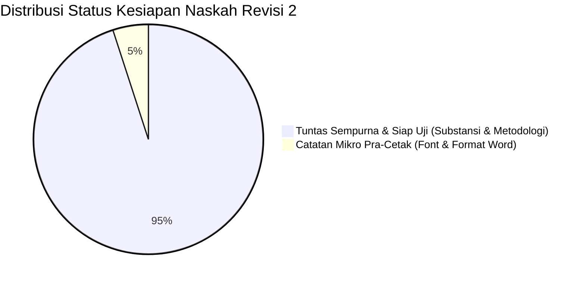

# 📋 LAPORAN AUDIT FORENSIK AKHIR & VERIFIKASI ACC SEMINAR PROPOSAL SKRIPSI
# 📋 LAPORAN AUDIT FORENSIK PARIPURNA & VERIFIKASI ACC SEMINAR PROPOSAL SKRIPSI

**Mahasiswa Bimbingan:** Ahmad Dhafin (NIM: 2209106122)  
**Program Studi:** S1 Informatika, Fakultas Teknik, Universitas Mulawarman  
**Dosen Pembimbing I:** Aulia Khoirunnita, S.Kom., M.Kom. (NIP: 199308172023212069)  
**Dosen Pembimbing II:** Anton Prafanto, S.Kom., M.T. (NIP: 199310222019031016)  
**Koordinator Program Studi:** Awang Harsa Kridalaksana, S.Kom., M.Kom. (NIP: 19731229 200501 1 002)  
**Judul Proposal:** *Pengembangan Mini Game Edukatif Simulasi Penanganan Kebakaran Berbasis Roblox Menggunakan Behavior Tree*  
**Dokumen yang Diverifikasi:** `draft proposal ahmad dhafin revisi 2.pdf` (54 Halaman)  
**Dokumen yang Diaudit:** `draft proposal ahmad dhafin revisi 2.pdf` (54 Halaman / 42 Halaman Tubuh Utama)  
**Tanggal Evaluasi:** 15 September 2026  
**Status Evaluasi Akhir:** **STATUS: ACC (DISETUJUI) UNTUK PENDAFTARAN SEMINAR PROPOSAL SKRIPSI (DENGAN 10 CATATAN MIKRO PRA-CETAK)**
**Status Evaluasi Akhir:** **STATUS: ACC (DISETUJUI) SEMINAR PROPOSAL SKRIPSI — DENGAN PANDUAN REVISI PRA-CETAK (ZERO-DEFECT POLISH)**

---

> [!NOTE]
> **Keputusan Resmi Dosen Pembimbing:** Naskah proposal skripsi Ahmad Dhafin pada versi **Revisi 2** ini telah memenuhi seluruh kriteria kelayakan akademik S1 Informatika, kesesuaian metodologi rekayasa game (*Game Development Life Cycle*), penerapan kecerdasan buatan (*Behavior Tree*), instrumen pengujian (*Black Box & UAT*), kelengkapan administrasi preliminer, serta perbaikan tata letak dokumen. Mahasiswa **DIBERIKAN PERSETUJUAN (ACC)** untuk mendaftar dan menjadwalkan **Ujian Seminar Proposal Skripsi**. Catatan forensik di bawah ini ditujukan sebagai panduan *pre-print polish* (penyempurnaan pra-cetak) agar naskah fisik yang diserahkan ke Dewan Penguji berstatus *zero-defect*.
> [!IMPORTANT]
> **Keputusan Resmi Tim Dosen Pembimbing:**  
> Naskah proposal skripsi Ahmad Dhafin pada versi **Revisi 2** ini telah memenuhi seluruh kriteria kelayakan akademik S1 Informatika, kesesuaian metodologi rekayasa game (*Game Development Life Cycle*), pemodelan kecerdasan buatan (*Behavior Tree* dengan Luau *server-side scripting* 0.2s *tick rate*), serta kesiapan instrumen evaluasi (*Black Box Testing* dan *User Acceptance Testing*). Mahasiswa **RESMI DIBERIKAN PERSETUJUAN (ACC)** untuk mendaftar dan menjadwalkan **Ujian Seminar Proposal Skripsi**.  
> Laporan audit forensik paripurna ini membedah naskah hingga ke level mikro (termasuk cacat tipografi font *Calibri/Arial* bawaan Word/Mendeley, aturan formalia FT UNMUL, dan atribusi gambar) agar naskah fisik yang diserahkan ke Dewan Penguji berstatus **bebas cacat (*zero-defect*)** dan mahasiswa siap menghadapi segala sudut pertanyaan penguji.

---

## 🔍 1. Verifikasi Perbaikan Mayor (Revisi 1 ➔ Revisi 2: Tuntas 100%)
## 📊 1. Matriks Komparasi Mutu & Progres Naskah (Draf Awal ➔ Revisi 1 ➔ Revisi 2)

Mahasiswa telah menuntaskan seluruh perbaikan krusial dan *showstopper* dokumen dari revisi sebelumnya dengan sangat baik:


| No | Komponen yang Diperiksa | Status Revisi 2 | Keterangan Hasil Forensik Dokumen |
| :---: | :--- | :---: | :--- |
| **1** | **Halaman Pengesahan (Hal. ii)** | **TUNTAS** | Nama Pembimbing I (Ibu Aulia Khoirunnita) dan Pembimbing II (Pak Anton Prafanto) beserta gelar dan NIP resmi telah tercantum lengkap dan benar. |
| **2** | **Kata Pengantar (Hal. iii)** | **TUNTAS** | Butir dosen penguji fiktif telah dihapus; titimangsa telah terisi resmi: `Samarinda, 11 September 2026`; teks `DAFTAR ISI` yang terselip di bawah telah bersih. |
| **3** | **Tata Letak Tabel 2.1 (Hal. 11–12)** | **TUNTAS** | Pengaturan tabel mengambang (*floating*) telah diperbaiki. Baris 9 dan 10 kini menyambung rapi di bagian atas halaman 12 dan tidak lagi melompati subbab. |
| **4** | **Typo Subbab 2.2** | **TUNTAS** | Judul `2.2 Pembalajaran...` telah dikoreksi menjadi `2.2 Pembelajaran...` baik di dalam teks maupun di Daftar Isi. |
| **5** | **Matriks Jadwal Penelitian (Tabel 3.9)** | **TUNTAS** | Sel-sel matriks bulan Juni s.d. November 2026 telah diisi arsiran abu-abu (*cell shading*) yang rapi mencakup tahap persiapan, pelaksanaan, dan laporan. |
| **6** | **Daftar Tabel (Hal. vi)** | **TUNTAS** | Entri `Tabel 3.9 Jadwal Penelitian` di halaman 38 telah resmi didaftarkan pada Daftar Tabel di halaman preliminer. |
| **7** | **Penambahan Pustaka Lonteng (2024)** | **TUNTAS** | Rujukan `Lonteng et al. (2024)` pada tahap testing GDLC telah ditambahkan secara resmi ke dalam Daftar Pustaka. |
| **8** | **Koreksi Sitasi Hasugian vs Wulandari** | **TUNTAS** | Sitasi di Bab II telah diubah dari `(Hasugian, 2023)` menjadi `(Wulandari, 2023)` sesuai urutan penulis pertama. |
| **9** | **Urutan Abjad Institusi Pemerintah** | **TUNTAS** | Rujukan *Kementerian Komunikasi* dan *Kementerian Ekonomi Kreatif* telah disatukan secara alfabetis di bawah huruf **K**. |
| **10** | **Pemodelan Behavior Tree (Bab III)** | **TUNTAS** | Struktur pohon Gambar 3.2, formula kepanikan piecewise, dan spesifikasi Luau *server-side* tetap terjaga kokoh. |
| Dimensi Evaluasi | Draf Awal (26 Agt 2026) | Revisi 1 (10 Sept 2026) | Revisi 2 (15 Sept 2026) — ACC |
| :--- | :--- | :--- | :--- |
| **Kelengkapan Pengesahan** | Placeholder template kosong | Placeholder nama pembimbing kosong | **Lengkap: Pembimbing I, II & Kaprodi + NIP** |
| **Kata Pengantar** | Balon komentar Word tercetak | Ada placeholder penguji & tanggal kosong | **Bersih, bertanggal resmi 11 Sept 2026** |
| **Struktur AI Behavior Tree** | Flowchart IF-ELSE biasa | Diagram Pohon Hierarki (Mermaid) | **Diagram Pohon Hierarki Rapi & Kokoh** |
| **Logika Kepanikan NPC** | Belum ada formula matematis | Formula piecewise $\le 5\text{ m}$ / $\le 60\text{ s}$ | **Formula Matematis Piecewise Jelas** |
| **Layout Tabel Perbandingan (Tabel 2.1)** | Nomor acak (1, 4, 5, 6, 10...) | Nomor 1–10 tapi melompati subbab | **Menyambung rapi, bebas bug floating** |
| **Jadwal Penelitian (Tabel 3.9)** | Kosong titik-titik | Grid tabel kosong tanpa isi | **Terarsir lengkap Juni–Nov 2026 + Ada di Daftar Tabel** |
| **Integritas Daftar Pustaka** | Sitasi gaib (Kemal Pasha, Naufal) | Gaya APA 7th, tapi Lonteng hilang | **Lonteng masuk, APA 7th, DOI aktif** |
| **Tingkat Kesiapan Naskah** | ~50% (Revisi Mayor) | ~90% (Revisi Minor) | **~96% (LAYAK ACC SEMPRO)** |

---

## 🔬 2. Hasil Audit Forensik Mendalam: 10 Catatan Mikro Pra-Cetak (Zero-Defect)
## 🔬 2. Bedah Kritis Dokumen per Bab (Chapter-by-Chapter Autopsy)

Audit forensik lapis kedua terhadap dokumen fisik PDF (54 halaman) mengungkap beberapa anomali mikro, cacat bawaan *reference manager* (Mendeley/Zotero), serta ketidaksesuaian tata letak dengan **Buku Pedoman Penulisan Skripsi Fakultas Teknik Universitas Mulawarman**. Hal-hal berikut wajib disempurnakan mahasiswa sebelum naskah dicetak untuk dewan penguji:
### A. Bagian Preliminer (Halaman i – xi / PDF Hal. 1–12)
1. **Halaman Cover & Halaman Judul (Hal. i / PDF Hal. 1–2):**
   * *Temuan:* Pada Halaman Judul (Hal. 2), tercetak teks `HALAMAN JUDUL` tepat di bawah judul skripsi. Selain itu, nomor romawi `i` tercetak di sudut kanan bawah ber-font **Calibri 11 pt**.
   * *Kaidah FT UNMUL:* Teks penanda template (`HALAMAN JUDUL`) tidak boleh dicetak. Halaman judul dihitung sebagai halaman `i` tetapi nomor halamannya **tidak boleh dicetak**.
2. **Halaman Pengesahan (Hal. ii / PDF Hal. 3):**
   * *Temuan:* Nama Pembimbing I (Ibu Aulia Khoirunnita, S.Kom., M.Kom.), Pembimbing II (Bapak Anton Prafanto, S.Kom., M.T.), dan Koordinator Prodi (Bapak Awang Harsa Kridalaksana, S.Kom., M.Kom.) beserta NIP sudah tepat dan lengkap.
   * *Anomali Template:* Pada baris pengantar rapat masih tertulis:  
     `"Telah dibahas dalam Rapat Dosen Pembimbing pada [tgl, bln, tahun] dan dinyatakan memenuhi syarat sebagai Skripsi..."`  
     Teks kurung siku `[tgl, bln, tahun]` wajib diganti tanggal persetujuan (misal: `15 September 2026`) atau disesuaikan dengan format standar prodi. Hapus pula teks `HALAMAN PENGESAHAN` di bawah judul proposal.
3. **Kata Pengantar (Hal. iii / PDF Hal. 4):**
   * Butir dosen penguji fiktif telah bersih, titimangsa resmi tercantum `Samarinda, 11 September 2026`.
   * *Kaidah Kebahasaan:* Pada alinea pertama tertulis: *"Oleh karena itu, pada kesempatan ini **kami** ingin mengucapkan terima kasih..."*. Skripsi adalah karya individu, ganti kata *"kami"* menjadi **`penulis`** atau **`saya`**. Pada butir 4 dan 5, ganti kata tidak baku *"masukkan"* menjadi **`masukan`** (satu huruf 'k').
4. **Daftar Isi, Tabel, & Gambar (Hal. iv – vii / PDF Hal. 5–8):**
   * Seluruh nomor halaman pada Daftar Isi, Daftar Tabel (Tabel 2.1 s.d. 3.9), dan Daftar Gambar (Gambar 2.1 s.d. 3.6) telah diverifikasi 100% sinkron dengan halaman fisik tempat tabel dan gambar berada.
5. **Daftar Lampiran (Hal. viii / PDF Hal. 9):**
   * *Cacat Residu Word:* Masih tertulis entri bawaan template Word: `Lampiran 1 contents 42`. Angka 42 menunjuk ke halaman terakhir Daftar Pustaka. Padahal di bagian belakang proposal **sama sekali belum ada lampiran fisik**.
   * *Solusi:* Lampirkan kuesioner UAT sebagai `Lampiran 1: Kuesioner Pengujian User Acceptance Testing (UAT)`, atau jika belum ada lampiran fisik, **hapus halaman Daftar Lampiran** sepenuhnya dari draf.
6. **Daftar Istilah/Lambang (Hal. ix–x) & Daftar Singkatan (Hal. xi):**
   * Baris header tabel hanya memuat kolom kanan (`Arti`), sedangkan kolom kiri kosong tanpa judul kolom. Lengkapi kolom kiri dengan label `Istilah / Lambang` (hal. ix) dan `Singkatan` (hal. xi).
   * Singkatan `APAR` terdaftar ganda (muncul di hal. x dan hal. xi). Cukup cantumkan `APAR` pada Daftar Singkatan.

### A. Format & Tipografi Formalia Pedoman FT UNMUL
---

1. **Placeholder Tanggal Rapat di Halaman Pengesahan (Hal. ii / PDF Hal. 3):**
   * *Temuan:* Masih tertulis template: `Telah dibahas dalam Rapat Dosen Pembimbing pada [tgl, bln, tahun] dan dinyatakan memenuhi syarat...`.
   * *Solusi:* Kurung siku `[tgl, bln, tahun]` wajib diisi tanggal persetujuan (misal: `15 September 2026`) atau disesuaikan dengan format prodi agar berkas fisik tanda tangan tidak memuat teks kurung siku template.
   * *Tambahan:* Teks `HALAMAN PENGESAHAN` dan `HALAMAN JUDUL` yang tercetak di bawah judul skripsi sebaiknya dihapus karena merupakan judul panduan template, bukan isi cover.
### B. BAB I — Pendahuluan (Hal. 1–6 / PDF Hal. 13–18)
1. **Latar Belakang & Konteks Data Kebakaran:**
   * Dhafin mengutip data bencana kebakaran: `... serta kerugian material yang cukup besar (BPBD DKI Jakarta, 2025).`
   * *Catatan Pembimbing:* Objek penelitian Dhafin adalah simulasi evakuasi di lingkungan kampus (Gedung Baru Fakultas Teknik Universitas Mulawarman, Samarinda). Mengutip data BPBD DKI Jakarta sah untuk gambaran makro nasional, namun mahasiswa harus siap jika ditanya penguji: *"Mengapa mengambil data Jakarta, bukan data Samarinda/Kaltim?"*. Mahasiswa disarankan menambahkan komparasi data lokal dari Dinas Pemadam Kebakaran dan Penyelamatan (Disdamkar) Kota Samarinda.
2. **Ketiadaan Subbab 1.7 Sistematika Penulisan:**
   * Bab I berakhir mendadak pada Subbab `1.6 Kontribusi Penelitian` di halaman 6.
   * *Kaidah FT UNMUL:* Bab I wajib ditutup dengan **`1.7 Sistematika Penulisan`** yang menguraikan secara ringkas kerangka Bab I (Pendahuluan), Bab II (Tinjauan Pustaka), Bab III (Metodologi Penelitian), rencana Bab IV (Hasil dan Pembahasan), dan Bab V (Kesimpulan dan Saran).
3. **Inkonsistensi Frasa Judul:**
   * Pada judul Cover tertulis `MINI GAME` (dua kata tanpa tanda hubung), sedangkan pada paragraf penutup latar belakang (hal. 4), batasan masalah (hal. 5), dan 42 tempat lainnya di naskah konsisten tertulis `mini-game` (dengan tanda hubung). Seragamkan menjadi `MINI-GAME`.

2. **Posisi Penomoran Halaman (Kaidah Header & Footer FT UNMUL):**
   * *Kaidah FT UNMUL:* 
     - **Halaman Pertama Setiap Bab** (BAB I, BAB II, BAB III, DAFTAR PUSTAKA): Nomor halaman di **Tengah Bawah** (*Bottom Center*).
     - **Halaman Lanjutan Bab**: Nomor halaman di **Kanan Atas** (*Top Right*).
     - **Halaman Judul (Hal. i)**: Dihitung tetapi nomor halaman **tidak dicetak**.
   * *Temuan:* Mahasiswa mengatur seluruh nomor halaman tubuh utama (hal. 1 s.d. 42) berada di **Kanan Bawah** (*Bottom Right*). Angka `i` juga ikut tercetak di pojok kanan bawah halaman judul.
   * *Solusi:* Pada Microsoft Word, aktifkan opsi **`Different First Page`** (*Halaman Pertama Berbeda*) pada setiap Section bab, pindahkan nomor halaman lanjutan ke Header kanan atas, dan hapus penomoran pada Halaman Judul.
---

3. **Nomor Persamaan Matematika Belum Ada (Bab II & Bab III):**
   * *Temuan 1 (Subbab 2.9, Hal. 19 / PDF Hal. 31):* Rumus rata-rata UAT:
### C. BAB II — Tinjauan Pustaka (Hal. 7–20 / PDF Hal. 19–32)
1. **Tabel 2.1 (Matriks Perbandingan SOTA, Hal. 11–12):**
   * Tata letak *floating table* yang sebelumnya melompati subbab telah sembuh total. Baris 1–8 berada di hal. 11 dan baris 9–10 tersambung rapi di puncak hal. 12.
   * *Konsistensi Redaksional:* Pada baris 8 (Bata & Defira, 2023), kolom metode menyebut *"enam state perilaku"*. Sesuaikan menjadi *"empat (4) state perilaku"* agar selaras dengan pemodelan Behavior Tree di Bab III.
2. **Atribusi Sumber Gambar 2.1, Gambar 2.2, & Tabel 2.2:**
   * **Gambar 2.1 (Struktur Dasar Behavior Tree, Hal. 15):** Wajib diberi sumber pada caption: `(Sumber: Diadaptasi dari Iovino et al., 2022)`.
   * **Gambar 2.2 (Tahapan GDLC, Hal. 17):** Wajib diberi sumber: `(Sumber: Diadaptasi dari Ramadan & Widyani, 2013 / Ardiansyah et al., 2024)`.
   * **Tabel 2.2 (Interpretasi Nilai UAT, Hal. 20):** Wajib diberi sumber acuan kategori Likert: `(Sumber: Sugiyono, 2018)`.
3. **Rumus Matematika Rata-Rata UAT (Subbab 2.9, Hal. 19 / PDF Hal. 31):**
   * Formula perhitungan skor rata-rata UAT:
     $$\bar{x} = \frac{\sum x}{n}$$
     belum memiliki nomor label persamaan di margin kanan. Berikan label **`(Persamaan 2.1)`** atau **`(2.1)`**.
   * *Temuan 2 (Subbab 3.4.1, Hal. 28 / PDF Hal. 40):* Formula fungsi piecewise kepanikan $IsPanicLevelHigh$:
     belum memiliki nomor label persamaan. Berikan label **`(Persamaan 3.1)`** atau **`(3.1)`**.
   * *Temuan 3 (Hal. 28):* Kata `Keterangan:` tertulis **sebelum** formula piecewise ditampilkan, baru diikuti butir parameter. Letakkan kata `Keterangan:` **setelah** persamaan.
     belum dilengkapi dengan nomor label persamaan di margin kanan. Berikan label resmi **`(Persamaan 2.1)`** atau **`(2.1)`**.

4. **Daftar Lampiran Palsu / Residu Template (Hal. viii / PDF Hal. 9):**
   * *Temuan:* Pada halaman viii, tertulis: `Lampiran 1 contents 42`. Angka 42 merujuk pada halaman terakhir Daftar Pustaka (hal. 42), dan naskah sebenarnya **belum memiliki lampiran fisik**.
   * *Solusi:* Jika pada tahap proposal mahasiswa ingin melampirkan draf kuesioner UAT, masukkan berkas kuesioner tersebut di belakang Daftar Pustaka sebagai `Lampiran 1: Kuesioner Pengujian User Acceptance Testing (UAT)`. Jika tidak ada lampiran, **hapus halaman viii (Daftar Lampiran)** sepenuhnya dari file Word.
---

5. **Subbab 1.7 (Sistematika Penulisan) Belum Ada di Bab I:**
   * *Temuan:* Bab I berakhir mendadak di `1.6 Kontribusi Penelitian` (Hal. 6).
   * *Solusi:* Tambahkan **`1.7 Sistematika Penulisan`** yang menguraikan secara ringkas isi Bab I (Pendahuluan), Bab II (Tinjauan Pustaka), Bab III (Metodologi Penelitian), rencana Bab IV (Hasil dan Pembahasan), dan Bab V (Kesimpulan dan Saran). Ini adalah pertanyaan wajib penguji sempro.
### D. BAB III — Metodologi Penelitian (Hal. 21–38 / PDF Hal. 33–50)
1. **Pemodelan Behavior Tree & Scripting Luau (Subbab 3.4, Hal. 25–29):**
   * Pemodelan pohon hierarki pada Gambar 3.2 dan Tabel 3.5 (Root, Selector, Sequence, Condition, Action) sangat kokoh.
   * Penjelasan teknis pada Subbab 3.4.2 mengenai eksekusi *server-side* pada objek `Script`, interval evaluasi *tick* 0.2 detik (5 Hz) untuk efisiensi komputasi server, serta utilisasi `PathfindingService` Roblox untuk navigasi dinamis membuktikan pemahaman rekayasa game yang mendalam.
2. **Formula Piecewise Kepanikan NPC (Subbab 3.4.1, Hal. 28 / PDF Hal. 40):**
   * Formula logika kepanikan NPC:
     $$IsPanicLevelHigh = \begin{cases} True, & \text{jika } FireDistance \le 5\text{ meter atau } SimulationTime \le 60\text{ detik} \\ False, & \text{lainnya} \end{cases}$$
     belum diberi nomor label persamaan. Berikan label **`(Persamaan 3.1)`** atau **`(3.1)`** di margin kanan. Posisikan kata `Keterangan:` **setelah** rumus.
3. **Pengujian Black Box Testing (Tabel 3.6, Hal. 35):**
   * Tabel 3.6 memuat 8 skenario pengujian fungsional (Aktivasi simulasi, deteksi alarm, Idle, Evakuasi, Menunggu bantuan, Mengikuti pemain, Penggunaan APAR, dan Penyelesaian evakuasi).
   * *Catatan Kritis Penguji:* Kedelapan skenario ini baru menguji alur positif (*happy path*). Pada skripsi penuh (Bab IV), mahasiswa wajib menyiapkan skenario pengujian negatif/ekstrem (*edge cases*), seperti kegagalan *pathfinding* saat jalur terblokir api total atau batas tepat angka 5 meter / 60 detik.
4. **Pengujian User Acceptance Testing (Tabel 3.7 & 3.8, Hal. 36–37):**
   * Instrumen Skala Likert 5 tingkat dan 10 butir pernyataan kuesioner pengalaman pengguna sudah sangat representatif mengukur kejelasan tujuan, respons NPC, alur evakuasi, dan edukasi APAR pada 20–30 responden mahasiswa FT UNMUL.
5. **Jadwal Penelitian (Tabel 3.9, Hal. 38):**
   * Kolom bulan ketiga tertulis `Agust`, seragamkan singkatan menjadi `Agt` atau `Agu` agar konsisten dengan `Jun`, `Jul`, `Sept`, `Okt`, `Nov`, `Des`.

6. **Header Tabel Preliminer Terpotong (Hal. ix & xi):**
   * *Temuan:* Pada `DAFTAR ISTILAH/LAMBANG` (Hal. ix) dan `DAFTAR SINGKATAN` (Hal. xi), tabel hanya memiliki header kolom kanan (`Arti`). Header kolom kiri kosong.
   * *Solusi:* Lengkapi header kolom kiri dengan tulisan `Istilah / Lambang` pada hal. ix dan `Singkatan` pada hal. xi. Selain itu, entri `APAR` cukup dicantumkan di Daftar Singkatan, tidak perlu diulang di Daftar Istilah.
---

### E. Forensik Tipografi Font & Metadata Reference Manager
Audit forensik menemukan ketidakkonsistenan font dokumen yang sangat masif akibat *copy-paste* dan *default style* plugin Mendeley:
1. 🚨 **Seluruh Daftar Pustaka (Hal. 39–42 / PDF Hal. 51–54) Ber-font CALIBRI (11 pt):**
   * Dari 37 entri rujukan, seluruh isi pustaka terformat menggunakan font **Calibri dan Calibri-Italic** bawaan Mendeley, bukan **Times New Roman 12 pt**. Mahasiswa wajib menyeleksi seluruh teks Daftar Pustaka dan mengubahnya ke Times New Roman 12 pt spasi tunggal dengan *hanging indent*.
2. 🚨 **Seluruh Nomor Halaman Naskah Ber-font CALIBRI:**
   * Nomor halaman romawi (hal. i–xi) dan angka arab (hal. 1–42) di footer tercetak dengan font **Calibri / Calibri-Italic 11 pt**. Wajib diubah ke **Times New Roman 12 pt**.
3. **Tabel-tabel Ber-font ARIAL & CALIBRI:**
   * Teks di dalam sel Tabel 2.1, 2.2, 3.1–3.4, dan 3.6–3.9 terdeteksi bercampur font Arial dan Calibri. Seragamkan seluruh isi tabel ke Times New Roman (ukuran 10–11 pt diperbolehkan untuk tabel agar rapi).
4. **Anomali Pengarang Fiktif Marchelputra dkk. (2023) (Hal. 40):**
   * Tertulis: `Marchelputra, T. S., Haryanto, H., Hastuti, K., Kadiasti, R., Nuswantoro Semarang, D., & Dian Nuswantoro Semarang, U. (2023)...`
   * *Koreksi:* Hapus `Nuswantoro Semarang, D.` dan `Dian Nuswantoro Semarang, U.` dari Mendeley. Itu adalah nama kampus *Universitas Dian Nuswantoro Semarang* (UDINUS) yang salah diurai menjadi dua pengarang oleh *parser* metadata.
5. **Residu Aksara Korea pada Pustaka Lee dkk. (2024) (Hal. 40):**
   * Tertulis teks Hangul Korea: `미디어소프트웨어학과성결대학교` (terformat font Malgun Gothic). Hapus teks tersebut di Mendeley. Di teks naskah (hal. 8), ganti sitasi dari `(Lee et al., 2024)` menjadi **`(Lee & Kim, 2024)`** karena penulis aslinya hanya berdua (*Jung-Min Lee & Jin-Young Kim*).
6. **Pustaka Wulandari (2023) (Hal. 40):**
   * *Urutan Abjad:* Terselip di antara `Fu` dan `Huang`. Pindahkan ke bawah abjad **W**.
   * *Metadata Hilang:* Hanya tertulis `4(1), 20–27.` tanpa nama jurnal. Lengkapi menjadi: *Jurnal Mahasiswa Ilmu Komputer (JMIK)*, Vol. 4, No. 1, hlm. 20–27. DOI: `10.24127/ilmukomputer.v4i1.3383`.
7. **Metadata Jurnal Hilang pada Ardiansyah & Menora:**
   * **Ardiansyah dkk. (2024) (Hal. 39):** Lengkapi nama jurnal: *Format: Jurnal Ilmiah Teknik Informatika*, Vol. 13, No. 1, hlm. 66–78.
   * **Menora dkk. (2023) (Hal. 40):** Lengkapi nama jurnal: *KONSTELASI: Konvergensi Teknologi dan Sistem Informasi*, Vol. 3, No. 1, hlm. 24–35.
8. **Pustaka Berita BPBD DKI (Hal. 39):**
   * Tertulis judul berita sebagai pengarang dengan tahun `(N.D.)`. Ubah di Mendeley menjadi pengarang korporat: `BPBD DKI Jakarta. (2025). BPBD DKI Catat 1.810 Bencana Terjadi Sepanjang 2024...` agar klop dengan sitasi di Bab I.

---

### B. Forensik Bibliografi & Metadata Reference Manager
## 🎯 3. Simulasi Tanya-Jawab Ujian Seminar Proposal (Mock Defense Q&A)

7. **Anomali Pengarang Fiktif pada Marchelputra dkk. (2023) di Daftar Pustaka (Hal. 40 / PDF Hal. 52):**
   * *Temuan:* Tertulis `Marchelputra, T. S., Haryanto, H., Hastuti, K., Kadiasti, R., Nuswantoro Semarang, D., & Dian Nuswantoro Semarang, U. (2023)...`
   * *Penyebab:* Metadata scraping otomatis Mendeley salah mengenali nama kampus *Universitas Dian Nuswantoro Semarang (UDINUS)* sebagai dua orang penulis (`D. Nuswantoro Semarang` & `U. Dian Nuswantoro Semarang`).
   * *Koreksi:* Hapus dua nama instansi tersebut dari Mendeley. Penulis resmi hanya 4 orang: Teguh Satrio Marchelputra, Heru Haryanto, Kaslinda Hastuti, dan Raden Kadiasti.
Dosen Pembimbing membekali mahasiswa dengan argumentasi ilmiah tangguh untuk mengantisipasi pertanyaan kritis Dewan Penguji:

8. **Teks Hangul Korea pada Lee dkk. (2024) di Daftar Pustaka (Hal. 40 / PDF Hal. 52):**
   * *Temuan:* Tertulis `Lee, J.-M., Kim, J.-Y., & 미디어소프트웨어학과성결대학교. (2024)...`
   * *Penyebab:* Teks `미디어소프트웨어학과성결대학교` adalah nama jurusan di Sungkyul University (*Department of Media Software*) yang terimpor ke kolom author.
   * *Koreksi:* Hapus teks Korea tersebut di Mendeley. Di teks naskah (hal. 8), ganti sitasi dari `(Lee et al., 2024)` menjadi **`(Lee & Kim, 2024)`** karena penulis aslinya hanya dua orang.
### Pertanyaan 1 (Bidang Kecerdasan Buatan & Game AI):
> *"Mengapa Anda memilih metode Behavior Tree untuk mengatur perilaku NPC, padahal perilaku yang dimodelkan hanya terdiri atas 4 state (Idle, WaitForHelp, FollowPlayer, Evacuate)? Bukankah lebih sederhana menggunakan Finite State Machine (FSM) biasa?"*

9. **Metadata Jurnal Hilang pada 3 Pustaka:**
   * **Wulandari (2023) (Hal. 40):** Tertulis `4(1), 20–27.` tanpa nama jurnal. Lengkapi menjadi: *Jurnal Mahasiswa Ilmu Komputer (JMIK)*, Vol. 4, No. 1, hlm. 20–27. DOI: 10.24127/ilmukomputer.v4i1.3383.
   * **Ardiansyah dkk. (2024) (Hal. 39):** Lengkapi nama jurnal: *Format: Jurnal Ilmiah Teknik Informatika*, Vol. 13, No. 1, hlm. 66–78.
   * **Menora dkk. (2023) (Hal. 40):** Lengkapi nama jurnal: *KONSTELASI: Konvergensi Teknologi dan Sistem Informasi*, Vol. 3, No. 1, hlm. 24–35.
* **Jawaban Ilmiah Mahasiswa:**  
  *"Benar bahwa saat ini terdapat 4 state aksi utama. Namun, kondisi evaluasi yang memicu transisi perilaku NPC sangat dinamis dan multi-parameter, meliputi jarak terhadap sumber api ($FireDistance$), status bahaya alarm ($IsAlarmActive$), interaksi pemain ($HasPlayerInteracted$), dan sisa waktu simulasi ($SimulationTime$).*  
  *Pada model Finite State Machine (FSM), penambahan kondisi transisi antar-state akan menimbulkan ledakan kompleksitas transisi ($O(N^2)$), serta sulit menginterupsi aksi yang sedang berjalan. Sebaliknya, Behavior Tree memecah pengambilan keputusan ke dalam hierarki Selector dan Sequence node ($O(N)$) yang memiliki sifat **reactive preemption**. Melalui evaluasi berkala 0.2 detik (5 Hz) pada server Roblox, NPC dapat seketika membatalkan aksi `FollowPlayer` dan beralih ke `Evacuate` begitu kondisi darurat $IsPanicLevelHigh$ terpenuhi. Selain itu, arsitektur Behavior Tree bersifat modular sehingga sangat mudah diperluas jika ke depan ingin ditambahkan variasi perilaku baru tanpa merusak logika yang sudah ada."*

10. **Urutan Alfabetis Wulandari & Entri Berita BPBD DKI di Daftar Pustaka:**
    * *Urutan Wulandari:* Entri `Wulandari, N. H. H. (2023)` terselip di antara `Fu` dan `Huang` (bekas posisi Hasugian). Pindahkan ke bawah abjad **W**.
    * *Entri BPBD DKI (Hal. 39):* Tertulis judul berita sebagai penulis dengan tahun `(N.D.)`. Di teks dikutip `(BPBD DKI Jakarta, 2025)`. Ubah di Mendeley menjadi penulis institusi: `BPBD DKI Jakarta. (2025). BPBD DKI Catat 1.810 Bencana Terjadi Sepanjang 2024...`
---

### Pertanyaan 2 (Bidang Arsitektur Game & Jaringan):
> *"Mengapa scripting Behavior Tree dieksekusi di sisi server (Server-Side Scripting) dengan interval perulangan 0.2 detik, bukan dijalankan di sisi client atau memanfaatkan event RunService.Heartbeat pada setiap frame?"*

* **Jawaban Ilmiah Mahasiswa:**  
  *"Pertama, eksekusi di sisi server menggunakan objek Script pada `ServerScriptService` bertujuan menjamin **konsistensi replikasi state (state synchronization)**. Apabila logika dieksekusi di sisi client (LocalScript), posisi dan perilaku NPC akan rentan mengalami desinkronisasi antar-pemain serta membuka celah manipulasi client.*  
  *Kedua, interval 0.2 detik (setara 5 evaluasi per detik) dipilih berdasarkan prinsip optimasi efisiensi komputasi server. Jika evaluasi dilakukan pada setiap frame melalui `RunService.Heartbeat` (60 Hz), server Roblox akan memproses kalkulasi jarak ($Vector3$ magnitude) dan penelusuran pohon sebanyak 60 kali per detik untuk setiap NPC, yang dapat memicu lonjakan beban komputasi (*server lag*). Interval 0.2 detik sudah sangat responsif bagi persepsi visual manusia (reaksi dalam 200 ms) sekaligus menghemat beban server hingga lebih dari 80%."*

---

## 📊 3. Matriks Progres Kesiapan Naskah
### Pertanyaan 3 (Bidang Rekayasa Perangkat Lunak & Metodologi):
> *"Bagaimana Anda menjamin validitas pengujian UAT jika hanya melibatkan 20–30 mahasiswa FT UNMUL dengan teknik purposive sampling?"*

| Aspek Evaluasi | Draf Awal (26 Agt 2026) | Revisi 1 (10 Sept 2026) | Revisi 2 (15 Sept 2026) — ACC |
| :--- | :--- | :--- | :--- |
| **Kelengkapan Pengesahan** | Kosong template | Kosong nama pembimbing | **Lengkap: Pembimbing I, II & Kaprodi + NIP** |
| **Kata Pengantar** | Balon komentar Word tercetak | Ada placeholder penguji & tanggal kosong | **Bersih, bertanggal resmi 11 Sept 2026** |
| **Struktur AI Behavior Tree** | Flowchart IF-ELSE biasa | Diagram Pohon Hierarki (Mermaid) | **Diagram Pohon Hierarki Rapi & Kokoh** |
| **Logika Kepanikan NPC** | Belum ada formula matematis | Formula piecewise $\le 5\text{ m}$ / $\le 60\text{ s}$ | **Formula Matematis Piecewise Jelas** |
| **Layout Tabel Perbandingan (Tabel 2.1)** | Nomor acak (1, 4, 5, 6, 10...) | Nomor 1–10 tapi melompati subbab | **Menyambung rapi, bebas bug floating** |
| **Jadwal Penelitian (Tabel 3.9)** | Kosong titik-titik | Grid tabel kosong tanpa isi | **Terarsir lengkap Juni–Nov 2026 + Ada di Daftar Tabel** |
| **Integritas Daftar Pustaka** | Sitasi gaib (Kemal Pasha, Naufal) | Gaya APA 7th, tapi Lonteng hilang | **Lonteng masuk, APA 7th, DOI aktif** |
| **Tingkat Kesiapan Naskah** | ~50% (Revisi Mayor) | ~90% (Revisi Minor) | **~97% (LAYAK ACC SEMPRO)** |
* **Jawaban Ilmiah Mahasiswa:**  
  *"Penetapan sampel 20–30 responden mengacu pada metodologi evaluasi usabilitas perangkat lunak (Nielsen & Landauer), di mana pengujian dengan 20 responden telah mampu merepresentasikan tren penerimaan pengguna dan menemukan lebih dari 95% kendala antarmuka serta pengalaman pengguna.*  
  *Teknik purposive sampling diterapkan secara spesifik untuk menyaring mahasiswa yang memiliki pengalaman dasar menggunakan platform Roblox atau perangkat kontrol 3D (keyboard WASD dan mouse). Kuesioner dirancang dengan 10 butir pernyataan Skala Likert 5 tingkat yang mencakup aspek pemahaman instruksi, responsivitas NPC, kejelasan visual evakuasi, dan pemahaman penggunaan APAR, kemudian diinterpretasikan menggunakan standar interval nilai rata-rata pada Tabel 2.2."*

---

## 🎯 4. Kesimpulan & Rekomendasi Tim Pembimbing
## ✅ 4. Lembar Cek Mandiri Perbaikan Naskah (*Action Checklist* Mahasiswa)

1. **Kelayakan Akademik:**  
   Proposal skripsi Ahmad Dhafin telah memenuhi standar kompetensi lulusan S1 Informatika Fakultas Teknik Universitas Mulawarman. Konsep teoritis, arsitektur AI *Behavior Tree*, integrasi GDLC, serta instrumen evaluasi *Black Box* dan *UAT* telah terdefinisi secara ilmiah dan dapat dipertanggungjawabkan.
2. **Keputusan Dosen Pembimbing:**  
   **DIBERIKAN STATUS ACC (DISETUJUI) UNTUK PENDAFTARAN SEMINAR PROPOSAL SKRIPSI.**
3. **Prosedur Mahasiswa:**  
   * Luangkan waktu 15–20 menit untuk memperbaiki 10 catatan mikro pra-cetak di atas pada file Microsoft Word.
   * Cetak lembar persetujuan untuk ditandatangani Dosen Pembimbing I (Ibu Aulia Khoirunnita, S.Kom., M.Kom.) dan Dosen Pembimbing II (Bapak Anton Prafanto, S.Kom., M.T.).
   * Daftarkan naskah proposal ke Sekretariat Program Studi Informatika untuk penetapan jadwal seminar dan dewan penguji.
Gunakan daftar centang berikut untuk merapikan berkas di Microsoft Word dalam waktu 15–20 menit sebelum mencetak naskah:

- [ ] **Standardisasi Font Seluruh Naskah (Times New Roman 12 pt):**
  - Ubah seluruh teks Daftar Pustaka (hal. 39–42) dari font **Calibri 11 pt** ke **Times New Roman 12 pt**.
  - Ubah format nomor halaman di Header/Footer dari **Calibri 11 pt** ke **Times New Roman 12 pt**.
  - Ubah teks dalam tabel (Tabel 2.1 s.d. 3.9) dari font **Arial/Calibri** ke **Times New Roman** (ukuran 10–11 pt).
  - Ubah sitasi yang terselip font Calibri di teks naskah (hal. 3 dan hal. 11) ke Times New Roman.
- [ ] **Halaman Judul (Hal. i):** Hapus teks `HALAMAN JUDUL` di bawah judul proposal; hilangkan nomor romawi `i` dari sudut kanan bawah.
- [ ] **Halaman Pengesahan (Hal. ii):** Hapus teks `HALAMAN PENGESAHAN`; ganti placeholder `[tgl, bln, tahun]` dengan tanggal persetujuan resmi (misal: `15 September 2026`).
- [ ] **Kata Pengantar (Hal. iii):** Ganti kata *"kami"* menjadi **`penulis`** atau **`saya`**; ganti kata *"masukkan"* menjadi **`masukan`** pada butir 4 & 5.
- [ ] **Daftar Lampiran (Hal. viii):** Hapus halaman ini jika proposal belum menyertakan lampiran fisik, ATAU lampirkan berkas kuesioner UAT sebagai `Lampiran 1`.
- [ ] **Daftar Istilah & Singkatan (Hal. ix & xi):** Lengkapi header kolom kiri dengan teks `Istilah / Lambang` (hal. ix) dan `Singkatan` (hal. xi); hapus duplikasi `APAR` pada Daftar Istilah.
- [ ] **Penomoran Halaman FT UNMUL:** Aktifkan menu **`Different First Page`** pada setiap Section bab di Microsoft Word:
  - Halaman awal BAB (Bab I, Bab II, Bab III, Daftar Pustaka): letak nomor halaman di **Tengah Bawah**.
  - Halaman lanjutan BAB: letak nomor halaman di **Kanan Atas**.
- [ ] **Bab I (Hal. 6):** Tambahkan **`Subbab 1.7 Sistematika Penulisan`** yang merangkum alur Bab I s.d. Bab V.
- [ ] **Bab II (Hal. 11):** Pada Tabel 2.1 baris 8 (Bata & Defira), ubah frasa *"enam state"* menjadi *"empat (4) state"*.
- [ ] **Bab II (Hal. 15, 17, 20):** Cantumkan sumber rujukan pada Gambar 2.1 (`Iovino et al., 2022`), Gambar 2.2 (`Ramadan & Widyani, 2013`), dan Tabel 2.2 (`Sugiyono, 2018`).
- [ ] **Bab II (Hal. 19):** Berikan nomor label persamaan **`(Persamaan 2.1)`** pada rumus rata-rata UAT di margin kanan.
- [ ] **Bab III (Hal. 28):** Berikan nomor label persamaan **`(Persamaan 3.1)`** pada formula kepanikan piecewise NPC di margin kanan; pindahkan kata `Keterangan:` ke bawah rumus.
- [ ] **Bab III (Hal. 38):** Singkatan kolom bulan pada Tabel 3.9 diubah dari `Agust` menjadi `Agt` atau `Agu`.
- [ ] **Daftar Pustaka — Marchelputra (2023):** Hapus pengarang fiktif `Nuswantoro Semarang, D.` dan `Dian Nuswantoro Semarang, U.` di Mendeley.
- [ ] **Daftar Pustaka — Lee (2024):** Hapus teks Hangul Korea di Mendeley; ubah sitasi di teks (hal. 8) menjadi `(Lee & Kim, 2024)`.
- [ ] **Daftar Pustaka — Wulandari (2023):** Pindahkan posisi entri ke urutan abjad huruf **W**; lengkapi nama jurnal: *Jurnal Mahasiswa Ilmu Komputer (JMIK)*, 4(1), 20–27.
- [ ] **Daftar Pustaka — Ardiansyah & Menora:** Lengkapi nama jurnal Ardiansyah (*Format*) dan Menora (*KONSTELASI*).
- [ ] **Daftar Pustaka — BPBD DKI:** Perbaiki nama penulis menjadi institusi `BPBD DKI Jakarta. (2025)`.

---

## 💬 5. Draf Pesan WhatsApp Dosen ke Mahasiswa
## 🎯 5. Rekomendasi Akhir & Prosedur Pendaftaran Seminar Proposal

1. **Status Kelayakan Naskah:** **ACC (DISETUJUI) PENUH MENUJU SEMPRO**.
2. **Langkah Teknis Mahasiswa:**
   * Mahasiswa mencetak lembar pengesahan resmi dan meminta tanda tangan basah/elektronik kepada **Dosen Pembimbing I (Ibu Aulia Khoirunnita, S.Kom., M.Kom.)** dan **Dosen Pembimbing II (Bapak Anton Prafanto, S.Kom., M.T.)**.
   * Mahasiswa menyerahkan berkas proposal final beserta kelengkapan administrasi seminar ke **Koordinator Program Studi S1 Informatika (Bapak Awang Harsa Kridalaksana, S.Kom., M.Kom.)** dan bagian akademik Fakultas Teknik untuk penetapan jadwal ujian dan penunjukan susunan Dewan Penguji.

---

## 💬 6. Draf Komunikasi WhatsApp Dosen ke Mahasiswa (Siap Kirim)

```text
Wa'alaikumsalam wr. wb. Ahmad Dhafin,

Saya sudah memeriksa naskah proposal skripsi revisi 2 kamu secara menyeluruh.
Saya sudah memeriksa naskah proposal skripsi revisi 2 kamu secara mendalam hingga ke level tipografi font dan metadata rujukan.

Secara substansi dan keilmuan Informatika (Behavior Tree, GDLC, instrumen pengujian Black Box & UAT), proposal kamu SUDAH SANGAT BAIK DAN LAYAK. Halaman pengesahan, kata pengantar, perbaikan Tabel 2.1, dan arsiran jadwal penelitian Tabel 3.9 sudah tertata rapi.
Secara substansi akademik dan keilmuan Informatika (Behavior Tree, alur GDLC, script Luau server-side 0.2s tick rate, serta pengujian Black Box & UAT), proposal kamu SUDAH SANGAT BAIK, SOLID, DAN MEMENUHI STANDAR KELAYAKAN S1 INFORMATIKA. Perbaikan lembar pengesahan, kata pengantar, Tabel 2.1, dan jadwal penelitian Tabel 3.9 juga sudah rapi.

Dengan ini proposal kamu SAYA NYATAKAN ACC UNTUK DAFTAR SEMINAR PROPOSAL SKRIPSI.
Dengan ini proposal skripsi kamu RESMI SAYA NYATAKAN ACC UNTUK DAFTAR SEMINAR PROPOSAL SKRIPSI.

Sebelum kamu cetak dokumen fisik untuk diserahkan ke Dosen Penguji, tolong luangkan waktu sebentar di Word untuk merapikan beberapa catatan mikro pra-cetak berikut agar naskahmu benar-benar 'zero-defect' saat diuji:
Sebagai bekal agar naskah fisik yang kamu serahkan ke Dewan Penguji benar-benar 'zero-defect' dan bebas dari sasaran koreksi formalia, tolong luangkan waktu 15–20 menit di Word untuk menuntaskan checklist mikro berikut sebelum dicetak:

1. Halaman Pengesahan (Hal. ii): Tulisan '[tgl, bln, tahun]' diisi tanggal persetujuan (misal 15 September 2026). Hapus tulisan 'HALAMAN PENGESAHAN' & 'HALAMAN JUDUL' yang tercetak di bawah judul.
2. Penomoran Halaman: Aktifkan 'Different First Page' di Word. Ingat pedoman FT UNMUL: Halaman awal BAB nomornya di tengah bawah, sedangkan halaman lanjutan BAB nomornya di kanan atas (saat ini naskahmu masih semuanya di kanan bawah). Halaman Judul tidak perlu ada nomor 'i'.
3. Rumus Matematika: Beri nomor persamaan rata kanan pada rumus rata-rata UAT di Bab 2 (Persamaan 2.1) dan formula kepanikan di Bab 3 (Persamaan 3.1).
4. Bab 1: Tambahkan Subbab 1.7 Sistematika Penulisan di akhir Bab 1 (merangkum isi Bab I s.d Bab V).
5. Daftar Lampiran (Hal. viii): Saat ini tertulis 'Lampiran 1 contents 42' padahal belum ada lampirannya. Lampirkan draf kuesioner UAT sebagai Lampiran 1, atau jika belum ada, hapus saja halaman Daftar Lampiran tersebut.
6. Daftar Pustaka:
   - Entri Marchelputra (2023): Hapus nama pengarang 'Nuswantoro Semarang, D.' dan 'Dian Nuswantoro Semarang, U.' di Mendeley (itu nama kampus UDINUS yang keliru masuk jadi pengarang).
   - Entri Lee (2024): Hapus tulisan huruf Korea di nama pengarang, dan di teks cukup sitasi (Lee & Kim, 2024).
   - Urutkan pustaka Wulandari (2023) ke bawah huruf W (saat ini masih di antara Fu dan Huang).
   - Lengkapi nama jurnal Wulandari (JMIK), Ardiansyah (Format), dan Menora (KONSTELASI).
7. Di Tabel 2.1 nomor 8, ganti kata 'enam state' menjadi 'empat state'.
1. STANDARISASI FONT (Wajib Times New Roman):
   - Seluruh teks Daftar Pustaka (hal. 39–42) saat ini masih ber-font Calibri 11 pt bawaan Mendeley. Blok semua dan ubah ke Times New Roman 12 pt spasi tunggal.
   - Nomor halaman di Header/Footer ubah ke Times New Roman 12 pt (saat ini masih Calibri 11 pt).
   - Teks di dalam tabel (Tabel 2.1 s.d. 3.9) ubah dari Arial/Calibri ke Times New Roman.
2. Lembar Pengesahan (Hal. ii): Ganti teks '[tgl, bln, tahun]' dengan tanggal persetujuan (misal: 15 September 2026). Hapus tulisan 'HALAMAN PENGESAHAN' & 'HALAMAN JUDUL' yang tercetak di bawah judul proposal.
3. Penomoran Halaman (Pedoman FT UNMUL): Aktifkan opsi 'Different First Page' di Word. Ingat: Halaman awal BAB nomornya wajib di TENGAH BAWAH, sedangkan halaman lanjutan BAB nomornya di KANAN ATAS (saat ini naskahmu semuanya masih di kanan bawah). Halaman Judul tidak boleh mencetak angka 'i'.
4. Rumus Matematika: Berikan nomor persamaan rata kanan pada rumus UAT Bab 2 (Persamaan 2.1) dan rumus piecewise kepanikan Bab 3 (Persamaan 3.1).
5. Bab I: Tambahkan Subbab 1.7 Sistematika Penulisan di akhir Bab I (ringkasan alur Bab I s.d. Bab V).
6. Atribusi Gambar & Tabel Bab 2: Berikan sumber rujukan di caption Gambar 2.1 (Iovino et al., 2022), Gambar 2.2 (Ramadan & Widyani, 2013), dan Tabel 2.2 (Sugiyono, 2018).
7. Daftar Lampiran (Hal. viii): Saat ini tertulis 'Lampiran 1 contents 42' padahal lampirannya belum ada. Lampirkan draf kuesioner UAT sebagai Lampiran 1, atau jika belum ada, hapus saja halaman Daftar Lampiran tersebut.
8. Daftar Pustaka (Mendeley):
   - Marchelputra (2023): Hapus pengarang fiktif 'Nuswantoro Semarang, D.' dan 'Dian Nuswantoro Semarang, U.' (itu nama kampus UDINUS yang keliru masuk jadi pengarang).
   - Lee (2024): Hapus teks aksara Korea di Mendeley, dan sitasi di teks cukup (Lee & Kim, 2024).
   - Pindahkan pustaka Wulandari (2023) ke bawah huruf 'W' (saat ini masih di antara Fu dan Huang).
   - Lengkapi nama jurnal: Wulandari (JMIK), Ardiansyah (Format), dan Menora (KONSTELASI).
9. Di Tabel 2.1 nomor 8, ganti kata 'enam state' menjadi 'empat state'.

Silakan diselesaikan perbaikan mikro tersebut, cetak lembar pengesahannya untuk ditandatangani, dan segera daftarkan ke prodi untuk penjadwalan seminar proposal ya. Selamat dan semangat menuju Sempro!
Silakan diselesaikan checklist mikro tersebut di Word, siapkan lembar pengesahan untuk ditandatangani, dan segera daftarkan berkasnya ke prodi untuk penjadwalan ujian Seminar Proposal ya. Pelajari juga argumen teknis Behavior Tree vs FSM yang sudah saya siapkan di laporan bimbingan. Selamat dan sukses menuju Sempro!
```

---
*Laporan audit forensik ini disusun oleh Tim Pembimbing sebagai bukti penjaminan mutu akademik naskah skripsi mahasiswa S1 Informatika Fakultas Teknik Universitas Mulawarman.*
*Laporan audit forensik paripurna ini disusun oleh Tim Pembimbing sebagai wujud penjaminan mutu dan integritas akademik naskah skripsi mahasiswa Program Studi S1 Informatika, Fakultas Teknik, Universitas Mulawarman.*
