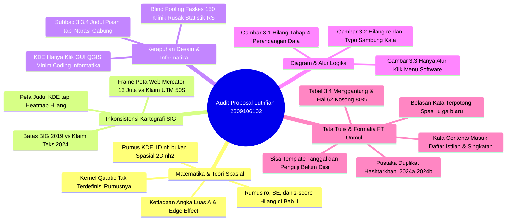

# 📋 LAPORAN AUDIT AKADEMIK FORENSIK & PANDUAN REVISI SEMINAR PROPOSAL SKRIPSI

**Mahasiswa:** Luthfiah Nur Alifah  
**NIM:** 2309106102  
**Program Studi:** S1 Informatika, Fakultas Teknik, Universitas Mulawarman  
**Dosen Pembimbing I:** Prof. Dr. Fahrul Agus, S.Si., M.T.  
**Dosen Pembimbing II:** Medi Taruk, M.Cs.  
**Koordinator Program Studi:** Awang Harsa Kridalaksana, S.Kom., M.Kom. (NIP: 19731229 200501 1 002)  
**Judul Naskah:** *Analisis Pola Sebaran dan Kepadatan Fasilitas Kesehatan Menggunakan Metode Nearest Neighbor Analysis (NNA) dan Kernel Density Estimation (KDE)*  
**Dokumen yang Diaudit:** `C:\Users\anton\Downloads\2309106102_Luthfiah Nur Alifah_Proposal Skripsi.pdf` (65 Halaman / 55 Halaman Bernomor Arab)  
**Tanggal Evaluasi:** 29 September 2026  
**Status Naskah:** **REVISI MAYOR SEBELUM SEMINAR PROPOSAL (BELUM DIIZINKAN SEMPRO SEBELUM PERBAIKAN SUBSTANSIAL & FORMALIA)**

---

> [!NOTE]
> **Catatan Tim Pembimbing / Penilai Akademik:** Dokumen audit ini disusun sebagai telaah akademik komprehensif, forensik metodologis, integritas geospasial, ketelitian rumus matematis, serta kepatuhan tata tulis naskah proposal skripsi di lingkungan Program Studi S1 Informatika, Fakultas Teknik, Universitas Mulawarman. Naskah telah diperiksa per halaman (65 halaman) untuk memastikan kelayakan saintifik sebelum mahasiswa diizinkan maju ke meja Ujian Seminar Proposal.

---

## 🌟 1. Resume Evaluasi Akademik Umum & Potensi Riset

Secara garis besar, topik yang diusulkan oleh Saudari **Luthfiah Nur Alifah (NIM: 2309106102)** memiliki relevansi terapan yang sangat berharga dalam mendukung perencanaan fasilitas pelayanan publik di **Kota Samarinda**. Seiring pertumbuhan penduduk dan dinamika pemekaran permukiman, evaluasi pemerataan fasilitas kesehatan rujukan (Rumah Sakit) dan fasilitas kesehatan primer (Puskesmas dan Klinik) berbasis Sistem Informasi Geografis (SIG) sangat krusial bagi pengambil kebijakan.

### Aspek Positif yang Patut Diapresiasi:
1. **Tinjauan Penelitian Terkait Cukup Kaya (Tabel 2.1):** Mahasiswa berhasil merangkum 13 publikasi nasional dan internasional (2021–2025) yang relevan, memetakan perbedaan fokus objek, serta mengidentifikasi kesenjangan (*research gap*) pemetaan fasilitas kesehatan di Kota Samarinda.
2. **Desain Pengujian Komparatif Terencana (Subbab 3.6):** Rancangan pengujian NNA yang membandingkan keluaran Python dengan kalkulasi manual dan pustaka `PySAL` (`pointpats`), serta verifikasi KDE terhadap *Quadrat Count Analysis*, menunjukkan adanya pemahaman metodologis awal yang baik mengenai validasi komputasi.
3. **Pemanfaatan Data Resmi (Satu Data Samarinda & BIG):** Sumber data spasial yang digunakan bersumber dari basis data resmi pemerintah, meminimalkan bias geometri batas wilayah.

Namun demikian, audit forensik menemukan **12 Kelemahan Kritis (*12 Critical Red Flags*)** yang tergolong fatal jika dipertahankan di hadapan Dewan Penguji. Mulai dari **kesalahan fatal rumus KDE 1-Dimensi untuk data spasial 2-Dimensi**, **anomali koordinat frame peta mock-up yang bertabrakan dengan sistem proyeksi (Web Mercator vs UTM)**, **peta hasil KDE tanpa lapisan heatmap**, **agregasi faskes tanpa stratifikasi**, **ketiadaan sentuhan keilmuan komputasi informatika**, hingga **sisa-sisa template dokumen yang memalukan**.

---

## 🚨 2. Rangkuman 12 Temuan Kritis (*12 Critical Red Flags*)



---

### Tabel Ringkasan Temuan Kritis:

| No | Kategori | Tingkat Urgensi | Lokasi (Hal.) | Deskripsi Temuan Kritis |
| :---: | :--- | :---: | :---: | :--- |
| **1** | **Matematika Teoretis** | 🚨 **Sangat Fatal** | Hal. 41 (Persamaan 2.3) | **Rumus KDE yang ditulis adalah rumus 1-Dimensi ($nh$), bukan 2-Dimensi ($nh^2$).** Menghasilkan satuan densitas yang salah (titik/meter, bukan titik/$\text{meter}^2$). |
| **2** | **Kartografi & SIG** | 🚨 **Sangat Fatal** | Hal. 56 (Gambar 3.4) | **Kontradiksi Ekstrem Koordinat Peta vs CRS:** Frame koordinat berangka `13041000` dan `-46000` (EPSG:3857 Web Mercator), tetapi legenda menyatakan `UTM Zone 50S (EPSG:32750)`. Koordinat UTM tidak pernah bernilai negatif atau belasan juta! |
| **3** | **Visualisasi Peta** | 🚨 **Sangat Fatal** | Hal. 56 (Gambar 3.4) | **Layer Heatmap Hilang pada Peta Hasil KDE:** Peta berjudul *"Metode Kernel Density Estimation"* dengan legenda gradasi 5 warna kepadatan, namun kanvas peta **hanya menampilkan titik merah (titik fasilitas kesehatan)** tanpa ada permukaan raster heatmap sama sekali. |
| **4** | **Keilmuan Informatika** | ⚠️ **Mayor (Kritis)** | Hal. 5, 40, 50, 52 | **Minim Kontribusi Komputasi Informatika:** NNA dikoding sederhana di Python Colab, sedangkan KDE **murni klik menu QGIS Desktop**. Tidak ada produk perangkat lunak, algoritma mandiri, pipeline terintegrasi, ataupun dashboard WebGIS interaktif. |
| **5** | **Metodologi Analisis** | ⚠️ **Mayor** | Hal. 39, 45, 55 | **Pencampuran Buta Seluruh Faskes (*Blind Pooling*):** Menggabungkan 16 RS, 26 Puskesmas, dan 150 Klinik ke dalam satu layer titik merusak interpretasi. Statistik akan didominasi 78% oleh klinik swasta, sehingga karakteristik RS dan Puskesmas tertutupi total. |
| **6** | **Kelengkapan Rumus** | ⚠️ **Mayor** | Hal. 38–40 | **Rumus Inti NNA Hilang di Bab II:** Persamaan untuk $r_o$ (Observed Mean Distance), Standard Error ($SE_{r_e}$), dan $z$-score tidak pernah dituliskan dalam bentuk rumus matematis bernomor, hanya $r_e$ dan $R$. Rumus Kernel Quartic juga tidak ada. |
| **7** | **Inkonsistensi Diagram** | ⚠️ **Mayor** | Hal. 43, 52, 54 | **Ketidaksinkronan Flowchart dengan Teks:**<br>• Gambar 3.1: Tahap 4 *"Perancangan Data"* lenyap dari bagan.<br>• Gambar 3.2: Perhitungan $r_e$ hilang (langsung lompat $r_0$ ke $R$), dan ada typo `Hitung signifikansistatistik`.<br>• Gambar 3.3: Hanya alur klik tombol QGIS. |
| **8** | **Kontradiksi Subbab** | ⚠️ **Mayor** | Hal. 49 (Subbab 3.3 Poin 4) | **Judul Bertolak Belakang dengan Isi:** Judul poin 4 adalah *"Pemisahan Layer Fasilitas Kesehatan"*, namun kalimat pertama berbunyi: *"Seluruh objek fasilitas kesehatan dipertahankan dalam satu layer titik..."*. |
| **9** | **Parameter Spasial** | ⚠️ **Sedang** | Hal. 38, 51 | **Nilai Luas Wilayah ($A$) & Efek Batas Tidak Ada:** Angka numerik luas Samarinda ($A$) tidak dicantumkan di mana pun. Potensi distorsi *edge effect* pada batas administrasi Samarinda yang berkelok-kelok diabaikan. |
| **10** | **Integritas Literatur** | ⚠️ **Sedang** | Hal. 63–65 (Daftar Pustaka) | **Duplikat 100% Identik & Sampah Web Scraper:** Ref 11 dan 12 (*Hashtarkhani 2024a* & *2024b*) adalah artikel yang persis sama diulang dua kali. Ref 29 (*Susianti*) memuat teks judul web kotor (`...| Susianti | Indonesian Journal of Geography`). Ref 25 memuat gelar master `MS.` sebagai nama. |
| **11** | **Salah Rujuk Tabel** | ⚠️ **Sedang** | Hal. 52 & 61 | **Cross-Reference Error:** Hal. 52 merujuk interpretasi $R$ ke *"Tabel 2.1"* (seharusnya Tabel 2.2). Hal. 61 merujuk jadwal ke *"Tabel 3.3"* (seharusnya Tabel 3.4). |
| **12** | **Formalia & Tata Tulis** | ⚠️ **Sedang** | Hal. 3, 4, 9, 10, 61, 62 | **Sisa Template & Kata Terpotong:** Tanggal pengesahan masih `[tgl, bln, tahun]`; nama penguji masih placeholder template; kata `Contents` muncul di Daftar Istilah/Singkatan; Tabel 3.4 terbelah buruk menyisakan halaman 62 kosong 80%; dan puluhan kata terpotong spasi (`ju ga`, `b aru`, `wilaya h`, `menganali sis`). |

---

## 🔍 3. Rincian Temuan & Panduan Perbaikan Per Bab

---

### 📄 A. Bagian Awal (Halaman i s.d. x)

#### 1. Halaman Pengesahan (Halaman ii / Halaman PDF 3)
* **Koreksi Placeholder:** Teks `Telah dibahas dalam Rapat Dosen Pembimbing pada [tgl, bln, tahun]` wajib diisi tanggal nyata persetujuan seminar proposal, bukan dibiarkan dalam kurung siku.
* **Kolom Tanda Tangan Pembimbing:** Saat ini Dosen Pembimbing I (Prof. Dr. Fahrul Agus, S.Si., M.T.) dan Pembimbing II (Medi Taruk, M.Cs.) hanya dituliskan sebagai daftar nama nomor I dan II. Sesuai template FT Unmul, sediakan ruang kolom tanda tangan untuk Pembimbing I dan Pembimbing II di bawah kata *Menyetujui*, serta Koordinator Program Studi di bagian bawah (*Mengetahui*).

#### 2. Kata Pengantar (Halaman iii / Halaman PDF 4)
* **Pembersihan Teks Template Penguji (Poin 6 & 7):**
  * Tertulis: *"6. Nama dan gelar akademik Dosen Penguji I selaku Penguji I..."* dan *"7. Nama dan gelar akademik Dosen Penguji II selaku Penguji II..."*.
  * **Arahan:** Ini adalah draf proposal! Pada tahapan ini dosen penguji belum ditetapkan secara definitif oleh Program Studi. Ucapan terima kasih untuk Dosen Penguji dieliminasi terlebih dahulu atau dialihkan kepada tim dosen reviewer dan dosen pengajar Prodi S1 Informatika.
* **Koreksi Typo & Tata Bahasa:**
  * Poin 3: `selaku K Program Studi` $\rightarrow$ perbaiki menjadi **selaku Koordinator Program Studi**.
  * Poin 4 & 5: kata `masukkan` pada frasa *"arahan dan masukkan"* dan *"atas masukkan"* $\rightarrow$ ganti menjadi **masukan** (satu huruf 'k'). Kata *masukan* (nomina) bermakna saran/input; sedangkan *masukkan* (verba) adalah kata perintah imperatif.
  * Poin 5: hilangkan spasi sebelum tanda koma: `Medi Taruk , M.Cs` $\rightarrow$ **Medi Taruk, M.Cs.**.
* **Karakter Rusak (Mojibake):** Pada alinea 1 dan poin 1, simbol tanda petik/kutip berubah menjadi tanda tanya rusak (``). Pastikan menyimpan berkas Word dalam encoding UTF-8 standar agar simbol apostrof (`doa`, `“Analisis...”`) tidak korup.

#### 3. Daftar Istilah & Daftar Singkatan (Halaman viii & ix / Halaman PDF 9–10)
* **Hapus Teks Bawaan Microsoft Word:** Di bawah tajuk `Arti`, terdapat teks **`Contents`**. Ini adalah sisa artefak fitur *Table of Contents* otomatis di MS Word yang tidak dihapus oleh mahasiswa. Hapus teks tersebut.
* **Koreksi Typo Istilah:**
  * Pada baris $p$-value tertulis: *"Nilai probalitas signifikan..."* $\rightarrow$ ganti menjadi **probabilitas**.
  * Lambang $r_o$ dan $r_e$: jangan hanya menuliskan istilah bahasa Inggris dalam kurung `(Observed Mean Distance)` dan `(Expected Mean Distance)`. Tuliskan penjelasan bahasa Indonesianya:
    * $r_o$: Jarak rata-rata teramati antar-titik terdekat (*Observed Mean Distance*).
    * $r_e$: Jarak rata-rata yang diharapkan secara acak teoritis (*Expected Mean Distance*).

---

### 📘 B. BAB I – Pendahuluan

#### 1. Pembenahan Judul Bab (Halaman 1 / Halaman PDF 11)
* Terdapat judul ganda akibat kesalahan *style* di Word:
  ```
  BAB I PEND AHULU AN
  PENDAHULUAN
  ```
* Perbaiki menjadi satu baris tajuk standar: **BAB I PENDAHULUAN** (tanpa spasi di tengah kata `PEND AHULU AN`).
* Berikan spasi tunggal yang konsisten pada subbab: ganti `1.6  Kontribusi Penelitian` (spasi ganda) menjadi `1.6 Kontribusi Penelitian`.

#### 2. Latar Belakang & Sitasi BPS (Halaman 1–4)
* **Gaya Sitasi Naratif BPS yang Cacat:** Pada halaman 1 alinea 3 tertulis:
  > *"Berdasarkan data (Badan Pusat Statistik Kota, 2025), Kota Samarinda memiliki 16 rumah sakit..."*
  * **Koreksi:** Ini adalah kesalahan sitasi ganda. Nama lembaganya terpotong dan tanda kurungnya ganjil. Ubah menjadi:
    > *"Berdasarkan data Badan Pusat Statistik Kota Samarinda (2025), Kota Samarinda memiliki 16 rumah sakit, 26 puskesmas, dan 150 klinik..."*
* **Pembersihan Kata Terpotong (*Soft Hyphen Glitch*):** Pada Bab I ditemukan banyak kata yang terbelah spasi secara tidak wajar:
  * Hal. 11: `ju ga` $\rightarrow$ **juga**, `b aru` $\rightarrow$ **baru**.
  * Hal. 12: `wilaya h` $\rightarrow$ **wilayah**, `menganali sis` $\rightarrow$ **menganalisis**, `mengh asilkan` $\rightarrow$ **menghasilkan**.
  * Hal. 14: `pen dukung` $\rightarrow$ **pendukung**.

#### 3. Penajaman Batasan Masalah & Tujuan Penelitian (Subbab 1.3 & 1.4)
* **Kelemahan Ruang Lingkup:** Pada Subbab 1.3 butir 4 dan Subbab 1.4 butir 1–2, mahasiswa menyatakan ketiga jenis faskes (RS, Puskesmas, Klinik) dianalisis sebagai **satu kesatuan agregat titik**.
* **Kritik Dewan Penguji:** Rumah sakit adalah faskes rujukan sekunder/tersier dengan radius jangkauan lintas kota, Puskesmas adalah faskes rujukan primer milik pemerintah yang diatur oleh zonasi kecamatan (Permenkes No. 43 Tahun 2019), sedangkan Klinik adalah faskes primer privat yang berorientasi pasar komersial. Jika ketiganya dicampur aduk dalam satu kali perhitungan NNA, maka nilai jarak tetangga terdekat dari sebuah Rumah Sakit kemungkinan besar adalah sebuah Klinik Pratama di sebelahnya, sehingga **tidak menggambarkan pola sebaran fasilitas rujukan sama sekali**.
* **Solusi Wajib:** Ubah Rumusan Masalah, Batasan Masalah, dan Tujuan Penelitian agar mencakup **4 skenario analisis**:
  1. Analisis Spasial Khusus **Rumah Sakit** ($n = 16$).
  2. Analisis Spasial Khusus **Puskesmas** ($n = 26$).
  3. Analisis Spasial Khusus **Klinik** ($n = 150$).
  4. Analisis Spasial **Komposit/Gabungan Seluruh Fasilitas Kesehatan** ($N = 192$).

---

### 📗 C. BAB II – Tinjauan Pustaka & Landasan Teori

#### 1. Perbaikan Fatal Rumus Kernel Density Estimation (Persamaan 2.3, Halaman 31)
Di naskah tertulis:
$$\hat{f}(x) = \frac{1}{nh} \sum_{i=1}^n K\left(\frac{x - x_i}{h}\right) \quad \text{--- (SALAH: RUMUS 1-DIMENSI)}$$

* **Kritik Matematis:** Rumus di atas adalah fungsi estimasi densitas 1-dimensi (Silverman, 1986, bab 2). Untuk data geospasial pada koordinat 2-dimensi $(x, y)$ atau vektor lokasi $s \in \mathbb{R}^2$, integral volume kepadatan harus bernilai 1 di atas bidang luas. Oleh karena itu, penyebutnya **wajib memuat $h^2$**!
* **Rumus 2D Spasial yang Benar (Wajib Digunakan):**
  $$\hat{f}(s) = \frac{1}{n h^2} \sum_{i=1}^n K\left(\frac{d(s, s_i)}{h}\right)$$
  atau secara eksplisit pada koordinat bidang kartesius $(x, y)$:
  $$\hat{f}(x, y) = \frac{1}{n h^2} \sum_{i=1}^n K\left(\frac{\sqrt{(x - x_i)^2 + (y - y_i)^2}}{h}\right)$$
  di mana:
  * $\hat{f}(s)$ atau $\hat{f}(x, y)$ = Estimasi densitas pada lokasi sel $(x, y)$ (satuan: $\text{titik}/\text{meter}^2$).
  * $n$ = Jumlah total titik fasilitas kesehatan.
  * $h$ = Bandwidth / radius pencarian (dalam meter, misalnya $h = 3.000\text{ m}$).
  * $d(s, s_i)$ = Jarak Euclidean antara titik evaluasi $s$ ke titik fasilitas kesehatan $s_i$.
  * $K(\cdot)$ = Fungsi kernel bivariate.

* **Definisikan Fungsi Kernel Quartic:** Pada Subbab 3.4.2 mahasiswa menyebut menggunakan fungsi *Quartic Kernel*, namun di Bab II rumusnya tidak ada. Tambahkan rumus baku fungsi Quartic (Biweight) 2D:
  $$K(u) = \begin{cases} \frac{3}{\pi} (1 - u^2)^2, & \text{untuk } 0 \le u \le 1 \\ 0, & \text{untuk } u > 1 \end{cases}$$
  dengan $u = \frac{d(s, s_i)}{h}$. Sehingga rumus kepadatan eksplisitnya menjadi:
  $$\hat{f}(s) = \sum_{d(s, s_i) \le h} \frac{3}{\pi n h^2} \left(1 - \frac{d(s, s_i)^2}{h^2}\right)^2$$

#### 2. Penambahan Rumus Inti NNA yang Hilang (Subbab 2.6, Halaman 28–29)
Di naskah saat ini, mahasiswa hanya menulis rumus $r_e$ (Persamaan 2.1) dan $R = r_o / r_e$ (Persamaan 2.2). Rumus untuk menghitung $r_o$, $SE$, dan $z$-score **hilang total**. Mahasiswa wajib menambahkan 3 persamaan berikut:

1. **Jarak Rata-rata Teramati (*Observed Mean Distance* - $r_o$):**
   $$r_o = \frac{\sum_{i=1}^n d_i}{n}$$
   *(di mana $d_i$ adalah jarak Euclidean dari titik fasilitas kesehatan ke-$i$ menuju tetangga terdekatnya yang pertama).*

2. **Standar Galat Jarak Harapan (*Standard Error* - $SE_{r_e}$):**
   $$SE_{r_e} = \frac{0{,}26136}{\sqrt{n^2 / A}} = \frac{0{,}26136}{\sqrt{n \cdot \rho}}$$
   *(di mana $A$ adalah luas wilayah Kota Samarinda dalam $\text{m}^2$, dan $\rho = n/A$ adalah densitas titik).*

3. **Uji Signifikansi Statistik Skor Baku (*z-score*):**
   $$z = \frac{r_o - r_e}{SE_{r_e}}$$
   *(dengan ketentuan jika $|z| \ge 1{,}96$ pada tingkat signifikansi $\alpha = 0{,}05$, maka pola sebaran berbeda secara signifikan dari pola acak Poisson).*

---

### 📙 D. BAB III – Metodologi Penelitian

#### 1. Perbaikan Diagram Alir Tahapan Penelitian (Gambar 3.1, Halaman 33 / PDF Hal. 43)
* **Anomali:** Teks Subbab 3.1 menjabarkan **8 Tahapan Pelaksanaan Penelitian**, yaitu:
  1. Studi Literatur dan Identifikasi Masalah
  2. Penentuan Ruang Lingkup Penelitian
  3. Pengumpulan Data
  4. **Perancangan Data**
  5. Perancangan Proses/Algoritma
  6. Penyajian Hasil Analisis
  7. Perancangan Pengujian
  8. Analisis dan Interpretasi Hasil
* **Fakta Gambar 3.1:** Kotak **"Perancangan Data" sama sekali tidak ada di dalam bagan!** Panah dari "Pengumpulan Data" langsung menembus ke "Perancangan Proses/Algoritma".
* **Arahan Revisi:** Perbarui bagan Gambar 3.1 dengan menyisipkan kotak *"Perancangan Data (Reproyeksi UTM, Validasi, Ekspor CSV & SHP)"* di antara Pengumpulan Data dan Perancangan Algoritma.

#### 2. Perbaikan Diagram Alir Algoritma NNA (Gambar 3.2, Halaman 42 / PDF Hal. 52)
* **Kelemahan Logika:** Bagan alir melompat langsung dari kotak *`Observed Mean Distance (r0)`* ke *`Nearest Neighbor Ratio (R)`*. Proses kalkulasi *`Expected Mean Distance (re)`* tidak digambarkan sama sekali, padahal $R$ mustahil diperoleh tanpa membagi $r_o$ dengan $r_e$.
* **Typo Parah pada Bagan:** Di kotak proses sebelum output tertulis: `Hitung signifikansistatistik` (kata *"signifikansi"* dan *"statistik"* menempel tanpa spasi).
* **Arahan Revisi:** Perbaiki tata letak flowchart: masukkan simbol proses paralel/sekuensial perhitungan $r_0$ dan $r_e$, satukan ke proses perhitungan $R$, lanjutkan ke proses perhitungan $SE_{r_e}$ dan $z$-score, serta pisahkan spasi pada teks proses.

#### 3. Peningkatan Bobot Keilmuan Informatika pada Algoritma KDE (Subbab 3.4.2 & Gambar 3.3)
* **Masalah Utama:** Flowchart Gambar 3.3 dan narasi Subbab 3.4.2 hanya menuliskan urutan menekan tombol pada software QGIS:
  `Mulai` $\rightarrow$ `Layer SHP faskes` $\rightarrow$ `Penerapan parameter` $\rightarrow$ `Hitung nilai kepadatan` $\rightarrow$ `Bentuk raster` $\rightarrow$ `Potong raster (clip)` $\rightarrow$ `Peta heatmap` $\rightarrow$ `Selesai`.
* **Kritik Penguji Informatika:** *"Jika hanya mengklik toolbox Heatmap di QGIS, di mana kompetensi komputasi dari Sarjana Komputer?"*
* **Solusi Kongkret:**
  1. Tampilkan logika komputasi raster internal: bagaimana algoritma membagi *bounding box* Samarinda menjadi matriks grid berukuran $100\text{ m} \times 100\text{ m}$, melakukan pencarian titik dalam *sliding window* radius $h = 3.000\text{ m}$, mengaplikasikan bobot kuadratik Quartic, dan mengekspor *density matrix* ke format GeoTIFF.
  2. **Nilai Tambah Sangat Direkomendasikan:** Implementasikan fungsi KDE tersebut dalam script Python mandiri (menggunakan pustaka `numpy`, `scipy.stats`, dan `rasterio`) atau bangun antarmuka WebGIS interaktif sederhana (berbasis **Streamlit + Leaflet/Folium**). Hal ini akan mengubah proposal ini dari sekadar laporan praktikum SIG geografi menjadi **karya ilmiah Teknik Informatika / Data Science Spasial yang bernilai tinggi**.

#### 4. Koreksi Anomali Fatal Kartografi pada Rancangan Layout Peta (Gambar 3.4, Halaman 46 / PDF Hal. 56)
Audit forensik terhadap citra Gambar 3.4 menemukan dua kesalahan fatal:
1. **Koordinat Grid Bertentangan dengan Sistem Proyeksi:**
   * Di sisi luar frame peta tertulis angka grid koordinat: `13041000.000`, `13064000.000` (Sumbu X) serta `-46000.000`, `-69000.000` (Sumbu Y).
   * Angka ini adalah koordinat **WGS 84 / Pseudo-Mercator (EPSG:3857)**!
   * Namun, pada panel informasi kartografi di sebelah kanan tertulis:
     ```
     System : UTM Zone 50S
     Datum  : WGS 84 (EPSG: 32750)
     Units  : Meter
     ```
   * **Fakta Teknis:** Pada sistem koordinat **UTM Zone 50S**, koordinat Kota Samarinda berada pada rentang:
     * **Easting (X):** sekitar `510.000 m` s.d. `535.000 m` (bukan 13 juta!).
     * **Northing (Y):** sekitar `9.935.000 m` s.d. `9.965.000 m` (bukan minus 46 ribu!). Sistem UTM di belahan bumi selatan menggunakan *False Northing* $10.000.000\text{ m}$, sehingga **koordinat UTM tidak pernah bernilai negatif**.
   * Jika draf ini diuji oleh dosen yang memahami SIG/Pemetaan, proposal ini bisa langsung dinyatakan tidak lulus karena data spasialnya terbukti mengalami kekeliruan sistem proyeksi (*misprojection*).
2. **Peta KDE Tanpa Permukaan Heatmap:**
   * Judul peta pada layout adalah: *"PETA FASILITAS KESEHATAN DI KOTA SAMARINDA METODE KERNEL DENSITY ESTIMATION"*.
   * Di legenda tercantum kelas gradasi warna: *Hijau (Sangat Rendah), Hijau Muda (Rendah), Kuning (Sedang), Oranye (Tinggi), Merah (Sangat Tinggi)*.
   * **Namun pada muka peta sama sekali tidak ada lapisan raster warna-warni heatmap tersebut!** Yang terlihat hanyalah titik-titik oranye/merah di atas peta dasar (OpenStreetMap). Mahasiswa lupa menyalakan atau merender layer raster KDE di QGIS sebelum mengekspor gambar layout!
* **Arahan Revisi:** Buka kembali QGIS Print Layout, pastikan proyeksi peta utama dan grid diset secara benar ke `EPSG:32750`, tampilkan angka koordinat grid UTM yang sesungguhnya (500 ribuan dan 9 jutaan), nyalakan layer raster heatmap dengan simbologi gradasi warna yang sesuai dengan legenda, lalu ekspor ulang Gambar 3.4.

#### 5. Perbaikan Subbab 3.3 Butir 4 (Halaman 39–40 / PDF Hal. 49–50)
* Teks saat ini:
  > *"4. Pemisahan Layer Fasilitas Kesehatan*  
  > *Setelah proses validasi selesai, data fasilitas kesehatan dipersiapkan untuk proses analisis. Seluruh objek fasilitas kesehatan dipertahankan dalam satu layer titik karena analisis dilakukan terhadap keseluruhan fasilitas kesehatan..."*
* **Koreksi:** Judulnya berbunyi *"Pemisahan Layer"*, namun narasinya menyatakan *"dipertahankan dalam satu layer titik"*. Sesuaikan judul dan narasinya menjadi:
  > *"4. Penyiapan dan Stratifikasi Layer Fasilitas Kesehatan*  
  > *Data fasilitas kesehatan dipilah menjadi empat kumpulan data (dataset), yaitu: (1) layer Rumah Sakit, (2) layer Puskesmas, (3) layer Klinik, dan (4) layer gabungan seluruh fasilitas kesehatan. Selanjutnya atribut spasial diekspor ke format CSV dan Shapefile untuk analisis terpisah dan komparatif."*

#### 6. Pencantuman Nilai Luas Wilayah Samarinda ($A$) & Mitigasi Efek Batas (Edge Effect)
* Pada Subbab 3.3 atau 3.4, sebutkan secara eksplisit luas wilayah administrasi Kota Samarinda yang digunakan sebagai parameter $A$. Berdasarkan data resmi BPS/BIG Kota Samarinda, luas daratan adalah **718,00 $\text{km}^2$ ($718.000.000\text{ m}^2$)** atau sebutkan angka eksak hasil kalkulasi geometri poligon `$area` pada layer SHP batas kota di QGIS.
* Tambahkan penjelasan singkat mengenai mitigasi **Edge Effect**: karena bentuk Kota Samarinda tidak beraturan (*irregular polygon*) dan dibelah oleh Sungai Mahakam, pencarian tetangga terdekat pada titik di dekat garis perbatasan Kabupaten Kutai Kartanegara berpotensi mengalami bias batas. Sebutkan bahwa titik fasilitas kesehatan dianalisis dengan batas administrasi resmi Kota Samarinda sesuai ruang lingkup penelitian.

#### 7. Perbaikan Salah Rujuk Tabel (Cross-Reference)
* **Halaman 42 / PDF Hal. 52 (Subbab 3.4.1 Poin 7):**
  * Tertulis: *"...sesuai indikator pada Tabel 2.1..."*.
  * **Koreksi:** Tabel 2.1 adalah tabel *"Perbedaan Penelitian Sebelumnya"*. Tabel interpretasi nilai $R$ adalah **Tabel 2.2**.
* **Halaman 51 / PDF Hal. 61 (Subbab 3.7):**
  * Tertulis: *"...disusun jadwal penelitian sebagaimana disajikan pada Tabel 3.3."*.
  * **Koreksi:** Tabel yang disajikan di bawahnya adalah **Tabel 3.4 Jadwal Penelitian** (Tabel 3.3 sudah digunakan untuk *Rancangan Pengujian*).

#### 8. Perbaikan Tata Letak Tabel 3.4 Jadwal Penelitian (Halaman 51–52 / PDF Hal. 61–62)
* **Kelemahan Tata Letak:** Tabel 3.4 terputus secara buruk. Sebanyak 7 baris kegiatan berada di Halaman 51, lalu 3 baris terakhir terlempar ke Halaman 52, menyisakan **halaman 52 kosong melompong sebanyak 80%** sebelum Daftar Pustaka di Halaman 53.
* **Arahan Revisi:** Atur spasi baris (*row height*) atau rapikan paragraf pengantar pada Subbab 3.7 agar seluruh Tabel 3.4 muat utuh di Halaman 51, atau berikan *Page Break* agar Tabel 3.4 berpindah rapi secara utuh ke Halaman 52 tanpa terbelah gantung.

---

### 📚 E. Daftar Pustaka (Halaman 53–55 / PDF Hal. 63–65)

Sesuai **Pedoman Skripsi FT Unmul**, Daftar Pustaka wajib dikelola menggunakan Software Management Reference (Mendeley/Zotero) dengan gaya **APA 7th Edition**. Audit menemukan sejumlah pelanggaran etika dan teknis:

#### 1. Duplikasi 100% Identik (Ref 11 & 12) — WAJIB DIHAPUS SATU!
* **Nomor 11:** `Hashtarkhani, S., Schwartz, D. L., & Shaban -Nejad, A. (2024a). Enhancing Health Care Accessibility and Equity Through a Geoprocessing Toolbox for Spatial Accessibility Analysis: Development and Case Study. JMIR Formative Research, 8, e51727. https://doi.org/10.2196/51727`
* **Nomor 12:** `Hashtarkhani, S., Schwartz, D. L., & Shaban -Nejad, A. (2024b). Enhancing Health Care Accessibility and Equity Through a Geoprocessing Toolbox for Spatial Accessibility Analysis: Development and Case Study. JMIR Formative Research, 8, e51727. https://doi.org/10.2196/51727`
* **Temuan:** Mahasiswa tidak sengaja memasukkan paper yang sama dua kali ke dalam pustaka Mendeley, sehingga Mendeley membuat sitasi otomatis berlabel `2024a` dan `2024b`. Di dalam naskah Bab I, mahasiswa hanya mengutip `2024a`, sementara `2024b` menjadi entri hantu (*ghost entry*).
* **Solusi:** Hapus salah satu entri duplikat tersebut di Mendeley, perbarui sitasi di Bab I menjadi `(Hashtarkhani, Schwartz, & Shaban-Nejad, 2024)`, dan lakukan *Refresh Reference*.

#### 2. Pembersihan Metadata Tercemar Web Scraping (Ref 29)
* **Nomor 29:**
  `Susianti, N. A., Riyanto, I. A., Ismayuni, N., Rizki, R. L. P., & Cahyadi, A. (2023). Geographic Accessibility to Primary Healthcare: Study Case Dengue Fever in Purwosari Sub-District, Gunungkidul Regency, Yogyakarta, Indonesia | Susianti | Indonesian Journal of Geography. Indonesian Journal of Geography, 55(2), 309–319. https://doi.org/10.22146/ijg.64967`
* **Koreksi:** Mahasiswa mengimpor referensi dari browser web dan tag `<title>` situs ikut terimpor ke judul paper. Hapus teks pencemar: `| Susianti | Indonesian Journal of Geography` dari kolom judul pada Mendeley.

#### 3. Gelar Akademik Masuk Nama Pengarang (Ref 25)
* **Nomor 25:** Tertulis `Khabibur Rahman, MS.`.
* **Koreksi:** Singkatan `MS.` adalah gelar akademik (*Master of Science*). Di APA style, gelar akademik dilarang dicantumkan. Perbaiki entri pengarang menjadi: `Rahman, K.`.

#### 4. Format Dokumen Hukum / Peraturan Perundang-undangan (Ref 19 & 30)
* **Nomor 19:** Tertulis acak-acakan:
  `Peraturan Pemerintah Republik Indonesia. Peraturan Pemerintah Republik Indonesia Nomor 28 Tahun 2024 tentang Peraturan Pelaksanaan Undang-Undang Nomor 17 Tahun 2023 tentang Kesehatan. , Nomor 28 Tahun 2024 § (2024).`
* **Nomor 30:**
  `Undang-Undang Republik Indonesia. Undang-Undang Republik Indonesia Nomor 17 Tahun 2023 tentang Kesehatan. , (2023).`
* **Koreksi:** Hapus pengulangan nama instansi dan simbol ganjil `§` atau tanda koma menggantung `. ,`. Gunakan format resmi dokumen hukum Indonesia:
  * *Republik Indonesia. (2023). Undang-Undang Republik Indonesia Nomor 17 Tahun 2023 tentang Kesehatan. Lembaran Negara Republik Indonesia Tahun 2023 Nomor 105.*
  * *Republik Indonesia. (2024). Peraturan Pemerintah Republik Indonesia Nomor 28 Tahun 2024 tentang Peraturan Pelaksanaan Undang-Undang Nomor 17 Tahun 2023 tentang Kesehatan. Lembaran Negara Republik Indonesia Tahun 2024 Nomor 135.*

#### 5. Nama Lembaga Terpotong (Ref 3)
* **Nomor 3:** Tertulis `Badan Pusat Statistik Kota. (2025)...`.
* **Koreksi:** Lengkapi menjadi **Badan Pusat Statistik Kota Samarinda. (2025)**.

#### 6. Typo pada Edisi Buku & Tanda Baca (Ref 1, 6, 20, 28)
* Ref 1 (`Abdulazeez`): tertulis `Tanim, R., M.` $\rightarrow$ hapus koma berlebih: **Tanim, R. M.**.
* Ref 6 (`Creswell`): URL di dalam kurung `(https://books...)` $\rightarrow$ hapus tanda kurung pada URL.
* Ref 20 (`Pressman`): tertulis `(Nineth edition)` $\rightarrow$ perbaiki typo menjadi **(9th ed.)** atau **(Ninth edition)**.
* Ref 28 (`Slocum`): tertulis `Howard, Hugh. H.` $\rightarrow$ perbaiki inisial menjadi **Howard, H. H.**.

---

## 💻 4. Blueprint Solusi Komputasi (Technical Solution Blueprint)

Untuk mengangkat marwah keilmuan **S1 Informatika**, mahasiswa sangat disarankan tidak hanya menjadi operator perangkat lunak SIG, melainkan menguasai algoritma komputasinya secara mandiri. Berikut adalah blueprint skrip Python yang dapat dilampirkan atau dijadikan inti analisis pada Bab III.

### A. Skrip Python: Perhitungan Lengkap NNA dengan Stratifikasi Faskes & Verifikasi PySAL

```python
"""
Skrip Analisis Spasial: Nearest Neighbor Analysis (NNA)
Studi Kasus: Fasilitas Kesehatan Kota Samarinda
Program Studi S1 Informatika, Universitas Mulawarman
"""

import numpy as np
import pandas as pd
from scipy.spatial import KDTree
from scipy.stats import norm

def hitung_nna(csv_path, kategori_faskes, luas_wilayah_m2=718000000.0):
    """
    Menghitung parameter NNA lengkap:
    r_o, r_e, R, SE, z-score, dan p-value
    berdasarkan proyeksi EPSG:32750 (satuan meter).
    """
    # 1. Baca data koordinat terproyeksi
    df = pd.read_csv(csv_path)
    if kategori_faskes != 'ALL':
        df = df[df['kategori'].str.upper() == kategori_faskes.upper()].copy()
    
    n = len(df)
    if n < 2:
        return {"Error": f"Jumlah titik terlalu sedikit untuk {kategori_faskes} (n={n})"}
    
    coords = df[['x_utm', 'y_utm']].to_numpy()
    
    # 2. Bangun KDTree untuk mencari jarak tetangga terdekat Euclidean
    tree = KDTree(coords)
    dists, _ = tree.query(coords, k=2)  # k=2 karena tetangga ke-1 adalah dirinya sendiri
    nearest_dists = dists[:, 1]
    
    # 3. Hitung Observed Mean Distance (r_o)
    r_o = np.mean(nearest_dists)
    
    # 4. Hitung Expected Mean Distance (r_e)
    # Persamaan Clark & Evans (1954): r_e = 0.5 / sqrt(n / A)
    r_e = 0.5 / np.sqrt(n / luas_wilayah_m2)
    
    # 5. Hitung Nearest Neighbor Ratio (R)
    R = r_o / r_e
    
    # 6. Hitung Standard Error (SE) dan z-score
    se = 0.26136 / np.sqrt((n ** 2) / luas_wilayah_m2)
    z_score = (r_o - r_e) / se
    
    # 7. Hitung two-tailed p-value
    p_value = 2.0 * (1.0 - norm.cdf(np.abs(z_score)))
    
    # 8. Interpretasi Pola Sebaran
    if R < 1.0:
        pola = "Clustered (Mengelompok)"
    elif np.isclose(R, 1.0, atol=0.05):
        pola = "Random (Acak)"
    else:
        pola = "Dispersed (Seragam / Tersebar)"
        
    signifikan = "Ya (Signifikan, p < 0.05)" if p_value < 0.05 else "Tidak Signifikan (Acak Hipotetis)"
    
    return {
        "Kategori": kategori_faskes,
        "Jumlah Titik (n)": n,
        "Luas Wilayah (m2)": luas_wilayah_m2,
        "Observed Mean Dist (ro)": round(r_o, 2),
        "Expected Mean Dist (re)": round(r_e, 2),
        "Nearest Neighbor Ratio (R)": round(R, 4),
        "Standard Error (SE)": round(se, 4),
        "z-score": round(z_score, 4),
        "p-value": f"{p_value:.4e}" if p_value < 0.0001 else round(p_value, 4),
        "Pola Sebaran": pola,
        "Signifikansi Stat": signifikan
    }

# Contoh Eksekusi untuk 4 Skenario Stratifikasi
if __name__ == "__main__":
    file_faskes = "faskes_samarinda_utm.csv"
    for kat in ["Rumah Sakit", "Puskesmas", "Klinik", "ALL"]:
        res = hitung_nna(file_faskes, kat)
        print(f"\n--- HASIL ANALISIS NNA: {kat} ---")
        for k, v in res.items():
            print(f"  {k:30s}: {v}")
```

---

### B. Skrip Python: Pembuatan Raster 2D Kernel Density Estimation (KDE) Mandiri

```python
"""
Implementasi Bivariate Quartic Kernel Density Estimation (2D)
Menghasilkan Raster GeoTIFF Kepadatan Kontinu
"""

import numpy as np
import rasterio
from rasterio.transform import from_origin

def build_spatial_kde(coords, bbox, cell_size=100.0, bandwidth=3000.0, out_tif="kde_samarinda.tif"):
    """
    coords: array Nx2 koordinat titik (UTM meter)
    bbox: tuple (min_x, min_y, max_x, max_y) batas administrasi Samarinda
    cell_size: resolusi grid raster (100 meter)
    bandwidth: radius pencarian h (3000 meter)
    """
    min_x, min_y, max_x, max_y = bbox
    n = len(coords)
    
    # Buat koordinat sel raster
    x_coords = np.arange(min_x, max_x, cell_size)
    y_coords = np.arange(max_y, min_y, -cell_size) # top-down
    grid_y, grid_x = np.meshgrid(y_coords, x_coords, indexing='ij')
    
    raster_density = np.zeros(grid_x.shape, dtype=np.float32)
    h2 = bandwidth ** 2
    factor = 3.0 / (np.pi * n * h2)
    
    print(f"Menghitung KDE pada grid {grid_x.shape[0]}x{grid_x.shape[1]} untuk {n} titik...")
    
    # Hitung kontribusi setiap titik faskes terhadap sel raster
    for pt in coords:
        px, py = pt[0], pt[1]
        dist_sq = (grid_x - px)**2 + (grid_y - py)**2
        mask = dist_sq <= h2
        # Quartic Kernel: factor * (1 - (dist^2 / h^2))^2
        raster_density[mask] += factor * (1.0 - (dist_sq[mask] / h2))**2
        
    # Ekspor hasil ke GeoTIFF terproyeksi EPSG:32750
    transform = from_origin(min_x, max_y, cell_size, cell_size)
    with rasterio.open(
        out_tif, 'w',
        driver='GTiff',
        height=raster_density.shape[0],
        width=raster_density.shape[1],
        count=1,
        dtype=raster_density.dtype,
        crs='EPSG:32750',
        transform=transform
    ) as dst:
        dst.write(raster_density, 1)
        
    print(f"File GeoTIFF berhasil disimpan di: {out_tif}")
```

---

## 📊 5. Matriks Rencana Tindakan Mahasiswa (*Action Plan Checklist*)

Gunakan tabel kendali ini untuk memeriksa perbaikan naskah sebelum menyerahkan berkas revisi ke dosen pembimbing:

| No | Komponen Dokumen | Halaman Asal | Tindakan Perbaikan yang Wajib Dilakukan | Status |
| :---: | :--- | :---: | :--- | :---: |
| **1** | **Lembar Pengesahan** | ii (PDF 3) | Isi tanggal rapat rapat draf; sediakan kolom tanda tangan resmi Pembimbing I & II serta Koorprodi. | [ ] |
| **2** | **Kata Pengantar** | iii (PDF 4) | Hapus teks template nama Dosen Penguji I & II; ubah kata `masukkan` menjadi `masukan`; perbaiki typo `selaku K Program Studi`; bersihkan karakter tanda tanya rusak. | [ ] |
| **3** | **Daftar Istilah/Singk.** | viii–ix (PDF 9–10) | Hapus kata `Contents`; ubah `probalitas` menjadi `probabilitas`; lengkapi definisi Indonesia untuk $r_o$ dan $r_e$. | [ ] |
| **4** | **Bab I (Format & Sitasi)** | 1–4 (PDF 11–14) | Hapus judul ganda `BAB I PEND AHULU AN`; perbaiki sitasi BPS `(Badan Pusat Statistik Kota, 2025)`; bersihkan kata terbelah spasi (`ju ga`, `b aru`, `wilaya h`). | [ ] |
| **5** | **Bab I (Ruang Lingkup)** | 4–6 (PDF 14–16) | Tambahkan rencana stratifikasi analisis: Pisahkan pengujian menjadi 4 subset (Rumah Sakit, Puskesmas, Klinik, Komposit). | [ ] |
| **6** | **Bab II (Rumus KDE 2D)** | 31 (PDF 41) | Ubah rumus KDE dari 1D ($nh$) menjadi rumus 2D spasial ($nh^2$); cantumkan rumus eksplisit fungsi *Quartic Kernel*. | [ ] |
| **7** | **Bab II (Rumus NNA)** | 28–29 (PDF 38–39) | Tambahkan 3 persamaan bernomor: Rumus $r_o$, Rumus Standard Error ($SE_{r_e}$), dan Rumus $z$-score. | [ ] |
| **8** | **Bab III (Gambar 3.1)** | 33 (PDF 43) | Perbarui bagan alur penelitian dengan menyisipkan kotak Tahap 4 *"Perancangan Data"*. | [ ] |
| **9** | **Bab III (Gambar 3.2)** | 42 (PDF 52) | Masukkan proses perhitungan $r_e$ pada bagan alur NNA; perbaiki typo spasi `Hitung signifikansistatistik`. | [ ] |
| **10** | **Bab III (Gambar 3.4)** | 46 (PDF 56) | Perbaiki layout peta: ubah koordinat grid frame menjadi angka UTM EPSG:32750 yang benar (bukan 13 juta); render permukaan raster heatmap KDE di muka peta. | [ ] |
| **11** | **Bab III (Subbab 3.3.4)** | 39 (PDF 49) | Ubah judul dan narasi poin 4 agar sejalan dengan rencana stratifikasi layer faskes (bukan mencampur aduk). | [ ] |
| **12** | **Bab III (Jadwal & Cross-ref)** | 50–52 (PDF 60–62) | Perbaiki rujukan Tabel 2.1 $\rightarrow$ Tabel 2.2; Tabel 3.3 $\rightarrow$ Tabel 3.4; tata rapi Tabel 3.4 agar tidak menggantung menyisakan hal. 52 kosong 80%. | [ ] |
| **13** | **Daftar Pustaka** | 53–55 (PDF 63–65) | Hapus duplikat Ref 12 (*Hashtarkhani 2024b*); bersihkan judul Ref 29 (*Susianti*); hilangkan gelar `MS.` di Ref 25; rapikan dokumen hukum Ref 19 & 30; lengkapi nama BPS Kota Samarinda di Ref 3. | [ ] |

---

## ⚖️ 6. Rekomendasi Keputusan Dosen Pembimbing

Berdasarkan telaah mendalam terhadap seluruh isi proposal skripsi yang diajukan oleh Saudari **Luthfiah Nur Alifah (NIM: 2309106102)**:

> [!WARNING]
> **KEPUTUSAN EVALUASI: REVISI MAYOR (BELUM MEMENUHI SYARAT SEMINAR PROPOSAL)**  
> Mahasiswa **BELUM DIIZINKAN** mendaftar atau menjadwalkan Ujian Seminar Proposal ke Koordinator Program Studi S1 Informatika FT Unmul hingga seluruh **12 Temuan Kritis** di atas diperbaiki secara tuntas dan berkas revisi disetujui kembali oleh Tim Pembimbing.

Mahasiswa diminta segera melakukan konsultasi tatap muka atau bimbingan daring intensif dengan membawa draf revisi yang telah menyertakan lembar periksa (*checklist*) tindakan di atas.
