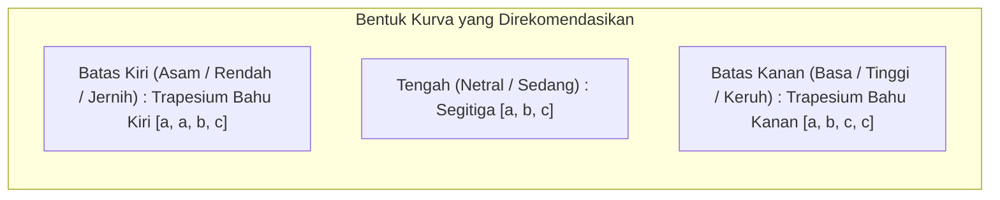

# 📋 LAPORAN AUDIT AKADEMIK & PANDUAN REVISI PROPOSAL SKRIPSI

**Mahasiswa Bimbingan:** Muhammad Khairrudin  
**NIM:** 2209106128  
**Program Studi:** S1 Informatika, Fakultas Teknik, Universitas Mulawarman  
**Dosen Pembimbing I:** Reza Wardhana, S.Kom., M.Eng.  
**Dosen Pembimbing II:** Anton Prafanto, S.Kom., M.T.  
**Judul Proposal:** *Rancang Bangun Sistem Monitoring Kualitas Air Sungai Mahakam Berbasis Internet of Things Menggunakan ESP32 dengan Metode Fuzzy Mamdani*  
**Tanggal Evaluasi:** 14 September 2026  
**Status Naskah:** **Diterima dengan Catatan Revisi (Minor Formalia & Penyesuaian Model Fuzzy / Elektronika Sebelum Seminar Proposal)**

---

## 🌟 1. Apresiasi & Catatan Positif Naskah

Secara substansi, proposal skripsi yang disusun oleh Saudara **Muhammad Khairrudin** memiliki konsep dan relevansi yang **sangat baik, kontekstual, dan aplikatif**:

1. **Urgensi Topik Sangat Kontekstual:** Pemanfaatan teknologi IoT untuk pemantauan kualitas air Sungai Mahakam di Kota Samarinda sangat tepat guna dan menjawab persoalan nyata lingkungan hidup daerah aliran sungai (DAS).
2. **Kajian Regulasi yang Rapi:** Usaha mengintegrasikan PP No. 22 Tahun 2021 (khususnya konsep deviasi suhu terhadap temperatur udara $\Delta T$) dan Permenkes No. 2 Tahun 2023 menunjukkan ketekunan mahasiswa dalam mencari dasar batas operasional yang dapat dipertanggungjawabkan secara ilmiah.
3. **Pemaparan Alur Perhitungan Fuzzy yang Runtut:** Contoh perhitungan numerik fuzzifikasi hingga defuzzifikasi pada Bab 3 disajikan dengan sangat jelas dan memudahkan pembaca memahami mekanisme inferensi sistem.
4. **Desain Purwarupa Komprehensif:** Skema penyimpanan ganda (*dual storage*: Firebase Realtime Database dan cadangan lokal MicroSD) menunjukkan perancangan sistem tertanam (*embedded system*) yang tangguh terhadap kendala koneksi internet di lapangan.

Catatan evaluasi di bawah ini disusun dengan tujuan menyempurnakan naskah, meluruskan aspek teoretis dan teknis elektronika, serta memperkuat argumentasi ilmiah Saudara agar saat maju ke **Seminar Proposal (Sempro)** nanti, naskah ini kokoh dan Saudara dapat menjawab setiap pertanyaan dosen penguji dengan percaya diri.

---

## 🚦 2. Matriks Status Kesiapan Naskah

| Komponen Naskah | Status | Catatan Evaluasi Utama |
| :--- | :---: | :--- |
| **Format & Kelengkapan Awal** | ⚠️ *Perlu Perapian* | Ganti placeholder `<TAHUN SEKARANG>`, `[tgl, bln, tahun]`, rapikan tabrakan teks halaman pengesahan, bersihkan duplikasi template di Kata Pengantar, isi Daftar Istilah/Singkatan, dan perbaiki penomoran romawi vs arab. |
| **Bab I: Pendahuluan** | ⚠️ *Revisi Ringan* | Sinkronkan kehadiran *Dashboard Web* pada Rumusan Masalah dan Batasan Masalah; pertegas peran data TDS ONLIMO; perjelas batasan *buzzer*. |
| **Bab II: Tinjauan Pustaka** | ⚠️ *Revisi Sedang* | Cantumkan nama penulis, tahun, dan judul pada 15 penelitian terkait; tambahkan **Tabel Matriks Perbedaan Penelitian (SOTA)**; luruskan terminologi rumus defuzzifikasi. |
| **Bab III: Metodologi & Desain** | 🚨 *Revisi Krusial* | **Koreksi fungsi keanggotaan segitiga ekstrem menjadi trapesium (*shoulder*)** untuk mencegah galat fatal *division-by-zero / NaN*; perbaiki level tegangan sensor (3.3V vs 5V); lengkapi pinout seluruh komponen pada tabel perancangan. |
| **Daftar Pustaka & Sitasi** | ⚠️ *Revisi Sedang* | Bersihkan *ghost citations* (`Hasib & Akib, 2026` dan `Zimmermann, 2001`); bersihkan anomali metadata parser Mendeley (afiliasi kampus terbaca sebagai nama penulis); urutkan alfabetis tanpa nomor. |
| **Lampiran Naskah** | ⚠️ *Perlu Perapian* | Hapus teks catatan pribadi `Penjelasan lihat di ppt` pada halaman 71; ganti dengan lampiran skematik atau lembar data sensor. |

---

## 🔍 3. Rincian Catatan Evaluasi & Panduan Solusi Langkah demi Langkah

---

### 📄 A. Bagian Awal Naskah (Cover s.d. Daftar Singkatan) & Akhir Naskah

1. **Pembersihan Placeholder pada Sampul (Cover) dan Halaman Judul (Hal. 1 & 2):**
   * **Temuan:** Di bagian bawah cover masih tertulis placeholder `<TAHUN SEKARANG>`.
   * **Solusi:** Ganti dengan tahun kalender akademik yang aktif saat pengajuan (misalnya: `2026`).

2. **Perapian Teks Tabrakan pada Halaman Pengesahan (Hal. 3):**
   * **Temuan:** Pada baris judul di halaman pengesahan tertulis: `FUZZY MAMDANIAN PENGESAHAN`. Kata *HALAMAN PENGESAHAN* tampak tertimpa atau menempel pada baris judul. Selain itu, tanggal pembahasan masih berupa `[tgl, bln, tahun]`. Penulisan nama Dosen Pembimbing II belum memiliki spasi (`Anton Prafanto, S.Kom.,MT`).
   * **Solusi:**
     - Pisahkan baris judul dan tajuk halaman dengan rapi.
     - Kosongkan tanggal atau beri titik-titik rapi: `Samarinda, .................... 2026`.
     - Standarisasi penulisan gelar Pembimbing II: `Anton Prafanto, S.Kom., M.T.`

3. **Pembersihan Sisa Template pada Kata Pengantar (Hal. 4):**
   * **Temuan:**
     - Pada poin 4 sudah disebutkan nama Pembimbing I (Reza Wardhana, S.Kom., M.Eng.) dan Pembimbing II (Anton Prafanto, S.Kom., M.T.).
     - Namun pada poin 5, 6, dan 7, teks template bawaan Word masih tertinggal:
       * *5. Nama dan gelar akademik Dosen Pembimbing II selaku Pembimbing II atas masukkan terhadap penelitian ini*
       * *6. Nama dan gelar akademik Dosen Penguji I selaku Penguji I atas saran dan masukkan terhadap penelitian ini.*
       * *7. Nama dan gelar akademik Dosen Penguji II selaku Penguji II atas saran dan masukkan terhadap penelitian ini.*
     - Di bagian titimangsa tertulis: `Samarinda,.............................. 2024` (masih tertulis tahun 2024).
   * **Solusi:**
     - Hapus poin 5 karena Pembimbing II sudah masuk di poin 4.
     - Untuk poin dosen penguji (poin 6 dan 7), karena ini masih tahapan draft proposal (penguji proposal baru ditentukan saat jadwal sempro keluar), redaksinya dapat disederhanakan: *"Segenap Dosen Penguji yang nantinya akan memberikan masukan berharga demi penyempurnaan penelitian ini"*, atau poin penguji dapat diisi setelah seminar proposal terlaksana.
     - Perbarui tahun menjadi `2026`.

4. **Pengisian Daftar Istilah dan Daftar Singkatan (Hal. 10 & 11):**
   * **Temuan:** Pada Daftar Lampiran (hal. 9) tertulis `Lampiran 1 contents 42`, serta Daftar Istilah dan Daftar Singkatan (hal. 10–11) hanya berisi teks bawaan template: `Arti Contents`.
   * **Solusi:** Karena naskah ini sarat dengan istilah sistem tertanam dan lingkungan, isi daftar tersebut secara manual/terformat:
     - **Singkatan:** ADC (*Analog to Digital Converter*), DAS (*Daerah Aliran Sungai*), ESP32 (*Espressif System 32-bit*), FIS (*Fuzzy Inference System*), IoT (*Internet of Things*), KLHK (*Kementerian Lingkungan Hidup dan Kehutanan*), LED (*Light Emitting Diode*), NTP (*Network Time Protocol*), NTU (*Nephelometric Turbidity Unit*), OLED (*Organic Light-Emitting Diode*), ONLIMO (*Online Monitoring System*), RTC (*Real-Time Clock*), TSS (*Total Suspended Solids*).
     - **Istilah/Lambang:** $z^*$ (Nilai tegas/crisp hasil defuzzifikasi), $\mu(x)$ (Derajat keanggotaan fuzzy), $\alpha$ (Derajat kekuatan aturan / firing strength), $\Delta T$ (Selisih mutlak suhu air terhadap suhu udara).

5. **Koreksi Sistem Penomoran Halaman (*Pagination*):**
   * **Temuan:** Halaman cover dalam terhitung angka `1`, Pengesahan `2`, Kata Pengantar `3`, dst. Kemudian pada Bab I Pendahuluan, nomor halaman ter-reset kembali ke angka `3`.
   * **Pedoman Resmi FT UNMUL:**
     - Halaman Judul s.d. Daftar Singkatan menggunakan **angka Romawi kecil** (`i, ii, iii, iv, v, vi, vii, viii, ix, x`) di posisi **tengah bawah**. (Halaman judul dihitung sebagai `i`, namun tidak dicetak nomornya).
     - Halaman Bab I Pendahuluan dimulai dari **angka Arab `1`** di posisi tengah bawah.
     - Halaman-halaman berikutnya dalam bab diletakkan di pojok **kanan atas**, kecuali halaman awal bab baru yang kembali di tengah bawah.

6. **🚨 Temuan Unik Halaman 71 (Lampiran):**
   * **Temuan:** Pada halaman 71 di bawah tajuk `LAMPIRAN` tertulis kalimat: `Penjelasan lihat di ppt`.
   * **Solusi:** Kalimat ini wajib **dihapus segera**. Ganti dengan dokumen lampiran yang nyata, seperti:
     - Lampiran 1: Skematik Rangkaian Elektronika Purwarupa (*Wiring Schematic*).
     - Lampiran 2: Lembar Pengujian Validasi Sensor (*Form Uji Lapangan*).
     - Lampiran 3: Ringkasan Spesifikasi Sensor (Datasheet PH-4502C, DS18B20, DHT22, Turbidity).

---

### 📘 B. BAB I – Pendahuluan

1. **Sinkronisasi Web Dashboard pada Rumusan & Batasan Masalah:**
   * **Masalah:** Pada Bab 3 Subbab 3.5.2 (hal. 53–54), Saudara sudah merancang antarmuka **Dashboard Web** lengkap dengan kartu status, indikator parameter, grafik pemantauan tren, dan tabel riwayat. Dashboard ini juga diuji pada Tabel 3.7. Namun, di Bab 1 pada **Rumusan Masalah butir 3** dan **Tujuan Penelitian butir 3**, Dashboard Web sama sekali belum disinggung (hanya menyebut OLED dan LED).
   * **Rekomendasi Redaksi Perbaikan Rumusan Masalah 3:**
     > *"3. Bagaimana merancang antarmuka pemantauan data kualitas air secara lokal melalui tampilan OLED dan indikator LED, serta secara jarak jauh (*remote monitoring*) melalui **Dashboard Web** berbasis data real-time Firebase, dengan mekanisme pencadangan data offline pada modul MicroSD?"*
   * Begitu pula pada **Tujuan Penelitian butir 3**, sesuaikan agar simetris:
     > *"3. Membangun sistem antarmuka pemantauan kualitas air secara lokal menggunakan layar OLED dan indikator LED, serta pemantauan jarak jauh melalui **Dashboard Web** yang terintegrasi dengan Firebase Realtime Database dan penyimpanan cadangan offline pada MicroSD."*

2. **Penyelarasan Batasan Masalah:**
   * Pada **Batasan Masalah butir 5**, tambahkan klausul mengenai Dashboard Web:
     > *"5. Tampilan informasi hasil monitoring disajikan secara lokal melalui layar OLED 0,96 inci dan indikator LED (hijau/kuning/merah) sebagai peringatan dini visual di lokasi alat, serta disajikan secara jarak jauh (*remote*) melalui antarmuka **Dashboard Web** untuk pemantauan data real-time dan histori."*
   * Pada **Batasan Masalah butir 2**, perjelas bahwa data Stasiun ONLIMO KLHK 167 (seperti parameter TDS atau suhu pembanding) murni diposisikan sebagai referensi pengamatan komparatif di titik sekitar stasiun, dan tidak diintegrasikan ke dalam komputasi mikrokontroler.

---

### 📗 BAB II – Tinjauan Pustaka & Landasan Teori

1. **Standarisasi Penulisan Subbab 2.1 (Penelitian Terkait):**
   * **Masalah:** Pada naskah saat ini, seluruh 15 butir penelitian terdahulu diawali dengan pola seragam tanpa menyebutkan identitas penulis:
     * *`1. Metode yang digunakan: Penelitian ini menerapkan...`*
     * *`2. Metode yang digunakan: Penelitian ini mengangkat permasalahan...`*
     * *`3. Metode yang digunakan: Penelitian ini dilatarbelakangi...`*
   * Pola ini menghilangkan subjek penelitian sehingga pembaca/penguji tidak mengetahui siapa penelitinya, tahun publikasi, maupun judul artikelnya.
   * **Rekomendasi Format Penulisan Narasi Akademik:**
     Awali setiap butir dengan sitasi pengarang, tahun, dan fokus kajian. Contoh:
     > *"1. Penelitian yang dilakukan oleh **Elriyan (2025)** berjudul *'Pengendalian Kualitas Air Minum Menggunakan Fuzzy Mamdani Berbasis Internet of Things'* mengkaji sistem pemantauan kelayakan air minum otomatis..."*  
     > *"2. Penelitian oleh **Kaho et al. (2025)** yang berjudul *'Sistem Pemantauan Kualitas Air Kolam Berbasis Internet of Things (IoT) Untuk Mengurangi Kematian Ikan Nila Menggunakan Logika Fuzzy Mamdani'* mengembangkan..."*  
     > *"3. Penelitian oleh **Ayu Wulandari et al. (2024)** mengenai *'Rancang Bangun Sistem Monitoring Kualitas Air... Menggunakan Fuzzy Logic Mamdani Berbasis Mobile'* berfokus pada..."*

2. **Wajib Menambahkan Tabel Matriks Perbedaan Penelitian (*State-of-the-Art* / SOTA):**
   * Pada akhir Subbab 2.1 (sebelum Subbab 2.2), penguji skripsi selalu mencari ringkasan perbandingan. Buatlah tabel perbandingan berikut untuk mempertegas posisi dan kebaruan (*novelty*) skripsi Saudara:

| No | Peneliti & Tahun | Objek / Lokasi | Metode Logika | Parameter Input | Platform / Output | Keterbatasan / Celah Riset | Posisi Penelitian Ini |
|:---|:---|:---|:---|:---|:---|:---|:---|
| 1 | Elriyan (2025) | Air Minum | Fuzzy Mamdani | Suhu, TDS, pH, Kekeruhan | ESP32, Firebase, Kodular | Objek air tertutup, tidak memperhitungkan deviasi suhu lingkungan. | Fokus pada air terbuka (Sungai Mahakam) dengan variabel deviasi suhu ($\Delta T$). |
| 2 | Kaho et al. (2025) | Kolam Ikan Nila | Fuzzy Mamdani | Suhu, pH, Kekeruhan | ESP32, IoT Blynk | Batas parameter disesuaikan untuk budidaya ikan, bukan sungai umum. | Mengacu baku mutu air sungai PP No. 22/2021 & Permenkes No. 2/2023. |
| 3 | Ayu Wulandari et al. (2024) | Tambak Ikan Mujair | Fuzzy Mamdani | Suhu, pH, DO | ESP32, Mobile App | Tidak memantau kekeruhan secara kuantitatif. | Memadukan pH, kekeruhan, dan selisih suhu udara-air. |
| 4 | Hermansyah (2022) | Sungai Kapuas | Fuzzy Mamdani & STORET | TSS, DO, BOD, COD | Pengolahan data sekunder | Menggunakan komputasi offline di komputer, tidak real-time IoT. | Sistem terintegrasi IoT langsung di mikrokontroler ESP32 dengan interval 5 menit. |
| 5 | Faradilla et al. (2025) | Sungai Mahakam (KLHK 167) | Analisis Deskriptif | Parameter Kimia & Fisika | Stasiun ONLIMO KLHK | Interval pembaruan lambat (minimal 1 jam), data pH/suhu kerap kosong. | Melengkapi pemantauan dengan interval rapat (5 menit) dan status mutu fuzzy otomatis. |
| **6** | **Penelitian Ini (Khairrudin, 2026)** | **Sungai Mahakam (PDAM Bakungan)** | **Fuzzy Mamdani (Weighted Average / Centroid)** | **pH, Selisih Suhu ($\Delta T$), Kekeruhan** | **ESP32, OLED, LED, Firebase, Web Dashboard, MicroSD** | - | **Purwarupa IoT berbiaya rendah dengan perhitungan fuzzy mandiri pada ESP32, dual storage, dan web dashboard.** |

3. **Klarifikasi Teoretis Rumus Defuzzifikasi (Subbab 2.5.1, Persamaan 2.4):**
   * **Temuan:** Pada halaman 40, Persamaan (2.4) tertulis:
     $$z^* = \frac{\sum z_i \cdot \alpha_i}{\sum \alpha_i}$$
     dengan keterangan *"menggunakan metode Centroid (rata-rata tertimbang terhadap titik puncak tiap kategori output)"*.
   * **Penjelasan Teori:**
     - Secara matematis, metode *Centroid* (*Center of Gravity* / COG) murni pada FIS Mamdani kontinu didefinisikan dengan integral luasan area keanggotaan gabungan:
       $$z^* = \frac{\int z \cdot \mu_C(z) \, dz}{\int \mu_C(z) \, dz}$$
     - Sedangkan rumus yang Saudara tuliskan di Persamaan 2.4 adalah metode **Rata-rata Terbobot (*Weighted Average Method / Height Method*)**.
     - Pada sistem tertanam seperti ESP32, metode *Weighted Average* sangat lazim dipilih karena komputasinya jauh lebih ringan (*lightweight*), tidak membebani memori SRAM, dan mengeksekusi perhitungan dalam fraksi milidetik tanpa perlu proses integrasi numerik yang memakan siklus clock.
   * **Saran Penyempurnaan:**
     - Tetap gunakan rumus tersebut, namun berikan penjelasan jujur dan ilmiah:
       > *"Defuzzifikasi dilakukan dengan metode **Rata-rata Terbobot (*Weighted Average / Discrete Height Centroid*)** dengan mengalikan derajat keanggotaan hasil agregasi terhadap nilai pusat (*center*) masing-masing himpunan output. Pendekatan ini dipilih untuk mengoptimalkan performa komputasi mikrokontroler ESP32 agar inferensi fuzzy dapat diselesaikan dengan latensi sangat rendah tanpa membebani memori perangkat."*
     - Penjelasan ini justru akan dipuji oleh penguji karena Saudara memahami konsekuensi implementasi algoritma pada perangkat keras (*hardware-aware algorithm design*).

---

### 📙 C. BAB III – Metodologi Penelitian & Rekayasa Sistem

#### 🚨 1. KRUSIAL: Kelemahan Fungsi Keanggotaan Segitiga pada Titik Ekstrem & Solusi Kurva Trapesium

* **Masalah Serius pada Tabel 3.4:**
  Saudara mendefinisikan seluruh himpunan fuzzy menggunakan segitiga $(a, b, c)$:
  1. **Variabel pH:** Asam $(0, 6, 7)$, Netral $(6, 7.5, 9)$, Basa $(8, 9, 14)$.
     - Jika air sungai terkena limbah asam kuat sehingga $pH = 3.0$, rumus segitiga Saudara menghasilkan:
       $$\mu_{\text{Asam}}(3.0) = \frac{3 - 0}{6 - 0} = 0.5$$
     - Jika $pH = 0$, $\mu_{\text{Asam}}(0) = 0$!
     - **Pertanyaan Logika:** Mengapa air dengan pH 0 (sangat asam berbahaya) derajat keasamannya justru 0, sedangkan pH 6 (hampir netral) derajat keasamannya 1.0?
  2. **Variabel Kekeruhan:** Jernih $(0, 1, 3)$, Sedang $(2, 3, 6)$, Keruh $(5, 10, 20)$.
     - Apa yang terjadi jika musim hujan dan air Sungai Mahakam sangat pekat berlumpur dengan kekeruhan **$25$ NTU**?
     - Karena batas atas Keruh adalah $20$, maka pada nilai $25$ NTU:
       $$\mu_{\text{Jernih}}(25) = 0, \quad \mu_{\text{Sedang}}(25) = 0, \quad \mu_{\text{Keruh}}(25) = 0$$
     - **🚨 Akibat Fatal:** Semua aturan fuzzy menghasilkan $\alpha_i = 0$.
     - Saat proses defuzzifikasi:
       $$z^* = \frac{\sum z_i \cdot 0}{\sum 0} = \frac{0}{0} \implies \textbf{NaN (Not a Number)}$$
       ESP32 akan mengalami pembagian nol (*divide by zero*), nilai variabel menjadi *NaN*, dan sistem dapat mengalami *restart / error loop*!
  3. **Variabel Selisih Suhu ($\Delta T$):** Rendah $(0, 1, 2)$.
     - Jika $\Delta T = 0^\circ\text{C}$ (suhu air persis sama dengan suhu udara, kondisi paling stabil/ideal), nilai $\mu_{\text{Rendah}}(0) = 0$! Seharusnya kondisi deviasi 0 memiliki derajat keanggotaan Rendah sebesar $1.0$.

* **💡 Solusi Wajib: Terapkan Fungsi Keanggotaan Trapesium (*Shoulder Curve*) pada Sisi Batas!**
  Ubah kurva batas kiri dan kanan menjadi trapesium dengan 4 parameter $(a, b, c, d)$:



* **Tabel Revisi Himpunan Fuzzy Rekomendasi (Tabel 3.4 Baru):**

| Variabel | Himpunan | Tipe Kurva | Titik Parameter $[a, b, c, d]$ | Aturan Matematika Derajat Keanggotaan $\mu(x)$ |
|:---|:---|:---:|:---:|:---|
| **pH** | Asam | Trapesium Bahu Kiri | $[0, 0, 6.0, 7.0]$ | $\mu = 1$ jika $x \le 6.0$; $\mu = \frac{7.0 - x}{7.0 - 6.0}$ jika $6.0 < x \le 7.0$; $\mu = 0$ jika $x > 7.0$ |
| | Netral | Segitiga | $[6.0, 7.5, 9.0]$ | $\mu = \frac{x - 6.0}{7.5 - 6.0}$ jika $6.0 \le x \le 7.5$; $\mu = \frac{9.0 - x}{9.0 - 7.5}$ jika $7.5 < x \le 9.0$ |
| | Basa | Trapesium Bahu Kanan | $[8.0, 9.0, 14.0, 14.0]$ | $\mu = 0$ jika $x < 8.0$; $\mu = \frac{x - 8.0}{9.0 - 8.0}$ jika $8.0 \le x < 9.0$; $\mu = 1$ jika $x \ge 9.0$ |
| **Selisih Suhu ($\Delta T$)** | Rendah | Trapesium Bahu Kiri | $[0, 0, 1.0, 2.5]$ | $\mu = 1$ jika $x \le 1.0$; $\mu = \frac{2.5 - x}{2.5 - 1.0}$ jika $1.0 < x \le 2.5$; $\mu = 0$ jika $x > 2.5$ |
| | Sedang | Segitiga | $[1.5, 3.0, 4.5]$ | Sesuai formula segitiga standar |
| | Tinggi | Trapesium Bahu Kanan | $[3.5, 5.0, 15.0, 15.0]$ | $\mu = 0$ jika $x < 3.5$; $\mu = \frac{x - 3.5}{5.0 - 3.5}$ jika $3.5 \le x < 5.0$; $\mu = 1$ jika $x \ge 5.0$ |
| **Kekeruhan** | Jernih | Trapesium Bahu Kiri | $[0, 0, 2.0, 3.5]$ | $\mu = 1$ jika $x \le 2.0$; $\mu = \frac{3.5 - x}{3.5 - 2.0}$ jika $2.0 < x \le 3.5$; $\mu = 0$ jika $x > 3.5$ |
| | Sedang | Segitiga | $[2.5, 5.0, 10.0]$ | Sesuai formula segitiga standar |
| | Keruh | Trapesium Bahu Kanan | $[6.0, 15.0, 100.0, 100.0]$ | $\mu = 0$ jika $x < 6.0$; $\mu = \frac{x - 6.0}{15.0 - 6.0}$ jika $6.0 \le x < 15.0$; **$\mu = 1$ jika $x \ge 15.0$** |

> [!TIP]
> **Proteksi Kode Arduino (*Division-by-Zero Guard*):**  
> Pada fungsi defuzzifikasi di ESP32, selalu tambahkan pengaman kode:
> ```cpp
> float totalAlpha = sumAlpha();
> if (totalAlpha == 0.0) {
>     // Fallback aman jika terjadi data anomali ekstrem
>     crispZ = 50.0; // Default status Sedang / Buruk
> } else {
>     crispZ = sumWeightedZ() / totalAlpha;
> }
> ```

---

#### 🚨 2. KRUSIAL ELEKTRONIKA: Masalah Catu Daya Sensor (Tabel 3.2) & Proteksi ADC ESP32

* **Temuan pada Tabel 3.2 (Konfigurasi Pin Sensor):**
  - Sensor pH (PH-4502C) terhubung ke pin `3V3` ESP32.
  - Sensor Turbidity terhubung ke pin `3V3` ESP32.
* **Tinjauan Teknis Perangkat Keras:**
  1. **Kebutuhan Tegangan Modul Analog:**
     - Modul pengkondisi sinyal **PH-4502C** memiliki rangkaian *operational amplifier* (Op-Amp LM358) dan potensiometer kalibrasi yang didesain untuk beroperasi pada tegangan nominal **5.0V DC**.
     - Begitu pula modul sensor kekeruhan (*optical turbidity sensor* SEN0189) membutuhkan tegangan **5V DC** agar LED inframerah dan fototransistor menghasilkan kurva respon tegangan yang linier. Jika hanya diberi 3.3V, tegangan keluaran akan anjlok drastis dan pembacaan menjadi sangat bias/tidak akurat.
  2. **Batas Toleransi ADC ESP32:**
     - Mikrokontroler ESP32 memiliki tegangan referensi ADC maksimum **3.3V**. Pin GPIO analog (seperti GPIO 34 dan 35) **tidak toleran terhadap tegangan 5V** (*not 5V tolerant*). Jika modul diberi catu 5V dan mengeluarkan sinyal analog di atas 3.3V (misalnya modul turbidity saat kondisi air jernih bisa mengeluarkan tegangan hingga 4.2V), pin ADC ESP32 dapat mengalami kerusakan permanen (*overvoltage damage*).
* **Solusi Rangkaian Elektronika:**
  - Hubungkan pin VCC modul sensor PH-4502C dan sensor Turbidity ke pin **VIN (5V dari regulator eksternal atau power bank)**, bukan ke pin 3V3.
  - Tambahkan rangkaian **Pembagi Tegangan (*Voltage Divider*)** sederhana menggunakan resistor (misalnya $R_1 = 10\,\text{k}\Omega$ dan $R_2 = 20\,\text{k}\Omega$) pada jalur keluaran analog sebelum masuk ke pin GPIO ESP32, atau kalibrasikan rentang tegangan keluaran modul agar dibatasi tidak melampaui 3.0V.
  - Jelaskan modifikasi rangkaian ini di Subbab 3.4.2 agar penguji melihat bahwa Saudara benar-benar menguasai aspek instrumentasi perangkat keras.

---

#### ⚡ 3. Lengkapi Konfigurasi Pinout Perangkat Keras (Tabel 3.2)

* **Temuan:** Tabel 3.2 saat ini **hanya memuat 4 sensor**. Modul OLED, RTC DS3231, Modul MicroSD, 3 buah LED (Hijau, Kuning, Merah), dan Buzzer sama sekali belum memiliki nomor pin pada tabel.
* **Tabel Konfigurasi Pinout Lengkap yang Direkomendasikan:**

| No | Nama Komponen | Pin Komponen | Pin ESP32 DevKit V1 | Keterangan Fungsi |
|:---:|:---|:---:|:---:|:---|
| 1 | Sensor pH (PH-4502C) | VCC / GND / PO | VIN (5V) / GND / **GPIO 34** | Catu 5V, analog input ADC1 CH6 |
| 2 | Sensor Suhu Air (DS18B20) | VCC / GND / DATA | 3V3 / GND / **GPIO 4** | OneWire bus (wajib pull-up resistor 4.7kΩ ke 3V3) |
| 3 | Sensor Suhu Udara (DHT22) | VCC / GND / DATA | 3V3 / GND / **GPIO 15** *(atau 27)* | Jalur data digital 1-wire DHT |
| 4 | Sensor Kekeruhan (Turbidity) | VCC / GND / OUT | VIN (5V) / GND / **GPIO 35** | Catu 5V, analog input ADC1 CH7 (via divider) |
| 5 | Layar OLED 0,96" (SSD1306) | VCC / GND / SDA / SCL | 3V3 / GND / **GPIO 21 / GPIO 22** | Jalur komunikasi serial I2C Bus |
| 6 | Modul RTC (DS3231) | VCC / GND / SDA / SCL | 3V3 / GND / **GPIO 21 / GPIO 22** | Berbagi bus I2C dengan OLED (alamat berbeda) |
| 7 | Modul MicroSD Card | VCC / GND / CS / MOSI / SCK / MISO | 5V atau 3V3 / GND / **GPIO 5 / GPIO 23 / GPIO 18 / GPIO 19** | Komunikasi SPI Hardware bus standar ESP32 |
| 8 | LED Hijau (Status Baik) | Anoda (+) / Katoda (-) | **GPIO 12** / GND | Digital Output (dengan resistor $220\,\Omega$) |
| 9 | LED Kuning (Status Sedang) | Anoda (+) / Katoda (-) | **GPIO 14** / GND | Digital Output (dengan resistor $220\,\Omega$) |
| 10 | LED Merah (Status Buruk) | Anoda (+) / Katoda (-) | **GPIO 27** *(atau 13)* / GND | Digital Output (dengan resistor $220\,\Omega$) |
| 11 | Buzzer Alarm | VCC (+) / GND (-) | **GPIO 2** *(atau 25)* / GND | Peringatan audio status Buruk (PWM/Digital) |

> [!NOTE]
> Catatan: Pada naskah awal, DHT22 dipasang di GPIO 5. Perhatikan bahwa **GPIO 5 adalah pin default Chip Select (CS) untuk SPI bus MicroSD**. Agar tidak bentrok (*pin contention*), pindahkan data DHT22 ke pin lain (misal GPIO 15 atau 27), sehingga GPIO 5 leluasa digunakan untuk MicroSD CS.

---

#### 📝 4. Perbaikan Teknis Lainnya di Bab III:

1. **Koreksi Keterangan Tabel 3.3 (Kebutuhan Perangkat Lunak):**
   * Baris 2: `Library OneWire & DallasTemperature` pada kolom keterangan tertulis: *"Membaca data suhu udara"*.
   * **Koreksi:** DS18B20 adalah sensor **suhu air kedap air (*waterproof*)**, sedangkan suhu udara dibaca oleh DHT22.
2. **Perapian Subbab 3.1 (Tahapan Pelaksanaan Penelitian):**
   * Pada teks antara halaman 46 dan 47, subjudul nomor `4. Implementasi Sistem` terpotong akibat perpindahan halaman sehingga langsung meloncat dari poin 3 ke poin 5. Berikan tajuk bernomor yang jelas:
     - `3. Perancangan Sistem`
     - `4. Implementasi Purwarupa (Perangkat Keras & Lunak)`
     - `5. Kalibrasi Sensor`
     - `6. Pengujian Sistem`
     - `7. Analisis dan Evaluasi Hasil`
3. **Penyempurnaan Perancangan Pengujian (Subbab 3.6):**
   * Perjelas prosedur pengujian kalibrasi sensor:
     - **Sensor pH:** Gunakan larutan kalibrasi standar (*buffer powder/solution*) pH 4.01, 6.86, dan 9.18 untuk menentukan persamaan regresi linier konversi tegangan ke nilai pH ($y = mx + c$).
     - **Sensor Suhu (DS18B20 & DHT22):** Bandingkan dengan termometer air standar (termometer air raksa/digital bersertifikat) pada beberapa variasi suhu air.
     - **Sensor Kekeruhan:** Uji menggunakan air aquades (0 NTU) dan beberapa variasi konsentrasi larutan standar atau sampel air sungai yang diuji silang dengan turbidimeter portabel.
     - **Confusion Matrix:** Nyatakan berapa jumlah skenario kombinasi uji (misalnya 30 titik sampel data acak/nyata) untuk menghitung persentase akurasi klasifikasi fuzzy program terhadap validasi manual.

---

### 📚 D. Daftar Pustaka & Sitasi Ilmiah

1. **Pembersihan Sitasi Hantu (*Ghost Citations* - Ada di Naskah, Hilang di Pustaka):**
   * Sitasi **`(Hasib & Akib, 2026)`** yang dikutip dua kali di Bab 2 (halaman 42 dan 43) terkait karakteristik transmisi Firebase belum ada di Daftar Pustaka. Wajib ditambahkan data pustakanya secara lengkap.
   * Sitasi **`(Zimmermann, 2001)`** yang dikutip di Bab 2 (halaman 39) terkait teori Fuzzy Logic belum ada di Daftar Pustaka. Tambahkan bukunya:
     * *Zimmermann, H.-J. (2001). Fuzzy Set Theory—and Its Applications (4th ed.). Springer Science & Business Media.*
2. **Pembersihan Anomali Metadata Parser Mendeley/Zotero pada Daftar Pustaka:**
   * **🚨 Entri Nomor 4 (Ayu Wulandari et al., 2024):**  
     Saat ini tertulis nama-nama aneh sebagai pengarang:
     *`...Studi Teknik Informatika, P., Pertanian Negeri Jember, P., Studi Teknologi Rekayasa Komputer, P., Pertanian Negeri Payakumbuh, P., & Korespondesi, P. (2024)...`*  
     Ini terjadi karena Mendeley mengimpor otomatis teks header/afiliasi kampus dari PDF jurnal sebagai nama penulis. **Buka aplikasi Mendeley/Zotero Saudara, klik artikel tersebut, lalu hapus nama-nama institusi tersebut dari kolom *Authors*.**
   * **🚨 Entri Nomor 30 (Zadeh, 1965):**  
     Tertulis: *`Zadeh, L. A., Introduction, I., & Navy, U. S. (1965). Fuzzy Sets * -. 353, 338–353.`*  
     Kata *Introduction, I.* dan *Navy, U. S.* terbaca sebagai rekan penulis Lotfi Zadeh karena membaca kop dokumen militer riset angkatan laut AS. Perbaiki entri menjadi:  
     *Zadeh, L. A. (1965). Fuzzy sets. Information and Control, 8(3), 338–353.*
   * **Entri Nomor 1 (Affandi et al., 2026):**  
     Tertulis volume jurnal: *`Jurnal Teori Dan Aplikasi Fisika, XX, No. XX(02), 149–162`*. Lengkapi nomor volume dan terbitan yang riil (hapus huruf `XX`).
   * **Entri Nomor 3 (Aristho umbu nggaba kaho):**  
     Perbaiki format huruf kapital pada nama pengarang (*Title Case*): *`Kaho, A. U. N., Pekuwali, A. A., & Ratu, L. M. D. (2025)...`*
3. **Format Daftar Pustaka (APA 7th Style):**
   * Sesuai standar APA Edisi ke-7, daftar pustaka **tidak menggunakan nomor urut angka (1, 2, 3...)**, melainkan disusun **urut abjad nama belakang penulis pertama (*alphabetical order*)** dengan format paragraf menggantung (*hanging indent* 1,27 cm).
   * Seragamkan penulisan sitasi dalam naskah: jangan mencampuradukkan format *dkk.* (`Hercog dkk., 2023`) dan *et al.* (`Aristho umbu nggaba kaho et al., 2025`). Pilihlah salah satu sesuai kaidah (misal: *et al.* dicetak miring).

---

## 🎯 4. Prediksi Pertanyaan Ujian Seminar Proposal & Panduan Menjawabnya

Berikut adalah simulasi pertanyaan kritis yang sangat sering diajukan oleh dosen penguji pada seminar proposal bertema IoT dan Fuzzy Logic, beserta strategi jawaban ilmiah yang tepat:

| No | Prediksi Pertanyaan Penguji Sempro | Rekomendasi Jawaban Ilmiah & Taktis |
|:---|:---|:---|
| 1 | *"Mengapa Saudara memilih metode Fuzzy Mamdani dan bukan Sugeno atau Tsukamoto?"* | *"Izin menjawab Bapak/Ibu Penguji. Karakteristik evaluasi kualitas air menghendaki hasil keputusan yang memiliki batas semantik linguistik yang intuitif (Baik, Sedang, Buruk) dengan fungsi keanggotaan output yang merepresentasikan rentang kondisi alamiah. Mamdani sangat sesuai untuk sistem penalaran berbasis keahlian manusia (*expert reasoning*). Selain itu, berbagai riset terdahulu (seperti Bellini et al., 2025 dan Harliana et al., 2022) membuktikan bahwa pada klasifikasi kategori mutu lingkungan, Mamdani memberikan performa penanganan ketidakpastian yang lebih stabil dan representatif."* |
| 2 | *"Pada defuzzifikasi, mengapa Saudara menggunakan formula Rata-rata Terbobot (*Weighted Average*) dan bukan integral Centroid murni?"* | *"Izin menjawab Bapak/Ibu. Perhitungan defuzzifikasi ini dijalankan secara langsung pada mikrokontroler ESP32 (*edge computing*). Metode Rata-rata Terbobot terhadap titik pusat himpunan output dipilih untuk meminimalkan beban komputasi floating-point dan konsumsi memori SRAM ESP32, sehingga proses klasifikasi dapat berjalan seketika (*near zero-latency*) tanpa risiko watchdog timer reset. Pendekatan ini tetap menjaga akurasi pemetaan kategori crisp mutu air."* |
| 3 | *"Sensor pH dan Turbidity Saudara pasang langsung di Sungai Mahakam. Bagaimana Saudara menjamin keandalan pembacaan mengingat air sungai memiliki arus, lumpur, dan biofouling?"* | *"Izin menjawab. Hal tersebut telah diakomodasi dalam perancangan perangkat keras dan pengujian. Sensor dilindungi dengan selongsong filter mekanik berlubang (*protective casing*) untuk menghindari benturan sampah hanyut dan paparan cahaya matahari langsung pada fotodioda sensor turbidity. Selain itu, pada algoritma ESP32 diterapkan teknik *software filtering* berupa rata-rata bergerak (*moving average*) dari 10 kali pembacaan berturut-turut untuk menyaring derau (*noise*) fluktuasi riak air."* |
| 4 | *"Apa acuan Saudara dalam menetapkan titik-titik nilai pada fungsi keanggotaan fuzzy?"* | *"Untuk variabel pH dan selisih suhu ($\Delta T$), titik himpunan diturunkan langsung dari baku mutu air sungai Kelas II pada PP No. 22 Tahun 2021 (rentang pH normal 6–9 dan deviasi suhu maksimal 3°C). Sementara untuk kekeruhan, karena PP 22/2021 mengaturnya dalam satuan TSS (mg/L), kami mengadopsi ambang operasional Permenkes No. 2 Tahun 2023 (3 NTU) sebagai titik tengah transisi kondisi jernih ke keruh. Keterbatasan acuan ini juga telah kami cantumkan secara eksplisit dalam batasan masalah proposal."* |
| 5 | *"Mengapa sistem membutuhkan MicroSD jika sudah ada Firebase?"* | *"Pencadangan ganda (*dual storage*) dirancang karena lokasi pemantauan di tepi Sungai Mahakam memiliki potensi fluktuasi atau kehilangan sinyal seluler/WiFi. Ketika koneksi internet terputus, ESP32 otomatis beralih ke *Mode Offline* dan menyimpan rekaman data beserta timestamp RTC ke MicroSD secara utuh, sehingga tidak ada data pemantauan historis yang hilang (*data loss prevention*)."* |

---

## ✅ 5. Lembar Periksa (*Checklist*) Mandiri Sebelum Maju Seminar Proposal

Sebelum berkas proposal dijilid atau didaftarkan ke koordinator program studi, pastikan Saudara telah mencentang seluruh butir perbaikan berikut:

- [ ] Placeholder `<TAHUN SEKARANG>` di cover & hal 1 sudah diganti tahun riil `2026`.
- [ ] Teks tabrakan `FUZZY MAMDANIAN PENGESAHAN` di halaman pengesahan sudah dirapikan dan gelar Pembimbing II tertulis `Anton Prafanto, S.Kom., M.T.`.
- [ ] Kata Pengantar sudah bersih dari teks template pembimbing/penguji yang dobel, dan tahun sudah diperbarui menjadi `2026`.
- [ ] Penomoran halaman sudah terbagi benar: Angka Romawi kecil (`i–x`) untuk bagian awal dan Angka Arab (`1–60+`) mulai dari Bab I.
- [ ] Rumusan Masalah 3, Batasan Masalah 5, dan Tujuan 3 sudah mencantumkan keberadaan **Dashboard Web**.
- [ ] Subbab 2.1 sudah dilengkapi nama penulis, tahun, judul pada 15 penelitian terkait, serta dilengkapi **Tabel Matriks Perbedaan Penelitian (SOTA)**.
- [ ] Persamaan defuzzifikasi (2.4) telah dijelaskan secara tepat sebagai metode *Weighted Average* untuk efisiensi komputasi ESP32.
- [ ] **Fungsi keanggotaan Tabel 3.4 telah diperbaiki menggunakan kurva trapesium pada batas ekstrem** untuk mencegah galat *division-by-zero / NaN*.
- [ ] Tabel 3.2 telah memuat konfigurasi pin lengkap untuk OLED, RTC, MicroSD, 3 LED, dan Buzzer, serta jalur daya sensor analog disesuaikan ke 5V dengan pengaman tegangan ADC.
- [ ] Keterangan fungsi sensor DS18B20 pada Tabel 3.3 sudah diperbaiki menjadi *sensor suhu air*.
- [ ] Subbab 3.1 sudah memuat penomoran urut lengkap tahapan penelitian (1 sampai 7).
- [ ] Catatan `Penjelasan lihat di ppt` di Halaman 71 telah dihapus dan diganti lampiran skematik rangkaian.
- [ ] Daftar pustaka sudah dibersihkan dari *ghost citations* (`Hasib & Akib, 2026` dan `Zimmermann, 2001`) serta anomali nama pengarang institusi di Mendeley sudah dirapikan.
- [ ] Format daftar pustaka disusun alfabetis tanpa nomor urut sesuai standar APA edisi ke-7.

---
*Laporan audit mutu dan panduan revisi akademik ini disusun oleh Tim Pembimbing Skripsi untuk membantu Saudara Muhammad Khairrudin menyempurnakan naskah proposal agar siap diujikan dalam Seminar Proposal S1 Informatika FT UNMUL.*
