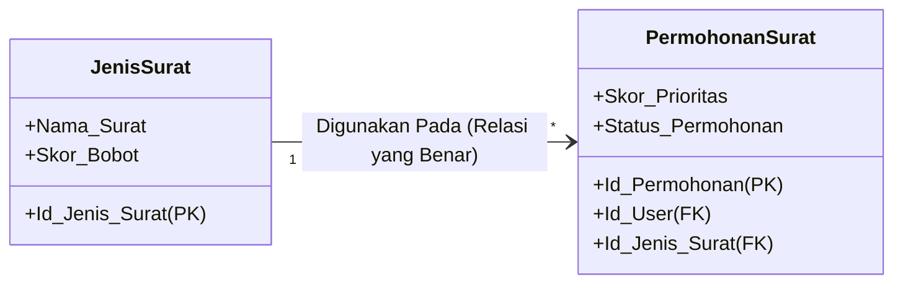

# 📋 LAPORAN AUDIT FORENSIK & EVALUASI SEMINAR PROPOSAL SKRIPSI (KOMPREHENSIF)

**Mahasiswa Bimbingan:** Nelsi (NIM: 2309106120)  
**Program Studi:** S1 Informatika, Fakultas Teknik, Universitas Mulawarman  
**Dosen Pembimbing I:** Anton Prafanto, S.Kom., M.T. (NIP: 199310222019031016)  
**Dosen Pembimbing II:** Gubtha Mahendra Putra, S.Kom., M.Eng.  
**Koordinator Program Studi:** Awang Harsa Kridalaksana, S.Kom., M.Kom. (NIP: 19731229 200501 1 002)  
**Judul Naskah:** *Implementasi Algoritma Priority Scheduling pada Sistem Informasi Pelayanan Surat Administrasi Kelurahan Kampung Sambakungan Berbasis Web*  
**Dokumen yang Diaudit:** `draft_proposal_nelsi.pdf` (56 Halaman, berasal dari `C:\Users\anton\Downloads\Skripsi Nelsii.pdf`)  
**Status Evaluasi:** **DRAF PROPOSAL SKRIPSI — REVISI MAYOR SEBELUM SEMINAR PROPOSAL (BELUM LAYAK SEMPRO TANPA PERBAIKAN FUNDAMENTAL)**

---

> [!NOTE]
> **Catatan Pembimbing Akademik:** Dokumen audit ini disusun sebagai evaluasi forensik akademik, metodologis, dan rekayasa perangkat lunak untuk mempersiapkan Nelsi menghadapi **Ujian Seminar Proposal Skripsi** di Program Studi S1 Informatika FT Unmul. Audit ini menyoroti integritas literatur, keabsahan formulasi algoritma penjadwalan, validitas data uji, ketepatan pemodelan perangkat lunak (UML & ERD), serta kepatuhan mutlak terhadap Buku Panduan Penulisan Skripsi FT Unmul.

---

## ⚖️ 1. Resume Evaluasi Akademik Umum

Secara garis besar, arah riset yang diusulkan oleh Nelsi (NIM: **2309106120**) memiliki intensi positif untuk mengangkat permasalahan nyata pelayanan administrasi di **Kampung Sambakungan, Kecamatan Gunung Tabur, Kabupaten Berau**. Upaya menyematkan **Algoritma Priority Scheduling** non-preemptive pada sistem persuratan kelurahan/kampung merupakan langkah yang baik agar skripsi tidak sekadar menjadi sistem informasi *CRUD (Create, Read, Update, Delete)* biasa.

Namun, dari hasil audit forensik menyeluruh terhadap 56 halaman naskah proposal, ditemukan **cacat metodologis, logis, dan tata tulis yang sangat fundamental**. Proposal ini belum siap dibawa ke meja Seminar Proposal karena mengandung:
1. **14 Referensi Hantu (*Ghost References*)** di Daftar Pustaka yang tidak pernah disitasi dalam badan naskah, termasuk kontradiksi mencantumkan paper pengujian *System Usability Scale (SUS)* padahal di batasan masalah menyatakan tidak menggunakan SUS.
2. **Celah Logika & *Moral Hazard* pada Input Prioritas:** Pemohon (warga) dapat memilih sendiri tingkat urgensi ("Tinggi") dan status ("Lansia/Disabilitas") tanpa validasi NIK maupun syarat berkas kedaruratan, yang berakibat pada manipulasi antrean (*gaming the system*).
3. **Kekeliruan Matematis pada Klaim Uji Banding FIFO vs Priority Scheduling:** Mengklaim rata-rata waktu tunggu seluruh populasi antrean akan turun, padahal dalam teori antrean server tunggal non-preemptive, penataan prioritas **tidak menurunkan rata-rata waktu tunggu total**, melainkan melakukan kompensasi (*trade-off*) waktu tunggu antara permohonan mendesak dan normal. Selain itu, parameter uji tidak menyertakan *Burst Time* dan *Arrival Time*.
4. **Penolakan Mekanisme *Aging* dengan Alasan Lemah:** Alasan volume pelayanan kecil justru bertentangan dengan urgensi penggunaan algoritma penjadwalan.
5. **Inflasi Naskah: 10 Halaman Berisi Wireframe Kosong Melompong (*Blank Skeletons*):** Gambar 3.5 s.d. Gambar 3.14 hanya berupa kotak abu-abu tanpa teks dan tanpa label komponen antarmuka.
6. **Pelanggaran Standar UML 2.5 & Inversi Kardinalitas ERD:** Relasi `<<include>>` digambar garis polos, batas sistem hilang, kardinalitas ERD antara permohonan dan jenis surat terbalik, serta ketiadaan *Class Diagram*.
7. **Kerusakan Format Tata Tulis FT Unmul:** Penomoran halaman preliminer melompat ke angka Arab (halaman 1 dan 2), margin tidak baku (3.5 cm bukan 4 cm), percampuran font (Arial, Calibri, Times New Roman), serta typo nama diagram (*"Pegujian"*).

---

## 🚨 2. Temuan Kritis (*Critical Red Flags*) & Pelanggaran Akademik

### 🚨 RED FLAG 1: Kerusakan Integritas Daftar Pustaka (14 Ghost References & Metadata Berantakan) — SANGAT FATAL!

Berdasarkan audit silang otomatis antara teks naskah (Bab I–III) dengan Daftar Pustaka (halaman 40–43), ditemukan anomali parah:

#### A. 14 Referensi Hantu (*Ghost References*) Tidak Pernah Disitasi di Badan Teks
Sebanyak 14 pustaka tertera di Daftar Pustaka namun **sama sekali tidak pernah dirujuk** dalam kalimat mana pun di Bab I, Bab II, maupun Bab III:
1. **Afrianto, M. I., Fauziah, F., & Wijaya, Y. F. (2024)** — *Priority Scheduling & EDD*.
2. **Al Husaeni, D. N. (2025)** — *Bibliometrik Penjadwalan*.
3. **Darip, M. et al. (2025)** — *Simulasi FIFO Kantin Sekolah*.
4. **Effendy, C., & Gusrianty, G. (2024)** — *Round Robin Wedding Organizer*.
5. **Fachri, B., Rizal, C., & Supiyandi. (2024)** — *Waterfall MBKM*.
6. **Hasibuan, N., & Putri, R. A. (2022)** — *Usability Evaluation SUS*.
7. **Kosim, M. A., Aji, S. R., & Darwis, M. (2022)** — *Pengujian SUS PeduliLindungi*.
8. **Lestari, M. A., Tabrani, M., & Ayumida, S. (2021)** — *Administrasi Kependudukan Desa Pucung*.
9. **Maulana, F. R., Faisol, M., & Zuraidah, E. (2021)** — *Pelayanan Masyarakat RT 02*.
10. **Mustakim / Suparman, A., & Veza, O. (2024)** — *Waterfall Penggajian*.
11. **Rashkovits, R., & Lavy, I. (2021)** — *Errors in ERD Design*.
12. **Ridwan, M. A. et al. (2024)** — *Black Box BJS Property*.
13. **Samsudin, Syamsiah, A., & Ilyas. (2024)** — *SUS Aplikasi Azkiya*.
14. **Sari, I. P. et al. (2022)** — *Antrian FIFO Wahana Hiburan*.

> [!WARNING]
> **Kontradiksi Nyata:** Masuknya paper SUS (Hasibuan 2022, Kosim 2022, Samsudin 2024) ke dalam Daftar Pustaka membuktikan bahwa mahasiswa melakukan *dumping* atau *copy-paste* daftar pustaka dari naskah orang lain tanpa membaca dan mengutipnya. Padahal di Batasan Masalah (Subbab 1.3 poin 6), mahasiswa menulis: *"Penelitian ini tidak menggunakan kuesioner System Usability Scale (SUS)..."*.

#### B. Kerusakan Metadata Sitasi & Error Scraping
1. **Pencampuran Afiliasi Kampus ke Nama Penulis (Hal. 42):**
   * Tertulis: `Ridwan, M. A., Nuryasin, I., Informatika, P., Malang, U. M., & Lowokwaru, K. (2024). PENGUJIAN BLACK BOX PADA WEBSITE BJS PROPERTY MENGGUNKAN. 8(1), 65–74.`
   * **Fakta:** Mahasiswa mengimpor metadata secara ceroboh dari Google Scholar/Mendeley. `"Informatika, P."` (Program Studi Informatika), `"Malang, U. M."` (Universitas Muhammadiyah Malang), dan `"Lowokwaru, K."` (Kecamatan Lowokwaru) dimasukkan sebagai nama pengarang manusia! Judulnya pun terpotong dan typo (*MENGGUNKAN*), serta nama jurnalnya hilang sama sekali.
2. **Pustaka Tidak Lengkap / Menggantung (Hal. 40, 41, 43):**
   * `Aldila. (2022). Sistem Informasi Pelayanan Surat Menyurat di Kelurahan Menggunakan Metode Waterfall.` (Tanpa nama jurnal/penerbit, tanpa volume/halaman).
   * `Hasri, A., & Sudarmilah. (2021). Sistem Informasi Administrasi Kependudukan Berbasis Web di Tingkat Kelurahan.` (Tanpa wadah publikasi).
   * `Hidayat. (2022). Sistem Informasi Administrasi Kependudukan Terintegrasi WhatsApp Gateway untuk Notifikasi.` (Nama tunggal, tanpa penerbit).
   * `Wulandari, & Purnomo. (2021). Penerapan Unified Modelling Language (UML) dalam Perancangan Sistem Informasi Administrasi Kelurahan.` (Tanpa inisial, tanpa nama jurnal).
   * Entri `Mustakim ...` (Hal. 41 baris terakhir) terputus di tengah jalan dan menyambung aneh pada baris pertama Hal. 42 dengan nama `Suparman, A., & Veza, O. (2024)`.

---

### 🚨 RED FLAG 2: Celah Moral Hazard & Kerapuhan Logika Formula Prioritas

Formula prioritas yang dirancang pada Persamaan 2.1:
$$P(i) = w_1 \times \text{SkorJenisSurat} + w_2 \times \text{SkorUrgensi} + w_3 \times \text{SkorStatusPemohon}$$
dengan bobot: $w_1 = 0.3$, $w_2 = 0.5$, $w_3 = 0.2$.

```
Skala Variabel:
- Jenis Surat: SKTM (5), SKU (3), Domisili (2), Pengantar (2)
- Urgensi:     Tinggi (5), Sedang (3), Rendah (1)
- Status:      Lansia (5), Disabilitas (4), Umum (1)
```

#### Kelemahan Desain Sistem:
1. **Bobot Terbesar Berada pada Dropdown Subjektif:** Variabel *Urgensi* memegang bobot $50\%$ ($w_2 = 0.5$). Berdasarkan rancangan antarmuka (Gambar 3.6), pemohon surat (warga) memilih sendiri opsi urgensi melalui *dropdown*. Secara psikologis dan perilaku pengguna pelayanan publik, **semua pemohon akan memilih "Tinggi"** agar permohonannya didahulukan.
2. **Ketiadaan Validasi NIK untuk Status Pemohon:** Pilihan status pemohon (Lansia/Disabilitas/Umum) juga diisi secara mandiri. Mengapa warga muda berusia 20 tahun bisa memilih "Lansia" jika sistem memegang data NIK? Tanggal lahir pemohon dapat di-ekstrak langsung dari 16 digit NIK (digit ke-7 s.d. 12). Jika sistem tidak memvalidasi usia dari NIK secara otomatis, ini adalah kelalaian rekayasa perangkat lunak (*software engineering design flaw*).
3. **Solusi Perbaikan Wajib:**
   - Variabel **Status Pemohon (Lansia)** wajib dihitung **otomatis oleh sistem** dari data tanggal lahir / NIK pemohon ($Usia \ge 60$ tahun = Lansia).
   - Status **Disabilitas** dan tingkat **Urgensi Tinggi** wajib menyertakan **unggah berkas bukti kedaruratan** (misal: surat rujukan rumah sakit, bukti tiket darurat, dll) yang harus diverifikasi awal oleh petugas sebelum skor urgensi 5 diaplikasikan.

---

### 🚨 RED FLAG 3: Kelemahan Matematis Pengujian Banding FIFO vs Priority Scheduling

Pada Rumusan Masalah 2, Tujuan 2, dan Subbab 3.6.3, mahasiswa menyatakan:
> *"membuktikan bahwa algoritma Priority Scheduling memberikan kinerja yang lebih baik dibandingkan metode FIFO yang berjalan saat ini... ditinjau dari (1) rata-rata waktu tunggu seluruh permohonan..."*

#### Kritik Keras Berdasarkan Teori Antrean (*Queueing & Scheduling Theory*):
1. **Kesalahan Konsep Efisiensi Global:** Dalam sistem antrean server tunggal non-preemptive (*work-conserving single-server queue*), jika durasi pemrosesan surat homogen atau terdistribusi independen dari prioritas:
   $$\sum_{i=1}^n WT_i^{\text{Priority}} = \sum_{i=1}^n WT_i^{\text{FIFO}}$$
   Artinya, **Rata-rata Waktu Tunggu Seluruh Permohonan ($\bar{WT}$) TIDAK AKAN PERNAH BERKURANG** hanya dengan mengubah urutan prioritas! Priority Scheduling adalah instrumen *distributif/keadilan perlakuan*, bukan instrumen reduksi beban total. Ia mempercepat permohonan gawat darurat dengan **mengorbankan (memperlambat)** permohonan biasa. Jika mahasiswa mengklaim rata-rata waktu tunggu keseluruhan turun, dewan penguji akan langsung mematahkan argumen ini.
2. **Data Uji Kehilangan Parameter Kritis (Tabel 3.7):**
   * Tabel 3.7 hanya mencantumkan: `ID`, `Jenis Surat`, `Urgensi`, `Status Pemohon`, `Urutan Datang`, `Skor P(i)`.
   * **Parameter Hilang:** Di mana **Waktu Kedatangan Riil (*Arrival Time* - $AT$)** dan **Lama Pemrosesan Surat (*Burst Time / Service Time* - $BT$)**?
   * Tanpa $AT$ dan $BT$, nilai *Waiting Time* ($WT = ST - AT$) dan *Turnaround Time* ($TAT = FT - AT$) secara matematis **mustahil dihitung**!
3. **Solusi Perbaikan Wajib:**
   * Ubah rumusan klaim: Priority Scheduling bukan menurunkan rata-rata waktu tunggu keseluruhan, melainkan **mereduksi waktu tunggu kelompok permohonan berkebutuhan khusus/mendesak (*Waiting Time of High-Priority Requests*)**.
   * Lengkapi Tabel Skenario Pengujian dengan $AT$ (menit ke-0, ke-5, ke-15) dan estimasi $BT$ (misal: verifikasi SKTM butuh 15 menit, Domisili butuh 5 menit).

---

### 🚨 RED FLAG 4: Penolakan Mekanisme *Aging* Menimbulkan Risiko Starvation Absolut

Dalam Subbab 1.3 poin 2 dan Subbab 2.3.3, mahasiswa menyatakan **tidak menerapkan mekanisme *aging*** dengan alasan volume surat di Kelurahan Kampung Sambakungan relatif kecil.

#### Kontradiksi Argumen:
* Jika volume surat sangat sedikit sehingga antrean cepat habis tanpa pernah menumpuk, maka **tidak ada justifikasi ilmiah mengapa kelurahan tersebut membutuhkan Priority Scheduling**. FIFO manual sudah lebih dari cukup.
* Sebaliknya, jika ada hari-hari sibuk di mana permohonan SKTM dan surat mendesak terus masuk, warga biasa yang mengajukan Surat Domisili akan mengalami **kebuntuan tak terbatas (*indefinite blocking / starvation*)** dan suratnya tidak akan pernah diverifikasi petugas.
* Sebagai mahasiswa S1 Informatika, menambahkan fungsi *Aging* linier sederhana:
  $$P_{\text{aktual}}(i, t) = P_{\text{awal}}(i) + \lambda \cdot (t - t_{\text{pengajuan}})$$
  di mana $\lambda$ adalah koefisien penambahan prioritas per satuan jam/hari tunggu, adalah bentuk kontribusi teknis nyata yang sangat diapresiasi oleh penguji.

---

### 🚨 RED FLAG 5: 10 Halaman Penuh Berisi Gambar Wireframe Kosong (*Blank Skeletons*)

Pada Subbab 3.5 (Perancangan Tampilan), halaman 37 sampai 46 memuat **10 gambar berturut-turut** (Gambar 3.5 s.d. Gambar 3.14).
* **Fakta:** Seluruh gambar tersebut adalah **wireframe kosong melompong**! Kotak-kotak abu-abu tanpa teks label form, tanpa tombol bernama, tanpa placeholder isi data, dan tanpa indikasi nilai skor antrean.
* Naskah proposal menjadi terlihat menggembung secara artifisial (*page padding*) sebanyak 10 halaman hanya untuk memuat gambar kosong dengan 2 baris kalimat pengantar per halaman.
* **Solusi Wajib:** Ganti wireframe kosong tersebut dengan desain antarmuka (*mockup high-fidelity* menggunakan Figma / visual riil) yang menampilkan label nyata: Field NIK, Nama, Pilihan Jenis Surat, Indikator Urgensi, Tabel Antrean dengan kolom skor prioritas, dan tombol aksi petugas. Satukan beberapa halaman kecil ke dalam satu layout terpadu agar hemat ruang dan informatif.

---

### 🚨 RED FLAG 6: Pelanggaran Notasi UML 2.5 & Inversi Kardinalitas ERD

Sebagai karya ilmiah Program Studi S1 Informatika:



1. **Inversi Kardinalitas ERD yang Fatal (Gambar 3.4):**
   * Di naskah, relasi `Permohonan Surat` ke `Jenis Surat` diberi angka: `Permohonan Surat [1] ---- [N] Jenis Surat`.
   * Ini **terbalik 180 derajat**! Satu permohonan surat hanya meminta 1 jenis surat. Sementara 1 jenis surat (misal: SKTM) dapat digunakan pada banyak (N) permohonan surat. Terlebih lagi, foreign key `Id_Jenis_Surat (FK)` berada di dalam entitas `Permohonan Surat`. Dalam perancangan basis data relasional, entitas yang memegang foreign key adalah sisi *Many (N)*!
2. **Atribut Basis Data Kurang Fundamental (Tabel 3.2 & Gambar 3.4):**
   * Tabel `Users`: Tidak memiliki atribut `NIK`, `Alamat`, `No_HP`.
   * Tabel `Permohonan_Surat`: Tidak memiliki atribut `Waktu_Selesai`, `Path_Berkas_Syarat`, `Catatan_Verifikasi_Petugas`, dan `Id_Petugas_Pemroses`.
3. **Use Case Diagram Cacat Notasi (Gambar 3.2):**
   * Hubungan use case "Mengajukan Permohonan Surat" dengan "Menghitung Skor Prioritas P(i)" digambarkan dengan **garis lurus polos tanpa panah dan tanpa teks `<<include>>`**.
   * Batas sistem (*System Boundary*) tidak digambar sama sekali.
   * Aktor Warga dihubungkan dengan use case "Menerima Notifikasi Email". Menerima email adalah interaksi di luar sistem (pada mail client warga seperti Gmail), bukan use case interaktif di dalam web kelurahan. Use case sistem yang benar adalah "Mengirim Notifikasi Email".
4. **Ketiadaan *Class Diagram* & *Sequence Diagram*:**
   * Sistem dikembangkan menggunakan arsitektur MVC berorientasi objek (*Laravel Framework*), tetapi tidak ada satu pun *Class Diagram* yang menggambarkan struktur Controller, Model, dan Service Algoritma.

---

### 🚨 RED FLAG 7: Kerusakan Tata Tulis, Penomoran Halaman, & Typo

1. **Penomoran Halaman Preliminer Rusak:**
   * Di naskah, Daftar Istilah/Lambang diberi nomor **1** (angka Arab) dan Daftar Singkatan diberi nomor **2**. Bab I kemudian dimulai pada halaman **3**.
   * **Standar FT Unmul:** Seluruh halaman preliminer (Judul s.d. Daftar Singkatan) **wajib menggunakan angka Romawi kecil (i, ii, iii, ... xi, xii)** di bagian tengah bawah (*bottom center*). Angka Arab (1, 2, 3...) **harus dimulai tepat pada BAB I halaman 1**!
2. **Artefak Field Code Microsoft Word yang Tidak Dihapus:**
   * Pada Daftar Istilah (Hal. 11 dokumen) dan Daftar Singkatan (Hal. 12 dokumen), muncul teks header bawaan Word yang tidak dihapus: `Contents halaman` dan `Contents Arti`.
3. **Pelanggaran Margin Baku FT Unmul:**
   * Hasil pengukuran naskah menunjukkan: Top = 3.5 cm, Left = 3.5 cm, Right = 2.4 cm, Bottom = 2.5 cm.
   * **Standar FT Unmul:** **Kiri = 4 cm, Atas = 4 cm, Kanan = 3 cm, Bawah = 3 cm**. Ruang kiri 4 cm mutlak dibutuhkan untuk jilid lakban/hardcover.
4. **Inkonsistensi Font:**
   * Ditemukan jenis font campur aduk:
     - Teks Utama: *Times New Roman* (12 pt).
     - Halaman Pengesahan & Kata Pengantar: *Arial* (12 pt).
     - Daftar Isi: *Calibri-Light* (16 pt) dan *Calibri* (12 pt).
     - Pseudocode: *Courier New* (11 pt).
   * Seluruh dokumen wajib diseragamkan menggunakan **Times New Roman** sesuai pedoman.
5. **Typo pada Diagram:**
   * Pada Gambar 3.1 (Kerangka Penelitian), kotak pengujian tertulis: **`Pegujian Algoritma`** (kurang huruf 'n').
6. **Placeholder Formalia Belum Lengkap:**
   * Lembar Pengesahan (Hal. iii): Tidak mencantumkan NIP Dosen Pembimbing I (Anton Prafanto, S.Kom., M.T.) dan NIP Pembimbing II (Gubtha Mahendra Putra, S.Kom., M.Eng.), serta tanggal rapat masih `[tanggal, bulan, tahun]`.
   * Kata Pengantar: Poin 6 dan 7 menuliskan titik-titik panjang untuk ucapan terima kasih kepada Penguji I dan Penguji II. Pada tahap seminar proposal, dewan penguji belum ditetapkan secara definitif dan belum menguji, sehingga poin ini harus dihapus.
   * Nama instansi lokasi: Di Kabupaten Berau, status resmi wilayah administratif adalah **Kampung Sambakungan** yang dipimpin oleh **Kepala Kampung** (bukan Kelurahan/Lurah murni). Mahasiswa harus memperjelas penyebutan nomenklatur pemerintahan daerah Kabupaten Berau agar tidak didebat penguji saat sempro.

---

## 🛠️ 3. Panduan Tindakan Revisi Konkret (*Action Plan*) untuk Mahasiswa

Agar proposal ini memenuhi standar kelayakan seminar proposal S1 Informatika, Nelsi wajib menjalankan instruksi revisi terstruktur berikut:

```mermaid
flowchart TD
    A["Audit Proposal Nelsi (2309106120)"] --> B["1. Pembersihan Sitasi & Daftar Pustaka"]
    A --> C["2. Penguatan Formulasi & Logika Algoritma"]
    A --> D["3. Penyempurnaan Parameter Uji Banding"]
    A --> E["4. Perbaikan Diagram UML, ERD & UI Mockup"]
    A --> F["5. Standardisasi Format & Tata Tulis FT"]

    B --> B1["Hapus 14 Ghost References"]
    B --> B2["Perbaiki Metadata Ridwan et al. & Pustaka Gantung"]
    B --> B3["Sinkronkan Pustaka via Mendeley/Zotero"]

    C --> C1["Otomasi Lansia via NIK"]
    C --> C2["Wajibkan Bukti Kedaruratan untuk Urgensi Tinggi"]
    C --> C3["Integrasikan Rumus Aging Sederhana"]

    D --> D1["Lengkapi Tabel Uji dengan Arrival & Burst Time"]
    D --> D2["Koreksi Klaim Metrik: Reduksi WT Khusus Kasus Mendesak"]

    E --> E1["Perbaiki Kardinalitas ERD (1 ke N) & Tambah Atribut"]
    E --> E2["Perbaiki Simbol <<include>> & Boundary pada Use Case"]
    E --> E3["Ganti 10 Halaman Wireframe Kosong dengan Mockup Berlabel"]

    F --> F1["Reset Margin ke 4-4-3-3 cm"]
    F --> F2["Perbaiki Penomoran Halaman (Romawi Awal & Arab Bab I = 1)"]
    F --> F3["Seragamkan Font ke Times New Roman"]
```



---

## 🎯 4. Matriks Perbandingan Pustaka Terkait yang Hilang (Wajib Dimasukkan ke Subbab 2.1)

Saat ini Subbab 2.1 hanya berupa narasi monoton 10 poin. Mahasiswa wajib merangkumnya ke dalam **Tabel Matriks Penelitian Terkait** berikut untuk mempertegas *Research Gap*:

| No | Penulis & Tahun | Judul Penelitian | Metode / Algoritma | Parameter / Variabel | Uji Banding Kinerja | Celah Riset (*Gap*) & Posisi Penelitian Ini |
|:---|:---|:---|:---|:---|:---:|:---|
| 1 | Rohmah & Gunawan (2023) | Sistem Informasi Pelayanan Administrasi Kependudukan Desa | Priority Scheduling & Waterfall | Bobot subjektif / asumtif | ❌ Tidak ada (Hanya SUS) | Mengimplementasikan prioritas tapi tanpa validasi empiris performa antrean. Penelitian Nelsi menambahkan uji banding kuantitatif vs FIFO. |
| 2 | Rumahorbo et al. (2025) | Analisis Perbandingan Penjadwalan Prioritas Preemptive vs Non-Preemptive | Preemptive & Non-Preemptive Scheduling | Waktu kedatangan & burst time proses | ✅ Simulasi Web | Hanya berfokus pada simulasi algoritma di lingkungan komputasi teoritis, belum diterapkan pada studi kasus persuratan instansi publik. |
| 3 | Mahendra & Gunawan (2025) | Optimalisasi Sistem Antrean Administrasi Desa | Shortest Job First (SJF) | Estimasi waktu pelayanan surat | ✅ Ada | Mengabaikan faktor urgensi pemohon (hanya melihat durasi pengerjaan tercepat). Penelitian Nelsi melengkapi dengan pembobotan kondisi khusus warga. |
| 4 | Darip et al. (2025) | Simulasi Model Antrean FIFO di Kantin Sekolah | First In First Out (FIFO) | Waktu kedatangan & pelayanan | ✅ Simulasi | Membuktikan kelemahan antrean FIFO saat terjadi beban puncak tanpa diferensiasi urgensi. |
| 5 | **Nelsi (2026) — *Usulan Penelitian Ini*** | **Sistem Informasi Pelayanan Surat Administrasi Kelurahan Kampung Sambakungan** | **Priority Scheduling (Non-Preemptive) + Aging Sederhana** | **Jenis Surat (0.3), Urgensi Tervalidasi (0.5), Status Lansia via NIK (0.2)** | **✅ Evaluasi Kuantitatif Terhadap FIFO (Arrival Time & Burst Time Terkontrol)** | **Menutup celah subjektivitas pembobotan melalui wawancara stakeholder desa dan membuktikan efektivitas pemangkasan waktu tunggu kasus gawat darurat.** |

---

## 🎤 5. Simulasi Pertanyaan Kritis Dewan Penguji Seminar Proposal

Berikut adalah daftar pertanyaan tajam yang diprediksi kuat akan dilontarkan oleh Dewan Penguji saat Nelsi maju Seminar Proposal:

1. **Pertanyaan Penguji 1 (Metodologi & Algoritma):**
   > *"Di Bab I dan III Anda mengklaim bahwa Priority Scheduling dapat menurunkan rata-rata waktu tunggu seluruh permohonan dibandingkan FIFO. Secara teori antrean non-preemptive work-conserving, merombak urutan tanpa mengubah burst time tidak akan menurunkan rata-rata waktu tunggu total! Bisa Anda jelaskan penurunan waktu tunggu di kelompok mana yang sebenarnya Anda tuju?"*
   * **Jawaban yang Harus Dipersiapkan Mahasiswa:** Mengakui bahwa secara matematis rata-rata waktu tunggu total seluruh populasi tetap sama, namun Priority Scheduling bertujuan **memangkas waktu tunggu secara drastis pada kelompok permohonan berkategori mendesak dan warga rentan (lansia/disabilitas)**, di mana hal ini memiliki nilai kemanfaatan sosial (*utility value*) yang jauh lebih tinggi bagi pelayanan publik.

2. **Pertanyaan Penguji 2 (Integritas Sistem & Keamanan Logika):**
   > *"Di form pengajuan surat, warga memilih sendiri apakah urgensinya Tinggi, Sedang, atau Rendah. Bobot urgensi Anda buat 50%. Apa yang menjamin warga tidak berbohong memilih 'Tinggi' semua agar suratnya selesai duluan? Dan kenapa status lansia dipilih manual bukan dideteksi dari NIK?"*
   * **Jawaban yang Harus Dipersiapkan Mahasiswa:** Sistem dilengkapi verifikasi ganda: status lansia dihitung otomatis dari parsing tanggal lahir NIK, dan pemilihan opsi urgensi tinggi mewajibkan unggah dokumen bukti kedaruratan yang diverifikasi awal oleh petugas sebelum antrean diprioritaskan.

3. **Pertanyaan Penguji 3 (Studi Kasus & Kepustakaan):**
   > *"Mengapa di Daftar Pustaka Anda banyak sekali paper tentang System Usability Scale (SUS), padahal Anda dengan tegas membatasi masalah tidak menguji SUS? Dan di pustaka nomor [x] tertulis pengarangnya 'Informatika, P.' dan 'Lowokwaru, K.'? Apakah Anda membaca artikel-artikel ini?"*
   * **Jawaban yang Harus Dipersiapkan Mahasiswa:** Harus meminta maaf atas kelalaian impor metadata sitasi dan menyatakan telah membersihkan pustaka hantu serta mengoreksi metadata langsung dari dokumen primer artikel aslinya.

4. **Pertanyaan Penguji 4 (Perancangan Basis Data & UML):**
   > *"Coba lihat ERD Anda di Gambar 3.4. Kenapa relasinya dari Permohonan Surat ke Jenis Surat adalah 1 ke N? Apakah satu surat bisa punya banyak jenis surat, sedangkan satu jenis surat cuma bisa diajukan satu kali seumur hidup? Dan ke mana atribut NIK serta file lampiran di database Anda?"*
   * **Jawaban yang Harus Dipersiapkan Mahasiswa:** Menjelaskan perbaikan kardinalitas menjadi 1 Jenis Surat memiliki Banyak (N) Permohonan Surat, serta menyajikan skema relasi baru yang sudah memuat atribut `nik`, `waktu_selesai`, `berkas_persyaratan`, dan `catatan_petugas`.

---

## 📌 6. Rekomendasi Keputusan Pembimbing

| Aspek Evaluasi | Skor Kelayakan (1–10) | Catatan Pembimbing |
|:---|:---:|:---|
| **Relevansi Topik & Urgensi Kasus** | **7.5 / 10** | Topik sangat aplikatif untuk digitalisasi persuratan kampung di Berau. |
| **Formulasi & Desain Algoritma** | **5.0 / 10** | Perlu perbaikan pada verifikasi input urgensi/NIK dan mitigasi starvation. |
| **Metodologi Pengujian Kinerja** | **4.5 / 10** | Desain data uji belum menyertakan *Arrival Time* dan *Burst Time*. |
| **Pemodelan Sistem (UML & Basis Data)** | **4.0 / 10** | Kardinalitas ERD terbalik fatal; Use Case cacat notasi; tidak ada Class Diagram. |
| **Integritas Literatur & Sitasi** | **3.5 / 10** | Ditemukan 14 pustaka hantu dan kesalahan impor metadata yang memalukan. |
| **Kepatuhan Tata Tulis & Format FT** | **4.0 / 10** | Penomoran halaman preliminer rusak; wireframe 10 halaman kosong melompong. |

**Keputusan Pembimbing I (Anton Prafanto, S.Kom., M.T.):**
> **BELUM DIIZINKAN SEMINAR PROPOSAL.**  
> Mahasiswa wajib melakukan revisi naskah secara komprehensif sesuai 7 poin *Red Flags* di atas, membersihkan daftar pustaka, memperbaiki perancangan UML & ERD, melengkapi data uji algoritma, dan menyerahkan draf revisi lengkap untuk audit ulang sebelum lembar persetujuan seminar proposal ditandatangani.
