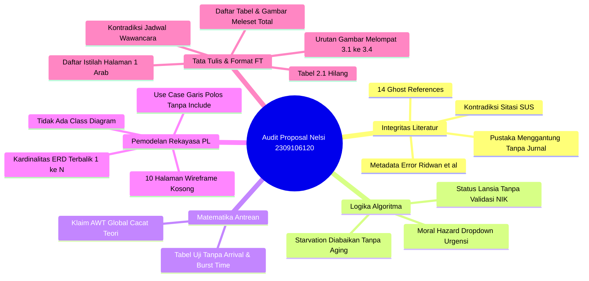
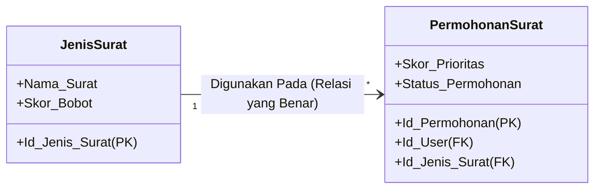

# 📋 LAPORAN AUDIT FORENSIK & EVALUASI SEMINAR PROPOSAL SKRIPSI (KOMPREHENSIF)

**Mahasiswa Bimbingan:** Nelsi (NIM: 2309106120)  
**Program Studi:** S1 Informatika, Fakultas Teknik, Universitas Mulawarman  
**Dosen Pembimbing I:** Anton Prafanto, S.Kom., M.T. (NIP: 199310222019031016)  
**Dosen Pembimbing II:** Gubtha Mahendra Putra, S.Kom., M.Eng.  
**Koordinator Program Studi:** Awang Harsa Kridalaksana, S.Kom., M.Kom. (NIP: 19731229 200501 1 002)  
**Judul Naskah:** *Implementasi Algoritma Priority Scheduling pada Sistem Informasi Pelayanan Surat Administrasi Kelurahan Kampung Sambakungan Berbasis Web*  
**Dokumen yang Diaudit:** `draft_proposal_nelsi.pdf` (56 Halaman, berkas sumber `Skripsi Nelsii.pdf`)  
**Status Evaluasi:** **DRAF PROPOSAL SKRIPSI — REVISI MAYOR SEBELUM SEMINAR PROPOSAL (BELUM DIIZINKAN SEMINAR SEBELUM PERBAIKAN FUNDAMENTAL)**

---

> [!NOTE]
> **Catatan Pembimbing Akademik:** Dokumen audit ini disusun sebagai evaluasi forensik akademik, metodologis, integritas pustaka, dan rekayasa perangkat lunak untuk mempersiapkan Nelsi menghadapi **Ujian Seminar Proposal Skripsi** di Program Studi S1 Informatika FT Unmul. Naskah telah ditelaah per halaman (56 halaman) untuk memastikan kepatuhan mutlak terhadap kaidah keilmuan komputer, teori antrean/penjadwalan, pemodelan sistem (UML & ERD), serta Buku Panduan Penulisan Skripsi FT Unmul.

---

## ⚖️ 1. Resume Evaluasi Akademik Umum

Secara substansi terapan, topik yang diangkat oleh Nelsi (NIM: **2309106120**) memiliki relevansi yang sangat baik untuk menjawab persoalan pelayanan administrasi warga di **Kampung Sambakungan, Kecamatan Gunung Tabur, Kabupaten Berau**. Penerapan **Algoritma Priority Scheduling** non-preemptive pada sistem persuratan publik bertujuan agar pelayanan tidak bersifat kaku menggunakan FIFO biasa, terutama bagi permohonan yang membutuhkan penanganan lekas (seperti SKTM berobat darurat atau pemohon lansia).

Namun, dari audit forensik mendalam yang dilakukan terhadap struktur naskah PDF, ditemukan **10 kelemahan kritis (*10 Critical Red Flags*)**, mulai dari integritas kepustakaan yang tercemar, kerapuhan logika sistem yang membuka celah manipulasi antrean (*moral hazard*), kesalahan fatal teori antrean matematis, ketiadaan mekanisme penanganan *starvation*, inflasi 10 halaman wireframe kosong tanpa teks, inversi kardinalitas ERD, lompatan nomor gambar dan tabel, kontradiksi waktu wawancara, hingga pelanggaran format baku FT Unmul.

Proposal ini **BELUM MEMENUHI STANDAR KELAYAKAN** untuk diseminarkan dan **WAJIB DIREVISI SECARA TOTAL** sesuai arahan di bawah ini.

---

## 🚨 2. Rincian 10 Temuan Kritis (*10 Critical Red Flags*)



---

### 🚨 RED FLAG 1: Kerusakan Integritas Daftar Pustaka (14 Ghost References & Metadata Berantakan) — SANGAT FATAL!

Berdasarkan audit silang komputasi antara badan naskah (Bab I–III) dengan Daftar Pustaka (halaman 40–43), ditemukan pelanggaran integritas literatur yang berat:

#### A. 14 Referensi Hantu (*Ghost References*)
Sebanyak 14 pustaka tertera di Daftar Pustaka namun **sama sekali tidak pernah disitasi atau dirujuk satu kali pun** di badan teks:
1. **Afrianto, M. I., Fauziah, F., & Wijaya, Y. F. (2024)** — *Priority Scheduling & EDD*.
2. **Al Husaeni, D. N. (2025)** — *Bibliometrik Penjadwalan*.
3. **Darip, M. et al. (2025)** — *Simulasi FIFO Kantin Sekolah*.
4. **Effendy, C., & Gusrianty, G. (2024)** — *Round Robin Wedding Organizer*.
5. **Fachri, B., Rizal, C., & Supiyandi. (2024)** — *Waterfall MBKM*.
6. **Hasibuan, N., & Putri, R. A. (2022)** — *Usability Evaluation SUS*.
7. **Kosim, M. A., Aji, S. R., & Darwis, M. (2022)** — *Pengujian SUS PeduliLindungi*.
8. **Lestari, M. A., Tabrani, M., & Ayumida, S. (2021)** — *Administrasi Kependudukan Desa Pucung*.
9. **Maulana, F. R., Faisol, M., & Zuraidah, E. (2021)** — *Pelayanan Masyarakat RT 02*.
10. **Mustakim / Suparman, A., & Veza, O. (2024)** — *Waterfall Penggajian*.
11. **Rashkovits, R., & Lavy, I. (2021)** — *Errors in ERD Design*.
12. **Ridwan, M. A. et al. (2024)** — *Black Box BJS Property*.
13. **Samsudin, Syamsiah, A., & Ilyas. (2024)** — *SUS Aplikasi Azkiya*.
14. **Sari, I. P. et al. (2022)** — *Antrian FIFO Wahana Hiburan*.

> [!WARNING]
> **Kontradiksi Nyata:** Masuknya 3 paper pengujian *System Usability Scale (SUS)* (Hasibuan 2022, Kosim 2022, Samsudin 2024) ke Daftar Pustaka membuktikan terjadinya *copy-paste* daftar pustaka secara serampangan. Padahal di Batasan Masalah (Subbab 1.3 poin 6), Nelsi tegas menulis: *"Penelitian ini tidak menggunakan kuesioner System Usability Scale (SUS)..."*. Di hadapan penguji, ini adalah bukti mahasiswa tidak membaca daftar pustakanya sendiri.

#### B. Kerusakan Metadata Sitasi yang Memalukan
1. **Pencampuran Afiliasi/Alamat Kampus Menjadi Nama Pengarang (Hal. 42):**
   * Tertulis: `Ridwan, M. A., Nuryasin, I., Informatika, P., Malang, U. M., & Lowokwaru, K. (2024). PENGUJIAN BLACK BOX PADA WEBSITE BJS PROPERTY MENGGUNKAN. 8(1), 65–74.`
   * **Fakta:** Mahasiswa mengimpor metadata tanpa diperiksa. `"Informatika, P."` (Program Studi Informatika), `"Malang, U. M."` (Universitas Muhammadiyah Malang), dan `"Lowokwaru, K."` (Kecamatan Lowokwaru) masuk sebagai nama pengarang! Judulnya terpotong dan typo (*MENGGUNKAN*), serta nama jurnalnya hilang.
2. **Pustaka Tidak Lengkap / Menggantung (Hal. 40, 41, 43):**
   * `Aldila. (2022). Sistem Informasi Pelayanan Surat Menyurat di Kelurahan Menggunakan Metode Waterfall.` (Tanpa nama jurnal/penerbit, tanpa volume/halaman).
   * `Hasri, A., & Sudarmilah. (2021). Sistem Informasi Administrasi Kependudukan Berbasis Web di Tingkat Kelurahan.` (Tanpa wadah publikasi).
   * `Hidayat. (2022). Sistem Informasi Administrasi Kependudukan Terintegrasi WhatsApp Gateway untuk Notifikasi.` (Nama tunggal tanpa identitas jurnal).
   * `Wulandari, & Purnomo. (2021). Penerapan Unified Modelling Language (UML) dalam Perancangan Sistem Informasi Administrasi Kelurahan.` (Tanpa inisial, tanpa nama jurnal).
   * Entri `Mustakim ...` (Hal. 41 baris terakhir) terputus di tengah jalan dan menyambung aneh pada baris pertama Hal. 42 dengan nama `Suparman, A., & Veza, O. (2024)`.

---

### 🚨 RED FLAG 2: Celah Moral Hazard & Kerapuhan Logika Formula Prioritas

Formula prioritas yang dirancang pada Persamaan 2.1:
$$P(i) = w_1 \times \text{SkorJenisSurat} + w_2 \times \text{SkorUrgensi} + w_3 \times \text{SkorStatusPemohon}$$
dengan bobot awal: $w_1 = 0.3$, $w_2 = 0.5$, $w_3 = 0.2$.

```
Skala Variabel:
- Jenis Surat: SKTM (5), SKU (3), Domisili (2), Pengantar (2)
- Urgensi:     Tinggi (5), Sedang (3), Rendah (1)
- Status:      Lansia (5), Disabilitas (4), Umum (1)
```

#### Kelemahan Desain Sistem:
1. **Bobot Terbesar Berada pada Dropdown Subjektif:** Variabel *Urgensi* memegang bobot $50\%$ ($w_2 = 0.5$). Berdasarkan form permohonan (Gambar 3.6), pemohon surat (warga) memilih sendiri opsi urgensi melalui *dropdown*. Secara psikologis dalam pelayanan publik, **semua pemohon akan memilih "Tinggi"** agar permohonannya didahulukan.
2. **Ketiadaan Validasi NIK untuk Status Pemohon:** Pilihan status pemohon (Lansia/Disabilitas/Umum) juga diisi secara mandiri. Mengapa warga muda berusia 20 tahun bisa memilih "Lansia" jika sistem memegang data NIK? Tanggal lahir pemohon dapat di-ekstrak langsung dari 16 digit NIK (digit ke-7 s.d. 12). Jika sistem tidak memvalidasi usia dari NIK secara otomatis, ini adalah kelalaian rekayasa perangkat lunak (*software engineering design flaw*).
3. **Solusi Perbaikan Wajib:**
   - Variabel **Status Pemohon (Lansia)** wajib dihitung **otomatis oleh sistem** dari data tanggal lahir / NIK pemohon ($Usia \ge 60$ tahun = Lansia).
   - Status **Disabilitas** dan tingkat **Urgensi Tinggi** wajib menyertakan **unggah berkas bukti kedaruratan** (misal: surat rujukan rumah sakit, bukti tiket darurat, dll) yang harus diverifikasi awal oleh petugas sebelum skor urgensi 5 diaplikasikan.

---

### 🚨 RED FLAG 3: Kelemahan Matematis Pengujian Banding FIFO vs Priority Scheduling

Pada Rumusan Masalah 2, Tujuan 2, dan Subbab 3.6.3, mahasiswa menyatakan:
> *"membuktikan bahwa algoritma Priority Scheduling memberikan kinerja yang lebih baik dibandingkan metode FIFO yang berjalan saat ini... ditinjau dari (1) rata-rata waktu tunggu seluruh permohonan..."*

#### Kritik Keras Berdasarkan Teori Antrean (*Queueing & Scheduling Theory*):
1. **Kesalahan Konsep Efisiensi Global:** Dalam sistem antrean server tunggal non-preemptive (*work-conserving single-server queue*), jika durasi pemrosesan surat homogen atau terdistribusi independen dari prioritas:
   $$\sum_{i=1}^n WT_i^{\text{Priority}} = \sum_{i=1}^n WT_i^{\text{FIFO}}$$
   Artinya, **Rata-rata Waktu Tunggu Seluruh Permohonan ($\bar{WT}$) TIDAK AKAN PERNAH BERKURANG** hanya dengan mengubah urutan prioritas! Priority Scheduling adalah instrumen *distributif/keadilan perlakuan*, bukan instrumen reduksi beban total. Ia mempercepat permohonan gawat darurat dengan **mengorbankan (memperlambat)** permohonan biasa. Jika mahasiswa mengklaim rata-rata waktu tunggu keseluruhan turun, dewan penguji akan langsung mematahkan argumen ini.
2. **Data Uji Kehilangan Parameter Kritis (Tabel 3.7):**
   * Tabel 3.7 hanya mencantumkan: `ID`, `Jenis Surat`, `Urgensi`, `Status Pemohon`, `Urutan Datang`, `Skor P(i)`.
   * **Parameter Hilang:** Di mana **Waktu Kedatangan Riil (*Arrival Time* - $AT$)** dan **Lama Pemrosesan Surat (*Burst Time / Service Time* - $BT$)**?
   * Tanpa $AT$ dan $BT$, nilai *Waiting Time* ($WT = ST - AT$) dan *Turnaround Time* ($TAT = FT - AT$) secara matematis **mustahil dihitung**!
3. **Solusi Perbaikan Wajib:**
   * Ubah rumusan klaim: Priority Scheduling bukan menurunkan rata-rata waktu tunggu keseluruhan, melainkan **mereduksi waktu tunggu kelompok permohonan berkebutuhan khusus/mendesak (*Waiting Time of High-Priority Requests*)**.
   * Lengkapi Tabel Skenario Pengujian dengan $AT$ (menit ke-0, ke-5, ke-15) dan estimasi $BT$ (misal: verifikasi SKTM butuh 15 menit, Domisili butuh 5 menit).

---

### 🚨 RED FLAG 4: Penolakan Mekanisme *Aging* Menimbulkan Risiko Starvation Absolut

Dalam Subbab 1.3 poin 2 dan Subbab 2.3.3, mahasiswa menyatakan **tidak menerapkan mekanisme *aging*** dengan alasan volume surat di Kelurahan Kampung Sambakungan relatif kecil.

#### Kontradiksi Argumen:
* Jika volume surat sangat sedikit sehingga antrean cepat habis tanpa pernah menumpuk, maka **tidak ada justifikasi ilmiah mengapa kelurahan tersebut membutuhkan Priority Scheduling**. FIFO manual sudah lebih dari cukup.
* Sebaliknya, jika ada hari-hari sibuk di mana permohonan SKTM dan surat mendesak terus masuk, warga biasa yang mengajukan Surat Domisili akan mengalami **kebuntuan tak terbatas (*indefinite blocking / starvation*)** dan suratnya tidak akan pernah diverifikasi petugas.
* Sebagai mahasiswa S1 Informatika, menambahkan fungsi *Aging* linier sederhana:
  $$P_{\text{aktual}}(i, t) = P_{\text{awal}}(i) + \lambda \cdot (t - t_{\text{pengajuan}})$$
  di mana $\lambda$ adalah koefisien penambahan prioritas per satuan jam/hari tunggu, adalah bentuk kontribusi teknis nyata yang sangat diapresiasi oleh penguji.

---

### 🚨 RED FLAG 5: 10 Halaman Penuh Berisi Gambar Wireframe Kosong (*Blank Skeletons*)

Pada Subbab 3.5 (Perancangan Tampilan), halaman 37 sampai 46 memuat **10 gambar berturut-turut** (Gambar 3.5 s.d. Gambar 3.14).
* **Fakta:** Seluruh gambar tersebut adalah **wireframe kosong melompong**! Kotak-kotak abu-abu tanpa teks label form, tanpa tombol bernama, tanpa placeholder isi data, dan tanpa indikasi nilai skor antrean.
* Naskah proposal menjadi terlihat menggembung secara artifisial (*page padding*) sebanyak 10 halaman hanya untuk memuat gambar kosong dengan 2 baris kalimat pengantar per halaman.
* **Solusi Wajib:** Ganti wireframe kosong tersebut dengan desain antarmuka (*mockup high-fidelity* menggunakan Figma / visual riil) yang menampilkan label nyata: Field NIK, Nama, Pilihan Jenis Surat, Indikator Urgensi, Tabel Antrean dengan kolom skor prioritas, dan tombol aksi petugas. Satukan beberapa halaman kecil ke dalam satu layout terpadu agar hemat ruang dan informatif.

---

### 🚨 RED FLAG 6: Pelanggaran Notasi UML 2.5 & Inversi Kardinalitas ERD

Sebagai karya ilmiah Program Studi S1 Informatika:



1. **Inversi Kardinalitas ERD yang Fatal (Gambar 3.4):**
   * Di naskah, relasi `Permohonan Surat` ke `Jenis Surat` diberi angka: `Permohonan Surat [1] ---- [N] Jenis Surat`.
   * Ini **terbalik 180 derajat**! Satu permohonan surat hanya meminta 1 jenis surat. Sementara 1 jenis surat (misal: SKTM) dapat digunakan pada banyak (N) permohonan surat. Terlebih lagi, foreign key `Id_Jenis_Surat (FK)` berada di dalam entitas `Permohonan Surat`. Dalam perancangan basis data relasional, entitas yang memegang foreign key adalah sisi *Many (N)*!
2. **Atribut Basis Data Kurang Fundamental (Tabel 3.2 & Gambar 3.4):**
   * Tabel `Users`: Tidak memiliki atribut `NIK`, `Alamat`, `No_HP`.
   * Tabel `Permohonan_Surat`: Tidak memiliki atribut `Waktu_Selesai`, `Path_Berkas_Syarat`, `Catatan_Verifikasi_Petugas`, dan `Id_Petugas_Pemroses`.
3. **Use Case Diagram Cacat Notasi (Gambar 3.2):**
   * Hubungan use case "Mengajukan Permohonan Surat" dengan "Menghitung Skor Prioritas P(i)" digambarkan dengan **garis lurus polos tanpa panah dan tanpa teks `<<include>>`**.
   * Batas sistem (*System Boundary*) tidak digambar sama sekali.
   * Aktor Warga dihubungkan dengan use case "Menerima Notifikasi Email". Menerima email adalah interaksi di luar sistem (pada mail client warga seperti Gmail), bukan use case interaktif di dalam web kelurahan. Use case sistem yang benar adalah "Mengirim Notifikasi Email".
4. **Ketiadaan *Class Diagram* & *Sequence Diagram*:**
   * Sistem dikembangkan menggunakan arsitektur MVC berorientasi objek (*Laravel Framework*), tetapi tidak ada satu pun *Class Diagram* yang menggambarkan struktur Controller, Model, dan Service Algoritma.

---

### 🚨 RED FLAG 7: Lompatan Penomoran Gambar & Hilangnya Tabel 2.1 (*Out-of-Order Captions*)

Ditemukan kekacauan serius pada penomoran elemen visual dalam dokumen:
1. **Urutan Gambar Melompat Terbalik di Bab III:**
   * Pada Halaman 19: **Gambar 3.1** (*Kerangka Penelitian*).
   * Pada Halaman 21 (Subbab 3.3): Tiba-tiba muncul **Gambar 3.4** (*Entity Relationship Diagram*)!
   * Pada Halaman 23 (Subbab 3.4): Baru muncul **Gambar 3.2** (*Use Case Diagram*).
   * Pada Halaman 24: Baru muncul **Gambar 3.3** (*Activity Diagram*).
   * **Evaluasi:** Nomor urut Gambar melompat dari 3.1 langsung ke 3.4, baru kemudian kembali ke 3.2 dan 3.3! Penomoran gambar wajib berurutan sesuai kemunculan pertama dalam narasi.
2. **Tabel 2.1 Hilang dari Naskah:**
   * Di Bab II (Hal. 14 / Dokumen P.24), tabel pertama yang muncul berlabel **`Tabel 2.2. Skala Skor Setiap Variabel Prioritas`**.
   * **Tabel 2.1 SAMA SEKALI TIDAK ADA** di seluruh naskah Bab II!
   * Di preliminer (Daftar Tabel Hal. viii), Tabel 2.2 ini bahkan **tidak terdaftar sama sekali**.

---

### 🚨 RED FLAG 8: Total Mismatch / Misalignment Halaman pada Daftar Tabel & Daftar Gambar

Seluruh nomor halaman yang tercantum pada preliminer Daftar Tabel (Hal. viii) dan Daftar Gambar (Hal. ix) **meleset total dari lokasi aslinya di naskah**:

| Entri Tabel / Gambar | Halaman Tercetak di Preliminer | Halaman Fisik Asli di Naskah | Selisih Halaman | Status Sinkronisasi |
|:---|:---:|:---:|:---:|:---|
| **Tabel 3.1** Simbol Flowchart | Hal. 17 | Hal. 18 | +1 | ❌ Meleset |
| **Tabel 3.2** Struktur Database | Hal. 18 | Hal. 20 | +2 | ❌ Meleset |
| **Tabel 3.3** Variabel Penelitian | Hal. 19 | Hal. 21 | +2 | ❌ Meleset |
| **Tabel 3.4** Simbol Use Case | Hal. 20 | Hal. 22 | +2 | ❌ Meleset |
| **Tabel 3.5** Daftar Halaman | Hal. 23 | Hal. 24–25 | +2 | ❌ Meleset |
| **Tabel 3.6** Black Box Testing | Hal. 32 | Hal. 37 | **+5** | ❌ Meleset Parah |
| **Tabel 3.7** Data Uji Antrean | Hal. 33 | Hal. 38 | **+5** | ❌ Meleset Parah |
| **Tabel 3.8** Jadwal Penelitian | Hal. 34 | Hal. 39 | **+5** | ❌ Meleset Parah |
| **Gambar 3.1 s.d. 3.14** | Hal. 17 s.d. 31 | Hal. 19 s.d. 36 | +2 s.d. +5 | ❌ 100% Seluruh Gambar Meleset |

* **Penyebab:** Mahasiswa tidak pernah melakukan *Update Field* (`F9`) pada Table of Figures Microsoft Word sebelum mengekspor naskah ke format PDF.

---

### 🚨 RED FLAG 9: Kontradiksi Kronologis Riset (Klaim Wawancara Prematur vs Jadwal Riset)

Ditemukan kontradiksi fatal mengenai status pengumpulan data lapangan:
1. **Klaim di Bab II (Subbab 2.3.2 Hal. 13):**
   > *"Bobot ditentukan berdasarkan hasil wawancara dengan petugas dan Lurah Kelurahan Kampung Sambakungan, yang menyatakan bahwa tingkat urgensi kebutuhan pemohon merupakan pertimbangan paling penting... Berdasarkan hasil wawancara tersebut, bobot awal adalah w1=0.3, w2=0.5, w3=0.2..."*
2. **Kontradiksi di Jadwal & Lampiran:**
   * Di Tabel 3.8 (Jadwal Penelitian Hal. 39), kegiatan **Pengumpulan Data (observasi, wawancara)** baru dijadwalkan pada **Bulan Agustus – September 2026** (setelah Seminar Proposal).
   * Pada Lampiran 1 (Surat Izin Pengambilan Data Hal. 44), surat masih berupa draf kosong bertanggal `[tanggal, bulan, tahun]` dan belum ditandatangani pihak kelurahan/kampung.
   * **Dampak saat Sempro:** Penguji akan bertanya: *"Kapan Anda wawancara? Siapa nama narasumbernya? Mengapa di jadwal wawancara baru dilakukan bulan Agustus dan surat izinnya masih kosong?"*. Mahasiswa akan terpojok atas dugaan klaim prematur atau manipulasi data awal.

---

### 🚨 RED FLAG 10: Kerusakan Format Tata Tulis FT Unmul & Kerapuhan Pengujian Black Box

1. **Penomoran Halaman Preliminer Rusak:**
   * Di naskah, Daftar Istilah diberi nomor **1** (angka Arab) dan Daftar Singkatan diberi nomor **2**. Bab I baru mulai di halaman **3**.
   * **Standar FT Unmul:** Preliminer **wajib menggunakan angka Romawi kecil (i s.d. xii)** di tengah bawah. Angka Arab (1, 2, 3...) **harus dimulai tepat pada BAB I halaman 1** di kanan atas.
2. **Artefak Field Code Microsoft Word yang Tidak Dihapus:**
   * Muncul teks header bawaan Word yang tidak dihapus: `Contents halaman` (Hal. 11) dan `Contents Arti` (Hal. 12).
3. **Pelanggaran Margin Baku FT Unmul:**
   * Hasil pengukuran naskah: Top = 3.5 cm, Left = 3.5 cm, Right = 2.4 cm, Bottom = 2.5 cm.
   * **Standar FT Unmul:** **Kiri = 4 cm, Atas = 4 cm, Kanan = 3 cm, Bawah = 3 cm**.
4. **Inkonsistensi Font:**
   * Percampuran font dalam satu naskah: *Times New Roman* (teks utama), *Arial* (pengesahan & kata pengantar), *Calibri / Calibri-Light* (daftar isi), *Courier New* (pseudocode). Wajib diseragamkan ke Times New Roman 12 pt.
5. **Typo pada Diagram:**
   * Gambar 3.1 tertulis: **`Pegujian Algoritma`** (kurang huruf 'n').
6. **Kerapuhan Rancangan Black Box (Tabel 3.6):**
   * Hanya 4 skenario uji yang sangat umum. Tidak ada skenario uji otentikasi NIK unik, validasi form, hak akses role warga vs petugas, upload berkas persyaratan, kondisi skor seri (*tie-breaker*), dan penanganan error SMTP email.
7. **Nomenklatur Wilayah Administrasi Pemerintahan:**
   * Judul tertulis *"Kelurahan Kampung Sambakungan"*. Di Kabupaten Berau (Kecamatan Gunung Tabur), status resminya adalah **Kampung Sambakungan** yang dipimpin oleh **Kepala Kampung** (UU No. 6 Tahun 2014). Istilah ini harus dikonsultasikan dan disesuaikan agar tidak rancu secara hukum tata negara.

---

## 🛠️ 3. Panduan Tindakan Revisi Konkret (*Action Plan*) untuk Mahasiswa

Berikut adalah langkah perbaikan sistematis yang wajib diselesaikan mahasiswa:

```mermaid
flowchart TD
    A["Revisi Komprehensif Nelsi (2309106120)"] --> B["1. Pembersihan & Restrukturisasi Pustaka"]
    A --> C["2. Penguatan Formulasi & Logika Algoritma"]
    A --> D["3. Perbaikan Parameter Uji Banding Antrean"]
    A --> E["4. Rekayasa Basis Data & UML Standar"]
    A --> F["5. Sinkronisasi Dokumen & Format FT Unmul"]

    B --> B1["Hapus 14 Ghost References"]
    B --> B2["Perbaiki Metadata Ridwan et al. & 4 Pustaka Gantung"]
    B --> B3["Buat Tabel Matriks Penelitian Terkait di Subbab 2.1"]

    C --> C1["Otomatisasi Status Lansia dari NIK (Usia >= 60)"]
    C --> C2["Wajibkan Bukti Kedaruratan untuk Dropdown Urgensi Tinggi"]
    C --> C3["Tambahkan Rumus Linear Aging untuk Cegah Starvation"]

    D --> D1["Lengkapi Data Uji dengan Arrival Time (AT) & Burst Time (BT)"]
    D --> D2["Revisi Klaim: Reduksi WT Khusus Kasus Mendesak"]

    E --> E1["Koreksi Kardinalitas ERD (Jenis Surat 1 ke N Permohonan)"]
    E --> E2["Tambahkan Atribut: NIK, Berkas, Waktu Selesai, Catatan"]
    E --> E3["Lengkapi Simbol <<include>> & Boundary pada Use Case"]
    E --> E4["Ganti 10 Halaman Wireframe Kosong dengan Mockup Hi-Fi"]

    F --> F1["Perbaiki Urutan Gambar (3.1 -> 3.2 -> 3.3 -> 3.4)"]
    F --> F2["Hadirkan Tabel 2.1 atau Ubah Tabel 2.2 Menjadi 2.1"]
    F --> F3["Update Field Seluruh Halaman pada Daftar Tabel & Gambar"]
    F --> F4["Reset Margin 4-4-3-3 cm & Romawi Preliminer (Bab I = 1)"]
```



---

## 💻 4. Usulan Desain Teknis Layanan Penjadwalan (Laravel Service Implementation)

Untuk membantu Nelsi menyusun Bab III dan merealisasikan algoritma secara konkret pada framework Laravel, berikut adalah rancangan arsitektur *Service Class* yang benar:

```php
namespace App\Services;

use App\Models\PermohonanSurat;
use Carbon\Carbon;

class PriorityQueueService
{
    // Bobot Algoritma
    private float $w1 = 0.3; // Jenis Surat
    private float $w2 = 0.5; // Tingkat Urgensi
    private float $w3 = 0.2; // Status Pemohon (Lansia/Disabilitas)
    private float $agingFactor = 0.05; // Tambahan skor per jam tunggu (Anti-Starvation)

    /**
     * Hitung Nilai Prioritas Awal P(i)
     */
    public function calculatePriority(int $skorJenis, int $skorUrgensi, int $skorStatus, Carbon $waktuPengajuan): float
    {
        $baseScore = ($this->w1 * $skorJenis) + ($this->w2 * $skorUrgensi) + ($this->w3 * $skorStatus);
        
        // Mekanisme Linear Aging: kenaikan prioritas seiring bertambahnya jam tunggu
        $jamTunggu = max(0, Carbon::now()->diffInHours($waktuPengajuan));
        $agingScore = $this->agingFactor * $jamTunggu;

        return round($baseScore + $agingScore, 4);
    }

    /**
     * Otomasi Status Pemohon dari NIK (Digit 7-12: DDMMYY)
     */
    public function extractAgeCategoryFromNIK(string $nik): int
    {
        if (strlen($nik) !== 16) return 1; // Default: Umum (Skor 1)

        $tgl = (int) substr($nik, 6, 2);
        if ($tgl > 40) $tgl -= 40; // Koreksi wanita (+40 pada NIK)
        $bln = (int) substr($nik, 8, 2);
        $thn = (int) substr($nik, 10, 2);
        $fullThn = ($thn > 30) ? 1900 + $thn : 2000 + $thn;

        $umur = Carbon::createFromDate($fullThn, $bln, $tgl)->age;

        return ($umur >= 60) ? 5 : 1; // 5 = Lansia, 1 = Umum
    }

    /**
     * Ambil Antrean Terurut Prioritas (Non-Preemptive) dengan Tie-Breaker FCFS
     */
    public function getPrioritizedQueue()
    {
        return PermohonanSurat::where('status_permohonan', 'Menunggu_Verifikasi')
            ->orderBy('skor_prioritas', 'DESC')
            ->orderBy('waktu_pengajuan', 'ASC') // Tie-Breaker: First Come First Served
            ->get();
    }
}
```

---

## 🎯 5. Matriks Perbandingan Pustaka Terkait yang Hilang (Subbab 2.1)

Mahasiswa wajib mengganti narasi monoton 10 poin di Subbab 2.1 dengan menyertakan **Tabel Matriks Penelitian Terkait** berikut:

| No | Penulis & Tahun | Judul Penelitian | Metode / Algoritma | Parameter / Variabel | Uji Banding Kinerja | Celah Riset (*Gap*) & Posisi Penelitian Ini |
|:---|:---|:---|:---|:---|:---:|:---|
| 1 | Rohmah & Gunawan (2023) | Sistem Informasi Pelayanan Administrasi Kependudukan Desa | Priority Scheduling & Waterfall | Bobot subjektif / asumtif | ❌ Tidak ada (Hanya SUS) | Mengimplementasikan prioritas tapi tanpa validasi empiris performa antrean. Penelitian Nelsi menambahkan uji banding kuantitatif vs FIFO. |
| 2 | Rumahorbo et al. (2025) | Analisis Perbandingan Penjadwalan Prioritas Preemptive vs Non-Preemptive | Preemptive & Non-Preemptive Scheduling | Waktu kedatangan & burst time proses | ✅ Simulasi Web | Hanya berfokus pada simulasi algoritma di lingkungan komputasi teoritis, belum diterapkan pada studi kasus persuratan instansi publik. |
| 3 | Mahendra & Gunawan (2025) | Optimalisasi Sistem Antrean Administrasi Desa | Shortest Job First (SJF) | Estimasi waktu pelayanan surat | ✅ Ada | Mengabaikan faktor urgensi pemohon (hanya melihat durasi pengerjaan tercepat). Penelitian Nelsi melengkapi dengan pembobotan kondisi khusus warga. |
| 4 | Darip et al. (2025) | Simulasi Model Antrean FIFO di Kantin Sekolah | First In First Out (FIFO) | Waktu kedatangan & pelayanan | ✅ Simulasi | Membuktikan kelemahan antrean FIFO saat terjadi beban puncak tanpa diferensiasi urgensi. |
| 5 | **Nelsi (2026) — *Usulan Penelitian Ini*** | **Sistem Informasi Pelayanan Surat Administrasi Kelurahan Kampung Sambakungan** | **Priority Scheduling (Non-Preemptive) + Aging Sederhana** | **Jenis Surat (0.3), Urgensi Tervalidasi (0.5), Status Lansia via NIK (0.2)** | **✅ Evaluasi Kuantitatif Terhadap FIFO (Arrival Time & Burst Time Terkontrol)** | **Menutup celah subjektivitas pembobotan melalui wawancara stakeholder desa dan membuktikan efektivitas pemangkasan waktu tunggu kasus gawat darurat.** |

---

## 🎤 6. Simulasi Pertanyaan Kritis Dewan Penguji Seminar Proposal

1. **Penguji 1 (Metodologi & Teori Antrean):**
   > *"Di Bab I dan III Anda menyatakan Priority Scheduling menurunkan rata-rata waktu tunggu seluruh permohonan. Secara hukum konservasi kerja (work-conserving theorem) antrean single server non-preemptive, mengacak urutan tanpa mengubah burst time tidak akan menurunkan rata-rata waktu tunggu total! Jelaskan mengapa demikian dan apa sebenarnya yang diturunkan oleh algoritma Anda?"*
   * **Jawaban Mahasiswa:** Mengakui bahwa rata-rata waktu tunggu total populasi antrean secara matematis tidak berubah. Keunggulan Priority Scheduling adalah **mereduksi waktu tunggu khusus kelompok kritis (*waiting time of urgent requests*)** agar permohonan darurat dan warga rentan (lansia/disabilitas) tertolong lebih cepat dengan mengorbankan waktu tunggu permohonan normal.

2. **Penguji 2 (Integritas Sistem & Rekayasa Perangkat Lunak):**
   > *"Di form Anda, warga bebas memilih tingkat urgensi 'Tinggi'. Bobot urgensi Anda buat 50%. Apa jaminan warga tidak curang memilih 'Tinggi' semua? Dan kenapa status lansia dipilih manual bukan dideteksi otomatis dari NIK?"*
   * **Jawaban Mahasiswa:** Sistem menerapkan kontrol validasi: status lansia dihitung otomatis dari tanggal lahir yang di-parse dari NIK 16 digit, dan opsi urgensi tinggi mewajibkan lampiran berkas bukti darurat yang diverifikasi awal oleh petugas sebelum antrean diprioritaskan.

3. **Penguji 3 (Integritas Kepustakaan):**
   > *"Mengapa di Daftar Pustaka Anda ada paper dengan pengarang 'Informatika, P.' dan 'Lowokwaru, K.'? Dan kenapa ada banyak paper tentang System Usability Scale (SUS) padahal Anda tidak meneliti SUS?"*
   * **Jawaban Mahasiswa:** Mengakui adanya kekeliruan impor metadata dari citation manager dan menyatakan telah membersihkan pustaka hantu serta mengoreksi metadata primer langsung dari artikel asli.

4. **Penguji 4 (Perancangan Basis Data):**
   > *"Di Gambar 3.4, Anda menghubungkan Permohonan Surat ke Jenis Surat dengan relasi 1 ke N. Artinya 1 surat punya banyak jenis surat? Kenapa foreign key-nya ada di Permohonan Surat kalau jenis suratnya yang N? Ke mana atribut NIK dan file lampiran?"*
   * **Jawaban Mahasiswa:** Menjelaskan perbaikan kardinalitas menjadi 1 Jenis Surat digunakan pada Banyak (N) Permohonan Surat (`1 ke N` dari Jenis Surat ke Permohonan), serta menunjukkan ERD yang telah dilengkapi atribut NIK, file persyaratan, dan waktu selesai.

---

## 📌 7. Rekomendasi Keputusan Pembimbing

| Aspek Evaluasi | Skor Kelayakan (1–10) | Catatan Pembimbing |
|:---|:---:|:---|
| **Relevansi Topik & Urgensi Kasus** | **7.5 / 10** | Topik aplikatif dan relevan untuk instansi desa/kampung di Berau. |
| **Formulasi & Desain Algoritma** | **4.5 / 10** | Rentan manipulasi (*moral hazard*) dan mengabaikan mitigasi starvation. |
| **Metodologi Pengujian Antrean** | **4.0 / 10** | Data uji belum menyertakan *Arrival Time* dan *Burst Time*. |
| **Pemodelan Sistem (UML & Basis Data)** | **4.0 / 10** | Kardinalitas ERD terbalik; Use Case salah notasi; Class Diagram nihil. |
| **Integritas Literatur & Sitasi** | **3.0 / 10** | 14 Ghost references dan metadata scraper rusak. |
| **Kepatuhan Tata Tulis & Format FT** | **3.5 / 10** | Nomor gambar melompat; halaman daftar tabel meleset; wireframe kosong. |

**Keputusan Pembimbing I (Anton Prafanto, S.Kom., M.T.):**
> **STATUS: REVISI MAYOR (BELUM DIIZINKAN SEMINAR PROPOSAL).**  
> Nelsi wajib merombak naskah proposal sesuai **10 Poin Red Flags** di atas, membersihkan daftar pustaka, memperbaiki perancangan basis data & UML, menyempurnakan data uji antrean, dan menyerahkan draf perbaikan untuk audit ulang sebelum persetujuan seminar proposal dapat diterbitkan.
