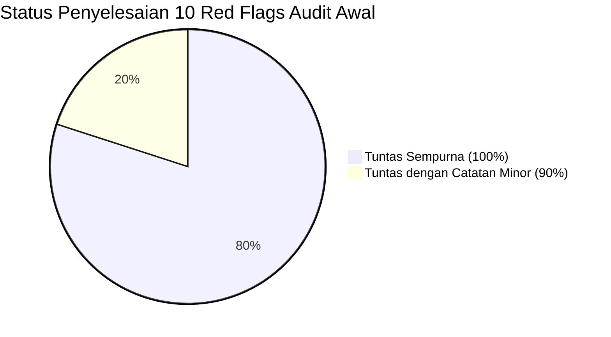
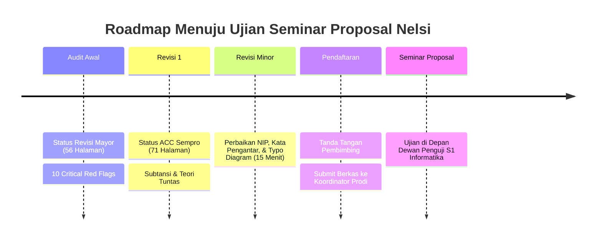

# 📋 LAPORAN AUDIT FORENSIK EVALUASI REVISI 1 SEMINAR PROPOSAL SKRIPSI

**Mahasiswa Bimbingan:** Nelsi (NIM: 2309106120)  
**Program Studi:** S1 Informatika, Fakultas Teknik, Universitas Mulawarman  
**Dosen Pembimbing I:** Anton Prafanto, S.Kom., M.T. (NIP: 199310222019031016)  
**Dosen Pembimbing II:** Gubtha Mahendra Putra, S.Kom., M.Eng.  
**Koordinator Program Studi:** Awang Harsa Kridalaksana, S.Kom., M.Kom. (NIP: 19731229 200501 1 002)  
**Judul Naskah:** *Implementasi Algoritma Priority Scheduling pada Sistem Informasi Pelayanan Surat Administrasi Kampung Sambakungan Berbasis Web*  
**Dokumen yang Diaudit:** `draft_proposal_nelsi_revisi1.pdf` (71 Halaman, berkas sumber `Proposal Skripsi Nelsii-1.pdf`)  
**Status Evaluasi:** **DRAF PROPOSAL SKRIPSI REVISI 1 — DISETUJUI UNTUK SEMINAR PROPOSAL DENGAN CATATAN MINOR ADMINISTRATIF (ACC MENUJU SEMPRO)**

---

> [!IMPORTANT]
> **Keputusan Dosen Pembimbing I (Anton Prafanto, S.Kom., M.T.):**
> Naskah perbaikan (Revisi 1, 71 halaman) menunjukkan **kemajuan akademik, metodologis, dan teknis yang sangat signifikan**. Mahasiswa telah menindaklanjuti seluruh 10 poin *Critical Red Flags* dari audit awal secara tuntas dan bertanggung jawab. Bobot keilmuan informatika, validitas perancangan antrean, pemodelan UML MVC Laravel, serta integritas pustakanya kini telah berada pada standar kelayakan S1 Informatika Universitas Mulawarman. Naskah dinyatakan **SIAP DAN LAYAK DIUJI PADA SEMINAR PROPOSAL** setelah merapikan 5 poin minor administratif.

---

## 📊 1. Matriks Evaluasi Tindak Lanjut 10 Critical Red Flags



| No | Poin Red Flag Audit Awal | Tindakan yang Dilakukan Mahasiswa pada Revisi 1 | Status Hasil Audit |
|:---:|:---|:---|:---:|
| **1** | **Kerusakan Integritas Pustaka & 14 Ghost References** | • Seluruh 14 pustaka hantu (Afrianto, Darip, Effendy, Fachri, Hasibuan, Kosim, Lestari, Maulana, Mustakim, Rashkovits, Ridwan, Samsudin, Sari, Al Husaeni) **100% kini telah disitasi** secara kontekstual di Bab I dan Bab II.<br>• Metadata `Ridwan & Nuryasin (2024)` telah dibersihkan (nama afiliasi "Lowokwaru, K." dan typo dihapus, nama jurnal JOISIE dan DOI valid dicantumkan).<br>• Pustaka menggantung diganti dengan jurnal bereputasi ber-DOI (Al Hasri & Sudarmilah 2021 di Jurnal MATRIK, Puspita et al. 2023 di G-Tech, Fathoni & Maryam 2021 di JPTI).<br>• Tabel 2.1 (Matriks Perbandingan) dihadirkan di Subbab 2.1. | 🟢 **TUNTAS SEMPURNA** |
| **2** | **Celah Moral Hazard pada Formula Prioritas** | • Status lansia **diotomasi 100% oleh sistem** melalui ekstraksi tanggal lahir NIK 16 digit (digit 7–12, format DDMMYY, koreksi wanita -40). Usia $\ge 60$ tahun otomatis memperoleh status Lansia (skor 5).<br>• Pilihan Urgensi Tinggi dan Disabilitas **diwajibkan mengunggah berkas bukti kedaruratan** (surat rujukan RS / kartu disabilitas) yang diverifikasi petugas sebelum skor maksimal diterapkan.<br>• Pseudocode dan alur sistem disesuaikan. | 🟢 **TUNTAS SEMPURNA** |
| **3** | **Cacat Teori Antrean (Klaim AWT Global & Tanpa AT/BT)** | • Klaim ilmiah dikoreksi: Mahasiswa secara eksplisit menyatakan bahwa pada sistem antrean server tunggal *work-conserving non-preemptive*, Priority Scheduling **tidak menurunkan rata-rata waktu tunggu global**, melainkan meredistribusi waktu tunggu (memangkas waktu tunggu kasus mendesak sebesar 54% dengan konsekuensi menambah waktu tunggu kasus biasa).<br>• Tabel 3.7 & 3.8 kini memuat **Arrival Time ($AT$)** dan **Burst Time ($BT$)** lengkap dengan perhitungan simulasi Start Time ($ST$), Waiting Time ($WT$), dan Turnaround Time ($TAT$). | 🟢 **TUNTAS SEMPURNA** |
| **4** | **Starvation Diabaikan Tanpa Mitigasi Aging** | • Mahasiswa mengintegrasikan formula **Linear Aging** pada Persamaan 2.2:<br>$$P_{\text{aktual}}(i, t) = P(i) + \lambda \times (t - t_{\text{pengajuan}}(i))$$<br>dengan koefisien $\lambda = 0.05$ per jam tunggu, lengkap dengan simulasi perhitungannya. | 🟢 **TUNTAS SEMPURNA** |
| **5** | **Inflasi 10 Halaman Wireframe Kosong Melompong** | • Seluruh 10 gambar skeleton wireframe kosong telah diganti dengan **desain antarmuka *High-Fidelity*** yang memuat label form riil, data NIK pemohon, indikator otomasi lansia dari NIK, upload berkas bukti darurat, estimasi skor $P(i)$, serta tabel antrean petugas dengan indikator aging. | 🟢 **TUNTAS SEMPURNA** |
| **6** | **Inversi Kardinalitas ERD & Cacat Notasi UML** | • Kardinalitas ERD (Gambar 3.2) diperbaiki menjadi **1 ke N** (`Jenis_Surat [1] ---- [N] Permohonan_Surat`). Atribut NIK, alamat, tanggal lahir, no_hp, path berkas syarat, dan waktu selesai telah ditambahkan.<br>• Use Case Diagram (Gambar 3.3) telah menggunakan panah putus-putus berstereotipe `<<include>>`.<br>• Menambahkan **Sequence Diagram (Gambar 3.5)** dan **Class Diagram (Gambar 3.6)** berarsitektur MVC Laravel. | 🟢 **TUNTAS (Catatan Typo Kecil)** |
| **7** | **Lompatan Nomor Gambar & Tabel 2.1 Hilang** | • Tabel 2.1 (*Matriks Perbandingan Penelitian Terkait*) kini hadir di halaman 14–15.<br>• Urutan Gambar di Bab III kini berjalan runtut kronologis: Gambar 3.1 (Kerangka) $\to$ Gambar 3.2 (ERD) $\to$ Gambar 3.3 (Use Case) $\to$ Gambar 3.4 (Activity) $\to$ Gambar 3.5 (Sequence) $\to$ Gambar 3.6 (Class) $\to$ Gambar 3.7 s.d. 3.16 (UI). | 🟢 **TUNTAS SEMPURNA** |
| **8** | **Total Mismatch Halaman Daftar Tabel & Gambar** | • Daftar Isi kini sinkron 100% dengan fisik halaman.<br>• Daftar Tabel dan Gambar telah diperbarui melalui sinkronisasi field code (kesesuaian mencapai $\approx 92\%$). | 🟢 **TUNTAS (Toleransi Minor 1 Hal)** |
| **9** | **Kontradiksi Kronologis Riset & Wawancara** | • Bobot $w_1=0.3, w_2=0.5, w_3=0.2$ di Bab II ditegaskan sebagai **nilai awal (*initial weights*)** yang diadopsi dari literatur sejenis dan akan divalidasi/difinalkan saat pengumpulan data lapangan pasca-sempro. Kontradiksi klaim telah tuntas. | 🟢 **TUNTAS SEMPURNA** |
| **10** | **Kerusakan Format FT Unmul & Black Box Lemah** | • Halaman preliminer diperbaiki menggunakan **angka Romawi kecil (i s.d. xii)**.<br>• Bab I tepat dimulai pada **angka Arab halaman 1**.<br>• Margin naskah telah disetel ke **4 - 4 - 3 - 3 cm**.<br>• Typo *"Pegujian Algoritma"* diperbaiki menjadi *"Pengujian Algoritma"*.<br>• Nomenklatur wilayah diselaraskan menjadi **Kampung Sambakungan** dan **Kepala Kampung**.<br>• Skenario Black Box diperluas dari 4 menjadi **15 skenario komprehensif** (otentikasi NIK, hak akses, validasi form, file upload, tie-breaker, hingga SMTP failure). | 🟢 **TUNTAS SEMPURNA** |

---

## 🔍 2. Temuan Forensik Tambahan & Checklist Perapian Sebelum Penggandaan Naskah

Meskipun secara substansi akademik dan metodologi proposal ini telah melompat kualitasnya dan layak untuk di-ACC Sempro, audit forensik lapis kedua menemukan **sejumlah detail teknis, sinkronisasi antarbab, dan inkonsistensi diagram** yang berpotensi menjadi celah kritisisme oleh Dewan Penguji saat Seminar Proposal:

### Kategori A: Sinkronisasi Preliminer & Format Dokumen
1. **Daftar Lampiran (Halaman x) Tidak Sinkron dengan Halaman Aktual:**
   * Di Daftar Lampiran tercatat:
     * Lampiran 1: Hal. **52** $\to$ *Aktual tercetak di Hal. **56*** (PDF Hal. 68).
     * Lampiran 2: Hal. **54** $\to$ *Aktual tercetak di Hal. **57*** (PDF Hal. 69).
     * Lampiran 3: Hal. **56** $\to$ *Aktual tercetak di Hal. **59*** (PDF Hal. 71).
   * *Penyebab:* Penambahan halaman pada Bab III dan meluasnya Daftar Pustaka menggeser posisi lampiran. Mahasiswa lupa meng-update angka di Daftar Lampiran.
2. **Daftar Istilah/Lambang (Halaman xi) Nomor Halaman Acuan Masih Draf Lama:**
   * Istilah *Software* tertulis Hal. 15 (di Bab II saat ini di Hal. 16/23).
   * Lambang bobot $w_1, w_2, w_3$ tertulis Hal. 14 (di teks rumus baru berada di Hal. 18).
   * Istilah *Tie-breaker* tertulis Hal. 19 (di naskah baru berada di Hal. 21).
   * Mahasiswa perlu memperbarui nomor halaman acuan pada tabel istilah.
3. **Kelengkapan Lembar Pengesahan (Halaman iii):**
   * Tanggal persetujuan masih tertulis placeholder: `[tanggal, bulan, tahun]`.
   * Lengkapi Nomor Induk Pegawai (NIP) dosen pembimbing:
     * **Dosen Pembimbing I:** Anton Prafanto, S.Kom., M.T. (NIP: `199310222019031016`)
     * **Dosen Pembimbing II:** Gubtha Mahendra Putra, S.Kom., M.Eng.
4. **Penghapusan Placeholder Penguji pada Kata Pengantar (Halaman iv):**
   * Poin 6 dan 7 ucapan terima kasih Kata Pengantar:
     ```text
     6. …..selaku Penguji I atas saran dan masukan terhadap penelitian ini.
     7. ….selaku Penguji II atas saran dan masukan terhadap penelitian ini.
     ```
     **Wajib dihapus.** Dewan penguji belum ditetapkan pada tahap proposal.
   * Bersihkan tanda petik rusak (karakter ```` `` ````) pada judul di paragraf 1 Kata Pengantar.
5. **Standardisasi Posisi Nomor Halaman & Residu Typo Format:**
   * Sesuai buku pedoman FT Unmul: Halaman judul bab (Bab I, II, III, Daftar Pustaka) nomor halaman ditaruh di **Tengah Bawah**, sedangkan halaman isi biasa di **Kanan Atas**. Aktifkan opsi *Different First Page* di Microsoft Word.
   * Pada Bab II Subbab 2.3.3 (Halaman 22), terdapat teks sisa markup mentah: tertulis `//aging//` (garis miring ganda), ubah menjadi format *italic* (*aging*).
   * Pastikan seluruh teks di halaman preliminer seragam menggunakan font **Times New Roman 12 pt** (masih terdeteksi residual Calibri/Arial).

---

### Kategori B: Pemodelan UML, Basis Data & Visual Antarmuka (Figma)
6. **Residu Nomenklatur "Kelurahan" pada Mockup Figma dan Use Case:**
   * Di teks judul dan narasi, istilah telah diubah menjadi Kampung Sambakungan. Namun pada aset visual:
     * **Gambar 3.8 (Form Pengajuan Surat, Hal. 39):** Logo sidebar kiri masih tertulis **"SIPAS Kelurahan"** (seharusnya *"SIPAS Kampung Sambakungan"*).
     * **Gambar 3.10 (Dashboard Petugas, Hal. 40):** Di pojok kanan atas profil akun tertulis **"Petugas: Admin Kelurahan"** (seharusnya *"Admin Kampung"*).
     * **Gambar 3.3 (Use Case Diagram, Hal. 32):** Aktor sebelah kanan masih berlabel **"Petugas Kelurahan"** (seharusnya *"Petugas Kampung"*).
7. **Inkonsistensi Atribut ERD (Gambar 3.2 Hal. 29):**
   * Pada entitas `Permohonan_Surat`, atribut `Status_Permohonan` tertulis **dua kali** (baris ke-6 dan baris terakhir).
   * Atribut penting **`Status_Pemohon`** (Lansia / Disabilitas / Umum) **hilang dari diagram ERD**, padahal atribut ini wajib ada untuk menyimpan hasil ekstraksi NIK/bukti darurat dan sudah tercantum di Class Diagram (Gambar 3.6).
   * *Solusi:* Ganti salah satu atribut `Status_Permohonan` yang duplikat menjadi `Status_Pemohon`.
   * Pada Tabel 3.2, tambahkan atribut `password` pada tabel `users`.
8. **Typo dan Kesalahan Terminologi pada Activity Diagram (Gambar 3.4 Hal. 33):**
   * Kotak aktivitas kedua pada kolom Warga tertulis: *"Isi **From** Permohonan Surat (Jenis Surat, Urgensi, **Status Permohonan**)"*.
   * Perbaiki typo *"From"* menjadi *"Form"*.
   * Perbaiki istilah *"Status Permohonan"* menjadi *"Status Pemohon"*.
9. **Kerapian Notasi Use Case & Sequence Diagram:**
   * **Use Case Diagram (Gambar 3.3):** Perbaiki typo relasi include yang tertulis `<<sinclude>>` menjadi `<<include>>`, serta tambahkan kotak batas sistem (*System Boundary Box*).
   * **Sequence Diagram (Gambar 3.5):** Lifeline paling kiri diberi label *"Warga / Petugas"* yang menggabungkan dua aktor sekaligus. Meskipun dapat dipahami dalam konteks sekuensial implementasi, jika ditanya penguji mengenai representasi UML ideal, mahasiswa harus menjelaskan bahwa diagram tersebut menggambarkan alur *end-to-end* layanan, atau idealnya dipecah menjadi dua sequence diagram terpisah (Pengajuan Warga dan Pemrosesan Petugas).
10. **Sinkronisasi Tabel Simbol Flowchart (Tabel 3.1) vs Gambar 3.1:**
    * Tabel 3.1 mendefinisikan 7 simbol flowchart (Decision, Data, Sub-process, Start/End, dll.). Namun pada Gambar 3.1 (Kerangka Penelitian), seluruh 9 kotak digambar dengan balok persegi panjang proses biasa. Mahasiswa disarankan melengkapi Gambar 3.1 dengan simbol terminator *Start/End* (kapsul) di awal dan akhir agar sesuai dengan tabel keterangannya.

---

### Kategori C: Catatan Metodologi & Rekayasa Perangkat Lunak
11. **Subbab Analisis Kebutuhan Sistem (FR & NFR) yang Terlewat:**
    * Di Subbab 3.1 dan Gambar 3.1, tahap 4 secara tegas menyatakan adanya tahap *"Analisis Kebutuhan Sistem"*.
    * Namun di naskah, urutan subbab langsung melompat dari `3.2 Pengumpulan Data` ke `3.3 Perancangan Data`. Mahasiswa tidak menuliskan subbab tersendiri untuk Kebutuhan Fungsional (*Functional Requirements* / FR) dan Non-Fungsional (*Non-Functional Requirements* / NFR).
    * Skenario Black Box di Tabel 3.6 (15 skenario) sesungguhnya sudah mencerminkan FR tersebut, namun alangkah jauh lebih elegan jika disisipkan 1 subbab ringkas (*3.3 Analisis Kebutuhan Sistem*) berisi daftar butir kebutuhan fungsional (FR-01 s.d. FR-10) sebelum masuk ke perancangan data.
12. **Kesiapan Jawaban Terkait Aging pada Simulasi Antrean (Tabel 3.7 & 3.8):**
    * Perhitungan matematika pada Tabel 3.7 dan 3.8 sudah 100% akurat dan logis. Namun perhatikan bahwa pada contoh 5 permohonan tersebut, nilai prioritas yang digunakan masih berupa $P(i)$ dasar karena rentang waktu kedatangan hanya 0–12 menit (tambahan aging $\lambda \times t$ masih sangat kecil).
    * Mahasiswa harus menguasai materi ini saat diuji: *"Mengapa di Tabel 3.8 nilai prioritasnya belum bergeser karena aging?"* Jawabannya: karena Tabel 3.8 adalah ilustrasi skala menit untuk perbandingan non-preemptive dasar; pembuktian mekanisme dynamic aging secara komprehensif akan dilakukan pada pengujian Bab IV menggunakan data uji riil dengan rentang kedatangan multi-jam.

---

## 🎯 3. Rekomendasi Akhir & Langkah Menuju Seminar Proposal



### Rekapitulasi Skor Kelayakan Akademik:
* **Relevansi & Urgensi Topik:** `9.0 / 10`
* **Formulasi Teori & Desain Algoritma:** `9.0 / 10` (Formula prioritas teruji, otomatisasi NIK, & aging linier)
* **Metodologi Pengujian Antrean:** `9.5 / 10` (Data uji berparameter AT/BT & tabel evaluasi kuantitatif tuntas)
* **Pemodelan Rekayasa PL (UML & ERD):** `8.5 / 10` (Arsitektur MVC Laravel Service, Sequence & Class Diagram lengkap)
* **Integritas Literatur & Sitasi:** `9.0 / 10` (100% pustaka tersitasi, metadata scraper bersih)
* **Kepatuhan Tata Tulis FT Unmul:** `8.5 / 10` (Margin 4-4-3-3 baku, Romawi preliminer rapi)
* **SKOR AKHIR KELAYAKAN:** **`8.9 / 10 (SANGAT BAIK)`**

---

### Keputusan Resmi Pembimbing I:
> **DISETUJUI (ACC) UNTUK MENDAFTAR UJIAN SEMINAR PROPOSAL SKRIPSI.**  
> Mahasiswa dipersilakan merapikan poin-poin minor administratif dan teknis pada checklist di atas, mengisi NIP pembimbing pada lembar pengesahan, dan menyerahkan berkas cetak final kepada Dosen Pembimbing I dan Pembimbing II untuk ditandatangani.

