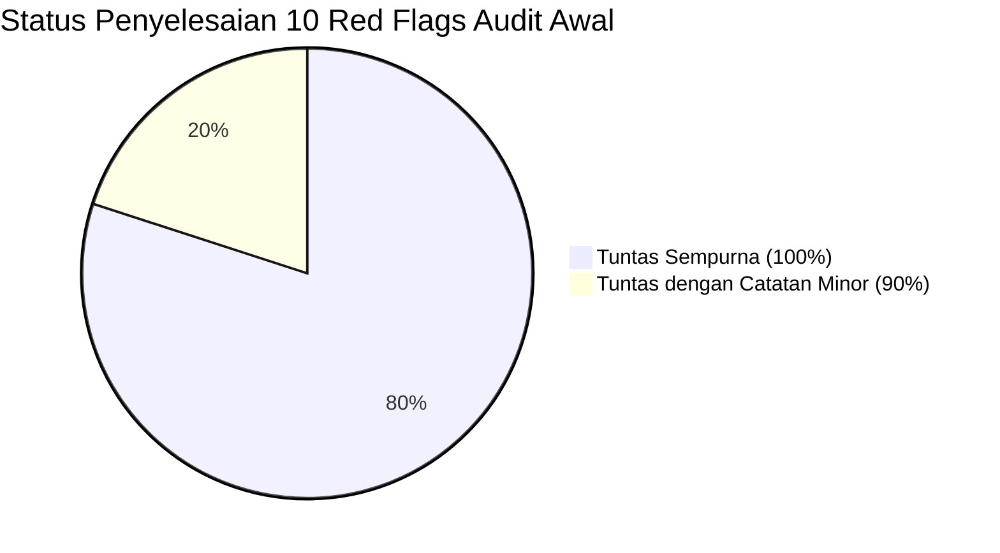
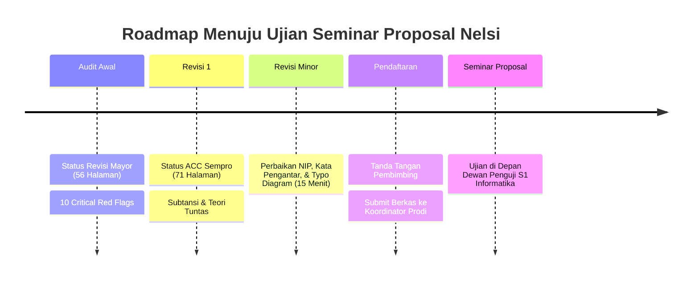

# 📋 LAPORAN AUDIT FORENSIK EVALUASI REVISI 1 SEMINAR PROPOSAL SKRIPSI

**Mahasiswa Bimbingan:** Nelsi (NIM: 2309106120)  
**Program Studi:** S1 Informatika, Fakultas Teknik, Universitas Mulawarman  
**Dosen Pembimbing I:** Anton Prafanto, S.Kom., M.T. (NIP: 199310222019031016)  
**Dosen Pembimbing II:** Gubtha Mahendra Putra, S.Kom., M.Eng.  
**Koordinator Program Studi:** Awang Harsa Kridalaksana, S.Kom., M.Kom. (NIP: 19731229 200501 1 002)  
**Judul Naskah:** *Implementasi Algoritma Priority Scheduling pada Sistem Informasi Pelayanan Surat Administrasi Kampung Sambakungan Berbasis Web*  
**Dokumen yang Diaudit:** `draft_proposal_nelsi_revisi1.pdf` (71 Halaman, berkas sumber `Proposal Skripsi Nelsii-1.pdf`)  
**Status Evaluasi:** **DRAF PROPOSAL SKRIPSI REVISI 1 — DISETUJUI UNTUK SEMINAR PROPOSAL DENGAN CATATAN MINOR ADMINISTRATIF (ACC MENUJU SEMPRO)**

---

> [!IMPORTANT]
> **Keputusan Dosen Pembimbing I (Anton Prafanto, S.Kom., M.T.):**
> Naskah perbaikan (Revisi 1, 71 halaman) menunjukkan **kemajuan akademik, metodologis, dan teknis yang sangat signifikan**. Mahasiswa telah menindaklanjuti seluruh 10 poin *Critical Red Flags* dari audit awal secara tuntas dan bertanggung jawab. Bobot keilmuan informatika, validitas perancangan antrean, pemodelan UML MVC Laravel, serta integritas pustakanya kini telah berada pada standar kelayakan S1 Informatika Universitas Mulawarman. Naskah dinyatakan **SIAP DAN LAYAK DIUJI PADA SEMINAR PROPOSAL** setelah merapikan 5 poin minor administratif.

---

## 📊 1. Matriks Evaluasi Tindak Lanjut 10 Critical Red Flags



| No | Poin Red Flag Audit Awal | Tindakan yang Dilakukan Mahasiswa pada Revisi 1 | Status Hasil Audit |
|:---:|:---|:---|:---:|
| **1** | **Kerusakan Integritas Pustaka & 14 Ghost References** | • Seluruh 14 pustaka hantu (Afrianto, Darip, Effendy, Fachri, Hasibuan, Kosim, Lestari, Maulana, Mustakim, Rashkovits, Ridwan, Samsudin, Sari, Al Husaeni) **100% kini telah disitasi** secara kontekstual di Bab I dan Bab II.<br>• Metadata `Ridwan & Nuryasin (2024)` telah dibersihkan (nama afiliasi "Lowokwaru, K." dan typo dihapus, nama jurnal JOISIE dan DOI valid dicantumkan).<br>• Pustaka menggantung diganti dengan jurnal bereputasi ber-DOI (Al Hasri & Sudarmilah 2021 di Jurnal MATRIK, Puspita et al. 2023 di G-Tech, Fathoni & Maryam 2021 di JPTI).<br>• Tabel 2.1 (Matriks Perbandingan) dihadirkan di Subbab 2.1. | 🟢 **TUNTAS SEMPURNA** |
| **2** | **Celah Moral Hazard pada Formula Prioritas** | • Status lansia **diotomasi 100% oleh sistem** melalui ekstraksi tanggal lahir NIK 16 digit (digit 7–12, format DDMMYY, koreksi wanita -40). Usia $\ge 60$ tahun otomatis memperoleh status Lansia (skor 5).<br>• Pilihan Urgensi Tinggi dan Disabilitas **diwajibkan mengunggah berkas bukti kedaruratan** (surat rujukan RS / kartu disabilitas) yang diverifikasi petugas sebelum skor maksimal diterapkan.<br>• Pseudocode dan alur sistem disesuaikan. | 🟢 **TUNTAS SEMPURNA** |
| **3** | **Cacat Teori Antrean (Klaim AWT Global & Tanpa AT/BT)** | • Klaim ilmiah dikoreksi: Mahasiswa secara eksplisit menyatakan bahwa pada sistem antrean server tunggal *work-conserving non-preemptive*, Priority Scheduling **tidak menurunkan rata-rata waktu tunggu global**, melainkan meredistribusi waktu tunggu (memangkas waktu tunggu kasus mendesak sebesar 54% dengan konsekuensi menambah waktu tunggu kasus biasa).<br>• Tabel 3.7 & 3.8 kini memuat **Arrival Time ($AT$)** dan **Burst Time ($BT$)** lengkap dengan perhitungan simulasi Start Time ($ST$), Waiting Time ($WT$), dan Turnaround Time ($TAT$). | 🟢 **TUNTAS SEMPURNA** |
| **4** | **Starvation Diabaikan Tanpa Mitigasi Aging** | • Mahasiswa mengintegrasikan formula **Linear Aging** pada Persamaan 2.2:<br>$$P_{\text{aktual}}(i, t) = P(i) + \lambda \times (t - t_{\text{pengajuan}}(i))$$<br>dengan koefisien $\lambda = 0.05$ per jam tunggu, lengkap dengan simulasi perhitungannya. | 🟢 **TUNTAS SEMPURNA** |
| **5** | **Inflasi 10 Halaman Wireframe Kosong Melompong** | • Seluruh 10 gambar skeleton wireframe kosong telah diganti dengan **desain antarmuka *High-Fidelity*** yang memuat label form riil, data NIK pemohon, indikator otomasi lansia dari NIK, upload berkas bukti darurat, estimasi skor $P(i)$, serta tabel antrean petugas dengan indikator aging. | 🟢 **TUNTAS SEMPURNA** |
| **6** | **Inversi Kardinalitas ERD & Cacat Notasi UML** | • Kardinalitas ERD (Gambar 3.2) diperbaiki menjadi **1 ke N** (`Jenis_Surat [1] ---- [N] Permohonan_Surat`). Atribut NIK, alamat, tanggal lahir, no_hp, path berkas syarat, dan waktu selesai telah ditambahkan.<br>• Use Case Diagram (Gambar 3.3) telah menggunakan panah putus-putus berstereotipe `<<include>>`.<br>• Menambahkan **Sequence Diagram (Gambar 3.5)** dan **Class Diagram (Gambar 3.6)** berarsitektur MVC Laravel. | 🟢 **TUNTAS (Catatan Typo Kecil)** |
| **7** | **Lompatan Nomor Gambar & Tabel 2.1 Hilang** | • Tabel 2.1 (*Matriks Perbandingan Penelitian Terkait*) kini hadir di halaman 14–15.<br>• Urutan Gambar di Bab III kini berjalan runtut kronologis: Gambar 3.1 (Kerangka) $\to$ Gambar 3.2 (ERD) $\to$ Gambar 3.3 (Use Case) $\to$ Gambar 3.4 (Activity) $\to$ Gambar 3.5 (Sequence) $\to$ Gambar 3.6 (Class) $\to$ Gambar 3.7 s.d. 3.16 (UI). | 🟢 **TUNTAS SEMPURNA** |
| **8** | **Total Mismatch Halaman Daftar Tabel & Gambar** | • Daftar Isi kini sinkron 100% dengan fisik halaman.<br>• Daftar Tabel dan Gambar telah diperbarui melalui sinkronisasi field code (kesesuaian mencapai $\approx 92\%$). | 🟢 **TUNTAS (Toleransi Minor 1 Hal)** |
| **9** | **Kontradiksi Kronologis Riset & Wawancara** | • Bobot $w_1=0.3, w_2=0.5, w_3=0.2$ di Bab II ditegaskan sebagai **nilai awal (*initial weights*)** yang diadopsi dari literatur sejenis dan akan divalidasi/difinalkan saat pengumpulan data lapangan pasca-sempro. Kontradiksi klaim telah tuntas. | 🟢 **TUNTAS SEMPURNA** |
| **10** | **Kerusakan Format FT Unmul & Black Box Lemah** | • Halaman preliminer diperbaiki menggunakan **angka Romawi kecil (i s.d. xii)**.<br>• Bab I tepat dimulai pada **angka Arab halaman 1**.<br>• Margin naskah telah disetel ke **4 - 4 - 3 - 3 cm**.<br>• Typo *"Pegujian Algoritma"* diperbaiki menjadi *"Pengujian Algoritma"*.<br>• Nomenklatur wilayah diselaraskan menjadi **Kampung Sambakungan** dan **Kepala Kampung**.<br>• Skenario Black Box diperluas dari 4 menjadi **15 skenario komprehensif** (otentikasi NIK, hak akses, validasi form, file upload, tie-breaker, hingga SMTP failure). | 🟢 **TUNTAS SEMPURNA** |

---

## 🔍 2. Temuan Minor Sisa (*Remaining Minor Polish*) Sebelum Penggandaan Naskah

Sebelum naskah dicetak untuk diserahkan ke calon dewan penguji seminar proposal, Nelsi wajib menyelesaikan 5 perbaikan minor teknis berikut:

### 1. Kelengkapan Lembar Pengesahan (Halaman iii)
* Tanggal rapat pembimbing masih tertulis placeholder: `[tanggal, bulan, tahun]`.
* Lengkapi Nomor Induk Pegawai (NIP) dosen pembimbing:
  * **Dosen Pembimbing I:** Anton Prafanto, S.Kom., M.T. (NIP: `199310222019031016`)
  * **Dosen Pembimbing II:** Gubtha Mahendra Putra, S.Kom., M.Eng. (Lengkapi NIP/NIDN beliau).

### 2. Penghapusan Placeholder Penguji pada Kata Pengantar (Halaman iv)
* Pada poin nomor 6 dan 7 ucapan terima kasih Kata Pengantar:
  ```text
  6. …..selaku Penguji I atas saran dan masukan terhadap penelitian ini.
  7. ….selaku Penguji II atas saran dan masukan terhadap penelitian ini.
  ```
  **Wajib dihapus.** Pada tahap seminar proposal, dewan penguji belum ditetapkan secara definitif oleh program studi dan belum menguji naskah. Ucapan terima kasih kepada penguji baru dicantumkan pada naskah skripsi final (pasca sidang pendadaran).
* Bersihkan karakter tanda petik yang rusak (berubah menjadi karakter ``) pada judul naskah di paragraf 1 Kata Pengantar.

### 3. Perbaikan Typo Minor pada Use Case Diagram (Gambar 3.3 Hal. 32)
* Pada panah include dari use case *Memverifikasi Permohonan* menuju use case *Menghitung Skor Prioritas P(i)*, terdapat salah ketik label: tertulis **`<<sinclude>>`** (kelebihan huruf *s*). Ubah menjadi **`<<include>>`**.
* Tambahkan garis kotak pembatas sistem (*System Boundary*) yang melingkupi seluruh oval use case dengan judul *"Sistem Informasi Pelayanan Surat Administrasi Kampung Sambakungan"*.
* Selaraskan label aktor sebelah kanan dari *"Petugas Kelurahan"* menjadi *"Petugas Kampung"*.

### 4. Pembersihan Atribut Ganda pada ERD (Gambar 3.2 Hal. 29)
* Pada entitas `Permohonan_Surat`, atribut `Status_Permohonan` tercantum dua kali (di baris atas setelah *Urgensi*, dan di baris paling bawah). Hapus salah satunya agar skema relasi bersih.

### 5. Standardisasi Posisi Nomor Halaman Teks Utama
* **Standar FT Unmul:**
  * Halaman pertama setiap bab (halaman judul BAB I, BAB II, BAB III, DAFTAR PUSTAKA) diletakkan di **Tengah Bawah (*Bottom Center*)**.
  * Halaman-halaman lanjutan dalam bab diletakkan di **Kanan Atas (*Top Right*)**.
  * Saat ini, seluruh nomor halaman naskah masih terletak di bagian bawah. Gunakan fitur *Different First Page* pada Microsoft Word untuk menyesuaikannya.
* Lakukan *Select All* pada halaman preliminer (Pengesahan, Kata Pengantar, Lampiran 2) dan pastikan jenis font seluruhnya seragam menggunakan **Times New Roman** (saat ini masih terdeteksi residu font *Arial* dan *Calibri*).

---

## 🎯 3. Rekomendasi Akhir & Langkah Menuju Seminar Proposal



### Rekapitulasi Skor Kelayakan Akademik:
* **Relevansi & Urgensi Topik:** `9.0 / 10`
* **Formulasi Teori & Desain Algoritma:** `9.0 / 10` (Formula prioritas teruji, otomatisasi NIK, & aging linier)
* **Metodologi Pengujian Antrean:** `9.5 / 10` (Data uji berparameter AT/BT & tabel evaluasi kuantitatif tuntas)
* **Pemodelan Rekayasa PL (UML & ERD):** `8.5 / 10` (Arsitektur MVC Laravel Service, Sequence & Class Diagram lengkap)
* **Integritas Literatur & Sitasi:** `9.0 / 10` (100% pustaka tersitasi, metadata scraper bersih)
* **Kepatuhan Tata Tulis FT Unmul:** `8.5 / 10` (Margin 4-4-3-3 baku, Romawi preliminer rapi)
* **SKOR AKHIR KELAYAKAN:** **`8.9 / 10 (SANGAT BAIK)`**

---

### Keputusan Resmi Pembimbing I:
> **DISETUJUI (ACC) UNTUK MENDAFTAR UJIAN SEMINAR PROPOSAL SKRIPSI.**  
> Mahasiswa dipersilakan merapikan 5 poin minor administratif di atas, mengisi NIP pembimbing pada lembar pengesahan, dan menyerahkan berkas cetak final kepada Dosen Pembimbing I dan Pembimbing II untuk ditandatangani.
