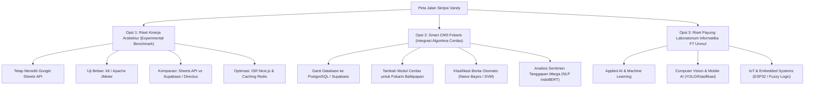

# 📋 LAPORAN AUDIT KOMPREHENSIF & PANDUAN PENGEMBANGAN IDE SKRIPSI
## EVALUASI FORENSIK DRAF AWAL & ROADMAP MENUJU PROPOSAL S1 INFORMATIKA FT UNMUL

**Mahasiswa:** Vandy Rizky Septiawan  
**NIM:** 2309106048 (Mahasiswa Angkatan 2023)  
**Program Studi:** S1 Informatika, Jurusan Teknik Elektro dan Informatika, Fakultas Teknik, Universitas Mulawarman  
**Status Bimbingan:** Konsultasi Eksplorasi Ide Awal (Dosen Pembimbing Resmi Ditetapkan oleh Program Studi)  
**Koordinator Program Studi:** Awang Harsa Kridalaksana, S.Kom., M.Kom. (NIP: 19731229 200501 1 002)  
**Judul Naskah Draf:**  
* *Cover Luar & Dalam:* Implementasi Google Sheets sebagai Media Penyimpanan Data pada Content Management System (CMS) Berbasis Web  
* *Bab I Paragraf Akhir:* Implementasi Google Sheets API sebagai Media Penyimpanan Data pada Content Management System (CMS) Berbasis Web  
**Mitra Studi Kasus:** Fokaris Balikpapan (Forum Komunikasi Anak Remaja Islam Balikpapan)  
**Dokumen yang Diaudit:** `Proposal_Vandy Rizky Septiawan.pdf` (27 Halaman, berkas sumber `Proposal_Vandy Rizky Septiawan.docx`)  
**Status Evaluasi:** 🌱 **DRAF PENGAJUAN IDE AWAL — PERLU REKONSTRUKSI METODOLOGI & PENINGKATAN BOBOT KEILMUAN MENUJU SEMESTER 7**

---

> [!NOTE]
> ### 💡 Pengantar & Catatan Konsultasi Akademik:
> *"Apresiasi tinggi untuk Vandy yang telah berinisiatif dan bersikap jujur berkonsultasi mengenai draf ide awal ini. Inisiatif kamu untuk merancang solusi web bagi komunitas pemuda (**Fokaris Balikpapan**) dengan teknologi modern (**Next.js**) adalah langkah awal yang sangat positif.*  
>  
> *Dokumen ini merupakan **Laporan Audit Komprehensif sekaligus Panduan Pembinaan Mandiri**. Di dalamnya dipaparkan secara detail: (1) evaluasi kritis terhadap kekurangan teknis dan administratif pada draf 27 halaman yang kamu kumpulkan, (2) edukasi standar keilmuan S1 Informatika, (3) tiga alternatif rekonstruksi riset, (4) panduan wawancara mitra, (5) prosedur administrasi FT Unmul, serta (6) target jadwal menuju kelulusan tepat waktu 4 tahun. Gunakan dokumen ini sebagai peta jalan (*roadmap*) perbaikan sebelum menyusun proposal skripsi resmi."*

---

## 🌟 1. Apresiasi & Potensi Positif dari Gagasan Awal

Ada 3 nilai positif mendasar yang patut diapresiasi dari inisiatif mahasiswa:
1. **Kepekaan Sosial terhadap Komunitas Lokal:** Memilih mitra nyata (**Fokaris Balikpapan**) membuktikan mahasiswa memiliki empati sosial untuk membantu digitalisasi organisasi masyarakat/non-profit yang memiliki keterbatasan anggaran infrastruktur server.
2. **Pemilihan Teknologi Web Modern:** Pemilihan **Next.js** (framework React modern dengan kapabilitas SSR/SSG/ISR) dan **Cloudinary** (cloud media management) menunjukkan mahasiswa mengikuti perkembangan arsitektur web modern.
3. **Sikap Jujur & Terbuka:** Datang berkonsultasi secara terbuka bahwa berkas ini baru sebatas eksplorasi ide awal adalah etika akademik yang sangat baik untuk memulai proses bimbingan.

---

## 🚦 2. Matriks Status Kesiapan Naskah

| Komponen Naskah | Status Kesiapan | Temuan Kritis & Catatan Evaluasi Utama |
| :--- | :---: | :--- |
| **Format & Halaman Depan (Hal. 1–10)** | 🚨 *Perlu Perapian Total* | Bagian preliminer masih 100% template mentah (`JUDUL SKRIPSI`, `NAMA MAHASISWA`, `“<Judul Skripsi>”`, tanggal 2024); penomoran halaman menggunakan angka Arab (1–9) melanggar format Romawi baku FT Unmul; resolusi logo Unmul berbeda antara cover (PNG 236px) dan judul dalam (JPG 261px). |
| **Bab I: Pendahuluan (Hal. 11–15)** | ⚠️ *Revisi Sedang-Mayor* | Judul bab tercetak dobel; rumusan masalah masih bersifat tutorial pemrograman ("bagaimana mengimplementasikan"); mitra Fokaris tiba-tiba muncul di batasan masalah tanpa pernah disinggung di latar belakang; belum memaparkan kelemahan arsitektur Google Sheets. |
| **Bab II: Tinjauan Pustaka (Hal. 16–19)** | 🚨 *Belum Dikerjakan (0%)* | Masih memuat teks asli Buku Panduan Skripsi FT Unmul (contoh Backpropagation kelapa sawit, titik-titik kosong, rumus $A+B=C$, Gambar antena mikrostrip Elektro, dan Tabel data mahasiswa 2017/2018). Wajib diganti dengan kajian literatur relevan dan matriks *research gap*. |
| **Bab III: Metodologi Penelitian (Hal. 20–21)** | 🚨 *Belum Dikerjakan (0%)* | Subbab 3.1 s.d. 3.6 secara harfiah hanya bertuliskan *"Penjelasan lihat di ppt"*; form tempat dan tabel jadwal masih kosong; menyisakan dua halaman kosong berhantu (*ghost pages* 22 dan 26). Wajib menyusun flowchart, UML/ERD, dan skenario pengujian. |
| **Daftar Pustaka & Lampiran (Hal. 23–27)** | 🚨 *Revisi Mayor* | Terjadi *citation stuffing* (sitasi paper kelapa sawit, scraping SINTA, Facebook governance, dan IoT perkerasan jalan ditempel pada kalimat umum); menyisakan nomor `1.` menggantung dan instruksi dosen; Lampiran hanya bertuliskan *"Penjelasan lihat di ppt"*. |

---

## 🔍 3. Rincian Catatan Audit & Solusi Perbaikan Bab per Bab

### 📄 Bagian Awal Naskah (Cover s.d. Daftar Singkatan — Hal. 1–10)

1. **Inkonsistensi Judul pada Cover vs Naskah:**
   * Di Cover Luar dan Halaman Judul Dalam (Hal. 1 & 2): *"Implementasi Google Sheets sebagai Media Penyimpanan Data..."*
   * Di Bab I Paragraf 8 (Hal. 13): *"Implementasi Google Sheets **API** sebagai Media Penyimpanan Data..."*.
   * **Solusi:** Selaraskan penulisan judul secara konsisten di seluruh bagian berkas.
2. **Anomali Resolusi File Logo Unmul:**
   * Cover luar menggunakan logo Unmul format `.png` (`236x236` px), sedangkan Halaman Judul Dalam menggunakan file `.jpg` (`261x260` px). Gunakan satu file vektor/resolusi tinggi yang resmi dan seragam.
3. **Pembersihan Halaman Pengesahan (Hal. 3):**
   * Masih berupa teks dummy: `JUDUL SKRIPSI JUDUL SKRIPSI`, `Oleh: NAMA MAHASISWA`, `NIM (Tanpa Tulisan NIM)`, dan `[tgl, bln, tahun]`.
   * **Solusi:** Isi identitas naskah dengan lengkap dan rapi saat proposal resmi siap diajukan.
4. **Pembersihan Kata Pengantar (Hal. 4):**
   * Teks instruksi buku panduan (*"Kata Pengantar (preface, foreword) sebaiknya disusun secara ringkas..."*) ikut tercetak ke PDF. Hapus teks instruksi ini.
   * Ganti tag `“<Judul Skripsi>”` dengan judul yang sebenarnya.
   * Ganti daftar ucapan terima kasih placeholder: `Nama dan gelar akademik Dekan...`, `Nama dan gelar Koordinator Prodi...`, dll.
   * Tahun tertulis `Samarinda, .............................. 2024` ➔ Perbaiki menjadi tahun berjalan (**2026**).
5. **Kekacauan Penomoran Halaman (*Pagination Anarchy*):**
   * **Pelanggaran Aturan Preliminer:** Halaman judul dalam sampai Daftar Singkatan diberi **angka Arab (1 s.d. 9)** di pojok kanan atas. Menurut Buku Panduan Skripsi FT Unmul, halaman preliminer **wajib menggunakan angka Romawi kecil (`i`, `ii`, `iii`, dst.) di posisi bawah tengah**.
   * **Lompatan Mundur (*Regression Jump*):** Bab I selesai pada Halaman 5, namun Bab II mendadak **kembali ke Halaman 3**! Hal ini terjadi karena mahasiswa belum memisahkan *Section Break (Next Page)* secara benar di Microsoft Word.
   * **Halaman Awal Bab:** Nomor halaman pertama setiap bab wajib diletakkan di **bawah tengah** (*footer center*), bukan di kanan atas.
6. **Perapian Daftar Isi, Tabel, Gambar, Istilah, dan Singkatan (Hal. 5–10):**
   * Daftar Isi saat ini masih berisi deretan angka dummy template (`1.1 1`, `1.2 3`, dll.) dan tercampur font **Calibri**.
   * Teks catatan dosen di bawah Daftar Isi (*"Keterangan: WAJIB menggunakan alat bantu TOC..."*) wajib dihapus.
   * Daftar Tabel, Gambar, Istilah, dan Singkatan yang masih bertuliskan `contents` atau `Arti Contents` wajib dihubungkan dengan tabel dan gambar riil penelitian menggunakan fitur *Caption & Table of Figures* Word.

---

### 📘 BAB I – Pendahuluan (Hal. 11–15)

1. **Koreksi Duplikasi Heading Bab (Hal. 11):**
   * Tercetak dobel:  
     ```text
     BAB I PENDAHULUAN
     PENDAHULUAN
     ```
     Hapus baris kedua agar sesuai dengan format baku.
2. **Urgensi Mitra Riil pada Latar Belakang (Subbab 1.1):**
   * **Masalah:** Nama mitra **"Fokaris Balikpapan"** tiba-tiba muncul di Batasan Masalah (poin 3), namun di seluruh Latar Belakang tidak pernah disebut satu patah kata pun.
   * **Solusi Wajib:** Masukkan profil singkat Fokaris Balikpapan di Latar Belakang, jelaskan aktivitas publikasi dakwah/kegiatan mereka saat ini, kendala operasional yang dihadapi pengurus, dan alasan mengapa mereka membutuhkan sistem CMS terpadu.
3. **Paparkan Kelemahan & Batasan Arsitektural Google Sheets:**
   * Jelaskan secara jujur mengapa Google Sheets dipilih (misal: antarmuka ramah bagi pengurus organisasi non-teknis), tetapi paparkan pula tantangan teknisnya (*rate limit* Google API 300 req/menit, tidak ada transaksi ACID, latensi HTTP round-trip) dan bagaimana penelitianmu akan memitigasi kendala tersebut.
4. **Rekonstruksi Rumusan Masalah (Subbab 1.2, Hal. 13):**
   * **Masalah:** Rumusan masalah saat ini: *"Bagaimana mengimplementasikan Google Sheets API sebagai media penyimpanan data pada Content Management System (CMS) berbasis web?"*. Ini adalah pertanyaan teknis instalasi (*how-to tutorial*), bukan pertanyaan ilmiah komputasi (*research question*).
   * **Rekomendasi Revisi (Tergantung Pilihan Opsi Riset):**
     * *Jika Opsi 1 (Uji Kinerja):* "Bagaimana performa latensi, throughput, dan batas skalabilitas Google Sheets API dibandingkan basis data relasional pada arsitektur web Next.js?" dan "Bagaimana efektivitas strategi caching ISR dalam mereduksi latency query?".
     * *Jika Opsi 2 (Smart CMS):* "Bagaimana merancang CMS komunitas Fokaris Balikpapan berbasis Next.js dengan integrasi modul klasifikasi konten otomatis menggunakan algoritma Naive Bayes/SVM?".
5. **Penyelarasan Tujuan Penelitian (Subbab 1.4, Hal. 14):**
   * Koreksi kesalahan huruf kapital di tengah kalimat: *"Tujuan yang ingin dicapai... adalah **Mengimplementasikan**..."* ➔ ubah menjadi huruf kecil (*mengimplementasikan*).
   * Rumusan Tujuan Penelitian wajib menjawab secara simetris butir-butir Rumusan Masalah.
6. **Perjelas Alasan Pemakaian Cloudinary (Batasan Masalah Poin 7):**
   * Jelaskan di latar belakang bahwa Google Sheets tidak efisien menyimpan data biner citra (karena limit karakter sel maksimal 50.000 karakter dan *bloating* enkripsi Base64), sehingga penyimpanan aset visual didelegasikan ke cloud storage khusus (Cloudinary).

---

### 📗 BAB II – Tinjauan Pustaka (Hal. 16–19)

1. **Bersihkan 100% Seluruh Teks Template Bawaan Fakultas:**
   * Hapus contoh template: *"1. Metode yang digunakan: Backpropagation Neural Network... data produksi kelapa sawit 2015-2017..."*.
   * Hapus daftar kosong *"2. Penelitian terkait 2"* s.d. *"11. Dst..."* dan deretan titik-titik kosong.
   * Hapus rumus contoh $A+B=C$, Gambar 2.1 Antena Mikrostrip Elektro, dan Tabel 2.1 data mahasiswa 2017/2018.
   * Perbaiki penomoran subbab yang melompat ngawur bawaan template: `II.1` (Romawi), `2.2` (Arab), `7.3`, `7.3.1`, `2.3.2`, `7.4`.
2. **Kajian Literatur yang Wajib Disusun Mahasiswa:**
   * **Subbab 2.1 (Penelitian Terkait):** Kumpulkan minimal 10–15 artikel jurnal ilmiah (terbitan 2021–2026) mengenai arsitektur CMS modern, integrasi Google Sheets API, uji performa web, atau algoritma text mining. Rangkum dalam **Tabel Matriks Perbedaan Penelitian (State-of-the-Art)** untuk menunjukkan kebaruan (*novelty / research gap*).
   * **Subbab 2.2 (Landasan Teori):** Uraikan landasan teori yang benar-benar digunakan:
     - Konsep *Content Management System* (CMS) & Arsitektur *Headless / Decoupled*.
     - Framework Next.js (Server-Side Rendering, Static Site Generation, Incremental Static Regeneration).
     - RESTful API & Mekanisme Autentikasi Google Cloud (Service Account vs OAuth 2.0).
     - Teori Basis Data Relasional vs Karakteristik *Spreadsheet Data Store*.
     - Algoritma / Metode Pengujian yang dipilih (Black Box, Stress Testing k6, atau Machine Learning).

---

### 📙 BAB III – Metodologi Penelitian (Hal. 20–21)

1. **🚨 Hapus Seluruh Frasa "Penjelasan Lihat di PPT":**
   * Pada naskah saat ini, subbab 3.1 s.d. 3.6 secara harfiah bertuliskan *"Penjelasan lihat di ppt"*. Frasa petunjuk penugasan kelas ini **wajib dihapus total** dan diganti dengan uraian ilmiah.
2. **Struktur Bab III yang Wajib Disusun:**
   * **3.1 Tahapan Penelitian:** Tampilkan diagram alir (*flowchart*) metodologi penelitian dari studi pendahuluan, analisis kebutuhan, perancangan, implementasi, pengujian, hingga penyusunan laporan.
   * **3.2 Pengumpulan Data:** Jelaskan metode observasi lapangan ke Fokaris Balikpapan, wawancara narasumber (cantumkan nama dan perannya), serta studi kepustakaan.
   * **3.3 Perancangan Sistem & Data:**
     - Buat diagram arsitektur sistem (*system architecture*).
     - Buat diagram pemodelan perangkat lunak (Use Case Diagram, Activity Diagram, Sequence Diagram).
     - Buat skema perancangan data / relasi kolom Google Sheets (nama sheet, nama kolom header, tipe data, validasi input).
   * **3.4 Perancangan Antarmuka (UI/UX):** Tampilkan rancangan *wireframe* atau *mockup* antarmuka CMS untuk admin dan portal publik untuk pengunjung.
   * **3.5 Perancangan Pengujian:** Definisikan skenario pengujian fungsional (**Black Box Testing**) dan pengujian performa (**Stress Testing k6 / JMeter**) atau pengujian penerimaan pengguna (**System Usability Scale / SUS**).
   * **3.6 Waktu dan Tempat Penelitian:** Isi formulir titik-titik lokasi (Laboratorium Informatika FT Unmul dan Sekretariat Fokaris Balikpapan) serta lengkapi Tabel 3.x Jadwal Penelitian dengan tanda centang (*timeline*) kegiatan yang realistis.
3. **Eliminasi Halaman Kosong Berhantu (*Ghost Pages*):**
   * Halaman fisik 22 (bernomor 9) dan Halaman fisik 26 (bernomor 13) adalah halaman kosong putih yang tidak sengaja terbuat akibat enter/page-break berlebih. Hapus halaman kosong ini sebelum diekspor ke PDF.

---

### 📚 Daftar Pustaka & Lampiran (Hal. 23–27)

1. **Pembersihan Fenomena *Citation Stuffing*:**
   * Saat ini terdapat 15 referensi yang ditempel secara tidak relevan di Bab I:
     - Paper kelapa sawit (*template bawaan*).
     - Paper Web Scraping SINTA (*Adila, 2022*) dikutip hanya untuk kalimat: *"website diperbarui berkala"*.
     - Paper sosiologi tata kelola Facebook (*van der Vlist, 2022*) dikutip untuk definisi umum REST API.
     - Paper IoT perkerasan jalan raya di Korea (*Hong, 2023*) dikutip untuk kalimat pengambilan data API.
   * **Solusi Wajib:** Ganti dengan artikel jurnal yang benar-benar relevan dengan arsitektur web modern, Next.js, evaluasi performa database, dan sistem manajemen konten.
2. **Hapus Sisa Nomor Template di Hal. 25:**
   * Hapus angka `1.` yang tertinggal menggantung di bawah rujukan van der Vlist.
   * Hapus teks catatan panduan dosen (*"Keterangan: WAJIB menggunakan software management reference... sebanyak 30-50 referensi"*).
3. **Peralihan Wajib ke Reference Manager:**
   * Mahasiswa wajib menggunakan software pengelola referensi (**Mendeley** atau **Zotero**) dengan format **APA Style 7th Edition**. Seluruh pustaka yang tercantum di Daftar Pustaka wajib disitasi di badan teks, dan sebaliknya (*zero ghost citations*).
4. **Lampiran Riil (Hal. 27):**
   * Ganti teks *"Penjelasan lihat di ppt"* dengan lampiran nyata:
     - **Lampiran 1:** Surat Izin Observasi/Penelitian dari Fakultas Teknik ke Fokaris Balikpapan.
     - **Lampiran 2:** Transkrip & Dokumentasi Foto Wawancara Narasumber Fokaris.
     - **Lampiran 3:** Tabel Rencana Kuesioner Pengujian / Skenario Uji.

---

## 🚀 4. Tiga Alternatif Rekonstruksi Riset Skripsi S1

Agar ide awal ini memiliki bobot ilmiah yang kuat dan siap diseminarkan, mahasiswa dapat memilih salah satu dari 3 arah pengembangan berikut:



### 🟢 OPSI 1: Riset Komparasi Kinerja Arsitektur (*Performance Benchmark*)
* **Fokus:** Tetap menggunakan Google Sheets API, tetapi fokusnya bukan sekadar membuat CMS, melainkan **menguji batas kemampuan, latensi, dan ketahanan arsitekturnya secara empiris kuantitatif**.
* **Contoh Usulan Judul:**  
  * *“Analisis Komparasi Kinerja, Latensi, dan Throughput Google Sheets API terhadap Headless CMS (Supabase) pada Arsitektur Web Next.js”*  
  * *“Evaluasi Kinerja dan Strategi Caching Incremental Static Regeneration (ISR) pada Web App Berbasis Google Sheets API Menghadapi Beban Akses Tinggi”*
* **Bobot S1:** Melakukan *load testing / stress testing* (k6 atau JMeter), mengukur latensi (ms), throughput (req/s), error rate (HTTP 429), dan merancang arsitektur caching untuk mitigasi bottleneck.

### 🔵 OPSI 2: Smart CMS Fokaris Balikpapan (*Integrasi Algoritma Cerdas*)
* **Fokus:** Menggunakan basis data standar industri (PostgreSQL/Supabase), lalu menambahkan **satu modul algoritma cerdas (AI/NLP/Search)** yang bermanfaat nyata bagi komunitas Fokaris.
* **Contoh Usulan Judul:**  
  * *“Rancang Bangun Content Management System (CMS) Komunitas Fokaris Balikpapan Berbasis Next.js dengan Fitur Kategorisasi Konten Otomatis Menggunakan Algoritma Naive Bayes / SVM”*  
  * *“Penerapan Algoritma Text Mining untuk Analisis Sentimen Feedback Publik dan Moderasi Tanggapan pada Website Komunitas Fokaris Balikpapan”*  
  * *“Optimasi Mesin Pencari Konten Kegiatan pada Portal Web Komunitas Menggunakan Algoritma Best Matching 25 (BM25)”*
* **Bobot S1:** Memecahkan masalah nyata mitra lokal sekaligus mengimplementasikan metode keilmuan informatika.

### 🟣 OPSI 3: Topik Payung Riset Laboratorium Program Studi Informatika
* **Fokus:** Mengambil topik penelitian unggulan yang tersedia di laboratorium Program Studi S1 Informatika FT Unmul (*Applied AI, Computer Vision, Internet of Things, atau Serious Games*).
* **Bobot S1:** Ketersediaan dataset, perangkat keras, dan roadmap riset sudah sangat matang.

---

## 📋 5. Panduan Observasi Lapangan: Daftar Pertanyaan Wawancara Mitra (*Interview Guide*)

Jika mahasiswa memilih melanjutkan studi kasus di **Fokaris Balikpapan** (khususnya Opsi 2), data awal harus diperoleh melalui wawancara langsung. Gunakan 5 pertanyaan panduan berikut:

1. **Profil & Tata Kelola Organisasi:** Apa visi, misi, struktur pengurus, dan program kerja utama Fokaris Balikpapan saat ini?
2. **Kondisi Publikasi Saat Ini:** Media apa yang selama ini digunakan untuk mempublikasikan agenda dakwah, kegiatan pemuda, atau pengumuman (apakah hanya via Instagram/WhatsApp)?
3. **Kendala Operasional:** Kendala apa yang dialami pengurus dalam mendokumentasikan arsip kegiatan, artikel dakwah, atau data anggota secara terpusat?
4. **Profil Admin Pengelola:** Siapa yang akan ditugaskan mengelola website CMS nantinya (apakah pengurus yang paham IT atau pengurus umum/non-teknis)?
5. **Kebutuhan Fitur Prioritas:** Fitur apa yang paling mendesak dibutuhkan (publikasi artikel kegiatan, kalender agenda dakwah, formulir pendaftaran anggota baru, atau galeri dokumentasi foto/video)?

> [!TIP]
> Catat hasil wawancara, mintalah identitas narasumber (nama dan jabatan di Fokaris), serta ambil foto dokumentasi kegiatan wawancara untuk dilampirkan di Bab I dan Lembar Lampiran naskah proposal resmi.

---

## 🏛️ 6. Kelengkapan Administratif Resmi FT Unmul

Mahasiswa wajib memperhatikan tata tertib dan prosedur administratif skripsi di FT Unmul:
1. **Surat Izin Penelitian Mitra (Wajib untuk Lampiran 1):** Mengajukan Surat Pengantar Penelitian dari Fakultas Teknik melalui bagian akademik prodi yang ditujukan kepada Pimpinan Fokaris Balikpapan. Surat balasan kesediaan wajib dilampirkan di naskah proposal.
2. **Penetapan Dosen Pembimbing I dan II:** Tim dosen pembimbing akan ditetapkan secara resmi oleh Program Studi / Rapat Jurusan setelah proposal judul awal disetujui.
3. **Buku Konsultasi / Kartu Bimbingan Skripsi:** Mahasiswa wajib mencatat materi konsultasi dan meminta tanda tangan dosen pada setiap sesi konsultasi.
4. **Standar Format Fisik:** Times New Roman 12 pt, spasi 1.5, margin 4-4-3-3 cm, kertas A4 80 gram.

---

## ⏳ 7. Peta Waktu Kelulusan Tepat Waktu (Target Lulus 4 Tahun)

Sebagai mahasiswa angkatan 2023 yang berada di **awal Semester 7 (September 2026)**, ini adalah momentum emas (*golden window*) untuk menyelesaikan studi tepat waktu:

| Periode Waktu | Target Capaian Mahasiswa | Output Dokumen / Aksi |
| :--- | :--- | :--- |
| **September 2026 (Minggu 2–3)** | Menentukan pilihan arah riset (Opsi 1, 2, atau 3) & konsultasi *One-Page Concept Note* | Draf Konsep 1 Halaman disetujui Dosen Pembimbing |
| **September 2026 (Minggu 4)** | Observasi mitra / studi literatur 15 jurnal terakreditasi | Hasil wawancara mitra & library Mendeley siap |
| **Oktober 2026** | Penulisan intensif Bab I, Bab II, dan Bab III yang utuh | Draf Naskah Proposal Lengkap (30–40 Halaman) |
| **November 2026** | Bimbingan revisi naskah proposal & uji Turnitin (< 20%) | Tanda tangan persetujuan ACC Sempro dari Pembimbing |
| **Desember 2026 / Januari 2027** | **Pelaksanaan Ujian Seminar Proposal (Sempro)** | Berita Acara Sempro & Surat Tugas Penelitian |
| **Februari – April 2027** | Pengembangan sistem, pengujian beban / algoritma, & penulisan Bab IV–V | Sistem selesai, pengujian tuntas, draf skripsi siap |
| **Mei – Juni 2027** | Seminar Hasil (Semhas) & Ujian Pendadaran (Skripsi) | Lulus Ujian Sarjana Komputer (S.Kom.) |
| **Juli – Agustus 2027** | **Wisuda Gelombang III Universitas Mulawarman (Tepat 4 Tahun / 8 Semester)** | 🎓 **Resmi Menyandang Gelar S.Kom.** |

---

## 🎯 8. Agenda Aksi Sebelum Pertemuan Konsultasi Berikutnya

Untuk persiapan pertemuan konsultasi tatap muka berikutnya dengan dosen, mahasiswa diminta menyiapkan:

1. [ ] **Pilih salah satu dari 3 opsi arah riset di atas** yang paling diminati.
2. [ ] Buat **Ringkasan Konsep 1 Halaman (*One-Page Concept Note*)** berisi:
   * Usulan judul baru yang lebih spesifik.
   * Latar belakang masalah mitra / problem arsitektur sistem.
   * Rencana metode/algoritma yang akan diterapkan.
   * Rencana pengujian terukur yang akan dilakukan.
3. [ ] Kumpulkan minimal **5 artikel jurnal ilmiah sejenis (terbitan 2021–2026)** yang mendukung ide tersebut menggunakan Mendeley/Zotero.

> **Pesan Penutup untuk Vandy:**  
> *"Setiap peneliti besar selalu bermula dari draf ide sederhana. Keberanian dan kejujuranmu untuk mulai berkonsultasi sejak awal adalah modal yang sangat berharga. Poles ide ini dengan sungguh-sungguh agar menjadi karya skripsi yang membanggakan bagi dirimu, keluarga, dan almamater. Tetap semangat menggapai kelulusan terbaik tepat waktu!"*

