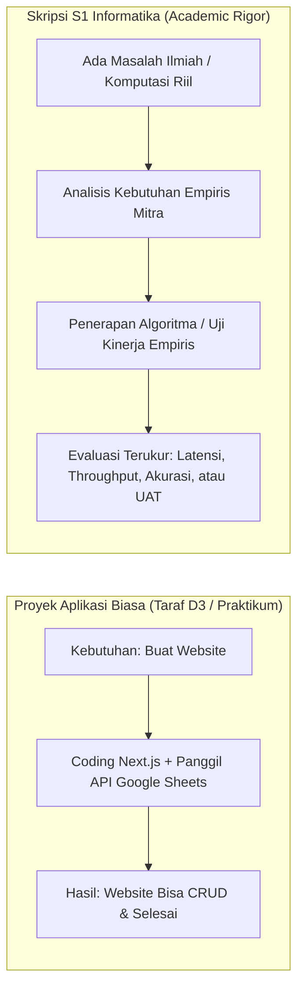
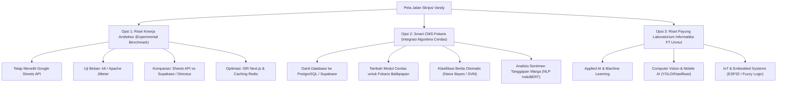

# 📋 CATATAN KONSULTASI AKADEMIK & PANDUAN PENGEMBANGAN IDE SKRIPSI
## ROADMAP TRANSFORMASI GAGASAN AWAL MENJADI SKRIPSI S1 INFORMATIKA FT UNMUL

**Mahasiswa:** Vandy Rizky Septiawan  
**NIM:** 2309106048 (Mahasiswa Angkatan 2023)  
**Program Studi:** S1 Informatika, Jurusan Teknik Elektro dan Informatika, Fakultas Teknik, Universitas Mulawarman  
**Status Dosen Pembimbing:** Dalam Tahap Konsultasi Ide / Belum Ditetapkan Resmi  
**Koordinator Program Studi:** Awang Harsa Kridalaksana, S.Kom., M.Kom. (NIP: 19731229 200501 1 002)  
**Gagasan Awal:** *Implementasi Google Sheets sebagai Media Penyimpanan Data pada Content Management System (CMS) Berbasis Web (Studi Kasus: Fokaris Balikpapan)*  
**Dokumen Referensi:** `Proposal_Vandy Rizky Septiawan.pdf` (Draf Ide Awal)  
**Status Evaluasi:** 🌱 **KONSULTASI EKSPLORASI GAGASAN AWAL — MENUJU PERSIAPAN PROPOSAL RESMI SEMESTER 7**

---

> [!NOTE]
> ### 💡 Catatan Konsultasi Akademik untuk Vandy:
> *"Terima kasih sudah berinisiatif dan jujur berkonsultasi mengenai ide awal ini. Inisiatif kamu untuk membantu digitalisasi komunitas pemuda/sosial (**Fokaris Balikpapan**) dengan teknologi web modern (**Next.js**) adalah langkah awal yang patut diapresiasi.*  
>  
> *Karena saat ini kamu berada di **awal Semester 7 (September 2026)**, ini adalah **jendela waktu emas (*golden window*)** kamu untuk mematangkan proposal skripsi agar bisa lulus tepat waktu 4 tahun (8 semester) pada pertengahan 2027. Dokumen panduan ini disusun secara komprehensif, mencakup aspek administratif, metodologis, teknis, hingga panduan wawancara mitra, agar draf ide ini bertransformasi menjadi Skripsi Sarjana Informatika yang berbobot dan siap diuji di hadapan tim penguji."*

---

## 🌟 1. Apresiasi atas Inisiatif & Kepekaan Ide Awal

Ada 3 nilai positif yang sudah kamu miliki sejak awal:
1. **Kepekaan Sosial & Solusi Komunitas:** Kamu memilih mitra nyata (**Fokaris Balikpapan**), bukan sekadar studi kasus fiktif. Membantu organisasi pemuda/non-profit yang minim anggaran server adalah niat yang sangat baik.
2. **Pemilihan Teknologi Terkini:** Penggunaan **Next.js** dan **Cloudinary** menunjukkan kamu memiliki kemauan belajar *framework* web modern berbasis React dan pemisahan media *cloud storage*.
3. **Kejujuran Akademik:** Datang berkonsultasi dengan jujur bahwa berkas ini baru sebatas draf ide awal adalah sikap mental ilmiah yang sangat baik.

---

## 🧠 2. Memahami Standar Skripsi S1: Mengapa Perlu Ditingkatkan?

Agar proposal kamu dinilai layak dan mendapat apresiasi tinggi saat Seminar Proposal, kamu perlu memahami perbedaan mendasar ini:

### Dua Alasan Utama Mengapa Ide Ini Perlu Di-Upgrade:
1. **Google Sheets Bukan Database CMS (*Architectural Anti-Pattern*):**
   * Di dunia industri perangkat lunak, Google Sheets dirancang untuk *spreadsheet perkantoran*, bukan basis data CMS yang diakses banyak pengunjung.
   * Google Sheets API membatasi kuota **maksimal 300 request per menit per proyek**. Jika website diakses bersamaan oleh puluhan warga, website langsung tumbang (*Error 429 Too Many Requests*).
   * Google Sheets tidak memiliki jaminan transaksi ACID (*row locking*), sehingga jika dua admin mengedit konten bersamaan, data berisiko tertimpa (*lost updates / race condition*).
2. **Tuntutan Keilmuan S1 Informatika:**
   * Jika hanya membuat web yang memanggil API Google Sheets untuk operasi CRUD standar, penguji akan menilai tingkat kesulitannya setara dengan tugas praktikum pemrograman web semester 3.
   * Untuk Skripsi S1, harus ada kontribusi keilmuan: **bisa berupa analisis komparasi kinerja sistem komputasi (benchmark empiris)**, atau **penerapan algoritma cerdas (kecerdasan buatan / NLP / pencarian)**.

---

## 🚀 3. Tiga Pilihan Arah Riset Skripsi (Pilih Salah Satu)

Terdapat 3 alternatif peta jalan pengembangan yang dapat kamu pilih sesuai dengan minat dan kemampuan teknismu:

---

### 🟢 OPSI 1: Tetap Meneliti Google Sheets API, tetapi Diubah Menjadi Riset Komparasi Kinerja Empiris (*Performance Benchmark*)
Jika kamu sangat antusias mengeksplorasi arsitektur web modern dan API Google:
* **Fokus Penelitian:** Jangan sekadar "membuat CMS", melainkan **menguji batas kemampuan, latensi, dan ketahanan arsitektur Google Sheets API secara kuantitatif**.
* **Contoh Usulan Judul:**  
  * *“Analisis Komparasi Kinerja, Latensi, dan Throughput Google Sheets API terhadap Headless CMS (Supabase) pada Arsitektur Web Next.js”*  
  * *“Evaluasi Kinerja dan Strategi Caching Incremental Static Regeneration (ISR) pada Web App Berbasis Google Sheets API Menghadapi Beban Akses Tinggi”*
* **Yang Kamu Kerjakan:**
  1. Membangun aplikasi Next.js dengan dua skenario penyimpanan: Google Sheets API vs Relational Database (Supabase/PostgreSQL).
  2. Melakukan *load testing / stress testing* menggunakan tools industri (**k6** atau **Apache JMeter**) untuk menyimulasikan 50, 100, hingga 500 pengguna bersamaan.
  3. Mengukur parameter kuantitatif: *response time* (latensi milidetik), *throughput* (request/detik), *error rate* (kapan terjadi HTTP 429), dan konsumsi memori.
  4. Merancang arsitektur mitigasi (*caching layer* menggunakan Redis atau fitur ISR Next.js) dan membuktikan persentase peningkatannya.
* **Nilai Plus di Sidang:** Penguji akan sangat mengapresiasi karena kamu menyajikan data riset performa komputasi nyata (*empirical software engineering*).

---

### 🔵 OPSI 2: Fokus Menyelesaikan Masalah Fokaris Balikpapan dengan Modul Algoritma Cerdas (*Smart CMS*)
Jika hatimu ingin tetap membantu digitalisasi komunitas Fokaris Balikpapan:
* **Fokus Penelitian:** Gunakan basis data yang aman dan standar industri (PostgreSQL / Supabase / Firebase), lalu tambahkan **satu fitur algoritma cerdas berbasis AI/NLP** yang benar-benar memecahkan masalah mereka.
* **Contoh Usulan Judul:**  
  * *“Rancang Bangun Content Management System (CMS) Komunitas Fokaris Balikpapan Berbasis Next.js dengan Fitur Kategorisasi Konten Otomatis Menggunakan Algoritma Naive Bayes / SVM”*  
  * *“Penerapan Algoritma Text Mining untuk Analisis Sentimen Feedback Publik dan Moderasi Tanggapan pada Website Komunitas Fokaris Balikpapan”*  
  * *“Optimasi Mesin Pencari Konten Kegiatan pada Portal Web Komunitas Menggunakan Algoritma Best Matching 25 (BM25)”*
* **Yang Kamu Kerjakan:**
  1. Observasi dan wawancara kebutuhan langsung ke pengurus Fokaris Balikpapan.
  2. Bangun CMS yang stabil dan aman untuk artikel/kegiatan mereka.
  3. Terapkan algoritma kecerdasan buatan (misalnya: admin mengetik draf berita, sistem otomatis menentukan tag/kategori artikel menggunakan Naive Bayes; atau sistem menyortir komentar warga yang positif vs negatif).
* **Nilai Plus di Sidang:** Menjawab kebutuhan mitra nyata sekaligus memenuhi standar keilmuan informatika.

---

### 🟣 OPSI 3: Mengambil Topik Payung Riset Laboratorium Program Studi Informatika
Jika kamu merasa ingin topik baru yang sudah memiliki ekosistem riset matang:
* Mahasiswa dapat mengeksplorasi topik-topik penelitian unggulan yang tersedia di laboratorium Program Studi S1 Informatika FT Unmul:
  1. **Applied AI & Computer Vision:** Deteksi objek, klasifikasi gambar (YOLOv8/MobileNet), atau integrasi model pada aplikasi mobile/Flutter.
  2. **Internet of Things (IoT) & Smart Systems:** Sistem monitoring lingkungan/sensor terdistribusi berbasis ESP32/Raspberry Pi dengan kendali Logika Samar (*Fuzzy Logic*).
  3. **Serious Games & Simulasi Interaktif:** Game edukasi simulasi dengan AI *Behavior Tree* atau *Finite State Machine*.
* **Nilai Plus:** Topik di laboratorium prodi memiliki ketersediaan dataset, roadmap riset yang jelas, dan *track record* bimbingan yang terbukti mengantarkan mahasiswa lulus tepat waktu.

---

## 📋 4. Panduan Observasi Lapangan: Panduan Wawancara Mitra (*Interview Guide*)

Jika kamu memilih melanjutkan studi kasus di **Fokaris Balikpapan** (terutama Opsi 2), data awal harus diperoleh melalui wawancara riil, bukan asumsi. Berikut adalah daftar pertanyaan kunci yang bisa kamu tanyakan kepada pengurus/admin Fokaris:

1. **Struktur & Profil Organisasi:** Apa visi, misi, dan program kerja utama Fokaris Balikpapan saat ini?
2. **Pengelolaan Informasi Saat Ini:** Selama ini bagaimana cara pengurus mempublikasikan kegiatan atau menyebarkan informasi kepada anggota/masyarakat (apakah hanya lewat Instagram/WhatsApp)?
3. **Kendala yang Dihadapi:** Apa kendala utama yang dialami pengurus dalam mendokumentasikan arsip kegiatan atau artikel dakwah/pemuda?
4. **Profil Pengelola Konten:** Siapa yang akan bertugas menjadi admin website (apakah orang yang memiliki latar belakang IT, atau pengurus umum/non-teknis)?
5. **Kebutuhan Fitur:** Fitur apa yang paling mendesak dibutuhkan (artikel kegiatan, jadwal agenda, formulir pendaftaran anggota baru, atau galeri dokumentasi)?

> [!TIP]
> Catat hasil wawancara ini, minta nama dan nomor kontak narasumber, serta ambil foto dokumentasi saat berkunjung. Data inilah yang akan menjadi **fondasi Latar Belakang (Bab I)** yang sangat kuat dan tidak bisa disanggah penguji!

---

## 🏛️ 5. Kelengkapan Administratif & Prosedur Resmi FT Unmul

Sebelum naskah resmi diajukan ke sidang seminar proposal, ada beberapa ketentuan administratif di Program Studi S1 Informatika FT Unmul yang wajib kamu ketahui:

1. **Surat Izin Penelitian / Observasi Mitra (Wajib untuk Lampiran 1):**
   * Karena kamu membawa studi kasus mitra luar (**Fokaris Balikpapan**), kamu **wajib mengajukan Surat Pengantar Penelitian dari Fakultas Teknik** melalui bagian akademik prodi yang ditujukan kepada Ketua/Pimpinan Fokaris Balikpapan.
   * Surat balasan/kesediaan dari pihak Fokaris wajib dilampirkan sebagai **Lampiran 1** pada naskah proposal skripsimu.
2. **Penetapan Dosen Pembimbing I dan II:**
   * Di FT Unmul, setiap skripsi dibimbing oleh **dua dosen pembimbing** (Pembimbing I dan Pembimbing II).
   * Tim dosen pembimbing akan ditetapkan secara resmi oleh Koordinator Program Studi / Rapat Jurusan setelah proposal judul awalmu disetujui.
3. **Buku Konsultasi / Lembar Bimbingan Skripsi:**
   * Siapkan lembar konsultasi bimbingan skripsi. Setiap pertemuan konsultasi/bimbingan (baik daring maupun tatap muka) wajib dicatat topik pembahasannya dan ditandatangani oleh dosen.
4. **Pembersihan Berkas Template:**
   * Hapus seluruh instruksi dosen template (*"Penjelasan lihat di ppt"*, contoh riset sawit, gambar antena elektro, dan tabel mahasiswa 2017/2018).
   * Bagian preliminer (Cover dalam s.d. Daftar Singkatan) wajib menggunakan **angka Romawi kecil (`i`, `ii`, `iii`, dst.) di bawah tengah**, sedangkan Bab I sampai III menggunakan **angka Arab (`1, 2, 3`, dst.)**.
   * Format sitasi wajib menggunakan **Reference Manager (Mendeley / Zotero)** dengan format **APA Style 7th Edition**.

---

## ⏳ 6. Peta Waktu Kelulusan Tepat Waktu (Target Lulus 4 Tahun)

Sebagai mahasiswa angkatan 2023 di **Semester 7 (September 2026)**, kamu berada di posisi yang sangat ideal untuk lulus tepat waktu dalam 8 semester:

| Periode Waktu | Target Capaian Mahasiswa | Output Dokumen / Aksi |
| :--- | :--- | :--- |
| **September 2026 (Minggu 2–3)** | Menentukan pilihan arah riset (Opsi 1, 2, atau 3) & konsultasi 1-Page Concept Note | Draf Konsep 1 Halaman disetujui Dosen Pembimbing |
| **September 2026 (Minggu 4)** | Observasi mitra / studi literatur 15 jurnal terakreditasi | Hasil wawancara mitra & library Mendeley siap |
| **Oktober 2026** | Penulisan intensif Bab I, Bab II, dan Bab III yang utuh | Draf Naskah Proposal Lengkap (30–40 Halaman) |
| **November 2026** | Bimbingan revisi naskah proposal & uji Turnitin (< 20%) | Tanda tangan persetujuan ACC Sempro dari Pembimbing |
| **Desember 2026 / Januari 2027** | **Pelaksanaan Ujian Seminar Proposal (Sempro)** | Berita Acara Sempro & Surat Tugas Penelitian |
| **Februari – April 2027** | Pengembangan sistem, pengujian beban / algoritma, & penulisan Bab IV–V | Sistem selesai, pengujian tuntas, draf skripsi siap |
| **Mei – Juni 2027** | Seminar Hasil (Semhas) & Ujian Pendadaran (Skripsi) | Lulus Ujian Sarjana Komputer (S.Kom.) |
| **Juli – Agustus 2027** | **Wisuda Gelombang III Universitas Mulawarman (Tepat 4 Tahun / 8 Semester)** | 🎓 **Resmi Menyandang Gelar S.Kom.** |

---

## 🎯 7. Agenda Aksi Sebelum Pertemuan Konsultasi Berikutnya

Untuk persiapan pertemuan konsultasi berikutnya dengan dosen, silakan siapkan:

1. [ ] **Pilih salah satu dari 3 opsi arah riset di atas** yang paling ingin kamu kerjakan.
2. [ ] Buat **Ringkasan Konsep 1 Halaman (*One-Page Concept Note*)** berisi:
   * Pilihan judul baru yang diusulkan.
   * Latar belakang masalah (ceritakan siapa Fokaris Balikpapan dan kendala riilnya).
   * Rencana metode/algoritma yang akan dipakai.
   * Rencana pengujian yang akan dilakukan.
3. [ ] Kumpulkan minimal **5 artikel jurnal ilmiah sejenis (terbitan 2021–2026)** yang mendukung idemu.

> **Pesan Penutup untuk Vandy:**  
> *"Setiap peneliti besar selalu bermula dari draf ide sederhana. Keberanian dan kejujuranmu untuk mulai berkonsultasi adalah modal awal yang sangat berharga. Poles ide ini dengan sungguh-sungguh agar menjadi karya skripsi yang membanggakan bagi dirimu, keluarga, dan almamater. Tetap semangat menggapai kelulusan terbaik tepat waktu!"*
