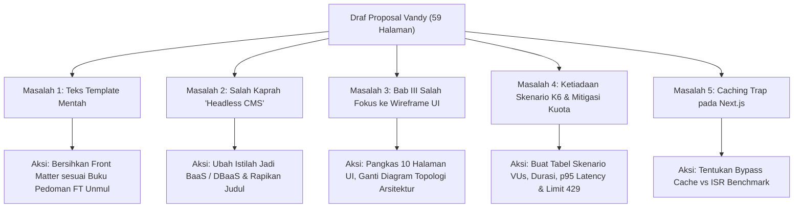

# 📋 LAPORAN AUDIT AKADEMIK PROPOSAL SKRIPSI (REVISI 1)
## EVALUASI KOMPREHENSIF MENUJU SEMINAR PROPOSAL S1 INFORMATIKA FT UNMUL

**Mahasiswa Bimbingan:** Vandy Rizky Septiawan  
**NIM:** 2309106048 (Angkatan 2023)  
**Program Studi:** S1 Informatika, Jurusan Rekayasa Perangkat Lunak / Teknik Elektro dan Informatika, Fakultas Teknik, Universitas Mulawarman  
**Dosen Pembimbing:** Anton Prafanto, S.Kom., M.T. (NIP: 199310222019031016)  
**Koordinator Program Studi:** Awang Harsa Kridalaksana, S.Kom., M.Kom. (NIP: 197312292005011002)  
**Judul pada Naskah:** *Komparasi Kinerja, Latensi, dan Throughput Google Sheets API terhadap Headless CMS (Supabase) pada Arsitektur Web Next.js*  
**Naskah yang Diaudit:** `Draft_Proposal_Vandy.pdf` (59 Halaman / 40 Halaman Naskah Inti)  
**Tanggal Audit:** 29 September 2026  
**Status Evaluasi:** 🟡 **REVISI MAYOR (BELUM SIAP SEMPRO DENGAN DRAF INI — BUTUH REKONSTRUKSI METODOLOGI BAB III & PEMBERSIHAN TEMPLATE)**

---

> [!NOTE]
> ### 💡 Pesan Pembimbing untuk Vandy:
> *"Halo Vandy, bapak sudah membaca dan menganalisis secara detail naskah proposal 59 halaman yang kamu kumpulkan. Pertama-tama, bapak sangat mengapresiasi progresmu! Kamu menunjukkan komitmen yang luar biasa: melompat dari draf awal 27 halaman menjadi 59 halaman, serta berani mengambil arah riset komparasi empiris (*performance benchmarking*) menggunakan Grafana K6 dan Next.js.*  
>  
> *Namun, sebagai dosen pembimbing yang bertanggung jawab melindungimu di ruang sidang, bapak harus jujur bahwa **draf ini belum bisa bapak izinkan maju Seminar Proposal (Sempro)** jika masih dalam kondisi sekarang. Ada beberapa 'jebakan fatal' yang pasti akan dicecar dan dicoret oleh dewan penguji, terutama: (1) teks template panduan fakultas yang masih tertinggal di halaman depan, (2) salah kaprah menyebut Supabase sebagai Headless CMS, dan (3) Bab III yang salah fokus ke 10 halaman gambar tombol/wireframe CMS sementara metodologi uji bebannya justru hanya ditulis satu paragraf kosong.*  
>  
> *Laporan ini bapak susun dengan bahasa yang santun, jelas, terstruktur, dan solutif lengkap dengan contoh konkret serta potongan kode siap pakai. Pelajari dengan tenang, ikuti panduan checklist perbaikannya, dan bapak yakin proposalmu akan menjadi sangat kuat dan berbobot untuk level S1 Informatika!"*

---

## 🌟 1. Apresiasi Perkembangan & Potensi Positif Mahasiswa

Dibandingkan dengan draf awal yang diajukan sebelumnya (yang hanya fokus pada pembuatan website organisasi biasa), draf revisi ini menunjukkan lonjakan kematangan berpikir keteknikan yang sangat pesat:

1. **Transformasi Menjadi Riset Komputasi Empiris:**
   Kamu berhasil mengubah paradigma dari sekadar *"membuat aplikasi web CRUD"* menjadi *"menguji dan membandingkan performa arsitektur data"*. Ini adalah langkah tepat untuk meningkatkan bobot skripsi S1 Informatika.
2. **Adopsi Perangkat Uji Standar Industri (Grafana K6):**
   Memilih **Grafana K6** sebagai *load testing tool* menunjukkan wawasan teknologi modern. K6 adalah *developer-centric load testing tool* berbasis JavaScript/Go yang sangat diakui di industri rekayasa perangkat lunak.
3. **Peningkatan Literatur yang Signifikan:**
   Daftar pustaka bertambah secara masif dengan lebih dari 40 referensi artikel ilmiah terkini (2022–2026), termasuk jurnal-jurnal nasional terakreditasi dan rujukan arsitektur modern.

---

## 🚦 2. Matriks Kelayakan Naskah Menuju Seminar Proposal

| Komponen Evaluasi | Kondisi Saat Ini pada Draf | Standar Akademik S1 Informatika FT Unmul | Status | Tindakan Koreksi Wajib |
| :--- | :--- | :--- | :---: | :--- |
| **Kerapian Format & Template** | Halaman Judul, Pengesahan, Kata Pengantar, dan Daftar Tabel/Gambar masih berisi teks *template* bawaan Word. | Bebas 100% dari teks dummy/placeholder; format TOC dan metadata lengkap sesuai Buku Pedoman Unmul. | 🔴 **Kritis** | Bersihkan seluruh teks template, isi data dosen & judul secara konsisten. |
| **Ketepatan Taksonomi Konsep** | Supabase berulang kali disebut sebagai *"Headless CMS"*. | Supabase adalah *Backend-as-a-Service (BaaS) / Relational DBaaS*. Headless CMS adalah Strapi/Sanity/Payload. | 🔴 **Kritis** | Koreksi istilah di judul, rumusan masalah, dan seluruh batang tubuh naskah. |
| **Formulasi Judul** | *"Komparasi Kinerja, Latensi, dan Throughput..."* (Pleonasme/Redundan). | Efektif, lugas, baku (maksimal 20 kata). Latensi dan throughput sudah tercakup dalam "Kinerja". | 🟡 **Perlu Perbaikan** | Sederhanakan judul menjadi lebih ilmiah dan ringkas. |
| **Fokus Bab III (Proporsi)** | 10 halaman memuat wireframe UI blog/galeri, sedangkan Pengujian Beban (3.6.2) hanya 1 paragraf. | Skripsi benchmarking berfokus pada topologi server, skenario beban, variabel kontrol, dan metrik uji. | 🔴 **Kritis** | Pangkas wireframe UI menjadi 1–2 diagram sistem. Uraikan Subbab 3.6.2 menjadi protokol uji beban yang komprehensif. |
| **Mitigasi Kuota Google Sheets API** | Tidak ada pembahasan batasan *rate limit* Google Sheets (300 req/min). | Wajib mengantisipasi *error HTTP 429 Too Many Requests* pada saat pengujian beban konkuren. | 🔴 **Kritis** | Definisikan batas beban uji di K6 dan strategi penanganan kuota API Google. |
| **Kontrol Caching Next.js** | Tidak ada penjelasan apakah `fetch()` Next.js di-cache atau di-bypass. | Pengujian raw latency API wajib mem-bypass Next.js Data Cache (`cache: 'no-store'`) agar data valid. | 🔴 **Kritis** | Tegaskan konfigurasi *cache policy* pada Next.js API Routes yang diuji. |
| **Pengujian Blackbox CRUD** | Memuat 24 butir pengujian tombol/input form admin biasa. | Pengujian blackbox UI web tidak berkontribusi menjawab rumusan masalah performa latensi & throughput. | 🟡 **Perlu Dieliminasi** | Hapus/rampingkan tabel blackbox, alihkan fokus ke validasi integritas payload data. |

---

## 🔍 3. Rincian 5 Masalah Kritis & Solusi Konkret

Berikut adalah pembahasan detail hal-hal yang wajib kamu perbaiki:



---

### 🔴 MASALAH 1: Kecerobohan Format & Teks Template Mentah

Pada naskah yang kamu kumpulkan, masih banyak sisa teks panduan Microsoft Word yang belum kamu ganti:
* **Halaman 2 (Halaman Judul Dalam):** Masih tertulis `"JUDUL SKRIPSI JUDUL SKRIPSI JUDUL SKRIPSI..."`, `"NAMA MAHASISWA"`, `"NIM (Tanpa Tulisan NIM)"`, dan `"<TAHUN SEKARANG>"`.
* **Halaman 3 (Halaman Pengesahan):** Masih tertulis `"[tgl, bln, tahun]"`, `"Nama Dosen Pembimbing I lengkap dengan gelar"`, dan teks panduan lainnya.
* **Halaman 4 (Kata Pengantar):** Teks panduan fakultas berbunyi *"Kata Pengantar (preface, foreword) sebaiknya disusun secara ringkas dan tidak lebih dari 2 halaman (lihat contoh Lampiran 9)..."* masih tercetak utuh.
* **Halaman 6–10:** Daftar Tabel memuat *"Tabel 1.1 contents 6"*, *"Keterangan: WAJIB menggunakan alat bantu TOC..."*, serta Daftar Gambar/Istilah/Singkatan yang hanya berisi kata *"Contents"*.

> **Solusi Konkret:**
> 1. Buka kembali file Microsoft Word proposalmu.
> 2. Ganti semua teks dummy dengan identitas aslimu:
>    * Judul: Sesuai judul revisi yang disetujui.
>    * Nama: **Vandy Rizky Septiawan** | NIM: **2309106048**.
>    * Dosen Pembimbing: Anton Prafanto, S.Kom., M.T.
>    * Koordinator Prodi: Awang Harsa Kridalaksana, S.Kom., M.Kom.
>    * Tahun: **2026**.
> 3. Hapus paragraf instruksi di bagian atas Kata Pengantar.
> 4. Klik kanan pada Daftar Isi, Daftar Tabel, dan Daftar Gambar -> pilih **Update Field** -> **Update entire table** agar nomor halamannya sinkron otomatis.

---

### 🔴 MASALAH 2: Cacat Taksonomi "Headless CMS" & Redundansi Judul

1. **Mengapa Supabase Bukan Headless CMS?**  
   * **Supabase** adalah *open-source Backend-as-a-Service (BaaS)* atau *Database-as-a-Service (DBaaS)* yang menyediakan instance PostgreSQL dengan lapisan API otomatis (PostgREST), autentikasi (GoTrue), dan storage. Supabase tidak memiliki fitur bawaan pemodelan konten editorial (seperti editor WYSIWYG konten, workflow draft-to-publish, atau content type builder).
   * **Headless CMS** sejati adalah platform seperti Strapi, Payload CMS, Contentful, atau Sanity yang dirancang khusus untuk tim konten/jurnalis.
   * Menyebut Supabase sebagai Headless CMS di hadapan dosen penguji Rekayasa Perangkat Lunak akan menjadi sasaran empuk pertanyaan teori dasar arsitektur.
2. **Redundansi pada Judul Saat Ini:**  
   * Judulmu: *"Komparasi Kinerja, Latensi, dan Throughput Google Sheets API terhadap Headless CMS (Supabase) pada Arsitektur Web Next.js"*
   * Secara definisi rekayasa perangkat lunak, **latensi dan throughput adalah bagian tak terpisahkan dari kinerja (*performance metrics*)**. Menyebut ketiganya sekaligus adalah pemborosan kata (pleonasme).

> **Rekomendasi Perbaikan Judul (Pilih salah satu yang paling kamu minati):**
> 
> * **Opsi A (Tetap Menggunakan Supabase — Sangat Direkomendasikan):**  
>   **"Analisis Komparasi Kinerja Google Sheets API dan Supabase sebagai Data Provider pada Arsitektur Web Next.js"**  
>   *(Penjelasan: Fokusnya jelas menguji dua alternatif penyimpan/penyedia data, yaitu spreadsheet berbasis API vs Database-as-a-Service).*
> 
> * **Opsi B (Jika Benar-Benar Ingin Membandingkan dengan Headless CMS Murni):**  
>   **"Komparasi Kinerja Google Sheets API dan Headless CMS (Strapi / Payload) pada Arsitektur Web Next.js"**  
>   *(Catatan: Kamu harus mengganti Supabase dengan Strapi atau Payload CMS).*

---

### 🔴 MASALAH 3: Bab III Salah Fokus (10 Halaman UI vs 1 Paragraf Pengujian)

Ini adalah kelemahan paling fundamental pada naskahmu saat ini:
* Di **Subbab 3.5 (Halaman 24 s.d. 34)**, kamu menampilkan 13 gambar wireframe antarmuka (Halaman Beranda, Blog, Galeri, Login, Admin, Edit Blog, Edit Galeri, Manajemen Konten Beranda, dll.). Ini adalah porsi untuk skripsi pembuatan aplikasi (*information system engineering*), **bukan skripsi komparasi kinerja**.
* Di **Subbab 3.6.2 (Pengujian Peforma - Halaman 38)**, kamu hanya menulis **SATU PARAGRAPH** umum yang tidak memuat angka, tidak memuat skenario, dan tidak memuat parameter teknis pengujian! Dosen penguji akan bertanya: *"Mana rancangan penelitian komparasinya?"*

> **Solusi Konkret:**
> 1. **Pangkas Subbab 3.5 secara drastis:**  
>    Hapus 10 halaman wireframe form/tabel tersebut. Kamu cukup membuat **1 Gambar Diagram Arsitektur Sistem / Topologi Komunikasi Data** yang memperlihatkan bagaimana client K6 menembak Next.js API Routes, lalu Next.js berkomunikasi ke Google Sheets API vs Supabase Client.
> 2. **Alihkan energi penulisanmu ke Subbab 3.6.2:**  
>    Jabarkan protokol eksperimen pengujian beban Grafana K6 secara ilmiah, terukur, dan dapat direplikasi (*reproducible*).

---

### 🔴 MASALAH 4: Perancangan Pengujian Performa Grafana K6 yang Seharusnya

Di Bab 3.6.2, kamu wajib menyajikan tabel skenario pengujian beban secara eksplisit. Berikut adalah rancangan standar ilmiah yang harus kamu masukkan ke dalam naskah:

#### **A. Parameter Metrik yang Diukur**
Jangan hanya mengukur rata-rata (*average*), karena rata-rata mudah bias oleh nilai pencilan (*outliers*). Wajib sertakan:
1. **Response Time / Latency (ms):**
   * *Minimum, Average, Median (p50)*.
   * *95th Percentile (p95)*: Waktu respon maksimal yang dirasakan oleh 95% pengguna.
   * *99th Percentile (p99)*: Indikator degradasi performa pada kondisi terburuk.
2. **Throughput (Requests per Second / RPS):**
   * Jumlah request sukses yang mampu dilayani per detik.
3. **Error Rate / Failure Rate (%):**
   * Persentase request yang gagal (HTTP status non-200, terutama status **HTTP 429 Too Many Requests** dan **HTTP 500/504 Gateway Timeout**).

#### **B. Tabel Skenario Pengujian Beban Grafana K6**

Wajib cantumkan tabel rancangan pengujian seperti ini di Bab III:

| Kode Skenario | Jenis Pengujian | Tujuan Pengujian | Beban Pengguna Virtual (VUs) | Pola Pembebanan (*Stages*) | Durasi Total |
| :---: | :--- | :--- | :---: | :--- | :---: |
| **TC-01** | *Smoke / Baseline Test* | Mengukur performa murni (*latency floor*) pada kondisi beban minimal tanpa antrean. | **1 VU** | 1 VU konstan | 1 Menit |
| **TC-02** | *Average Load Test* | Mengukur stabilitas sistem pada beban lalu lintas pengguna normal. | **10–25 VUs** | Ramp-up 1 menit, tahan (*hold*) 3 menit, ramp-down 1 menit | 5 Menit |
| **TC-03** | *Stress Test (Breaking Point)* | Mengamati titik degradasi performa, antrean konkurensi, dan batas kuota API. | **50–100 VUs** | Ramp-up bertahap (10 -> 25 -> 50 -> 100 VUs) | 7 Menit |
| **TC-04** | *Spike Test* | Menguji ketahanan sistem saat terjadi lonjakan trafik tiba-tiba (*burst traffic*). | **0 -> 50 VUs** | Lonjakan drastis dalam 10 detik, tahan 1 menit, turun ke 0 | 2 Menit |

#### **C. Contoh Skrip Pengujian Grafana K6 (Bisa Kamu Cantumkan di Lampiran / Bab III)**

```javascript
import http from 'k6/http';
import { check, sleep } from 'k6';

// Konfigurasi Options Pengujian Beban
export const options = {
  stages: [
    { duration: '30s', target: 10 }, // Ramp-up ke 10 VUs
    { duration: '1m', target: 25 },  // Naik ke 25 VUs (beban normal)
    { duration: '30s', target: 0 },  // Ramp-down ke 0
  ],
  thresholds: {
    http_req_failed: ['rate<0.05'],    // Error rate harus di bawah 5%
    http_req_duration: ['p(95)<2000'], // 95% request harus selesai di bawah 2 detik
  },
};

export default function () {
  // Ganti URL target dengan endpoint Next.js yang memanggil Sheets API / Supabase
  const url = __ENV.TARGET_URL || 'http://localhost:3000/api/articles';
  
  const params = {
    headers: {
      'Accept': 'application/json',
    },
  };

  const res = http.get(url, params);

  check(res, {
    'status is 200': (r) => r.status === 200,
    'status is not 429': (r) => r.status !== 429, // Memantau kuota rate-limit Google
  });

  sleep(1); // Jeda simulasi aksi pengguna (think time)
}
```

---

### 🔴 MASALAH 5: Penanganan Faktor Perancu (*Confounding Variables*)

Dosen penguji yang mengerti arsitektur web modern akan menanyakan 3 hal krusial berikut:

#### **1. Jebakan Caching Bawaan Next.js (Next.js Data Cache)**
* **Masalah:** Next.js (versi 13/14/15 App Router) secara default menyimpan hasil pemanggilan `fetch()` ke dalam memori cache peladen (*Server-Side Data Cache*).
* Jika kamu tidak mengatur *cache-control*, maka request pertama dari K6 akan mengambil data dari Google Sheets API, tetapi **request ke-2 sampai ke-10.000 akan diambil langsung dari memori RAM server Next.js!** Akibatnya, kamu bukan sedang mengukur Google Sheets API atau Supabase, melainkan mengukur kecepatan cache Next.js!
* **Solusi Wajib:**  
  Di Bab 3.4 atau 3.6, nyatakan secara eksplisit bahwa untuk pengujian *raw performance*:
  ```typescript
  // Pada Next.js API Route Handler (app/api/articles/route.ts)
  export const dynamic = 'force-dynamic'; // Menonaktifkan full route cache
  export const fetchCache = 'force-no-store'; // Memaksa setiap request memanggil data provider riil
  ```
  *(Catatan Tambahan untuk Nilai Plus: Kamu juga bisa membuat skenario perbandingan: pengujian tanpa cache vs pengujian dengan Incremental Static Regeneration / ISR).*

#### **2. Limit Kuota Google Sheets API (HTTP 429 Too Many Requests)**
* **Masalah:** Google Sheets API v4 menerapkan kuota resmi:
  * Maksimal **300 requests per minute (RPM) per project**.
  * Maksimal **60 requests per minute per user**.
* Jika kamu melakukan *stress test* K6 dengan 50 VU tanpa jeda, dalam 15 detik sistemmu akan dibanjiri error status code `429 (Too Many Requests)`.
* **Solusi Wajib:**  
  Jelaskan di Bab 1.3 (Batasan Masalah) dan Bab 3.6 bahwa:  
  *"Pengujian beban dirancang dengan mempertimbangkan batas kuota resmi Google Sheets API v4 (300 req/min/project). Salah satu fokus analisis adalah mengidentifikasi ambang batas pengguna virtual (VUs) saat Google Sheets API mulai menghasilkan status HTTP 429 dibandingkan dengan Supabase yang didukung oleh pooler basis data mandiri."* Ini akan membuat skripsimu terlihat sangat cerdas!

#### **3. Topologi Lingkungan Pengujian (Network & Hardware Specs)**
Di Bab 3.7 atau Subbab Metodologi, wajib cantumkan spesifikasi lingkungan uji:
* **Server Environment:** Di mana Next.js dijalankan? Apakah di lokal (Node.js runtime, RAM 16GB, CPU Intel/AMD...), atau di cloud hosting (Vercel Serverless / VPS)?
* **Data Provider Region:** Supabase berada di region mana? (Misalnya: Singapore `ap-southeast-1` agar latensi jaringan dari Indonesia serendah mungkin).
* **K6 Runner:** Dari mesin mana skrip K6 dijalankan? (Wajib menggunakan mesin terpisah atau koneksi jaringan stabil agar pembebanan CPU oleh K6 tidak mengganggu eksekusi Next.js).

---

## 📝 4. Perbaikan Bab Lain (Bab I dan Bab II)

### **A. Bab I (Pendahuluan)**
1. **Latar Belakang:**  
   * Hapus klaim bahwa Supabase adalah Headless CMS. Posisikan Google Sheets API sebagai solusi *low-cost / zero-maintenance data storage* untuk aplikasi skala kecil, sedangkan Supabase adalah solusi *scalable Relational BaaS (Postgres)*.
   * Tekankan celah penelitian (*research gap*): Pengembang pemula sering tergoda memakai Google Sheets sebagai basis data gratis tanpa memahami konsekuensi latensi pemanggilan API eksternal dan batasan kuotanya ketika trafik meningkat.
2. **Rumusan Masalah:**  
   Sempurnakan redaksinya menjadi:  
   * *"Bagaimana perbandingan kinerja antara Google Sheets API dan Supabase sebagai data provider pada arsitektur web Next.js ditinjau dari metrik latensi, throughput, dan tingkat keberhasilan request (error rate) di bawah berbagai skenario beban pengguna virtual?"*
3. **Batasan Masalah:**  
   * Mengenai pembatasan operasi READ: Jelaskan alasannya secara ilmiah. Mengapa hanya READ? (Misal: Karena membaca artikel/konten publik mencakup 90%+ pola lalu lintas CMS web).  
   * *Saran Pembimbing:* Jika memungkinkan, tambahkan pengujian WRITE ringan (misal 1 VU submit kontak/komentar) untuk membuktikan lambatnya Google Sheets API saat mengunci baris spreadsheet (*cell serialization*).
4. **Hapus Tabel Blackbox di Metodologi:**  
   Tabel 3.2 (pengujian tombol klik login, tambah galeri, ubah blog) **sebaiknya dihapus atau dipindahkan ke lampiran**. Pengujian fungsionalitas UI dasar tidak relevan dengan esensi riset komparasi performa API.

### **B. Bab II (Tinjauan Pustaka)**
* Ringkas teori-teori dasar SMA/semester 1 seperti pengertian *"Website"*, *"Website Dinamis"*, dan *"HTML/CSS"*. Tinjauan pustaka mahasiswa S1 tingkat akhir harus berfokus pada:
  1. Arsitektur Data Provider pada Web Modern (Spreadsheet API vs Relational BaaS).
  2. Next.js Data Fetching Lifecycles (Server Components, Route Handlers, Cache Policy).
  3. Konsep Rekayasa Kinerja Perangkat Lunak (*Software Performance Engineering*): Metrik Latensi, Percentile (p50, p95, p99), Throughput, dan Little's Law.
  4. Prinsip Pengujian Beban (*Load & Stress Testing*) menggunakan Grafana K6.

---

## ✅ 5. Checklist Mandiri Mahasiswa Sebelum Pengajuan Ulang

Gunakan daftar centang berikut sebelum menyerahkan naskah revisi berikutnya:

- [ ] **1. Pembersihan Template:**
  - [ ] Judul skripsi pada Halaman Judul dan Pengesahan sudah diganti dengan judul penelitian yang sebenarnya.
  - [ ] Teks `NAMA MAHASISWA`, `NIM (Tanpa Tulisan NIM)`, dan `<TAHUN SEKARANG>` sudah diganti identitas asli.
  - [ ] Teks petunjuk pembuatan Kata Pengantar sudah dihapus.
  - [ ] Daftar Tabel, Daftar Gambar, dan Daftar Singkatan sudah di-update otomatis (*Update Field -> Entire Table*).
- [ ] **2. Koreksi Terminologi:**
  - [ ] Semua kata *"Headless CMS (Supabase)"* telah dikoreksi menjadi *"Backend-as-a-Service (Supabase)"* atau *"Data Provider Supabase"*.
  - [ ] Judul disederhanakan tanpa pleonasme ("Kinerja, Latensi, dan Throughput").
- [ ] **3. Restrukturisasi Bab III:**
  - [ ] Memangkas 10 halaman wireframe form/tabel UI CMS.
  - [ ] Menyajikan 1 diagram arsitektur interaksi sistem dan topologi jaringan yang jelas.
  - [ ] Menguraikan Subbab 3.6.2 (Pengujian Performa) dengan Tabel Skenario Pengujian K6 (Smoke, Average Load, Stress Test).
  - [ ] Menjelaskan metrik evaluasi: Average, p95, p99, Throughput (RPS), dan Error Rate (%).
  - [ ] Menyertakan skrip pengujian K6 dasar pada lampiran atau subbab metodologi.
- [ ] **4. Mitigasi Teknis:**
  - [ ] Menjelaskan kontrol bypass cache pada Next.js (`cache: 'no-store'`).
  - [ ] Menyebutkan analisis batasan kuota Google Sheets API (300 req/min) dan status error 429.
  - [ ] Mencantumkan spesifikasi perangkat keras dan region server/basis data.
- [ ] **5. Kepatuhan Pedoman Format FT Unmul:**
  - [ ] Margin halaman: Atas 3,5 cm, Kiri 3,5 cm, Bawah 2,5 cm, Kanan 2,5 cm.
  - [ ] Font: Times New Roman 12 pt, spasi 1.5, Justify (Rata Kiri-Kanan).
  - [ ] Penomoran halaman: Angka romawi kecil (i, ii, iii...) di tengah bawah untuk bagian awal; angka arab (1, 2, 3...) di pojok kanan atas untuk naskah utama (kecuali halaman judul bab di tengah bawah).

---

## 🎯 6. Kesimpulan & Arahan Dosen Pembimbing

> **Vandy, idemu sangat bagus dan berbobot untuk skripsi S1 Informatika.**  
> Topik ini sangat diminati oleh para *software engineer* di industri yang mencari solusi arsitektur hemat biaya namun tetap andal. Kekurangan drafmu saat ini **murni karena salah fokus penyusunan naskah (terjebak format skripsi bikin web biasa) serta kelalaian merapikan dokumen template**.  
>  
> Jangan berkecil hati! Lakukan perbaikan sesuai 5 poin kritis di atas. Pangkas halaman yang tidak relevan, lengkapi skenario pengujian K6 dengan detail, dan bersihkan halaman depan naskahmu. Jika revisi ini sudah kamu lakukan, **bapak siap menandatangani lembar persetujuan Seminar Proposal!**  
>  
> Semangat berproses, kamu berada di jalur yang benar! 🚀
