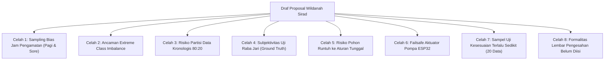

# 📋 LAPORAN AUDIT AKADEMIK PROPOSAL SKRIPSI
**Program Studi S1 Informatika – Fakultas Teknik – Universitas Mulawarman**

---

### Data Mahasiswa & Dokumen:
* **Nama Mahasiswa:** Wildanah Sirad
* **NIM:** 2209106062
* **Judul Proposal:** *Sistem Monitoring dan Otomasi Penyiraman Tanaman Cabai Berbasis IoT dengan Decision Tree*
* **Dosen Pembimbing I:** Ir. Indah Fitri Astuti, S.Kom., M.Cs.
* **Dosen Pembimbing II:** Anton Prafanto, S.Kom., M.T. (NIP: 19931022 201903 1 016)
* **Koordinator Program Studi:** Awang Harsa Kridalaksana, S.Kom., M.Kom. (NIP: 19731229 200501 1 002)
* **Berkas yang Dievaluasi:** [draft_proposal_wildanah_sirad_revisi1.pdf](draft_proposal_wildanah_sirad_revisi1.pdf) (Naskah Draf Proposal Skripsi, 80 Halaman)
* **Tanggal Audit:** 28 September 2026
* **Status Keputusan:** ✅ **LAYAK DENGAN REVISI METODOLOGIS (MENUJU SEMINAR PROPOSAL)**

---

## 🌟 1. Apresiasi Akademik & Keunggulan Naskah

Secara umum, draf proposal ini memiliki kualitas di atas rata-rata mahasiswa S1 Informatika pada tahap awal pengajuan proposal. Mahasiswa menunjukkan dedikasi literatur dan pemahaman metodologis yang patut diapresiasi:

1. **Kajian Literatur Sangat Kuat & Mutakhir (91 Referensi):**
   Daftar pustaka memuat 91 referensi dari basis data ilmiah bereputasi (IEEE Transactions, MDPI Sensors, Elsevier Smart Agricultural Technology, Springer) mayoritas terbitan 2021–2026. Tabel 2.1 (Tabel Perbandingan Penelitian Terkait) merangkum 11 penelitian sebelumnya secara mendalam dan terstruktur.
2. **Menghindari Perangkap *Circular Reasoning* (Bebas Data Leakage pada Pelabelan):**
   Banyak mahasiswa pemula membuat kesalahan fatal dengan melabeli data training menggunakan sensor kelembapan tanah (misal: jika sensor < 60% maka diberi label Siram). Saudara Wildanah dengan tepat **memisahkan proses pelabelan *ground truth* secara manual-independen** (inspeksi fisik media tanam dan kondisi turgor daun) dari data pembacaan sensor (Tabel 3.1 & Subbab 3.2). Ini adalah pemahaman konsep *Supervised Learning* yang sangat benar.
3. **Penyusunan Pembanding (*Baseline Comparison*):**
   Penelitian ini tidak hanya mengukur akurasi algoritma CART, melainkan membandingkannya dengan *baseline* berupa kontrol nilai ambang tunggal (*Rule Threshold 60%*). Hal ini penting untuk membuktikan nilai kebaruan (*novelty*) dan manfaat nyata penggunaan *Machine Learning*.
4. **Pemilihan Metrik Evaluasi yang Relevan:**
   Mahasiswa menyadari bahwa metrik akurasi (*Accuracy*) dapat menjebak (*Accuracy Paradox*) pada dataset irigasi, sehingga secara eksplisit memilih **Precision, Recall, dan F1-Score pada kelas "Siram"** sebagai tolok ukur utama keberhasilan model.
5. **Strategi *Deployment* yang Realistis (*Rule Extraction*):**
   Pendekatan ekstraksi aturan *if-else* dari pohon keputusan CART untuk ditanamkan ke ESP32 adalah keputusan rekayasa komputasi yang efisien (*edge intelligence* berbiaya rendah tanpa ketergantungan koneksi internet secara terus-menerus).

---

## 🚨 2. Temuan Kritis & Potensi "Serangan" Dewan Penguji (*Red Flags*)

Meskipun draf ini sangat berpotensi, terdapat **8 celah metodologis dan administratif** yang harus diperbaiki agar tidak menjadi sasaran kritik tajam oleh dewan penguji saat Seminar Proposal maupun Ujian Pendadaran Skripsi.

---

### ⚠️ Celah 1: *Sampling Bias* pada Jam Pengumpulan Data (Pagi & Sore Saja)
* **Kondisi Naskah (Hal. 40, Subbab 3.2):**
  Observasi manual hanya dilakukan pada **pukul 06.00–08.00** dan **pukul 16.00–18.00** setiap 30 menit (total 10 titik data/tanaman/hari).
* **Potensi Pertanyaan Kritis Dewan Penguji:**
  > *"Tanaman cabai mengalami titik transpirasi tertinggi, suhu udara maksimum, dan radiasi terik pada siang hari (11.00–14.00). Jika Saudara hanya mengumpulkan data saat cuaca sejuk pagi dan sore hari, bagaimana model Decision Tree dapat mengenali karakteristik iklim siang hari? Saat sistem dipasang 24 jam di lapangan, model akan mengalami kegagalan inferensi (*domain shift/out-of-distribution*) ketika suhu mencapai 34°C di siang hari!"*
* **Tindakan Perbaikan:**
  1. Tambahkan minimal 1 sesi observasi pada siang hari (misal pukul **12.00–13.00**, 2–3 titik data), **ATAU**
  2. Jika tanaman cabai secara agronomis memang tidak dianjurkan disiram pada siang terik (karena risiko syok termal akar / pembusukan perakaran), maka mahasiswa **wajib menambahkan filter jadwal operasional berbasis RTC/waktu** pada firmware ESP32: pengambilan keputusan penyiraman otomatis hanya dieksekusi pada jendela pagi dan sore hari. Jelaskan rasionalitas ini secara gamblang di Bab 1.3 (Batasan Masalah) dan Bab 3.2.

---

### ⚠️ Celah 2: Ancaman *Extreme Class Imbalance* (Ketidakseimbangan Kelas Ekstrem)
* **Kondisi Naskah (Hal. 40 & 52):**
  Direncakan 420 data mentah (target minimal 300 data bersih).
* **Fakta Lapangan:**
  Tanaman cabai dalam polybag 30x30 cm umumnya hanya disiram 1 kali sehari (atau maksimal 2 kali bila cuaca sangat panas). Dari 10 titik observasi harian, kemungkinan besar:
  * Kelas `Siram`: $\approx 1$ kali per hari.
  * Kelas `Tidak Siram`: $\approx 9$ kali per hari.
  * Artinya, dari 300 sampel data, kelas `Siram` hanya berkisar 30 sampel (~10%), sedangkan `Tidak Siram` mencapai 270 sampel (~90%).
* **Kelemahan di Bab 3.4.4 (Tabel 3.3):**
  Mahasiswa hanya menyetel *hyperparameter* `criterion='gini'`, `max_depth=[3,4,5]`, dan `min_samples_leaf=[5,10]`. **Tidak ada penanganan ketidakseimbangan kelas!**
  Pohon keputusan standar dengan kriteria Gini cenderung memaksimalkan kemurnian global, sehingga rentan memprediksi semua kondisi sebagai `Tidak Siram` (akurasi bisa mencapai 90%, namun *Recall* kelas Siram = 0%).
* **Tindakan Perbaikan:**
  Tambahkan parameter `class_weight=['balanced', None]` pada Tabel 3.3, dan jelaskan di teks metodologi bahwa pembobotan kelas (*cost-sensitive learning*) digunakan untuk memberikan bobot penalti lebih besar pada kelas minoritas (`Siram`).

---

### ⚠️ Celah 3: Risiko Partisi Data Kronologis 80:20 (Berdasarkan Urutan Hari)
* **Kondisi Naskah (Hal. 51 & 58):**
  Dataset dibagi 80:20 berdasarkan urutan hari (Hari 1 s.d. 11 sebagai Data Latih, Hari 12 s.d. 14 sebagai Data Uji).
* **Potensi Masalah Fatal:**
  Rentang penelitian hanya 14 hari di satu titik lokasi (Bumi Sempaja, Samarinda). Jika pada Hari 12 s.d. 14 cuaca di Samarinda diguyur hujan terus-menerus, maka seluruh data uji (20%) akan berlabel **`Tidak Siram`**.
  Jika di data uji tidak ada satu pun sampel kelas `Siram`, maka metrik **Precision, Recall, dan F1-Score kelas Siram menjadi 0 atau tidak terdefinisi (*division by zero*)!**
* **Tindakan Perbaikan:**
  Tambahkan klausul pengamanan di Bab 3.6.2:
  *"Apabila pembagian data berdasarkan urutan hari menghasilkan data uji yang tidak memiliki sampel kelas Siram (akibat kondisi cuaca tertentu), maka digunakan metode Stratified K-Fold Cross Validation atau Stratified Random Sampling untuk memastikan proporsi kelas Siram dan Tidak Siram terwakili secara seimbang pada data latih dan data uji."*

---

### ⚠️ Celah 4: Subjektivitas Uji Raba Jari (*Tactile Sensing*) pada Ground Truth
* **Kondisi Naskah (Hal. 41, Tabel 3.1):**
  Kriteria observasi: *"Media tanam terasa kering saat diperiksa secara langsung dan tidak menunjukkan kondisi lembap -> Siram"*.
* **Potensi Kritik Penguji:**
  > *"Bagaimana parameter 'terasa kering' diukur secara objektif? Apakah kelembapan tangan pengamat atau persepsi subjektif harian tidak membiaskan label ground truth?"*
* **Tindakan Perbaikan:**
  Standarkan deskripsi operasional pada Tabel 3.1 dengan prosedur fisik sederhana yang baku:
  1. **Kedalaman Rabaan:** *"Pemeriksaan fisik dilakukan dengan menekan jari telunjuk hingga kedalaman ruas pertama (sekitar 2–3 cm di bawah permukaan tanah)"*.
  2. **Uji Kepal Tanah Baku (*Soil Squeeze/Ball Test*):**
     * **Kering (Siram):** Tanah pada kedalaman 2–3 cm saat diambil dan dikepal dengan tangan terasa berderai/berdebu serta tidak mampu membentuk gumpalan padat.
     * **Lembap (Tidak Siram):** Tanah saat dikepal membentuk bola gumpalan yang lentur, permukaan telapak tangan terasa lembap, namun tidak mengeluarkan air menetes.
     * **Terlalu Basah (Tidak Siram):** Tanah sangat lunak, berlumpur, dan saat dikepal mengeluarkan tetesan atau genangan air bebas.

---

### ⚠️ Celah 5: Bobot Keilmuan Informatika & Risiko Pohon CART "Menciut" (*Tree Collapse*)
* **Potensi Kritik Penguji:**
  > *"Jika pada akhirnya pohon keputusan CART hanya melakukan percabangan pada fitur kelembapan tanah (misal: if soil_moisture < 58% then Siram), apa gunanya sensor DHT22 dan algoritma Decision Tree? Bukankah itu sama saja dengan sistem ambang batas berbasis sensor tunggal?"*
* **Tindakan Perbaikan:**
  1. Pada Bab 3.6.2 dan rencana pembahasan Bab IV, mahasiswa wajib menambahkan **Analisis Feature Importance (Tingkat Kepentingan Fitur)** dari Scikit-Learn.
  2. Mahasiswa harus merencanakan analisis kasus batas (*edge cases* / interaksi multivariat). Contoh skenario yang harus ditunjukkan:
     * *"Pada rentang kelembapan tanah transisi (55%–65%), suhu udara tinggi (>30°C) dan kelembapan udara rendah memicu model memutuskan SIRAM lebih awal guna mengantisipasi kelayuan akibat laju evapotranspirasi tinggi. Sebaliknya, pada nilai kelembapan tanah yang sama namun suhu dingin (23°C), sistem memutuskan TIDAK SIRAM."*
     * Analisis inilah yang membuktikan keunggulan komputasi kecerdasan buatan (*Machine Learning*) dibanding sekadar aturan *threshold* tunggal!

---

### ⚠️ Celah 6: Ketiadaan Mekanisme *Failsafe* pada Firmware ESP32
* **Kondisi Naskah (Hal. 54–55, Subbab 3.4.5 & Gambar 3.9):**
  Jika model memutuskan `Siram`, ESP32 menyalakan relay pompa selama 10,5 detik (~300 mL), lalu *delay* 30 menit sebelum evaluasi berikutnya.
* **Bahaya *Hardware* (*Cyber-Physical Risk*):**
  Bagaimana jika probe Soil Moisture Sensor V2 terlepas dari tanah, kabel sinyal putus, atau pin ADC mengalami kontak buruk sehingga nilai ADC terbaca 2634 (kering terus-menerus)?
  ESP32 akan menyiram 300 mL setiap 30 menit tanpa henti (48 kali per 24 jam = **14,4 Liter air!**). Tanaman cabai akan tenggelam mati, media tanam hanyut, dan motor pompa berpotensi terbakar (*overheating*).
* **Tindakan Perbaikan:**
  Tambahkan blok logika pengaman (*Failsafe Logic*) pada flowchart Gambar 3.9 dan program ESP32:
  1. **Batas Maksimum Penyiraman Harian (*Daily Watering Cap*):** Batasi aktivasi pompa maksimal 2–3 kali dalam periode 24 jam.
  2. **Deteksi Anomali Sensor (*Outlier/Disconnection Check*):** Jika pembacaan sensor menghasilkan nilai tidak wajar (misal ADC = 0 atau ADC = 4095 secara konstan), sistem mengabaikan keputusan siram, mengunci relay pada posisi mati, dan mengirim status `Sensor Error` ke Firestore.

---

### ⚠️ Celah 7: Ukuran Sampel Uji Kesesuaian Python vs ESP32 Terlalu Sedikit
* **Kondisi Naskah (Hal. 60, Tabel 3.6):**
  Uji kesesuaian antara model Python dan *rules* ESP32 hanya menggunakan **20 data**.
* **Potensi Kritik Penguji:**
  > *"Mengapa hanya 20 data? Apakah 20 data tersebut telah mencakup seluruh percabangan aturan (*code coverage*) pada pohon keputusan?"*
* **Tindakan Perbaikan:**
  Ubah rancangan pengujian pada Tabel 3.6:
  1. Uji menggunakan **seluruh data uji (*test set*)** (misal 60–84 data hasil split).
  2. Tambahkan pengujian sintetis (*Boundary Value Analysis*) yang mewakili setiap simpul daun (*leaf node*) dari pohon keputusan untuk menjamin 100% *rule coverage* pada program C++ ESP32.

---

### ⚠️ Celah 8: Formalitas Template Lembar Pengesahan Belum Dilengkapi
* **Kondisi Naskah (Hal. 3 & Hal. 4):**
  * Halaman Pengesahan (Hal. 3) masih memuat teks placeholder:
    * `[tgl, bln, tahun]`
    * `I. Nama Dosen Pembimbing I lengkap dengan gelar`
    * `II. Nama Dosen Pembimbing II lengkap dengan gelar`
* **Tindakan Perbaikan:**
  Wajib diisi lengkap sebelum berkas diserahkan ke staf prodi / ditandatangani pembimbing:
  * **Pembimbing I:** Ir. Indah Fitri Astuti, S.Kom., M.Cs.
  * **Pembimbing II:** Anton Prafanto, S.Kom., M.T. (NIP: 19931022 201903 1 016)
  * **Koordinator Prodi:** Awang Harsa Kridalaksana, S.Kom., M.Kom. (NIP: 19731229 200501 1 002)

---

## 🔍 3. Panduan Perbaikan Langkah demi Langkah (*Action Plan*)

Mahasiswa dapat langsung membuka berkas naskah Microsoft Word dan melakukan revisi sesuai panduan berikut:

### A. Bagian Awal (Halaman Pengesahan & Kata Pengantar)
1. **Halaman iii (Pengesahan):**
   Ganti teks placeholder dengan nama dan gelar lengkap para dosen pembimbing beserta NIP yang sah.
2. **Halaman iv (Kata Pengantar):**
   Pastikan penulisan gelar dosen pembimbing dan koordinator program studi sudah seragam dan benar.

### B. Bab I (Pendahuluan)
1. **Subbab 1.1 (Latar Belakang):**
   Pertegas kalimat pada paragraf 4 mengenai **urgensi multivariat**: jelaskan bahwa kelembapan tanah diukur pada satu titik media tanam dan sering kali lambat merespons perubahan iklim mikro (suhu dan kelembapan udara lingkungan sekitar daun). Penggabungan ketiga variabel via Machine Learning memungkinkan sistem mendeteksi kebutuhan air secara lebih adaptif dan antisipatif.
2. **Subbab 1.3 (Batasan Masalah):**
   * Tambahkan butir batasan: *"Sistem otomasi dilengkapi mekanisme pengaman (*failsafe*) berupa batasan frekuensi penyiraman harian maksimum guna mencegah kelebihan air akibat potensi gangguan sensor."*
   * Tambahkan butir batasan operasional: *"Evaluasi pengambilan keputusan penyiraman dilakukan secara berkala dengan interval 30 menit (dengan jendela operasional pagi dan sore hari)."*

### C. Bab II (Tinjauan Pustaka)
1. **Subbab 2.9 (Decision Tree & CART):**
   * Tambahkan penjelasan singkat mengenai tantangan *Class Imbalance* pada pohon klasifikasi dan bagaimana pembobotan kelas (*class weight*) bekerja pada perhitungan *weighted Gini impurity*.
   * Tambahkan definisi teoritis mengenai *Feature Importance* (Mean Decrease in Impurity / MDI) pada pohon keputusan.

### D. Bab III (Metodologi Penelitian) — Fokus Utama Revisi!
1. **Subbab 3.2 (Pengumpulan Data - Tabel 3.1):**
   * Perjelas prosedur operasional rabaan jari (kedalaman 2–3 cm) dan uji kepal tanah (*soil squeeze test*) untuk kriteria Kering, Lembap, dan Terlalu Basah.
   * Beri justifikasi logis mengenai jam observasi (06.00–08.00 dan 16.00–18.00) dikaitkan dengan anjuran waktu penyiraman tanaman hortikultura agar tidak menyebabkan stres termal pada siang terik.
2. **Subbab 3.4.4 (Pembentukan Model CART - Tabel 3.3):**
   * Tambahkan parameter `class_weight` dengan nilai `[None, 'balanced']` pada tabel eksplorasi konfigurasi.
   * Tuliskan strategi: konfigurasi terbaik dipilih berdasarkan nilai **F1-Score tertinggi pada kelas Siram** pada data validasi.
3. **Subbab 3.4.5 & Gambar 3.9 (Implementasi ESP32):**
   * Perbarui flowchart Gambar 3.9 dengan menambahkan blok pengecekan kuota siram harian (*Daily Watering Check*) dan validasi rentang ADC sebelum relay diaktifkan.
4. **Subbab 3.6.2 (Pengujian Model):**
   * Tambahkan klausul cadangan: jika partisi kronologis menghasilkan ketiadaan sampel Siram di data uji, mahasiswa akan beralih menggunakan *Stratified Splitting*.
   * Tambahkan rencana evaluasi *Feature Importance*.
5. **Subbab 3.6.3 (Pengujian Kesesuaian - Tabel 3.6):**
   * Tingkatkan jumlah data pengujian dari 20 data menjadi seluruh data uji (*test set*).

---

## 📋 4. Lembar Kerja Mahasiswa (Checklist Pra-Seminar)

Gunakan tabel ini untuk memantau progres perbaikan sebelum menandatangani lembar persetujuan seminar proposal:

| Prioritas | Item Tindakan Perbaikan | Bagian Dokumen | Target Selesai | Status |
| :---: | :--- | :--- | :---: | :---: |
| 🔴 **Tinggi** | Tambahkan parameter `class_weight=['balanced']` pada Tabel 3.3 & mitigasi *class imbalance*. | Bab 3.4.4 (Hal. 52) | H-2 | [ ] |
| 🔴 **Tinggi** | Tambahkan mekanisme *Failsafe* (kuota harian & cek error sensor) pada flowchart Gambar 3.9. | Bab 3.4.5 (Hal. 54) | H-2 | [ ] |
| 🔴 **Tinggi** | Lengkapi nama pembimbing, gelar, NIP, dan tanggal pada Lembar Pengesahan. | Lembar Pengesahan (Hal. 3) | H-1 | [ ] |
| 🟡 **Sedang** | Standarkan prosedur uji kepal tanah (*soil squeeze test*) pada kriteria Tabel 3.1. | Bab 3.2 (Hal. 41) | H-3 | [ ] |
| 🟡 **Sedang** | Tambahkan klausul cadangan *Stratified Splitting* pada data uji. | Bab 3.6.2 (Hal. 58) | H-3 | [ ] |
| 🟡 **Sedang** | Tingkatkan jumlah data uji kesesuaian Python vs ESP32 dari 20 menjadi seluruh test set. | Bab 3.6.3 (Hal. 60) | H-3 | [ ] |
| 🟢 **Rendah** | Berikan justifikasi agronomis mengapa penyiraman diutamakan pagi & sore hari. | Bab 3.2 (Hal. 40) | H-4 | [ ] |

---

## 🎯 5. Simulasi Pertanyaan Dewan Penguji & Kunci Jawaban Ilmiah

Berikan latihan 5 pertanyaan berikut kepada Wildanah Sirad agar siap menghadapi sesi tanya-jawab:

#### **Pertanyaan 1:**
> *"Mengapa Anda harus menggunakan Decision Tree CART yang rumit, padahal petani cukup melihat nilai kelembapan tanah saja untuk menyiram?"*
* **Rekomendasi Jawaban Mahasiswa:**
  > *"Penggunaan Decision Tree CART bertujuan menangani kondisi dinamis mikroklimat yang bersifat multivariat. Pada kondisi kelembapan tanah di batas ambang abu-abu (misal 55%–65%), aturan ambang tunggal sering kali gagal mengambil keputusan yang tepat. Model Decision Tree mampu mengintegrasikan laju suhu udara dan kelembapan udara. Jika cuaca terik dan udara kering, pohon keputusan dapat memutuskan penyiraman lebih dini untuk mencegah kelayuan akibat evapotranspirasi tinggi, sedangkan jika udara dingin dan lembap, penyiraman ditangguhkan untuk mencegah kebusukan akar."*

#### **Pertanyaan 2:**
> *"Mengapa Anda tidak melatih model Machine Learning langsung di dalam chip ESP32?"*
* **Rekomendasi Jawaban Mahasiswa:**
  > *"Pelatihan model Machine Learning memerlukan alokasi memori komputasi yang intensif untuk optimasi matematis dan pembagian partisi data. ESP32 memiliki keterbatasan SRAM (520 KB). Pendekatan yang paling efisien adalah melatih model di lingkungan komputasi PC dengan Scikit-Learn, lalu mengekstrak pohon keputusan menjadi aturan logika IF-ELSE biner (*Rule Extraction*). Logika ini kemudian dieksekusi secara instan di ESP32 dengan latensi sub-milidetik dan konsumsi daya minimal."*

#### **Pertanyaan 3:**
> *"Bagaimana Anda menjamin bahwa pelabelan data 'Siram' dan 'Tidak Siram' tidak bias atau subjektif?"*
* **Rekomendasi Jawaban Mahasiswa:**
  > *"Pelabelan ground truth dirancang independen dari sensor tanah untuk menghindari circular reasoning (data leakage). Untuk menjamin objektivitas, prosedur observasi dibakukan menggunakan metode perabaan kedalaman ruas pertama jari (2–3 cm) dipadukan dengan Soil Ball/Squeeze Test standar agronomi, serta diverifikasi silang dengan indikator turgor daun cabai."*

#### **Pertanyaan 4:**
> *"Apa yang terjadi jika data Anda 90% Tidak Siram dan hanya 10% Siram? Bukankah model Anda akan bias?"*
* **Rekomendasi Jawaban Mahasiswa:**
  > *"Benar, pada data irigasi terdapat fenomena class imbalance alami karena tanaman hanya disiram 1–2 kali per hari. Oleh karena itu, saya mengimplementasikan hyperparameter `class_weight='balanced'` pada algoritma CART untuk memberikan bobot penalti lebih besar pada kelas minoritas, serta menggunakan F1-Score kelas Siram—bukan akurasi global—sebagai metrik optimasi model."*

#### **Pertanyaan 5:**
> *"Jika sensor kelembapan tanah Anda rusak atau kabelnya lepas di lapangan, apakah sistem Anda akan menyiram air terus-menerus hingga banjir?"*
* **Rekomendasi Jawaban Mahasiswa:**
  > *"Tidak. Sistem telah dirancang dengan mekanisme pertahanan fisik (*failsafe*). Pertama, terdapat batasan kuota penyiraman harian maksimum (misal maksimal 2 kali sehari). Kedua, firmware ESP32 memiliki modul deteksi anomali: jika nilai ADC terbaca di luar ambang batas fisik wajar secara terus-menerus, sistem otomatis menonaktifkan relay pompa dan mengirimkan sinyal status error ke Cloud Firestore."*

---

## 📌 Catatan Penutup untuk Dosen Pembimbing

Proposal Saudara **Wildanah Sirad** memiliki substansi riset informatika terapan yang sangat baik, relevan dengan tren *smart agriculture* dan *edge computing*. Dengan menyempurnakan 8 catatan kritis di atas—terutama pada aspek *class imbalance*, *failsafe* aktuator, dan objektivitas data *ground truth*—naskah ini akan menjadi proposal skripsi yang sangat matang, kokoh secara metodologis, dan siap dipertahankan dengan percaya diri di hadapan dewan penguji.
