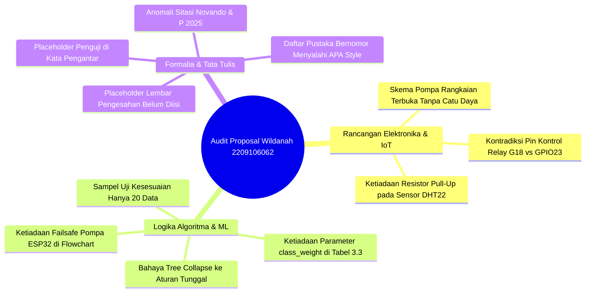

# 📋 LAPORAN AUDIT AKADEMIK FORENSIK PROPOSAL SKRIPSI (REVISI 2)

**Mahasiswa Bimbingan:** Wildanah Sirad  
**NIM:** 2209106062  
**Program Studi:** S1 Informatika, Fakultas Teknik, Universitas Mulawarman  
**Dosen Pembimbing I:** Ir. Indah Fitri Astuti, S.Kom., M.Cs. (NIP: 196812031998022001)  
**Dosen Pembimbing II:** Anton Prafanto, S.Kom., M.T. (NIP: 199310222019031016)  
**Koordinator Program Studi:** Awang Harsa Kridalaksana, S.Kom., M.Kom. (NIP: 197312292005011002)  
**Judul Proposal:** *Sistem Monitoring dan Otomasi Penyiraman Tanaman Cabai Berbasis IoT dengan Decision Tree*  
**Naskah yang Diaudit:** `2209106062 Wildanah Sirad Revisi (2).pdf` (80 Halaman / 62 Halaman Bernomor Arab)  
**Tanggal Audit:** 29 September 2026  
**Status Evaluasi:** 🟡 **LAYAK DENGAN REVISI METODOLOGIS & SKEMA ELEKTRONIK (ACC SEMINAR PROPOSAL SETELAH 10 POIN KRITIS DIPERBAIKI)**

---

> [!NOTE]
> **Petunjuk Mahasiswa:** Dokumen ini merupakan hasil audit akademik forensik menyeluruh terhadap naskah draf proposal skripsi revisi kedua (80 halaman) yang Saudari ajukan. Evaluasi mencakup validitas rancangan elektronika dan IoT (*embedded systems*), ketepatan pemodelan *Machine Learning* pohon keputusan CART, mitigasi ketidakseimbangan kelas (*class imbalance*), serta kepatuhan mutlak terhadap Buku Pedoman Penulisan Skripsi Fakultas Teknik Universitas Mulawarman (Update Mei 2025).

---

## 🌟 1. Apresiasi Akademik & Keunggulan Riset Mahasiswa

Secara umum, naskah proposal yang disusun oleh Saudari **Wildanah Sirad (NIM: 2209106062)** memiliki fondasi keilmuan yang sangat solid dan kualitas di atas rata-rata draf proposal S1 Informatika:

### Keunggulan yang Patut Diapresiasi:
1. **Kajian Literatur Sangat Masif & Mutakhir (91 Referensi):**
   Memuat 91 referensi dari basis data ilmiah bereputasi internasional dan nasional (IEEE Transactions, MDPI Sensors, Elsevier Smart Agricultural Technology, Springer, serta jurnal nasional SINTA), mayoritas terbitan 2021–2026. Tabel 2.1 (Tabel Perbandingan Penelitian Terkait) menyajikan analisis komparatif 11 penelitian sebelumnya secara mendalam dan terstruktur.
2. **Bebas dari Jebakan *Circular Reasoning* (Integritas Ground Truth):**
   Mahasiswa memahami kaidah *Supervised Machine Learning* dengan sangat baik. Proses pelabelan data *ground truth* (Siram / Tidak Siram) **dipisahkan secara independen melalui observasi fisik media tanam dan kondisi turgor daun** (Tabel 3.1 & Subbab 3.2), bukan mengambil jalan pintas dengan melabeli data berdasarkan pembacaan sensor kelembapan tanah. Ini mencegah terjadinya kebocoran data (*data leakage*).
3. **Penyusunan Pembanding (*Baseline Comparison*):**
   Penelitian ini tidak hanya mengevaluasi pohon keputusan CART secara terisolasi, tetapi secara eksplisit membandingkannya dengan *baseline* berupa aturan nilai ambang tunggal (*single threshold rule 60%*). Pendekatan ini esensial untuk membuktikan kontribusi ilmiah (*scientific novelty*) dari penerapan *Machine Learning*.
4. **Pemilihan Metrik Evaluasi yang Relevan (Bebas Accuracy Paradox):**
   Mahasiswa menyadari bahwa metrik akurasi global (*Accuracy*) dapat menyesatkan pada kasus penyiraman tanaman, sehingga memilih **Precision, Recall, dan F1-Score pada kelas Siram** sebagai tolok ukur utama keberhasilan model.
5. **Strategi *Edge Intelligence* yang Efisien (*Rule Extraction*):**
   Pendekatan ekstraksi aturan logika *if-else* dari pohon keputusan CART untuk ditanamkan langsung pada memori mikrokontroler ESP32 adalah keputusan rekayasa komputasi yang tepat: sistem mampu mengambil keputusan penyiraman secara lokal (*offline-first*) dengan latensi sub-milidetik tanpa ketergantungan koneksi internet secara terus-menerus.

---

## 🚨 2. Rangkuman 10 Temuan Kritis (*10 Critical Red Flags*)

Meskipun fondasi penelitian sangat kuat, audit forensik menemukan **10 celah fatal dan mayor**—terutama pada **skema elektronika yang masih berupa rangkaian terbuka (*open circuit*)**, kontradiksi pin kontrol, ketiadaan mekanisme pengaman pompa (*failsafe*), serta sisa teks *template* pada lembar pengesahan.



### Tabel Ringkasan Temuan Kritis:

| No | Kategori | Tingkat Urgensi | Lokasi (Hal.) | Deskripsi Temuan Kritis |
| :---: | :--- | :---: | :---: | :--- |
| **1** | **Rancangan Elektronika** | 🚨 **Sangat Fatal** | Hal. 47 (PDF Hal. 57) | **Skema Pompa Rangkaian Terbuka (*Open Circuit*):** Pada Gambar 3.6, terminal relay hanya tersambung ke kabel merah pompa, kabel hitam pompa melayang di udara tanpa koneksi, dan tidak ada sumber catu daya eksternal (adaptor 5V) yang digambar sama sekali. Pompa air DC tidak akan pernah bisa menyala! |
| **2** | **Konsistensi Pinout** | 🚨 **Sangat Fatal** | Hal. 46–47 (PDF 56–57) | **Kontradiksi Pin Kontrol Relay (Gambar 3.6 vs Teks):** Pada Gambar 3.6 kabel sinyal relay (IN1) dicolokkan ke pin G18 (GPIO18) ESP32, tetapi narasi teks Hal. 47 menyatakan relay dihubungkan ke pin GPIO23. |
| **3** | **Integritas Sensor** | 🚨 **Fatal** | Hal. 46–47 (PDF 56–57) | **Ketiadaan Resistor Pull-Up pada Sensor DHT22:** Pada Gambar 3.5 dan 3.6, sensor DHT22 tipe 4-pin digambar langsung tanpa resistor pull-up (4,7kΩ–10kΩ) antara VCC dan DATA. Sensor berisiko tinggi mengalami kegagalan transmisi data (*checksum/timeout error*). |
| **4** | **Formalitas Naskah** | 🚨 **Fatal** | Hal. iii (PDF Hal. 3) | **Placeholder Lembar Pengesahan Belum Diisi:** Halaman iii masih memuat teks template mentah: `[tgl, bln, tahun]`, `I. Nama Dosen Pembimbing I lengkap dengan gelar`, dan `II. Nama Dosen Pembimbing II lengkap dengan gelar`. |
| **5** | **Etika Penulisan** | 🚨 **Fatal** | Hal. iv (PDF Hal. 4) | **Placeholder Penguji pada Kata Pengantar:** Butir 6 dan 7 Kata Pengantar masih memuat teks template: `Nama dan gelar akademik Dosen Penguji I...`. Pada tahap proposal, penguji belum ditetapkan oleh prodi dan tidak boleh dicantumkan placeholder. |
| **6** | **Metodologi ML** | ⚠️ **Mayor** | Hal. 52 (PDF Hal. 62) | **Ketiadaan Penanganan Extreme Class Imbalance (Tabel 3.3):** Tanaman hanya disiram 1–2 kali sehari (kelas Siram ~10%, Tidak Siram ~90%). Mahasiswa tidak menyertakan parameter `class_weight=['balanced', None]` pada Tabel 3.3. Pohon CART standar rentan memprediksi semua kondisi sebagai Tidak Siram. |
| **7** | **Keandalan IoT** | ⚠️ **Mayor** | Hal. 54–55 (PDF 64–65) | **Ketiadaan Mekanisme Failsafe Pompa ESP32:** Flowchart Gambar 3.9 menyiram 10,5 detik (~300 mL) setiap 30 menit. Jika sensor tanah lepas/rusak (ADC kering terus), sistem akan memompa air 48 kali/hari (14,4 Liter air!), menenggelamkan tanaman cabai di polybag 30x30 cm. |
| **8** | **Desain Pengujian** | ⚠️ **Mayor** | Hal. 60 (PDF Hal. 70) | **Ukuran Sampel Uji Kesesuaian Terlalu Sedikit (20 Data):** Tabel 3.6 hanya merencanakan 20 data untuk menguji kesesuaian Python vs ESP32. Jumlah ini tidak menjamin seluruh percabangan aturan (*branch/rule coverage*) teruji. |
| **9** | **Format Pustaka** | ⚠️ **Sedang** | Hal. 63–70 (PDF 73–80) | **Daftar Pustaka Diberi Nomor Urut (Menyalahi APA Style):** Pedoman Skripsi FT Unmul mewajibkan APA Style (alfabetis murni dengan hanging indent tanpa nomor urut 1–91). |
| **10** | **Tipografi & Metadata** | ⚠️ **Sedang** | Hal. 4, 14, 66 (PDF 4, 14, 76) | **Anomali Sitasi & Gelar:** Sitasi tertulis `(Novando & P, 2025)` karena kesalahan metadata author; `(Muh. Owen M. et al., 2025)`; penulisan gelar Dekan kurang titik dan tanda koma (`H Tamrin` tanpa titik dan tanpa ASEAN.Eng). |

---

## 🔍 3. Bedah Forensik Mendalam & Panduan Perbaikan

---

### 🔌 A. Bidang Rekayasa Perangkat Keras & IoT (*Embedded Systems*)

#### 1. Pembongkaran Kesalahan Fatal Skema Elektronika (Gambar 3.6 Hal. 47 / PDF Hal. 57)
* **Fakta Temuan Forensik:**
  Perhatikan sirkuit penggerak pompa air pada Gambar 3.6:
  1. Terminal relay bagian bawah dihubungkan dengan kabel merah muda ke kabel merah pompa air.
  2. **Kabel hitam pompa air dibiarkan putus melayang di udara tanpa terhubung ke komponen apa pun!**
  3. **Tidak ada sumber tegangan eksternal (adaptor 5V / baterai) yang digambar pada skema!**
* **Bahaya Ilmiah Sidang:**
  Dosen penguji bidang Embedded System (termasuk Pembimbing II) akan langsung menghentikan presentasi karena rangkaian tersebut adalah **rangkaian terbuka (*open circuit*)**. Pompa air DC memerlukan kutub positif (+) dan kutub negatif (-) yang terhubung ke sumber daya untuk mengalirkan arus listrik.
* **Instruksi Perbaikan Skema Fritzing Gambar 3.6:**
  1. Tambahkan komponen **Adaptor DC 5V (atau Terminal Blok Jack DC 5V)** ke dalam kanvas Fritzing.
  2. Sambungkan kutub **Positif (+) Adaptor 5V** ke terminal **COM (Common)** relay.
  3. Sambungkan terminal **NO (Normally Open)** relay ke **Kabel Merah (+) Pompa Air**.
  4. Sambungkan **Kabel Hitam (-) Pompa Air** langsung kembali ke kutub **Negatif / GND Adaptor 5V**.
  5. Hubungkan **GND Adaptor 5V** dengan **GND ESP32** (*Common Ground*) untuk memastikan stabilitas referensi logika modul relay.

#### 2. Sinkronisasi Pin Kontrol Relay (Gambar 3.6 vs Narasi Hal. 47)
* **Kontradiksi Naskah:**
  * Gambar 3.6 menunjukkan kabel biru sinyal relay (IN1) dicolokkan ke pin **G18 (GPIO18)** ESP32.
  * Teks narasi Hal. 47 baris 8 menyatakan: *"Relay module dihubungkan ke pin **GPIO23** sebagai pin kontrol..."*.
* **Instruksi Perbaikan:**
  Pilih salah satu pin dan seragamkan! Jika menggunakan GPIO23, pindahkan jalur kabel biru pada Fritzing ke pin G23. Jika tetap di pin G18, ubah teks narasi di Hal. 47 menjadi: *"Relay module dihubungkan ke **pin GPIO18** sebagai pin kontrol..."*.

#### 3. Penambahan Resistor Pull-Up Sensor DHT22 (Gambar 3.5 & Gambar 3.6)
* **Fakta Teknis:**
  Sensor DHT22 menggunakan protokol komunikasi *single-bus* dua arah. Pada sensor DHT22 lepasan (4-pin) seperti yang digambar di Fritzing, **wajib ditambahkan resistor pull-up bernilai 4,7 kΩ s.d. 10 kΩ antara pin VCC (Pin 1) dan pin DATA (Pin 2)**.
* **Instruksi Perbaikan:**
  Gambarkan sebuah resistor 4,7kΩ atau 10kΩ di antara jalur kuning (3.3V) dan jalur ungu (GPIO4) pada Gambar 3.5 dan 3.6, atau beri keterangan teks di bawah gambar: *"Sensor DHT22 yang digunakan adalah modul 3-pin dengan resistor pull-up terintegrasi"*.

---

### 🧠 B. Bidang Algoritma & Machine Learning (*Decision Tree CART*)

#### 1. Mitigasi *Extreme Class Imbalance* pada Tabel 3.3 (Hal. 52 / PDF Hal. 62)
* **Fakta Lapangan Tanaman Cabai:**
  * Dalam polybag 30x30 cm, tanaman cabai umumnya hanya disiram 1 kali sehari (atau maksimal 2 kali pada cuaca sangat terik).
  * Dari 10 titik data observasi harian selama 14 hari, frekuensi penyiraman riil hanya berkisar 14–20 kali (`Siram`), sedangkan kondisi tidak disiram mencapai 120–126 kali (`Tidak Siram`).
  * Proporsi kelas adalah **~10% kelas Siram vs ~90% kelas Tidak Siram** (*extreme class imbalance*).
* **Kelemahan Naskah Saat Ini:**
  Tabel 3.3 hanya memuat parameter: `criterion='gini'`, `max_depth=[3, 4, 5]`, dan `min_samples_leaf=[5, 10]`.
  Algoritma CART standar dengan fungsi objektif Gini global akan cenderung membagi seluruh node menjadi kelas mayoritas (`Tidak Siram`). Akurasi global tampak tinggi (90%), namun *Recall* kelas Siram bisa bernilai 0% (tanaman tidak pernah disiram dan mati kekeringan!).
* **Instruksi Tindakan Wajib Mahasiswa:**
  1. Tambahkan baris parameter pada **Tabel 3.3 (Hal. 52)**:
     ```text
     Parameter: class_weight
     Nilai: [None, 'balanced']
     Keterangan: Diuji untuk memberikan penalti bobot lebih besar pada kelas minoritas (Siram) guna mengatasi ketidakseimbangan kelas.
     ```
  2. Jelaskan di narasi Subbab 3.4.4 bahwa seleksi model terbaik dievaluasi menggunakan **F1-Score kelas Siram** (bukan akurasi global).

#### 2. Penambahan Logika Pengaman (*Failsafe Logic*) pada Firmware ESP32
* **Bahaya Fisik (*Physical Risk*):**
  Pada flowchart Gambar 3.9 dan teks Hal. 55, sistem menyiram 10,5 detik (~300 mL) setiap 30 menit. Jika kabel sensor kelembapan tanah lepas, korosi, atau pin ADC mengalami kontak buruk sehingga nilai ADC terbaca kering terus-menerus (ADC 2634), maka ESP32 akan menyiram air 48 kali sehari = **14,4 Liter air!** Tanaman cabai akan membusuk mati, media tanam tergerus hanyut, dan motor pompa berisiko terbakar (*overheating*).
* **Instruksi Perbaikan Flowchart Gambar 3.9:**
  Tambahkan 2 blok pengaman logika (*failsafe*) sebelum relay diaktifkan:
  1. **Deteksi Anomali Sensor (*Sensor Integrity Check*):** Jika pembacaan sensor menghasilkan nilai tidak wajar (misal ADC = 0 atau ADC = 4095 secara konstan), sistem mengabaikan keputusan siram, mengunci relay pada posisi mati, dan mengirim status `Sensor Error` ke Firestore.
  2. **Batas Kuota Penyiraman Harian (*Daily Watering Cap*):** Batasi aktivasi pompa maksimal 2–3 kali dalam siklus 24 jam. Jika kuota harian telah habis, pompa tidak diizinkan aktif meskipun model menghasilkan keputusan Siram.

#### 3. Ekspansi Sampel Uji Kesesuaian Python vs ESP32 (Tabel 3.6 Hal. 60 / PDF Hal. 70)
* **Kelemahan:** Menguji kesesuaian hanya dengan 20 data tidak cukup mewakili seluruh percabangan aturan (*rule coverage*) pohon keputusan.
* **Instruksi Perbaikan:**
  Ubah rancangan pengujian pada Subbab 3.6.3:
  1. Uji kesesuaian menggunakan **seluruh data uji (*test set*)** (sekitar 60–84 data hasil partisi).
  2. Tambahkan pengujian sintetis (*Boundary Value Analysis*) yang mewakili setiap simpul daun (*leaf node*) dari pohon keputusan untuk menjamin 100% *rule coverage* pada program C++ ESP32.

---

### 📄 C. Bidang Formalia, Template, & Format Penulisan FT Unmul

#### 1. Pembersihan Sisa Template pada Lembar Pengesahan (Hal. iii / PDF Hal. 3)
Ganti seluruh teks template placeholder menjadi identitas sah:
```text
HALAMAN PENGESAHAN
Oleh:
WILDANAH SIRAD
2209106062

Telah dibahas dalam Rapat Dosen Pembimbing pada 29 September 2026 dan dinyatakan memenuhi syarat sebagai Proposal Skripsi, dengan Dosen Pembimbing:

Pembimbing I,
Ir. Indah Fitri Astuti, S.Kom., M.Cs.
NIP. 196812031998022001

Pembimbing II,
Anton Prafanto, S.Kom., M.T.
NIP. 199310222019031016

Mengetahui,
Koordinator Program Studi S1 Informatika,
Fakultas Teknik, Universitas Mulawarman,

Awang Harsa Kridalaksana, S.Kom., M.Kom.
NIP. 197312292005011002
```

#### 2. Koreksi Kata Pengantar (Hal. iv / PDF Hal. 4)
1. **Hapus Butir 6 dan 7:** Pada tahap proposal skripsi, Dosen Penguji I dan Penguji II **belum ditetapkan oleh prodi**. Hapus baris teks:
   * `6. Nama dan gelar akademik Dosen Penguji I selaku Penguji I...`
   * `7. Nama dan gelar akademik Dosen Penguji II selaku Penguji II...`
2. **Koreksi Gelar Dekan (Butir 2):**
   * *Naskah:* `Bapak Prof. Dr. Ir. H Tamrin S.T., M.T., IPU., APEC Eng`
   * *Koreksi:* **Bapak Prof. Dr. Ir. H. Tamrin, S.T., M.T., IPU., ASEAN.Eng., APEC Eng.** (tambahkan titik setelah H, koma setelah Tamrin, dan cantumkan gelar ASEAN.Eng).
3. **Koreksi Sebutan Koordinator Prodi (Butir 3):**
   * *Naskah:* `Kepala Program Studi Informatika`
   * *Koreksi:* **Koordinator Program Studi Informatika**.

#### 3. Standardisasi Format APA Style pada Daftar Pustaka (Hal. 63–70 / PDF Hal. 73–80)
* **Kaidah Baku FT Unmul:**
  Daftar Pustaka wajib mengikuti format APA Style (*American Psychological Association*). Ciri khas APA Style adalah:
  1. **TIDAK MENGGUNAKAN NOMOR URUT** (hapus angka `1. `, `2. `, s.d. `91. `).
  2. Disusun urut abjad nama belakang penulis pertama (*alphabetical order*).
  3. Menggunakan format paragraf gantung (*hanging indent*) sebesar **1,27 cm (0,5 inci)**.
* **Koreksi Typo Sitasi & Metadata Referensi:**
  1. **Ref 63 (Novando):** Ubah nama pengarang kedua yang terpotong menjadi nama lengkap sesuai dokumen aslinya, dan ganti sitasi di Hal. 4 `(Novando & P, 2025)` menjadi sitasi yang benar.
  2. **Ref 57 (Muh. Owen M.):** Di naskah Hal. 3 tertulis `(Muh. Owen M. et al., 2025)`. Ubah sitasi menjadi nama keluarga penulis pertama: **(Owen et al., 2025)** atau **(Muhammad et al., 2025)**.

---

## 📋 4. Matriks Checklist Rencana Tindakan Mahasiswa (*Action Plan*)

| No | Lokasi Bagian | Tindakan Koreksi Wajib Mahasiswa | Status |
| :---: | :--- | :--- | :---: |
| **1** | **Gambar 3.6 (Hal. 47)** | Tambahkan Adaptor 5V pada Fritzing; hubungkan (+) Adaptor ke COM Relay, NO Relay ke Kabel Merah Pompa, dan Kabel Hitam Pompa ke (-) Adaptor (*Closed Circuit*). | [ ] |
| **2** | **Bab III Hal. 46–47** | Sinkronkan pin kontrol relay: samakan antara wiring diagram dan narasi teks (pilih GPIO18 atau GPIO23 secara konsisten). | [ ] |
| **3** | **Gambar 3.5 & 3.6** | Tambahkan resistor pull-up 4,7kΩ–10kΩ pada jalur data DHT22 (antara VCC dan GPIO4). | [ ] |
| **4** | **Lembar Pengesahan (Hal. iii)** | Isi tanggal rapat, nama dan NIP Pembimbing I (Ir. Indah Fitri Astuti, M.Cs.) dan Pembimbing II (Anton Prafanto, M.T.). | [ ] |
| **5** | **Kata Pengantar (Hal. iv)** | Hapus butir placeholder Penguji I & II; perbaiki gelar Dekan dan sebutan Koordinator Prodi. | [ ] |
| **6** | **Tabel 3.3 (Hal. 52)** | Tambahkan parameter `class_weight=['balanced', None]` untuk mitigasi *class imbalance* alami tanaman cabai. | [ ] |
| **7** | **Flowchart Gambar 3.9** | Tambahkan blok logika pengaman (*Failsafe*): batas kuota siram harian (maks 2–3x) dan sensor error check. | [ ] |
| **8** | **Tabel 3.6 (Hal. 60)** | Tingkatkan sampel uji kesesuaian dari 20 data menjadi seluruh data uji (*test set*) + *Boundary Value Analysis*. | [ ] |
| **9** | **Daftar Pustaka (Hal. 63–70)** | Hapus penomoran angka 1 s.d. 91; terapkan format APA murni (*hanging indent* 1,27 cm). | [ ] |
| **10** | **Sitasi Bab I & II** | Perbaiki sitasi ganjil: `(Novando & P, 2025)` dan `(Muh. Owen M. et al., 2025)`. | [ ] |

---

## 🎯 5. Simulasi Pertanyaan Seminar Proposal & Kunci Jawaban Ilmiah

Persiapkan diri Saudari Wildanah Sirad untuk menjawab 5 pertanyaan kritis dewan penguji berikut:

#### **Pertanyaan 1 (Elektronika & Keandalan IoT):**
> *"Bagaimana Anda menjamin bahwa pompa air tidak akan menyala terus-menerus dan membanjiri polybag jika sensor kelembapan tanah Anda rusak atau kabelnya putus di lapangan?"*
* **Kunci Jawaban Mahasiswa:**
  > *"Sistem telah dilengkapi mekanisme pengaman ganda (failsafe) pada firmware ESP32. Pertama, sistem memiliki batasan kuota penyiraman harian maksimum, yaitu pompa hanya diizinkan aktif maksimal 2 hingga 3 kali dalam periode 24 jam. Kedua, sistem menerapkan deteksi anomali sensor: jika nilai ADC terbaca di luar batas fisik wajar secara konstan (misal ADC 0 atau 4095 akibat kabel terputus), sistem secara otomatis mengunci relay pada posisi mati (OFF) dan mengirimkan notifikasi status error ke Cloud Firestore."*

#### **Pertanyaan 2 (Metodologi Machine Learning):**
> *"Tanaman cabai hanya disiram 1 kali sehari, artinya data Anda akan didominasi 90% kelas Tidak Siram dan hanya 10% kelas Siram. Bagaimana model Decision Tree Anda dapat belajar tanpa mengalami bias?"*
* **Kunci Jawaban Mahasiswa:**
  > *"Fenomena tersebut adalah class imbalance alami pada sistem irigasi. Untuk mengatasinya, saya menerapkan cost-sensitive learning pada algoritma CART dengan menyetel hyperparameter `class_weight='balanced'`. Parameter ini secara matematis memberikan bobot penalti yang berbanding terbalik dengan frekuensi kelas pada perhitungan weighted Gini impurity, sehingga pemisahan node tetap sensitif terhadap kelas minoritas. Selain itu, pemilihan model terbaik dievaluasi menggunakan F1-Score kelas Siram, bukan akurasi global, untuk menghindari Accuracy Paradox."*

#### **Pertanyaan 3 (Integritas Ground Truth):**
> *"Bagaimana Anda menentukan label 'Siram' dan 'Tidak Siram' saat mengumpulkan dataset? Apakah Anda tidak terjebak circular reasoning dengan melihat nilai sensor kelembapan tanah?"*
* **Kunci Jawaban Mahasiswa:**
  > *"Sama sekali tidak. Untuk menjamin integritas ilmiah dan menghindari data leakage (circular reasoning), pelabelan data ground truth dilakukan secara independen tanpa melihat nilai sensor tanah. Penentuan label mengacu pada protokol observasi fisik baku: perabaan media tanam hingga kedalaman 2–3 cm dipadukan dengan uji kepal tanah (Soil Squeeze/Ball Test) standar agronomi, serta diverifikasi silang dengan indikator turgor daun cabai."*

#### **Pertanyaan 4 (Komparasi Riset):**
> *"Mengapa Anda harus membandingkan Decision Tree CART dengan aturan ambang batas 60%?"*
* **Kunci Jawaban Mahasiswa:**
  > *"Aturan ambang batas 60% merepresentasikan metode kontrol konvensional berbasis sensor tunggal yang umum digunakan saat ini. Pembandingan ini dirancang untuk membuktikan kontribusi kebaruan (novelty) dari Machine Learning: bahwa integrasi multivariat antara kelembapan tanah, suhu udara, dan kelembapan udara mampu mengambil keputusan yang lebih adaptif pada kondisi batas transisi (abu-abu), misalnya mengantisipasi penyiraman lebih dini saat suhu udara terik guna mencegah kelayuan akibat laju evapotranspirasi tinggi."*

#### **Pertanyaan 5 (Arsitektur Komputasi Edge):**
> *"Mengapa model Decision Tree dilatih di komputer dan diekstrak menjadi aturan IF-ELSE di ESP32, bukan menggunakan TensorFlow Lite for Microcontrollers (TFLite Micro)?"*
* **Kunci Jawaban Mahasiswa:**
  > *"Pohon keputusan biner memiliki keunggulan transparansi representasi logika. Setelah model optimal terbentuk di Scikit-Learn, seluruh cabang keputusan dapat diekstrak menjadi hierarki logika IF-ELSE (Rule Extraction). Pendekatan ini jauh lebih hemat memori dibandingkan memuat runtime interpreter TFLite Micro, menghasilkan latensi eksekusi sub-milidetik, serta menjamin sistem beroperasi secara deterministik dan mandiri tanpa ketergantungan koneksi internet."*

---

## ⚖️ 6. Rekomendasi Keputusan Dosen Pembimbing II

Berdasarkan telaah akademik forensik yang mendalam terhadap draf proposal skripsi Saudari **Wildanah Sirad (NIM: 2209106062)**:

> [!TIP]
> **KEPUTUSAN EVALUASI: LAYAK DENGAN REVISI METODOLOGIS & ELEKTRONIKA (ACC SEMINAR PROPOSAL)**  
> 1. Dosen Pembimbing II menyatakan bahwa **ide penelitian, kajian literatur, dan desain metodologi mandiri mahasiswa sangat berkualitas dan berbobot tinggi untuk tugas akhir S1 Informatika**.
> 2. Saudari Wildanah Sirad diwajibkan menyelesaikan perbaikan **10 butir temuan kritis di atas**—khususnya memperbaiki skema Fritzing pompa menjadi rangkaian tertutup dengan adaptor 5V, menambahkan parameter `class_weight`, melengkapi Lembar Pengesahan, dan membersihkan teks placeholder pada Kata Pengantar.
> 3. Setelah 10 butir tersebut diperbaiki dan diverifikasi oleh Tim Pembimbing, **proposal ini SIAP DITANDATANGANI untuk dijadwalkan dalam Ujian Seminar Proposal (Sempro)**.

---
*Dokumen audit akademik ini diterbitkan di Samarinda, 29 September 2026 oleh Dosen Pembimbing II (Anton Prafanto, S.Kom., M.T.).*
