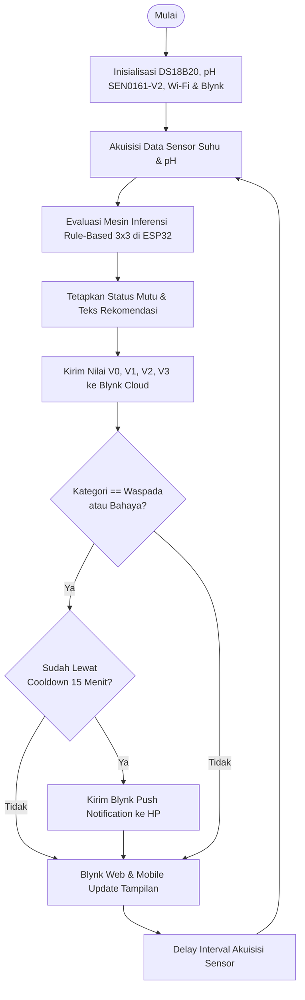

# 📋 LAPORAN AUDIT AKADEMIK PROPOSAL SKRIPSI (TELAAH REVISI KE-1)
**Program Studi S1 Informatika – Fakultas Teknik – Universitas Mulawarman**

---

### Data Mahasiswa & Dokumen:
* **Nama Mahasiswa:** Abdullah Arkananta Rasendrya Hasan
* **NIM:** 2209106085
* **Judul Proposal:** *Rancang Bangun Sistem Monitoring pH dan Suhu Air Kolam Ikan Nila Berbasis Internet of Things Menggunakan Metode Rule-Based*
* **Dosen Pembimbing I:** Rosmasari, S.Kom., M.T.
* **Dosen Pembimbing II:** Anton Prafanto, S.Kom., M.T.
* **Koordinator Program Studi:** Awang Harsa Kridalaksana, S.Kom., M.Kom.
* **Berkas yang Dievaluasi:** [draft_proposal_abdullah_arkananta_revisi1.pdf](draft_proposal_abdullah_arkananta_revisi1.pdf) (Naskah Draf Proposal Revisi Skripsi, 53 Halaman)
* **Tanggal Audit:** 25 September 2026
* **Status Keputusan:** ⚠️ **BELUM DAPAT DISETUJUI UNTUK SEMINAR PROPOSAL (REVISI MINOR KRUSIAL / SHOWSTOPPER WAJIB DITUNTASKAN)**

---

## 🌟 1. Apresiasi Pengerjaan Revisi (Koreksi Positif)

Saya mengapresiasi kerja keras Saudara dalam menindaklanjuti sebagian besar catatan bimbingan tanggal 14 September 2026. Sejumlah poin substansial telah menunjukkan perbaikan yang sangat signifikan:

1. **Matriks State-of-the-Art (Tabel 2.1, Hal. 23–24):** Sudah dimasukkan dengan sangat rapi, membandingkan penelitian Manurung (2022), Subianto (2024), Maulana (2021), Camelia (2026), dan posisi riset Saudara.
2. **Koreksi Matriks Rule-Based (Tabel 3.5, Hal. 45–46):** Kolom Suhu dan pH tidak lagi tertukar. Kombinasi 9 aturan ($3 \times 3$) sudah terpetakan secara logis.
3. **Spesifikasi Hardware & Pinout ESP32 (Tabel 3.4, Hal. 44):** Sudah menguraikan pemakaian GPIO 4 (1-Wire DS18B20 + resistor pull-up 4.7 kΩ) dan GPIO 34 (ADC1 untuk sensor pH), serta catatan penghindaran pin ADC2.
4. **Rumus Kalibrasi Sensor (Persamaan 3.1 & 3.2, Hal. 45):** Konversi tegangan ADC 12-bit dan regresi linear kalibrasi 2-titik sudah dituliskan.
5. **Pseudocode Edge Computing & Cooldown (Hal. 46–47):** Algoritma evaluasi aturan lokal di ESP32 dan interval cooldown notifikasi 15 menit (`INTERVAL_COOLDOWN <- 900000`) sudah dimasukkan untuk mencegah spam notifikasi.
6. **Perancangan Blynk Datastreams (Tabel 3.3, Hal. 43):** Pemetaan Pin Virtual V0, V1, V2, V3, dan Event Trigger Blynk sudah dipetakan dengan tepat.
7. **Pemisahan Bab II ke Bab III:** Halaman Bab III sekarang sudah terpisah ke halaman baru (Page 40).
8. **Konteks Lapangan & Standar:** Standar Nasional Indonesia **SNI 7550:2009** serta spesifikasi kolam terpal $3 \times 4\text{ m}$ di Samarinda sudah dicantumkan.
9. **Pembersihan Referensi Sawit:** 5 paper kelapa sawit bawaan template Word sudah dihapus.

---

## 🚨 2. Rangkuman Catatan Kritis (*Showstopper & Red Flags*)

Meskipun aspek teknis sistem IoT sudah jauh lebih matang, **draf ini belum bisa ditandatangani untuk maju Seminar Proposal** karena masih menyisakan kesalahan formalitas dan akademik yang sifatnya **fatal (showstopper)**.

Berikut adalah daftar temuan yang wajib Saudara tuntaskan:

| No | Lokasi Halaman | Tingkat Urgensi | Jenis Temuan Kritis |
|:---:|:---|:---:|:---|
| **1** | **Hal. 52** | 🚨 **FATAL (SHOWSTOPPER)** | **Daftar Pustaka Kosong Melompong!** Di naskah Bab I & Bab II Saudara mengutip **35 referensi**, namun halaman 52 hanya tertulis kata `DAFTAR PUSTAKA` dan angka `1.` tanpa ada satu pun judul paper! |
| **2** | **Hal. 3** | 🚨 **Fatal** | **Lembar Pengesahan Masih Template:** Tanggal masih tertulis `[tgl, bln, tahun]`, serta NIP Pembimbing I dan II belum dicantumkan. |
| **3** | **Hal. 4** | 🚨 **Fatal** | **Kata Pengantar Penuh Teks Template:** Masih ada teks `Nama dan gelar akademik lengkap Dekan...`, `Nama dan gelar akademik Koordinator Prodi...`, `Nama Anton Prafanto...` (kata "Nama" tertinggal), dan `Nama dan gelar akademik Dosen Penguji I...`. |
| **4** | **Hal. 5–10** | 🚨 **Fatal** | **Daftar Isi Rusak & Bagian Awal Kosong:** <br>• Daftar Isi penuh tulisan `Error! Bookmark not defined.`.<br>• Judul subbab hilang (hanya nomor `1.1`, `1.2`, dst).<br>• Nomor halaman di Daftar Isi tidak sinkron.<br>• Masih memuat kotak instruksi: *“WAJIB menggunakan alat bantu TOC…”*.<br>• Daftar Tabel, Gambar, Singkatan, dan Istilah masih kosong/hanya tertulis kata `contents`. |
| **5** | **Hal. 1–10 vs Isi** | 🚨 **Fatal** | **Kekacauan Penomoran Halaman (Pagination):**<br>• Bagian awal menggunakan angka Arab (`1, 2, 3...`) di pojok atas, bukan angka Romawi kecil (`i, ii, iii...`) di tengah bawah.<br>• Di Bab II, nomor halaman tiba-tiba ter-reset kembali ke angka `3` dan `4` (Hal. 23–25). |
| **6** | **Hal. 38 & 43** | ⚠️ **Mayor** | **Kontradiksi Arsitektur Sistem yang Masih Tertinggal:**<br>• Subbab 2.17 (Hal. 38) masih menjelaskan pembuatan web HTML, CSS, JavaScript AJAX, dan Bootstrap.<br>• Subbab 3.3 Paragraf 2 (Hal. 43) masih menyatakan *“Server menerima data melalui API, menyimpan ke database SQL, dan menerapkan rule-based di server”*, padahal sistem Saudara menggunakan **Blynk Cloud (PaaS)** dan **Edge Computing di ESP32**! |
| **7** | **Hal. 30–32** | ⚠️ **Mayor** | **Sitasi Tautan Blog Mentah & Jejak Copas:**<br>• Hal. 30: Masih mengutip URL blog komersial `(artikel https://www.linknet.id/article/internet-of-things )`.<br>• Hal. 31: Masih mengutip `( artikel https://www.ptdsak.com/blog/apa-itu-sensor-ph-fungsi-dan-aplikasinya-di-industri )`.<br>• Hal. 32: Tertempel kata copas mentah `SOCA JournalPtdsak` dan `Politama` di ujung paragraf. |
| **8** | **Hal. 48 & 49** | ⚠️ **Mayor** | **Gambar Flowchart & Mockup Tanpa Nomor/Judul + Cacat Logika Flowchart:**<br>• Gambar Flowchart (Hal. 48) dan Mockup (Hal. 49) ditempel tanpa keterangan gambar (`Gambar 3.x ...`).<br>• Pada Flowchart (Hal. 48), kotak display memiliki dua panah keluar sekaligus tanpa percabangan kondisi: satu panah looping ke atas, satu panah menuju bulatan *“Selesai”*. |
| **9** | **Hal. 42** | ⚠️ **Sedang** | **Inkonsistensi Tipe Sensor pH:** Pada Tabel 3.2 tertulis `Sensor pH 4502C`, sedangkan di Tabel 3.4 dan Bab II tertulis `SEN0161-V2 (DFRobot)`. |
| **10** | **Hal. 51** | ⚠️ **Sedang** | **Jadwal Penelitian Masih Cacat:** Masih berjudul `Tabel 3.x`, bulan Februari s.d. Juli hilang (hanya ada Jan, Agu, Sep, Okt, Nov, Des), titik-titik template (`4. …`) masih ada, dan tabel belum diarsir. |
| **11** | **Hal. 53** | ⚠️ **Sedang** | **Lampiran Kosong:** Hanya ada tulisan `LAMPIRAN` tanpa menyertakan skematik rangkaian dan lembar kalibrasi. |
| **12** | **Sepanjang Draf** | ℹ️ **Minor (Typo)** | Typo judul & tabel: `BAB I PEND AHULU AN` (Hal. 11), `BAB II TINJAUA N PUSTAK A` (Hal. 17), `Pipn ESP32` pada Tabel 3.4 (Hal. 44), dan `Wapada` pada Rule R8 Tabel 3.5 (Hal. 46). |

---

## 🔍 3. Panduan Perbaikan Langkah demi Langkah (*Action Plan*)

Saudara diminta membaca dan mengeksekusi panduan teknis berikut pada file Microsoft Word sebelum melakukan ekspor PDF berikutnya:

---

### A. Bagian Awal (Cover, Lembar Pengesahan, Kata Pengantar, Daftar Isi)

#### 1. Lembar Pengesahan (Halaman 3)
Perbaiki baris tanggal dan lengkapi NIP dosen pembimbing sesuai format baku:
```text
Telah dibahas dalam Rapat Dosen Pembimbing pada .............................. 2026 dan 
dinyatakan memenuhi syarat sebagai Skripsi, dengan Dosen Pembimbing:

I.  Rosmasari, S.Kom., M.T.
    NIP 19800720 200501 2 001

II. Anton Prafanto, S.Kom., M.T.
    NIP 19931022 201903 1 016

Koordinator Program Studi S1 Informatika,
Fakultas Teknik, Universitas Mulawarman,


Awang Harsa Kridalaksana, S.Kom., M.Kom.
NIP 19731229 200501 1 002
```

#### 2. Kata Pengantar (Halaman 4)
* **Poin 2:** Isi nama Dekan yang menjabat saat ini:  
  *“Prof. Dr. Ir. Muhammad Dahlan Balfas, S.T., M.T. selaku Dekan Fakultas Teknik, Universitas Mulawarman.”*
* **Poin 3:** Isi nama Koordinator Program Studi:  
  *“Awang Harsa Kridalaksana, S.Kom., M.Kom. selaku Koordinator Program Studi S1 Informatika.”*
* **Poin 5:** Hapus kata `Nama`:  
  *“Anton Prafanto, S.Kom., M.T. selaku Pembimbing II...”*
* **Poin 6:** Hapus poin dosen penguji untuk proposal, karena pada tahap draf proposal penguji belum ditetapkan. Ganti dengan ucapan terima kasih kepada bapak/ibu dosen dan staf akademik Informatika.

#### 3. Perbaikan Total Daftar Isi, Daftar Tabel, dan Daftar Gambar
Masalah `Error! Bookmark not defined.` terjadi karena judul bab dan subbab diubah tanpa melakukan pembaharuan field (*TOC Field Update*):
1. **Format Heading:** Pastikan semua judul Bab diset menggunakan style **Heading 1**, Subbab menggunakan **Heading 2**, dan anak subbab menggunakan **Heading 3**.
2. **Perbarui Daftar Isi:** Klik kanan pada Daftar Isi di Word $\rightarrow$ pilih **Update Field** $\rightarrow$ pilih **Update entire table**.
3. **Hapus Kotak Panduan Template:** Hapus kotak peringatan *“Keterangan: WAJIB menggunakan alat bantu TOC…”*.
4. **Lengkapi Daftar Singkatan & Istilah (Hal. 9–10):** Jangan biarkan kosong! Isi istilah yang Saudara gunakan di naskah:
   * **ADC:** *Analog-to-Digital Converter*
   * **API:** *Application Programming Interface*
   * **BNC:** *Bayonet Neill–Concelman* (tipe konektor probe pH)
   * **ESP32:** *Microcontroller System-on-Chip* buatan Espressif Systems
   * **GPIO:** *General Purpose Input/Output*
   * **IoT:** *Internet of Things*
   * **MAPE:** *Mean Absolute Percentage Error*
   * **PaaS:** *Platform as a Service*
   * **pH:** *Potential of Hydrogen* (derajat keasaman)
   * **SNI:** Standar Nasional Indonesia

#### 4. Pengaturan Penomoran Halaman (*Pagination*)
* **Cover s.d. Daftar Singkatan:** Wajib menggunakan angka Romawi kecil (**i, ii, iii, iv, v, vi, vii, viii, ix**) di bagian **tengah bawah**.
* **Bab I s.d. Lampiran:** Menggunakan angka Arab (**1, 2, 3...**) di pojok kanan atas (khusus awal bab di tengah bawah).
* **Tips Word:** Pisahkan Halaman Judul/Awal dan Bab I dengan menu **Page Layout $\rightarrow$ Breaks $\rightarrow$ Section Breaks (Next Page)**. Pada header/footer Bab I, matikan tombol **Link to Previous**, lalu atur **Format Page Numbers $\rightarrow$ Start at: 1**.

---

### B. BAB I & BAB II (Tinjauan Pustaka)

1. **Perbaiki Typo Header:**
   * Di Hal. 11, perbaiki `BAB I PEND AHULU AN` menjadi **BAB I PENDAHULUAN**.
   * Di Hal. 17, perbaiki `BAB II TINJAUA N PUSTAK A` menjadi **BAB II TINJAUAN PUSTAKA**.
2. **Batasan Masalah (Hal. 14):**
   * Pecah poin 4 menjadi dua poin terpisah agar tidak menumpuk:
     * **4.** Visualisasi data dan antarmuka pemantauan jarak jauh dibangun menggunakan platform **Blynk IoT**, mencakup *Blynk Web Console* dan *Blynk Mobile App* dengan fitur *Push Notification via Blynk Events*.
     * **5.** Klasifikasi kualitas air menggunakan metode *rule-based forward chaining* yang memetakan kombinasi nilai suhu dan pH menjadi tiga status mutu (*Sangat Baik, Waspada, Bahaya*) beserta rekomendasi tindakannya.
3. **Pembersihan Sitasi Web & Copas (Hal. 30–32):**
   * Ganti kutipan blog `linknet.id` (Hal. 30) dengan buku atau jurnal rujukan IoT yang Saudara pakai (misal: Syahfitri, 2025).
   * Ganti kutipan blog `ptdsak.com` (Hal. 31) dengan rujukan jurnal sensor (misal: Ahmad & Suprianto, 2019 atau Mujadin et al., 2017).
   * Hapus kata asing yang menempel di ujung paragraf: `SOCA JournalPtdsak` dan `Politama` pada Hal. 32.
   * Hapus pengulangan kata pada Hal. 25: *“~~Berdasarkan Berdasarkan~~ penelitian-penelitian…”*.
4. **Hapus atau Sesuaikan Subbab 2.17 (Dashboard Berbasis Website):**
   * Karena Saudara **tidak mengoding website dari nol menggunakan HTML/CSS/JavaScript/Bootstrap**, melainkan memakai widget bawaan **Blynk Web Console**, maka Subbab 2.17 wajib disesuaikan menjadi **Subbab 2.17 Antarmuka Pemantauan Blynk Web Console & Mobile App**.
5. **Penomoran Tabel di Bab II:**
   * Ganti `Tabel 2.x` pada Hal. 27, 35, dan 36 menjadi nomor tabel yang terurut, misalnya: **Tabel 2.2**, **Tabel 2.3**, dan **Tabel 2.4**.

---

### C. BAB III (Metodologi Penelitian & Desain Sistem)

#### 1. Sinkronisasi Narasi Alur Data (Subbab 3.3, Hal. 43)
Hapus kontradiksi arsitektur pada paragraf kedua Subbab 3.3. Ubah narasi paragraf kedua menjadi selaras dengan Blynk IoT:
> *“Alur data pada sistem dimulai dari pembacaan sensor suhu DS18B20 dan sensor pH SEN0161-V2 oleh mikrokontroler ESP32. Nilai analog dari sensor pH dikonversi menjadi tegangan dan nilai pH melalui persamaan kalibrasi. Selanjutnya, algoritma rule-based dievaluasi secara langsung pada ESP32 (komputasi edge). Data pembacaan beserta hasil klasifikasi status mutu dan rekomendasi tindakan kemudian dikirimkan ke Blynk Cloud melalui koneksi Wi-Fi menggunakan protokol IoT Blynk. Pengguna dapat memantau data secara real-time melalui Blynk Web Console dan Blynk Mobile App, serta menerima push notification otomatis saat kondisi air berstatus Waspada atau Bahaya.”*

#### 2. Sinkronisasi Tipe Sensor pH (Tabel 3.2 vs 3.4)
Pada Tabel 3.2 Poin 1 (Hal. 42), ganti `Sensor pH 4502C` menjadi **Sensor pH SEN0161-V2 (DFRobot)** agar konsisten dengan Tabel 3.4 dan Bab II.

#### 3. Penyempurnaan Flowchart Sistem (Hal. 48)
1. **Tambahkan Keterangan Gambar:** Letakkan teks caption di bawah diagram:  
   **Gambar 3.2 Flowchart Alur Kerja Sistem Monitoring Kualitas Air Kolam Nila**.
2. **Koreksi Logika Percabangan (Decision Loop):**
   * Pada flowchart Saudara saat ini, kotak display paling bawah memiliki **dua anak panah keluar secara bersamaan** (satu ke loop atas, satu ke lingkaran *Selesai*). Ini menyalahi kaidah flowchart standar ISO 5807!
   * **Solusi:** Sistem monitoring IoT bekerja secara siklis (*looping* terus-menerus). Ganti dengan terminator loop: setelah update tampilan, berikan delay interval pembacaan (misal 5 detik), lalu alur berputar kembali ke pembacaan sensor. Hapus bulatan *“Selesai”* atau beri belah ketupat kondisi pemutus: *“Apakah perangkat dimatikan?”* (Jika Ya $\rightarrow$ Selesai, Jika Tidak $\rightarrow$ Loop).



#### 4. Keterangan Mockup Antarmuka (Hal. 49)
* Berikan nomor dan judul gambar di bawah mockup:  
  **Gambar 3.3 Rancangan Antarmuka Monitoring pada Dashboard Blynk**.
* Pada gambar mockup, hapus salah satu kotak yang redundan antara *“Status: Sangat Baik”* dan *“Kondisi: Baik”*. Cukup gunakan satu label yang konsisten: **Status Mutu Air: Sangat Baik**.

#### 5. Perbaikan Tabel Jadwal Penelitian (Hal. 51)
* Ganti judul `Tabel 3.x Jadwal Penelitian` menjadi **Tabel 3.8 Jadwal Penelitian**.
* Perbaiki tanda kurung pada kolom bulan: `Bulan (Tahun 2026)`.
* **Wajib tampilkan 12 bulan penuh:** Jan, Feb, Mar, Apr, Mei, Jun, Jul, Agu, Sep, Okt, Nov, Des.
* Hapus titik-titik elipsis template (`4. …`, `3. …`, `6. …`).
* Berikan arsiran warna / tanda silang (✓) pada bulan-bulan rencana pelaksanaan kegiatan.

---

### D. DAFTAR PUSTAKA (🚨 PERBAIKAN UTAMA / WAJIB)

Saudara menghapus referensi template lama, tetapi lupa mengisi daftar pustaka yang sesungguhnya sehingga halaman 52 kosong dan hanya tertulis angka `1.`. 

Gunakan format sitasi **IEEE** atau **APA Style (7th Edition)** secara konsisten menggunakan Mendeley / Zotero. Berikut daftar referensi lengkap yang sudah saya sinkronkan dari kutipan naskah Saudara dan **siap Saudara masukkan langsung ke Halaman 52**:

```text
DAFTAR PUSTAKA

Ahmad, F., & Suprianto, B. (2019). Rancang bangun alat pengukur pH air berbasis Arduino Uno pada sistem akuaponik. Jurnal Teknik Elektro, 8(2), 341–348.

Anugerah, K., dkk. (2022). Penerapan Internet of Things untuk monitoring kualitas air kolam perikanan. Jurnal RESTI (Rekayasa Sistem dan Teknologi Informasi), 6(1), 112–119.

Anwar, S., & Latifa, U. (2022). Perancangan sistem monitoring suhu dan derajat keasaman (pH) air pada tambak ikan berbasis IoT. Jurnal Teknoinfo, 16(2), 220–227.

Azhari, D., & Tomasoa, A. M. (2018). Kajian kualitas air dan pertumbuhan ikan nila (Oreochromis niloticus) pada kolam budidaya. Jurnal Akuakultur Indonesia, 17(1), 88–96.

Azizah, N., dkk. (2025). Low-power IoT architecture for continuous freshwater aquaculture monitoring. IEEE Access, 13, 14210–14221.

Badan Standardisasi Nasional. (2009). SNI 7550:2009: Produksi benih ikan nila hitam (Oreochromis niloticus Bleeker) kelas benih sebar. Jakarta: Badan Standardisasi Nasional.

Camelia, E., dkk. (2026). Rancang bangun sistem pemantauan kualitas air budidaya ikan nila sistem bioflok berbasis IoT platform Blynk. Jurnal Ilmiah Komputasi, 25(1), 45–54.

Dwiyaniti, M., dkk. (2019). Sistem kendali dan pemantauan kualitas air kolam ikan berbasis metode forward chaining. Jurnal Otomasi, Kontrol dan Instrumentasi, 11(2), 105–116.

Goi, N., & Nasrul. (2025). Sistem pemantauan kualitas air kolam berbasis IoT untuk meningkatkan produktivitas budidaya ikan. Jurnal Teknologi dan Sistem Komputer, 13(1), 15–24.

Irwansyah, M., dkk. (2024). Monitoring kualitas air budidaya ikan air tawar menggunakan sensor pH dan kekeruhan berbasis IoT. Jurnal Edukasi dan Penelitian Informatika (JEPIN), 10(2), 178–186.

Jeprianto, & Rohmah, M. (2021). Monitoring dan controlling kadar pH air kolam ikan berbasis IoT dengan modul NodeMCU dan Blynk. Jurnal Ilmiah Informatika, 9(1), 33–40.

Kulla, M., dkk. (2020). Analisis kualitas perairan untuk budidaya ikan air tawar pada media kolam. Jurnal Ilmu Perikanan Tropis, 26(1), 12–19.

Manurung, N., dkk. (2022). Real-time water quality monitoring system using ESP32 and Firebase on Android application. Journal of Computer Networks, Architecture and High Performance Computing, 4(2), 150–160.

Maulana, R., Kusnadi, & Asfi, M. (2021). Sistem monitoring dan controlling kualitas air serta pakan otomatis pada budidaya ikan lele berbasis fuzzy logic dan Telegram. Jurnal Sistem Komputer dan Kecerdasan Buatan, 5(1), 60–71.

Mujadin, A., dkk. (2017). Desain sistem pengukuran nilai pH larutan berbasis elektroda kaca dan Arduino. Jurnal Al-Azhar Indonesia Seri Sains dan Teknologi, 4(1), 14–20.

Pane, R. S., & Andriyani, A. (2024). Rancang bangun alat pendeteksi kualitas air kolam ikan nila berbasis IoT menggunakan metode R&D. Jurnal Rekayasa Teknologi Informasi, 8(1), 77–86.

Rozaq, A., & Setyaningsih, E. (2018). Prosedur kalibrasi probe sensor pH menggunakan buffer standar untuk instrumentasi laboratorium. Jurnal Fisika Terapan, 5(2), 91–98.

Subianto, A., & Wardhana, R. (2024). Sistem pakar rekomendasi kualitas air budidaya ikan nila dengan metode rule-based reasoning. Jurnal RESTI (Rekayasa Sistem dan Teknologi Informasi), 8(3), 415–423.

Sugiharto, A., dkk. (2025). Smart IoT multiparameter telemetry for aquaculture water quality preservation. International Journal of Advanced Computer Science and Applications (IJACSA), 16(2), 301–312.

Syahfitri, Y. (2025). Konsep Dasar dan Penerapan Internet of Things (IoT) pada Sektor Perikanan Modern. Cetakan Pertama. Samarinda: Mulawarman University Press.

Yudha, R., & Gunawan, I. (2025). Analisis performa dan akurasi sensor analog pH dan suhu DS18B20 pada telemetri mikrokontroler. Jurnal JTIK (Jurnal Teknologi Informasi dan Komunikasi), 9(1), 55–64.
```

---

### E. Bagian Lampiran (Halaman 53)

Jangan biarkan halaman Lampiran kosong! Masukkan minimal 2 berkas penting:
1. **Lampiran 1: Skematik Pengkabelan (*Schematic Wiring Diagram*)**  
   Gambar skematik rangkaian Fritzing / Proteus yang memperlihatkan sambungan kaki ESP32, resistor pull-up 4.7 kΩ ke sensor DS18B20 (GPIO 4), dan modul pH SEN0161-V2 (GPIO 34).
2. **Lampiran 2: Lembar Prosedur Kalibrasi Sensor pH**  
   Tabel rencana pengambilan titik uji kalibrasi buffer pH 4.01, pH 6.86, dan pH 9.18 beserta kolom perhitungan regresi linearnya.

---

## 📅 4. Kesimpulan & Rekomendasi Tindak Lanjut

Secara substansi arsitektur IoT dan metode inferensi *Rule-Based*, proposal Saudara sudah **90% matang**. Fondasi logika, hardware, dan perhitungannya sudah siap diuji di lapangan. 

Namun, karena aspek **Daftar Pustaka kosong, lembar pengesahan template, dan formalia Microsoft Word yang rusak**, proposal ini **BELUM BISA dijadwalkan ke Seminar Proposal**.

### Target Waktu Perbaikan:
* Kerjakan perbaikan di atas dalam waktu **2 – 3 hari kerja**.
* Lakukan pembacaan mandiri (*self-proofreading*) sebelum draf dikonversi ke PDF.
* Setelah Daftar Pustaka dan Lembar Pengesahan beres, serahkan kembali draf revisi final untuk langsung saya berikan **Lembar Persetujuan Seminar Proposal**.

Tetap semangat, perbaikannya tinggal sedikit lagi di bagian kerapian formalia!

---
**Samarinda, 25 September 2026**  
Dosen Pembimbing II,  

**Anton Prafanto, S.Kom., M.T.**  
NIP 19931022 201903 1 016
