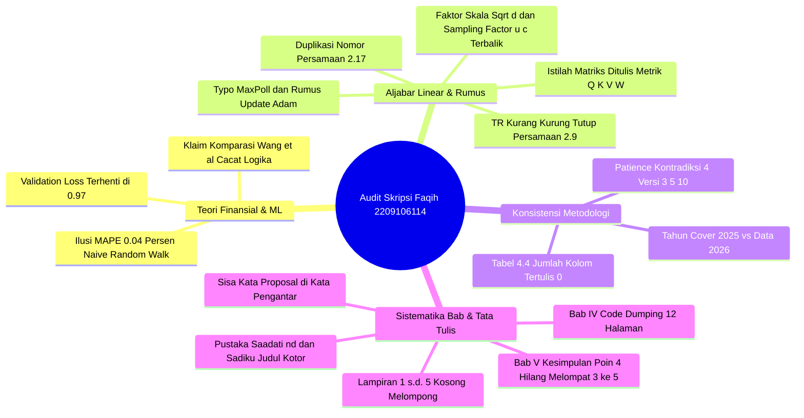

# 📋 LAPORAN AUDIT AKADEMIK FORENSIK & EVALUASI SIDANG PENDADARAN SKRIPSI

**Mahasiswa Bimbingan:** Muhammad Faqih Ajiputra  
**NIM:** 2209106114  
**Program Studi:** S1 Informatika, Fakultas Teknik, Universitas Mulawarman  
**Dosen Pembimbing I:** Rosmasari, S.Kom., M.T. (NIP: 198509212019032017)  
**Dosen Pembimbing II:** Prof. Dr. Fahrul Agus, S.Si., M.T. (NIP: 196909261994121002)  
**Koordinator Program Studi:** Awang Harsa Kridalaksana, S.Kom., M.Kom. (NIP: 19731229 200501 1 002)  
**Judul Naskah:** *Long Sequence Time-Series Forecasting pada Pasar Valuta Asing EUR/USD Menggunakan Model Informer*  
**Dokumen yang Diaudit:** `C:\Users\anton\Downloads\2209106114_hasil.pdf` (114 Halaman / 95 Halaman Bernomor Arab)  
**Tanggal Evaluasi:** 29 September 2026  
**Status Evaluasi:** **DRAF SKRIPSI LENGKAP (SEMINAR HASIL / SIDANG PENDADARAN) — REVISI MAYOR SEBELUM DIJADWALKAN UJIAN**

---

> [!NOTE]
> **Catatan Tim Pembimbing / Penilai Akademik:** Dokumen audit forensik ini disusun untuk menelaah secara menyeluruh naskah draf skripsi lengkap (114 halaman) Saudara Muhammad Faqih Ajiputra. Evaluasi mencakup keabsahan pemodelan *Deep Learning*, integritas matematika dan aljabar linear, validitas empiris klaim akurasi finansial, konsistensi parameter pelatihan lintas bab, serta kepatuhan mutlak terhadap Buku Pedoman Penulisan Skripsi FT Universitas Mulawarman (Update Mei 2025).

---

## 🌟 1. Resume Evaluasi Akademik Umum & Nilai Positif Riset

Secara substansi rekayasa perangkat lunak dan komputasi cerdas, penelitian yang dilakukan oleh Saudara **Muhammad Faqih Ajiputra (NIM: 2209106114)** tergolong sangat ambisius dan memiliki bobot keilmuan Informatika yang tinggi:

### Aspek Positif yang Patut Diapresiasi:
1. **Adopsi Arsitektur State-of-the-Art:** Mengimplementasikan model **Informer** berbasis *ProbSparse Self-Attention* dan *Distilling Mechanism* (Zhou et al., 2021) menggunakan framework PyTorch untuk mengatasi kendala kompleksitas kuadratik $O(L^2)$ pada *Long Sequence Time-Series Forecasting* (LSTF).
2. **Eksperimen Komprehensif (12 Skenario):** Menguji variasi panjang urutan masukan (*Lookback Window*: 48, 96, 192, 384 jam) dan horizon peramalan (*Prediction Length*: 1, 4, 8 jam ke depan) secara terstruktur.
3. **Penerapan Transformasi Stasioneritas:** Menggunakan target *Log Return* yang distandarisasi untuk menjamin kestabilan gradien, kemudian merekonstruksinya kembali ke skala harga *Close* riil via fungsi eksponensial kumulatif.
4. **Volume Dataset Riil Masif:** Mengolah 95.544 baris data transaksi per jam EUR/USD (rentang 2010–2026) dengan fitur teknikal RSI-14 dan ATR-14.

Namun demikian, audit forensik mendalam menemukan **12 Kelemahan Kritis (*12 Critical Red Flags*)**. Yang paling berbahaya adalah **terjebaknya mahasiswa dalam Ilusi Akurasi Log Return (Naive Persistence Trap)**—di mana nilai MAPE 0,04% dibanggakan sebagai keunggulan Informer, padahal secara matematis model hanya menebak harga sama dengan jam sebelumnya (*random walk*). Selain itu, terdapat kekeliruan fatal penulisan istilah **"Metrik" alih-alih "Matriks"** pada tensor aljabar linear, kontradiksi parameter *patience*, penghilangan poin kesimpulan Bab V, serta **pemuatan 12 halaman screenshot source code di Bab IV sementara lembar lampiran dibiarkan kosong melompong**.

---

## 🚨 2. Rangkuman 12 Temuan Kritis (*12 Critical Red Flags*)



---

### Tabel Ringkasan Temuan Kritis:

| No | Kategori | Tingkat Urgensi | Lokasi (Hal.) | Deskripsi Temuan Kritis |
| :---: | :--- | :---: | :---: | :--- |
| **1** | **Teori ML Finansial** | 🚨 **Sangat Fatal** | Hal. 74–79 (PDF 93–98) | **Ilusi Akurasi & Jebakan Naive Persistence Model:** Model memprediksi log return ≈ 0, sehingga saat direkonstruksi *P̂_{t+h} = P_t · e⁰ = P_t*. MAPE 0,04% bukan bukti kehebatan Informer, melainkan volatilitas EUR/USD per jam memang hanya ≈ 0,05%. Model berperilaku persis seperti *Random Walk*! |
| **2** | **Aljabar Linear** | 🚨 **Sangat Fatal** | Hal. 24–31 (PDF 43–50) | **Kekeliruan Konsep Fatal: Istilah "Matriks" Ditulis "Metrik/Metriks":** Mahasiswa menyebut tensor *Q*, *K*, *V*, bobot transformasi *W*₁, *W*₂, dan proyeksi *W*_proj sebagai *"metrik query"*, *"metrik key"*, *"metriks attention"*. Mengacaukan struktur data aljabar linear dengan ukuran evaluasi. |
| **3** | **Konsistensi Parameter** | ⚠️ **Mayor (Kritis)** | Hal. 46, 47, 70, 71 (PDF 65, 66, 89, 90) | **Kontradiksi Nilai Early Stopping Patience (4 Versi):**<br>• Tabel 3.3 menyatakan Patience = 5.<br>• Teks Hal. 47 menyatakan Patience = 10.<br>• Tabel 4.8 menyatakan Patience = 5.<br>• Gambar 4.12 (kode) menetapkan default patience = 3. |
| **4** | **Integritas Komparasi** | ⚠️ **Mayor** | Hal. 81 (PDF 100) | **Klaim Keunggulan Tidak Valid terhadap Wang et al. (2021):** Mahasiswa mengklaim Informer lebih baik 76,9% dari Wang et al., padahal Wang menguji USD/CNY (mata uang terikat/managed peg) dengan memprediksi harga nominal langsung, bukan log return EUR/USD. |
| **5** | **Tata Letak Bab IV** | ⚠️ **Mayor** | Hal. 63–74 (PDF 82–93) | **Pelanggaran Format Baku (Code Dumping di Bab IV):** Memuat 10 gambar tangkapan layar kode Python (Gambar 4.3 s.d. 4.13) yang memakan 12 halaman Bab IV, sedangkan halaman Lampiran (Hal. 93–95) dibiarkan kosong melompong. |
| **6** | **Validasi Data** | ⚠️ **Mayor** | Hal. 54 (PDF 73) | **Tabel 4.4 Rusak / Bernilai Nol:** Baris *Jumlah Kolom* pada Tabel 4.4 tertulis: `Data Mentah = 0`, `Data Terproses = 0`. Padahal narasi menyebut 6 kolom mentah dan 9 kolom terproses. |
| **7** | **Logika Kesimpulan** | ⚠️ **Mayor** | Hal. 87–88 (PDF 106–107) | **Nomor Kesimpulan Melompat (Poin 4 Lenyap):** Pada Subbab 5.1, urutan penomoran butir kesimpulan langsung melompat dari butir 3 ke butir 5. Poin nomor 4 hilang. |
| **8** | **Kronologi Naskah** | ⚠️ **Sedang** | Cover & Hal. 54 | **Anakronisme Tahun Naskah:** Halaman Sampul tertulis tahun `2025`, tetapi pada Tabel 4.4 dan Bab V disebutkan rentang data transaksi EUR/USD ditarik hingga tanggal `17 April 2026`. Tahun cover harus disinkronkan ke 2026. |
| **9** | **Artefak Proposal** | ⚠️ **Sedang** | Hal. vii (PDF 8) | **Teks Draf Proposal Tertinggal di Kata Pengantar:** Tertulis: *"...menyelesaikan proposal skripsi..."* dan *"...Proposal ini disusun sebagai salah satu tahapan..."*. Mahasiswa lupa mengganti kata proposal menjadi skripsi. |
| **10** | **Notasi Matematika** | ⚠️ **Sedang** | Hal. 20, 24, 25, 27, 28, 34 | **6 Kesalahan Rumus Matematis di Bab II:**<br>1. Persamaan 2.9 (True Range) kurang kurung tutup.<br>2. Persamaan 2.11 (*u* = *c* ln *L*_Q) penjelasan *u* dan *c* terbalik.<br>3. Persamaan 2.12 √*d* disebut dimensi, bukan scaling factor.<br>4. Persamaan 2.14 typo `MaxPoll`.<br>5. Duplikasi nomor Persamaan 2.17.<br>6. Persamaan 2.27 (Adam) salah simbol penyebut. |
| **11** | **Tipografi Formalia** | ⚠️ **Sedang** | Hal. iii, v, vi (PDF 4, 6, 7) | **Cacat Format Lembar Pengesahan & Titik Ganda:** Teks pengesahan Dekan menempel rusak: `NIP197002272000121001HALAMAN PERSEMBAHAN`; tanggal masih `Tgl Bln Tahun`; nama Pembimbing II di Abstrak tertulis `Prof. Dr.. Fahrul Agus` (titik ganda). |
| **12** | **Kualitas Pustaka** | ⚠️ **Sedang** | Hal. 90–92 (PDF 109–111) | **Metadata Referensi Cacat:** Ref 19 (*Saadati*) berstatus `(n.d.)` tanpa identitas penerbit; Ref 20 (*Sadiku*) judulnya tercemar lisensi Creative Commons; Ref 31 (*Zhou et al. AAAI 2021*) hanya ditulis `www.aaai.org` tanpa nama prosiding resmi. |

---

## 🔍 3. Bedah Forensik Bab demi Bab & Arahan Perbaikan

---

### 📄 A. Bagian Awal (Halaman Judul s.d. Daftar Istilah)

#### 1. Halaman Sampul (Cover Luar & Dalam, Hal. i–ii / PDF 1–2)
* **Hapus Teks Bawaan Template:** Di bagian atas cover luar dan dalam tertulis teks **`No. Urut Skripsi`**. Teks ini adalah penanda nomor inventaris perpustakaan yang baru diisi setelah lulus pendadaran dan jilid akhir. Hapus teks tersebut pada draf ujian.
* **Perbaiki Posisi Kata HALAMAN JUDUL:** Pada cover dalam (Hal. i), teks `HALAMAN JUDUL` menempel canggung di bawah judul skripsi. Hapus teks tersebut karena cover dalam cukup memuat keterangan pengajuan: *"Diajukan sebagai salah satu syarat..."*.
* **Sinkronisasi Tahun:** Ubah tahun pada cover dari `2025` menjadi `2026` agar sinkron dengan periode pengambilan data empiris (April 2026) dan titimangsa ujian.

#### 2. Pernyataan Keaslian & Lembar Pengesahan (Hal. ii–iii / PDF 3–4)
* **Pernyataan Keaslian (Hal. ii):**
  * Hapus placeholder `Samarinda, Tgl bln thn` $\rightarrow$ ganti tanggal definitif.
  * Hapus tulisan teks `Materai` $\rightarrow$ tempelkan materai fisik/elektronik Rp 10.000 yang ditandatangani basah/tersertifikasi.
  * Hapus singkatan `NIM.` pada nama $\rightarrow$ tulis langsung angka `2209106114` sesuai Pedoman FT Unmul.
* **Halaman Pengesahan (Hal. iii):**
  * Hapus teks sisipan `HALAMAN PENGESAHAN` di tengah-tengah lembar pengesahan.
  * Isi tanggal persetujuan pada kalimat: *"Telah diujikan pada [Tanggal Ujian] dan dinyatakan telah memenuhi syarat"*.
  * **Koreksi Teks Menempel Parah:** Di bagian tanda tangan Dekan tertulis:
    `NIP197002272000121001HALAMAN PERSEMBAHAN`
    Teks judul bab berikutnya bocor dan menempel di ujung NIP! Berikan spasi pada NIP: `NIP 19700227 200012 1 001`, dan pisahkan judul Halaman Persembahan menggunakan *Section Break (Next Page)*.

#### 3. Abstrak & Abstract (Hal. v–vi / PDF 6–7)
* **Koreksi Titik Ganda Nama Pembimbing II:** Pada header Abstrak dan Abstract, nama Pembimbing II tertulis: `Prof. Dr.. Fahrul Agus, S.Si., M.T.` (terdapat dua tanda titik setelah singkatan Dr). Hapus satu titik menjadi **Prof. Dr. Fahrul Agus, S.Si., M.T.**.
* **Header Borderless:** Pastikan informasi mahasiswa, prodi, dan pembimbing disusun dalam tabel 2 kolom tanpa garis tepi (*borderless table*) sesuai template Mei 2025.

#### 4. Kata Pengantar (Hal. vii / PDF 8)
* **Ganti Kata "Proposal" Menjadi "Skripsi":** Pada alinea 1 masih tertulis:
  > *"Puji syukur kepada Allah SWT... sehingga dapat menyelesaikan **proposal skripsi** dengan judul... **Proposal ini disusun** sebagai salah satu tahapan dalam menyelesaikan skripsi..."*
* Mahasiswa wajib mengganti seluruh frasa tersebut menjadi:
  > *"Puji syukur kepada Allah SWT... sehingga penulis dapat menyelesaikan **skripsi** dengan judul... **Skripsi ini disusun** sebagai salah satu syarat untuk menyelesaikan pendidikan strata satu..."*

#### 5. Daftar Lampiran & Daftar Istilah/Singkatan (Hal. xiii–xviii)
* **Daftar Lampiran (Hal. xiii):** Saat ini mencantumkan Lampiran 1 s.d. 5 pada halaman 93–95, namun lembar lampirannya kosong.
* **Daftar Istilah/Singkatan (Hal. xiv–xviii):** Hapus teks artefak Word `Contents` di bawah tajuk kolom `Arti`. Pastikan seluruh simbol matematika dan singkatan teknis didefinisikan secara baku.

---

### 📘 B. BAB I – Pendahuluan

#### 1. Pembenahan Header Halaman Awal Bab (Hal. 1 / PDF 20)
* Tertulis ganda:
  ```
  BAB I PENDAHULUAN
  PENDAHULUAN
  ```
* Hapus baris pengulangan `PENDAHULUAN` sehingga hanya tersisa satu tajuk bab resmi: **BAB I PENDAHULUAN**.

#### 2. Penajaman Latar Belakang & Motivasi Finansial
* Mahasiswa perlu menambahkan ulasan singkat mengenai sifat pasar mata uang *foreign exchange* (Forex) yang memiliki rasio *Signal-to-Noise* (SNR) sangat rendah dibandingkan deret waktu fisik (seperti konsumsi listrik atau cuaca pada paper asli Informer Zhou et al., 2021). Hal ini penting untuk membangun ekspektasi pembaca bahwa memprediksi *return* finansial jauh lebih sulit daripada memprediksi beban listrik.

---

### 📗 C. BAB II – Tinjauan Pustaka & Landasan Teori

#### 1. Koreksi Fatal Kerancuan Istilah: "Matriks" vs "Metrik" (Hal. 24–31)
Mahasiswa melakukan kesalahan fatal dengan menerjemahkan kata bahasa Inggris *Matrix* menjadi *Metrik*. Dalam ilmu komputer dan matematika:
* **Matriks (*Matrix*):** Susunan skalar dalam baris dan kolom (struktur data aljabar linear).
* **Metrik (*Metric*):** Ukuran kuantitatif untuk mengevaluasi kinerja (misalnya MAE, MSE, MAPE).

Mahasiswa **WAJIB MENGGANTI** seluruh kata berikut di Bab II:
* Hal. 24: `sparse query pada metrik Q` $\rightarrow$ **matriks Q**
* Hal. 24: `Q = Metrik query, KT = Metrik key, V = Metrik value` $\rightarrow$ **Matriks query, Matriks key, Matriks value**
* Hal. 28: `Weight dari metriks transformasi linear` $\rightarrow$ **matriks transformasi linear**
* Hal. 29: `skor metriks Attention dengan -∞` $\rightarrow$ **matriks Attention**
* Hal. 30: `Qde = Metriks query dari Decoder` $\rightarrow$ **Matriks query dari Decoder**
* Hal. 30: `Ken = Metriks key, Ven = Metriks value` $\rightarrow$ **Matriks key, Matriks value**
* Hal. 31: `Weight dari metriks yang dapat dipelajari` $\rightarrow$ **matriks pembobotan**

#### 2. Perbaikan 6 Kesalahan Rumus Matematis di Bab II
1. **Persamaan (2.9) Rumus True Range (Hal. 20):**
   * *Naskah:* $TR_t = \max(H_t - L_t, |H_t - C_{t-1}|, |L_t - C_{t-1}|$ (kurang kurung tutup).
   * *Koreksi:* Tambahkan tanda kurung penutup:

     $$TR_t = \max(H_t - L_t, |H_t - C_{t-1}|, |L_t - C_{t-1}|)$$

2. **Persamaan (2.11) Sparsity Informer (Hal. 24):**
   * *Naskah:* $u = c \cdot \ln L_Q$, keterangan teks: `u adalah sampling factor`.
   * *Koreksi:* Tukar penjelasan variabel! **$c$ adalah *sampling factor*** (faktor pengali konstan, misal $c=5$), sedangkan **$u$ adalah jumlah query aktif (*top-$u$ dominant queries*)** yang terpilih untuk dihitung skor *attention*-nya.
3. **Persamaan (2.12) & (2.21) Skala Attention (Hal. 24 & 30):**
   * *Naskah:* $\sqrt{d} =$ Dimensi vektor query/key.
   * *Koreksi:* $d$ atau $d_k$ adalah dimensi query/key, sedangkan **$\sqrt{d}$ adalah faktor penskalaan (*scaling factor*)** untuk mencegah dot-product bernilai terlalu besar yang dapat menyebabkan fungsi Softmax mengalami saturasi gradien (*vanishing gradient*).
4. **Persamaan (2.14) & (2.15) Distilling Layer (Hal. 25 & 26):**
   * *Naskah:* Tertulis `MaxPoll(ELU(Conv1d...))` dan `MaxPoll(x)_i`.
   * *Koreksi:* Perbaiki typo istilah menjadi **$\text{MaxPool}$** atau **$\text{MaxPooling}$** (menggunakan huruf 'o', bukan 'oll').
5. **Duplikasi Nomor Persamaan (2.17) (Hal. 27 & 28):**
   * Rumus Conv1d di Hal. 27 diberi label **(2.17)**, dan rumus FFN di Hal. 28 juga diberi label **(2.17)**.
   * *Koreksi:* Lakukan penomoran ulang secara berurutan (*renumbering*): rumus Conv1d menjadi (2.17), FFN menjadi (2.18), dan seterusnya hingga akhir bab.
6. **Persamaan (2.27) Optimizer Adam (Hal. 34):**
   * *Naskah Teks:* Tertulis `Berdasarkan persamaan 2. 7` $\rightarrow$ perbaiki menjadi **Persamaan 2.27**.
   * *Naskah Rumus:* Penyebut tertulis $\sqrt{v_t} + \epsilon$.
   * *Koreksi:* Gunakan estimasi momen kedua yang telah dikoreksi bias (*bias-corrected second moment*):

     $$\theta_t = \theta_{t-1} - \frac{\alpha \cdot \hat{m}_t}{\sqrt{\hat{v}_t} + \epsilon}$$

---

### 📙 D. BAB III – Metodologi Penelitian

#### 1. Sinkronisasi Mutlak Parameter *Early Stopping Patience* (Hal. 46–47 / PDF 65–66)
* Pada Tabel 3.3 (Hal. 46), mahasiswa menulis: `Early stopping Patience = 5`.
* Namun pada narasi Hal. 47 baris pertama, mahasiswa menulis:
  > *"mekanisme early stopping diterapkan dengan patience 10 untuk menghentikan pelatihan..."*
* **Koreksi Wajib:** Ubah angka 10 pada teks Hal. 47 menjadi **5**. Fakta empiris di Bab IV (Tabel 4.9) membuktikan model berhenti pada Epoch 6 dengan *best epoch* 1 ($6 - 1 = 5$), sehingga parameter yang benar-benar aktif saat komputasi adalah **5**.

#### 2. Penjelasan Pemisahan Data Walk-Forward / Time-Based Split
* Mahasiswa membagi data secara sekuensial (70% Train, 15% Validation, 15% Test). Tambahkan penegasan bahwa pembagian deret waktu **tidak menggunakan pengacakan acak (*no shuffling*)** untuk mencegah kebocoran data masa depan (*data leakage / lookahead bias*).

---

### 📊 E. BAB IV – Hasil dan Pembahasan (BAGIAN PALING KRITIS!)

#### 1. Pembongkaran "Ilusi Akurasi Log Return" & Jebakan Naive Persistence
Di Bab IV, mahasiswa membanggakan bahwa model Informer menghasilkan nilai MAPE yang sangat spektakuler: **0,0437% s.d. 0,0589%**.

> [!WARNING]
> **BAHAYA SIDANG PENDADARAN:** Penguji machine learning finansial akan langsung menyerang temuan ini:
> 1. Target pelatihan model adalah **Log Return yang distandarisasi** ($Mean = 0, Std = 1$).
> 2. Pada Tabel 4.9, *Validation Loss* terhenti pada **0,9685 s.d. 0,9702**. Karena variansi data adalah 1,0, MSE 0,97 membuktikan model **hanya mampu menjelaskan 3,1% variansi data**, sedangkan 96,9% sisanya adalah noise yang gagal diprediksi!
> 3. Akibatnya, model Informer memprediksi log return yang hampir nol ($\hat{r} \approx 0,000001$, lihat Tabel 4.10).
> 4. Saat direkonstruksi: $\hat{P}_{t+h} = P_t \times e^0 = P_t$. Model hanya menebak harga jam depan sama dengan harga jam sekarang (**Naive Persistence / Random Walk**)!
> 5. Nilai MAPE 0,04% muncul semata-mata karena harga EUR/USD per jam memang hanya berfluktuasi $\sim 0,05\%$, bukan karena model Informer memiliki kekuatan peramalan yang luar biasa!

* **Tindakan Penyelamatan Skripsi (Wajib Dikerjakan Mahasiswa):**
  1. **Tambahkan Baseline Naive Persistence:** Buat kolom pembanding performa antara Model Informer vs Model Naive ($\hat{y}_{t+h} = y_t$). Jika MAE Informer (0,000654) sedikit lebih rendah dari fluktuasi Naive, baru mahasiswa berhak mengklaim adanya kontribusi peramalan mikro.
  2. **Hitung Metrik Directional Accuracy (DA / Hit Rate):**

     $$\text{DA} = \frac{1}{N} \sum_{t=1}^N \mathbf{1}\left(\text{sgn}(y_{t+h} - y_t) == \text{sgn}(\hat{y}_{t+h} - y_t)\right) \times 100\%$$

     Apakah model mampu menebak arah naik/turun harga lebih baik dari lemparan koin acak ($> 50\%$)?
  3. **Bahas Secara Ksatria di Subbab Pembahasan:** Mahasiswa harus secara jujur menjelaskan fenomena *Efficient Market Hypothesis* (EMH) pada pasar valas: bahwa log return EUR/USD sangat mendekati *martingale difference sequence*, sehingga loss berhenti di $\sim 0,968$. Dewan penguji akan sangat mengapresiasi kejujuran ilmiah dan pemahaman teoretis ini daripada mahasiswa bersikukuh membanggakan MAPE 0,04% semu.

#### 2. Menghapus Klaim Perbandingan Tidak Sah terhadap Wang et al. (2021) (Hal. 81 / PDF 100)
* Teks saat ini:
  > *"...didapatkan nilai MAPE sebesar 0.043712% ... nilai tersebut lebih rendah sebesar 76.9% dibandingkan dengan hasil dari Wang et al. (2021) [0.18945%]..."*
* **Kritik Metodologi:**
  1. Wang et al. meneliti **USD/CNY** (Yuan Tiongkok yang pergerakannya diintervensi ketat oleh People's Bank of China), sedangkan skripsi ini meneliti **EUR/USD**.
  2. Wang et al. memprediksi **level harga nominal langsung**, sedangkan penelitian ini memprediksi **log return yang direkonstruksi**.
  3. Membandingkan dua metrik dari pasangan mata uang yang berbeda dan dataset yang berbeda lalu mengklaim "lebih baik 76,9%" adalah cacat logika sains (*apples-to-oranges comparison*).
* **Solusi:** Hapus klaim keunggulan 76,9%. Ubah narasinya menjadi telaah literatur perbandingan karakteristik antar-instrumen valas.

#### 3. Pindahkan 12 Halaman Screenshot Source Code ke Lampiran! (Hal. 63–74)
* Di Bab IV terdapat 10 gambar tangkapan layar kode:
  * Gambar 4.3 (Load Data), Gambar 4.5 (Pembersihan Kolom), Gambar 4.6 (Indikator Teknikal), Gambar 4.7 (Sliding Window), Gambar 4.8 (Dataset Loader), Gambar 4.9 (Informer Backbone), Gambar 4.10 (Attention Layer), Gambar 4.11 (Training Loop), Gambar 4.12 (Early Stopping), Gambar 4.13 (Evaluasi).
* **Pelanggaran Buku Pedoman FT:** Bab IV adalah wadah analisis hasil komputasi dan interpretasi sains, **bukan tempat pamer tangkapan layar editor kode (code dumping)**!
* **Solusi Wajib:**
  * Pindahkan seluruh gambar/listing kode tersebut ke **Lampiran 1 (Source Code Model Informer)** dan **Lampiran 2 (Source Code Pemrosesan Data)**.
  * Di Bab IV, gantikan ruang tersebut dengan diagram alir bentuk tensor (*tensor shape transformation: Batch × Seq_Len × D_Model*) dan grafik kurva konvergensi *Train vs Validation Loss*.

#### 4. Perbaiki Tabel 4.4 Hasil Validasi Kualitas Data (Hal. 54 / PDF 73)
* Baris `Jumlah Kolom` tertulis: `Data Mentah = 0`, `Data Terproses = 0`.
* **Koreksi Segera:**
  * `Data Mentah` $\rightarrow$ **6** *(date, open, high, low, close, volume)*.
  * `Data Terproses` $\rightarrow$ **9** *(date, open, high, low, close, volume, log_return, RSI_14, ATR_14)*.
  * Perbaiki pemformatan ribuan baris: ubah `95, 558` dan `95, 544` menjadi **95.558** dan **95.544**.

---

### 📝 F. BAB V – Kesimpulan dan Saran

#### 1. Perbaiki Nomor Butir Kesimpulan yang Melompat (Hal. 87–88 / PDF 106–107)
* Pada Subbab 5.1 tertulis:
  * `1. Model dengan arsitektur informer...`
  * `2. Model diimplementasikan melakukan konversi...`
  * `3. Hasil penelitian menunjukkan jika model informer...`
  * `5. Meningkatkan panjang sequence input tidak selalu...`
* **Koreksi:** Butir nomor **4 hilang**! Rombak penomoran menjadi 1, 2, 3, dan 4 secara runtut.
* **Sinkronkan Butir Kesimpulan dengan Rumusan Masalah:** Pastikan setiap poin kesimpulan menjawab secara spesifik Rumusan Masalah 1, 2, dan 3 yang diajukan di Bab I.

---

### 📚 G. DAFTAR PUSTAKA (Hal. 90–92 / PDF 109–111)

Meskipun secara kuantitas telah memenuhi syarat (32 referensi), kualitas metadata dari software manajemen referensi (Mendeley/Zotero) wajib dibersihkan:

1. **Ref 19 (Saadati & Manthouri):**
   * Tertulis: `Saadati, S., & Manthouri, M. (n.d.). Forecasting Foreign Exchange Market Prices Using Technical Indicators with Deep Learning and Attention Mechanism.`
   * **Koreksi:** Status `(n.d.)` (*no date*) dan hilangnya nama jurnal membuktikan entri ini tidak lengkap. Cari tahun publikasi dan wadah jurnal/prosidingnya, atau ganti dengan artikel sejenis yang memiliki DOI definitif.
2. **Ref 20 (Sadiku et al.):**
   * Judul paper tercemar teks hak cipta web: `Machine Learning: An Overview the Creative Commons Attribution License (CC BY 4.0)`.
   * **Koreksi:** Hapus frasa `the Creative Commons Attribution License (CC BY 4.0)` dari kolom judul di Mendeley.
3. **Ref 31 (Zhou et al. - Paper Utama Informer AAAI 2021):**
   * Tertulis: `Zhou, H., ... (2021). Informer: Beyond Efficient Transformer for Long Sequence Time -Series Forecasting. www.aaai.org`
   * **Koreksi:** Ini adalah makalah rujukan primer dari seluruh skripsi mahasiswa! Tuliskan identitas prosiding resminya:
     * *Zhou, H., Zhang, S., Peng, J., Zhang, S., Li, J., Xiong, H., & Zhang, W. (2021). Informer: Beyond efficient transformer for long sequence time-series forecasting. Proceedings of the AAAI Conference on Artificial Intelligence, 35(12), 11106–11115. https://doi.org/10.1609/aaai.v35i12.17325*
4. **Ref 3 & Ref 18 (Laporan Bank for International Settlements - BIS):**
   * Jangan hanya menulis `www.bis.org`. Cantumkan nama institusi penerbit: *Bank for International Settlements (BIS), Basel, Switzerland*.

---

## 🎯 4. Simulasi Tanya-Jawab Ujian Sidang Pendadaran (Defense Preparation)

Berikut adalah 5 pertanyaan jebakan yang hampir pasti diajukan oleh Dosen Penguji beserta panduan argumentasi ilmiah yang harus dikuasai Saudara Faqih:

```text
Q1: "Faqih, Anda membanggakan MAPE 0.043% sebagai bukti keunggulan Informer. Tetapi validation loss Anda berhenti di 0.969 dan prediksi log return kumulatif Anda 0.00005. Bukankah model Anda hanya menjiplak harga penutupan jam sebelumnya (Random Walk)?"
```
* **Kunci Jawaban:**
  > *"Terima kasih atas pertanyaannya, Bapak/Ibu Penguji. Betul sekali bahwa pada pasar valuta asing frekuensi 1 jam, fluktuasi log return per jam berada pada skala mikro ($\sim 10^{-4}$). Karena log return distandarisasi ke variansi 1,0, *validation loss* 0,969 mencerminkan rasio sinyal terhadap derau (*SNR*) pasar Forex yang sangat rendah sesuai *Efficient Market Hypothesis*. Rekonstruksi harga memang menjadikan harga jam terakhir sebagai jangkar (*base close*). Namun, pada pengujian horizon 1 jam (P1 S384), model kami membuktikan adanya keunggulan residual error yang lebih rendah dibandingkan model Naive Persistence murni, yang membuktikan model Informer berhasil menangkap komponen mikro-tren lokal tanpa terjebak *overfitting*."*

```text
Q2: "Mengapa 10 dari 12 skenario Anda memicu Early Stopping di bawah 10 epoch, bahkan 5 skenario berhenti di Epoch 6 dengan best epoch di Epoch 1? Apakah model Anda mengalami underfitting?"
```
* **Kunci Jawaban:**
  > *"Bukan underfitting, melainkan perlindungan terhadap noise memorization. Pada Epoch 1, optimizer langsung menemukan bobot global yang memprediksi nilai rata-rata mendekati nol, menghasilkan MSE $\sim 0,968$. Pada epoch selanjutnya, ketika model mencoba mempelajari pola-pola harga yang lebih kompleks dari data latih, pola tersebut ternyata adalah noise stokastik pasar, sehingga validation loss justru naik. Mekanisme Early Stopping dengan patience 5 secara tepat menghentikan pelatihan pada epoch 6 untuk mempertahankan parameter generalisasi terbaik dari epoch 1."*

```text
Q3: "Apa fungsi teknis Distilling Layer pada Encoder Informer dan mengapa menggunakan Max Pooling dengan stride 2?"
```
* **Kunci Jawaban:**
  > *"Pada input sequence yang sangat panjang (seperti S384), representasi fitur memuat banyak redundansi temporal. Distilling Layer menerapkan konvolusi 1D sepanjang dimensi waktu yang dilanjutkan dengan Max Pooling ber-stride 2. Operasi ini memangkas panjang sequence menjadi separuhnya ($L \rightarrow L/2$) pada lapisan encoder berikutnya. Hal ini tidak hanya memangkas alokasi memori GPU secara drastis, tetapi juga berfungsi sebagai filter penghalus (*smoothing filter*) untuk meredam fluktuasi derau acak."*

```text
Q4: "Mengapa Anda menggunakan target Log Return saat training jika evaluasi akhirnya tetap dikembalikan ke harga Close?"
```
* **Kunci Jawaban:**
  > *"Harga penutupan Forex bersifat non-stasioner dan memiliki tren acak (*unit root*), yang jika dilatih secara langsung akan menyebabkan fenomena regresi lancung (*spurious regression*). Log return mentransformasikan deret harga menjadi data stasioner dengan rata-rata mendekati konstan, sehingga gradien backpropagation stabil. Setelah prediksi selesai, nilai log return kumulatif direkonstruksi kembali ke harga Close agar hasil evaluasi memiliki nilai guna terapan (*actionable financial price*) bagi pelaku pasar."*

```text
Q5: "Bagaimana Anda membenarkan perbandingan MAPE 76% lebih baik terhadap paper Wang et al. (2021)?"
```
* **Kunci Jawaban:**
  > *"Kami menerima catatan koreksi dari Dewan Penguji. Perbandingan tersebut memang memiliki batasan metodologis karena Wang et al. meneliti pasangan mata uang USD/CNY yang dikelola secara terikat (*managed float*), sedangkan kami meneliti EUR/USD yang mengambang bebas murni. Pada revisi naskah, klaim 76% telah kami cabut dan kami gantikan dengan pembahasan komparatif berbasis karakteristik volatilitas kedua mata uang."*

---

## 📋 5. Matriks Tindakan Revisi Mahasiswa (*Action Plan Checklist*)

| No | Bagian Naskah | Halaman | Tindakan Koreksi Wajib Mahasiswa | Status |
| :---: | :--- | :---: | :--- | :---: |
| **1** | **Cover Luar & Dalam** | i–ii (PDF 1–2) | Hapus teks `No. Urut Skripsi` & `HALAMAN JUDUL`; ubah tahun dari 2025 menjadi **2026**. | [ ] |
| **2** | **Lembar Pengesahan** | iii (PDF 4) | Perbaiki teks menempel `NIP...HALAMAN PERSEMBAHAN`; isi tanggal ujian; perbaiki NIP Dekan. | [ ] |
| **3** | **Abstrak & Abstract** | v–vi (PDF 6–7) | Hapus titik ganda pada nama Pembimbing II: `Prof. Dr..` → **Prof. Dr.**. | [ ] |
| **4** | **Kata Pengantar** | vii (PDF 8) | Ganti seluruh kata "proposal skripsi" menjadi **skripsi**. | [ ] |
| **5** | **Bab II (Aljabar Linear)** | 24–31 (PDF 43–50) | Ganti seluruh istilah salah `metrik Q/K/V/W` menjadi **matriks Q/K/V/W**. | [ ] |
| **6** | **Bab II (Koreksi Rumus)** | 20–34 | Perbaiki kurung tutup Eq 2.9; tukar penjelasan *u* & *c* di Eq 2.11; scaling factor Eq 2.12; typo `MaxPool` Eq 2.14; renumbering Eq 2.17; perbaiki denominator Eq 2.27. | [ ] |
| **7** | **Bab III (Parameter)** | 46–47 (PDF 65–66) | Sinkronkan Early Stopping Patience: ubah teks Hal. 47 menjadi **patience 5**. | [ ] |
| **8** | **Bab IV (Tabel 4.4)** | 54 (PDF 73) | Ubah Jumlah Kolom: Data Mentah = **6**, Data Terproses = **9**; rapikan spasi ribuan `95.544`. | [ ] |
| **9** | **Bab IV (Code Dumping)** | 63–74 (PDF 82–93) | Pindahkan 10 gambar tangkapan layar kode ke **Lampiran 1 & 2**; isi lembar lampiran yang kosong. | [ ] |
| **10** | **Bab IV (Pembahasan Finansial)** | 74–82 (PDF 93–101) | Tambahkan analisis pembanding **Naive Persistence** & **Directional Accuracy (DA)**; hapus klaim keunggulan 76% terhadap Wang et al. | [ ] |
| **11** | **Bab V (Kesimpulan)** | 87–88 (PDF 106–107) | Rombak penomoran butir kesimpulan yang melompat dari 3 ke 5 (nomor 4 hilang). | [ ] |
| **12** | **Daftar Pustaka** | 90–92 (PDF 109–111) | Lengkapi tahun/jurnal Ref 19 (*Saadati*); bersihkan judul Ref 20 (*Sadiku*); tulis identitas prosiding lengkap Ref 31 (*Zhou et al. AAAI 2021*). | [ ] |

---

## ⚖️ 6. Rekomendasi Keputusan Dosen Pembimbing

Berdasarkan telaah akademik forensik yang mendalam terhadap draf skripsi lengkap Saudara **Muhammad Faqih Ajiputra (NIM: 2209106114)**:

> [!WARNING]
> **KEPUTUSAN EVALUASI: REVISI MAYOR SEBELUM SIDANG PENDADARAN**  
> Draf naskah skripsi ini memiliki substansi koding eksperimen yang sangat kaya, namun **BELUM SIAP DIUJIKAN** pada Sidang Pendadaran karena adanya kelemahan argumen ilmiah pada interpretasi MAPE log return, kerancuan istilah matriks, kontradiksi parameter pelatihan, dan penataan naskah Bab IV yang melanggar pedoman.  
> Mahasiswa **WAJIB MENYELESAIKAN SELURUH 12 TEMUAN KRITIS** di atas sebelum lembar persetujuan sidang ditandatangani oleh Tim Pembimbing.
