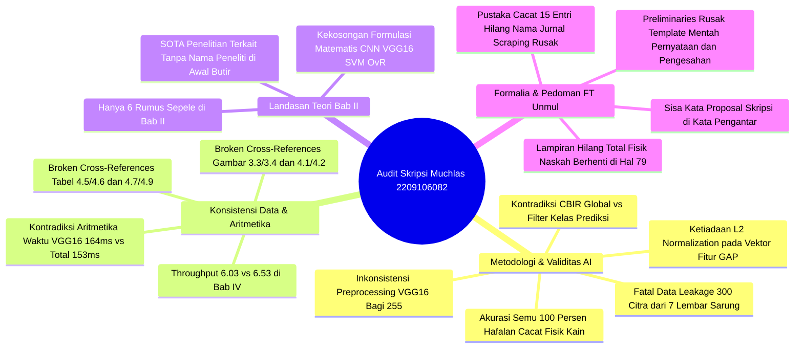

# 📋 LAPORAN AUDIT AKADEMIK FORENSIK & EVALUASI SEMINAR HASIL SKRIPSI

**Mahasiswa Bimbingan / Ujian:** Muchlas Andrey Pahlevi  
**NIM:** 2209106082  
**Program Studi:** S1 Informatika, Fakultas Teknik, Universitas Mulawarman  
**Dosen Pembimbing I:** Rosmasari, S.Kom., M.T. (NIP: 198509212019032017)  
**Dosen Pembimbing II:** Awang Harsa Kridalaksana, S.Kom., M.Kom. (NIP: 19731229 200501 1 002)  
**Dosen Penguji I:** Gubtha Mahendra Putra, S.Kom., M.Eng. (NIP: 199008232019031013)  
**Dosen Penguji II:** Anton Prafanto, S.Kom., M.T. (NIP: 199310222019031016)  
**Koordinator Program Studi:** Awang Harsa Kridalaksana, S.Kom., M.Kom. (NIP: 19731229 200501 1 002)  
**Judul Naskah:** *Klasifikasi Motif Tenun Samarinda Menggunakan CNN-SVM dan Content-Based Image Retrieval untuk Menampilkan Citra Serupa*  
**Dokumen yang Diaudit:** `C:\Users\anton\Downloads\Draft Semhas Muchlas.pdf` (95 Halaman / 79 Halaman Bernomor Arab)  
**Tanggal Evaluasi:** 2 Oktober 2026  
**Status Evaluasi:** **DRAF SEMINAR HASIL SKRIPSI LENGKAP — REVISI MAYOR SEBELUM DIJADWALKAN UJIAN / SEMINAR HASIL**

---

> [!IMPORTANT]
> **Catatan Tim Dosen Penilai / Penguji II:** Dokumen audit forensik akademik ini disusun secara komprehensif untuk menelaah naskah draf Seminar Hasil (95 halaman) Saudara Muchlas Andrey Pahlevi (NIM: 2209106082). Evaluasi mencakup keabsahan metodologi Machine Learning & Computer Vision, ancaman fatal *Data Leakage* (*Identity/Instance Leakage*) pada pembagian dataset, kontradiksi arsitektur CBIR antarbab, inkonsistensi aritmetika waktu komputasi, kekosongan formulasi matematis di Bab II, kebersihan metadata daftar pustaka, ketiadaan lembar lampiran fisik, serta kepatuhan mutlak terhadap Buku Pedoman Penulisan Skripsi Fakultas Teknik Universitas Mulawarman (Edisi Pembaruan Mei 2025).

---

## 🌟 1. Resume Evaluasi Akademik Umum & Nilai Positif Riset

Secara substansi keilmuan Informatika dan rekayasa kecerdasan artifisial terapan, penelitian yang dilakukan Saudara **Muchlas Andrey Pahlevi** memiliki relevansi lokal dan nilai guna yang sangat tinggi:

### Aspek Positif yang Patut Diapresiasi:
1. **Relevansi Pelestarian Warisan Budaya Lokal (*Digital Cultural Heritage*):** Mengangkat motif khas Tenun Samarinda (Hatta, Pucuk Rebung, Cumi/Bunga Dayak) sebagai domain pengenalan visual komputer, mendukung hilirisasi digitalisasi kain tradisional Kalimantan Timur.
2. **Integrasi Paradigma Hibrida (Klasifikasi + Retrieval):** Menggabungkan model klasifikasi diskriminatif (CNN feature extractor + SVM classifier) dengan paradigma *Information Retrieval* (CBIR berbasis *Euclidean Distance*) dalam satu alur kerja aplikasi terpadu.
3. **Eksperimen Komparasi Layer & Pooling yang Rinci:** Melakukan pengujian empiris sistematis terhadap berbagai kedalaman representasi layer VGG16 (Block4, Block5, FC1, FC2) serta membandingkan teknik *pooling* (Global Average Pooling, Global Max Pooling, dan kombinasi keduanya).
4. **Pengujian Ketahanan (*Robustness Testing*) Beragam:** Menguji daya tahan model terhadap 8 skenario variasi fisik dan gangguan citra nyata (rotasi 90°/180°, horizontal flip, Gaussian blur, variasi pencahayaan $\pm 30\%$, Gaussian noise, dan penurunan resolusi ke 25%).
5. **Implementasi Prototipe Interaktif:** Mengembangkan antarmuka berbasis Streamlit dengan visualisasi interaktif dua kolom (*wide layout*) yang menampilkan confidence score, diagram batang probabilitas per kelas, dan galeri visual Top-5 retrieval.

---

## 🚨 2. Rangkuman 12 Temuan Kritis (*12 Critical Red Flags*)

Walaupun prototipe telah terbangun dan eksperimen berjalan, audit forensik mendalam menemukan **12 Kelemahan Kritis (*12 Critical Red Flags*)** yang berpotensi menjadi bumerang fatal pada sesi tanya-jawab Seminar Hasil dan Ujian Pendadaran jika tidak segera diperbaiki:



---

### Tabel Ringkasan Temuan Kritis:

| No | Kategori | Tingkat Urgensi | Lokasi Naskah | Deskripsi Temuan Kritis |
| :---: | :--- | :---: | :---: | :--- |
| **1** | **Validitas Data & Metodologi ML** | 🚨 **Sangat Fatal** | Hal. 37, 57, 59 (PDF 53, 73, 75) | **Ancaman Fatal *Data Leakage / Identity Leakage* (Akurasi Semu 100%):** 300 citra dikumpulkan hanya dari **7 lembar fisik sarung** (2 Hatta, 3 Pucuk Rebung, 2 Cumi). Pembagian data dilakukan secara acak per foto (`train_test_split`). Akibatnya, foto dari sarung fisik yang sama tersebar di data latih dan data uji! Model bukan mempelajari pola abstrak motif, melainkan menghafal karakteristik unik serat/warna celupan sarung fisik tersebut. |
| **2** | **Konsistensi Desain Sistem** | 🚨 **Sangat Fatal** | Hal. 49, 55, 61, 70 (PDF 65, 71, 77, 86) | **Kontradiksi Konseptual Mekanisme CBIR (Pencarian Global vs Filter Kelas):** Di Abstrak, Bab I, Bab II, dan Bab IV diklaim: *pencarian dilakukan terhadap seluruh galeri tanpa membatasi kelas hasil klasifikasi*. Namun pada Bab III Hal. 55 Poin 6 tertulis secara eksplisit: *"...hasil pencarian citra serupa PADA KELAS HASIL KLASIFIKASI"*. |
| **3** | **Konsistensi Aritmetika Komputasi** | 🚨 **Sangat Fatal** | Hal. 68 & 72 (PDF 84 & 88) | **Kontradiksi Angka Latensi Komputasi (Komponen > Total):** Pada Tabel 4.8 (Hal. 68) tertulis Ekstraksi Fitur = 152,253 ms, Total = 153,066 ms, Throughput = 6,53 citra/s. Namun di narasi Hal. 72 mahasiswa menulis: *Ekstraksi Fitur = 164,880 ms* (lebih besar dari total waktu!) dan throughput tertulis *6,03 citra per detik*. |
| **4** | **Ambiguitas Galeri Basis Data CBIR** | ⚠️ **Mayor (Kritis)** | Hal. 49, 60, 64 (PDF 65, 76, 80) | **Definisi Galeri CBIR Tidak Jelas & Potensi Kebocoran Query:** Mahasiswa tidak mendefinisikan berapa jumlah citra galeri (apakah 300 seluruh data, 180 data latih, atau 120 data uji). Jika data uji masuk dalam galeri, apakah query dieksklusikan? Jika tidak dieksklusikan, Rank-1 akan selalu menghasilkan jarak 0,00 (dirinya sendiri). |
| **5** | **Rekayasa Fitur & Matriks** | ⚠️ **Mayor** | Hal. 44, 48, 60 (PDF 60, 64, 76) | **Ketiadaan *Feature Normalization* (L2-Norm / StandardScaler):** Vektor 512-dimensi hasil GAP (aktivasi ReLU non-negatif dengan magnitudo bervariasi) langsung dimasukkan ke Linear SVM ($C=0.001$) dan Euclidean Distance tanpa normalisasi L2 ($\mathbf{v} / \|\mathbf{v}\|_2$). Hal ini membuat jarak Euclidean bias terhadap variasi intensitas pencahayaan global. |
| **6** | **Pipeline Preprocessing CNN** | ⚠️ **Mayor** | Hal. 48 & 58 (PDF 64 & 74) | **Kekeliruan Standar Preprocessing VGG16 ImageNet:** Mahasiswa menormalisasi piksel dengan pembagian $255$ (`x / 255.0`). Padahal bobot pra-latih VGG16 ImageNet resmi dilatih menggunakan subtraksi nilai rata-rata kanal RGB ImageNet dalam format BGR (*zero-centered mean subtraction*) tanpa penskalaan ke [0, 1]. |
| **7** | **Landasan Teori Bab II** | ⚠️ **Mayor** | Hal. 20–30 (PDF 36–46) | **Kekosongan Formulasi Matematis Inti di Bab II:** Bab II sepanjang 24 halaman hanya memuat 6 rumus sepele (Akurasi, Presisi, Recall, F1, Euclidean, Precision@5). Sama sekali tidak ada formulasi matematis untuk Operasi Konvolusi, ReLU, Pooling, VGG16, Fungsi Optimasi SVM (Primal/Dual/Margin), Fungsi Kernel, dan Skema One-vs-Rest (OvR). |
| **8** | **Integritas Rujukan Silang (*Cross-References*)** | ⚠️ **Mayor** | Hal. 38, 64, 66, 69 | **4 Cacat Rujukan Silang Gambar & Tabel:**<br>• Teks Hal. 38 menyebut Use Case pada `Gambar 3.3` (seharusnya `Gambar 3.4`).<br>• Teks Hal. 64 menyebut retrieval pada `Gambar 4.1` (seharusnya `Gambar 4.2-4.4`).<br>• Teks Hal. 66 menyebut `Tabel 4.5` padahal tabel berlabel `Tabel 4.6`.<br>• Teks Hal. 69 menyebut `Tabel 4.7` padahal tabel berlabel `Tabel 4.9`. |
| **9** | **Kelengkapan Dokumen Fisik** | ⚠️ **Mayor** | Akhir Naskah (PDF Hal. 95) | **Lampiran Hilang Total (*Zero Appendices*):** Pada Daftar Lampiran (Hal. xii) tertera `Lampiran 1 contents 42`, namun naskah fisik berakhir di halaman 79 (Daftar Pustaka, PDF hal. 95). Tidak ada lampiran *source code*, lembar bimbingan, spesifikasi kamera, atau rincian dataset. |
| **10** | **Formalia Bagian Awal (Preliminaries)** | ⚠️ **Sedang** | Hal. i s.d. vii (PDF 1–8) | **Tercemar Template Mentah Word:**<br>• Cover luar memuat `No. Urut Skripsi`.<br>• Cover dalam memuat teks `HALAMAN JUDUL` dan bocor teks `PERNYATAAN KEASLIAN SKRIPSI`.<br>• Lembar Keaslian masih berisi `Samarinda, Tgl bln thn`, `Materai`, `(Nama Mahasiswa)`, `NIM. ...`.<br>• Lembar Pengesahan memuat `[tgl, bln, tahun]`, NIP Pembimbing I & II hilang, gelar Pembimbing I kurang titik.<br>• Halaman Persembahan menggantung: `Persembahan untuk ..`.<br>• Kata Pengantar memuat kata `proposal skripsi` 2 kali, gelar Penguji II salah tulis (`Anton Prafanto, M.T` tanpa `S.Kom.`), dan nama Dekan tertulis `Univertas`. |
| **11** | **Kebersihan Metadata Daftar Pustaka** | ⚠️ **Sedang** | Hal. 75–79 (PDF 91–95) | **Metadata Referensi Rusak Masif (>15 Pustaka Cacat):** Pustaka 3 judul terulang scraping *ScienceDirect*; Pustaka 5 membahas algoritma Apriori penjualan HP (tidak relevan); Pustaka 9 berstatus `(n.d.)`; Pustaka 10, 11, 13, 15, 18, 19, 22, 24, 26, 31, 32, 33, 34, 35, 41, 42 hilang nama jurnal; Pustaka 15 tidak memiliki metadata penerbit; Pustaka 23 URL DOI ganda `https://doi.org/https://doi.org/`. |
| **12** | **Sistematika & Tata Bahasa Penulisan** | ⚠️ **Sedang** | Hal. 1, 7, 57, 73 (PDF 17, 23, 73, 89) | **Duplikasi Tajuk Bab & Typo Judul:** Judul bab berulang ganda: `BAB I PENDAHULUAN \n PENDAHULUAN`; spasi patah pada judul bab `BAB IV HASIL DAN P EMBA HASAN` dan `BAB V KESIMPU LAN`; gaya sitasi salah kurung `Menurut (Sunyoto et al., 2022)`; subbab Sistematika Penulisan di Bab I lenyap. |

---

## 🔍 3. Bedah Forensik Bab demi Bab & Arahan Perbaikan Rinci

---

### 📄 A. Bagian Awal (Halaman Judul s.d. Daftar Singkatan)

#### 1. Halaman Sampul Luar & Dalam (Cover, Hal. 1 & Hal. i / PDF 1 & 2)
* **Hapus Teks `No. Urut Skripsi`:** Teks ini adalah penanda nomor inventaris ruang baca/perpustakaan yang baru diisi oleh staf fakultas saat penyerahan jilid lux skripsi final, bukan pada draf seminar hasil. Hapus teks tersebut dari cover luar.
* **Hapus Teks `HALAMAN JUDUL`:** Pada cover dalam (Hal. i), teks `HALAMAN JUDUL` menempel canggung di bawah judul skripsi. Format standar FT Unmul langsung menyantumkan maksud pengajuan: *"Diajukan sebagai salah satu syarat untuk menyelesaikan pendidikan..."*.
* **Koreksi Kebocoran Teks Header di Bagian Bawah Cover Dalam:** Di bagian bawah halaman i tertulis teks:
  ```text
  PERNYATAAN KEASLIAN SKRIPSI
  ```
  Teks tajuk halaman berikutnya bocor dan tertinggal di bawah halaman i akibat penggunaan spasi manual (*hard enter*). Gunakan *Page Break* atau *Section Break (Next Page)* yang bersih.

#### 2. Pernyataan Keaslian Skripsi (Hal. ii / PDF 3)
* **Bersihkan Seluruh Placeholder Template Mentah:**
  * Ubah `Samarinda, Tgl bln thn` $\rightarrow$ tulis tanggal definitif pengajuan draf seminar hasil (misal: *Samarinda, Oktober 2026*).
  * Hapus tulisan teks `Materai` $\rightarrow$ tempelkan e-Meterai resmi Rp 10.000 atau materai fisik yang ditandatangani basah menyentuh kertas dan materai.
  * Ganti teks placeholder `(Nama Mahasiswa)` $\rightarrow$ **Muchlas Andrey Pahlevi**.
  * Ganti teks placeholder `NIM. ...` $\rightarrow$ **2209106082** (tanpa tanda titik setelah kata NIM sesuai panduan FT Unmul).

#### 3. Halaman Pengesahan (Hal. iii / PDF 4)
* **Penyesuaian Lembar untuk Seminar Hasil:** Naskah ini bertuliskan *"Telah dibahas dalam Rapat Dosen Pembimbing pada [tgl, bln, tahun] dan dinyatakan memenuhi syarat sebagai Skripsi"*. Untuk tahapan Seminar Hasil, judul halaman pengesahan yang baku adalah **LEMBAR PERSETUJUAN SEMINAR HASIL SKRIPSI** dengan tanggal definitif persetujuan kedua pembimbing.
* **Lengkapi NIP Dosen Pembimbing:**
  * Pembimbing I: **Rosmasari, S.Kom., M.T.** (NIP: 198509212019032017). Perhatikan tanda titik setelah gelar M.T.! Pada naskah tertulis tanpa titik: `M.T`.
  * Pembimbing II: **Awang Harsa Kridalaksana, S.Kom., M.Kom.** (NIP: 19731229 200501 1 002).
* Hapus teks sisipan `HALAMAN PENGESAHAN` di tengah-tengah lembar pengesahan.

#### 4. Halaman Persembahan (Hal. iv / PDF 5)
* Naskah saat ini hanya memuat kalimat yang menggantung:
  ```text
  Persembahan untuk ..
  ```
  Ini menunjukkan mahasiswa lalai memeriksa dokumen sebelum mencetak/mengekspor PDF. Isi kalimat persembahan secara khidmat dan pantas (misal: untuk orang tua, keluarga, guru/dosen), atau jika belum siap, hilangkan halaman ini pada draf ujian.

#### 5. Abstrak & Abstract (Hal. v & vi / PDF 6 & 7)
* **Koreksi Penulisan Gelar pada Header Abstrak:**
  * Pembimbing I tertulis `Rosmasari, S.Kom., M.T` $\rightarrow$ tambahkan titik penutup menjadi **Rosmasari, S.Kom., M.T.**.
  * Pembimbing II tertulis `Awang Harsa Kridalaksana, S.Kom., M.Kom` $\rightarrow$ tambahkan titik penutup menjadi **Awang Harsa Kridalaksana, S.Kom., M.Kom.**.
* **Penyusunan Format Header Abstrak:** Susun identitas mahasiswa, prodi, dan pembimbing dalam tabel dua kolom tanpa bingkai (*borderless table*) agar rapi dan simetris sesuai Buku Pedoman Penulisan Skripsi FT Unmul Update Mei 2025.
* **Ketegasan Klaim Akurasi:** Mahasiswa menulis *"...mencapai akurasi sebesar 100%..."*. Perlu ditambahkan konteks bahwa akurasi 100% diperoleh pada skenario stratified split internal dari dataset 300 citra uji (7 sarung), sehingga pembaca ilmiah mendapatkan konteks batasan eksperimen yang jujur.

#### 6. Kata Pengantar (Hal. vii / PDF 8)
* **Koreksi Frasa "Proposal Skripsi" yang Tertinggal:** Mahasiswa terbukti menyalin kata pengantar dari draf proposal lama tanpa membaca ulang. Pada paragraf 2 dan paragraf penutup tertulis:
  > *"Oleh karena itu, pada kesempatan ini penulis ingin mengucapkan terima kasih kepada semua pihak yang telah mendukung serta membantu penulis selama proses penyusunan **proposal skripsi**..."*  
  > *"Saya menyadari bahwa **proposal skripsi** ini tidak luput dari berbagai kekurangan..."*
  * **Koreksi Wajib:** Ganti seluruh frasa `proposal skripsi` menjadi **skripsi** atau **draf seminar hasil skripsi**.
* **Koreksi Gelar dan Instansi Tokoh Akademik:**
  * Butir 2 (Dekan): Tertulis `Univertas Mulawarman` (typo huruf 'i') dan spasi gelar `ST.,MT.` $\rightarrow$ perbaiki menjadi **Prof. Dr. Ir. Tamrin, S.T., M.T., IPU., APEC Eng.** selaku Dekan Fakultas Teknik, **Universitas** Mulawarman.
  * Butir 4 (Pembimbing I): Tambahkan titik: **Ibu Rosmasari, S.Kom., M.T.**
  * Butir 6 (Penguji I): Tambahkan titik setelah gelar S.Kom: **Bapak Gubtha Mahendra Putra, S.Kom., M.Eng.**
  * Butir 7 (Penguji II): Gelar Bapak Anton Prafanto ditulis keliru: `Bapak Anton Prafanto, M.T`. Gelar resmi dan lengkap beliau adalah **Bapak Anton Prafanto, S.Kom., M.T.** (tambahkan gelar sarjana S.Kom.).
  * Titimangsa tanggal: Ganti placeholder `Samarinda,.............................. 2026` menjadi bulan dan tahun resmi.

#### 7. Daftar Isi, Daftar Tabel, Daftar Gambar, Daftar Lampiran, Daftar Istilah & Singkatan (Hal. viii–xv)
* **Daftar Isi (Hal. viii):** Hapus teks artefak Microsoft Word: `Table of Contents` dan `halaman`. Perbaiki penomoran `PERNYATAAN KEASLIAN SKRIPSI` yang tertulis `i` padahal berada pada halaman `ii`.
* **Daftar Lampiran (Hal. xii):** Tertulis:
  ```text
  Halaman
  Lampiran 1 contents 42
  ```
  Teks `contents 42` adalah teks *dummy* bawaan template Microsoft Word! Perbaiki dan sinkronkan dengan judul lampiran riil.
* **Daftar Istilah (Hal. xiii) & Daftar Singkatan (Hal. xv):** Hapus kata `Contents` dan `Content` yang tercetak di bawah tajuk kolom `Arti`. Pastikan seluruh istilah asing dimiringkan (*italic*).

---

### 📘 B. BAB I – Pendahuluan

#### 1. Pembenahan Header Awal Bab (Hal. 1 / PDF 17)
* Tertulis ganda:
  ```text
  BAB I PENDAHULUAN
  PENDAHULUAN
  ```
* Hapus baris pengulangan `PENDAHULUAN` sehingga hanya tersisa satu tajuk bab resmi: **BAB I PENDAHULUAN**.

#### 2. Tata Cara Sitasi Naratif dalam Bahasa Indonesia
* Di Hal. 2 tertulis:
  > *"Penelitian ole h (Muhartini et al., 2024) menunjukkan..."*  
  > *"Penelitian lain oleh (Kelen & Baso, 2023) juga memperlihatkan..."*
* **Koreksi Aturan Sitasi APA:**
  * Penulisan naratif tidak boleh membungkus nama pengarang ke dalam tanda kurung ganda.
  * Kata `ole h` terdapat kesalahan spasi ketik.
  * Perbaiki menjadi:
    * *"Penelitian oleh **Muhartini et al. (2024)** menunjukkan..."*
    * *"Penelitian lain oleh **Kelen dan Baso (2023)** juga memperlihatkan..."*

#### 3. Penajaman Rumusan Masalah & Batasan Masalah (Hal. 3–4 / PDF 19–20)
* **Justifikasi Angka Top-5:** Pada Rumusan Masalah butir 2 dan Batasan Masalah butir 4, mahasiswa langsung mematok nilai $k=5$ (`Precision@5`). Penguji akan bertanya: *Mengapa harus 5? Mengapa bukan 3, 10, atau evaluasi variasi nilai k (Precision@k curve)?*. Tambahkan landasan argumen pemilihan Top-5 (misalnya: batasan ergonomi antarmuka visual Streamlit atau standar display e-commerce tekstil).
* **Penambahan Subbab Sistematika Penulisan:** Pada naskah saat ini, mahasiswa mencantumkan Subbab 1.6 Kontribusi Penelitian, namun **menghilangkan Subbab Sistematika Penulisan**. Sesuai Buku Pedoman FT Unmul, Bab I wajib ditutup dengan gambaran struktur bahasan Bab I sampai dengan Bab V.

---

### 📗 C. BAB II – Tinjauan Pustaka & Landasan Teori

#### 1. Penataan Ulang Subbab 2.1 Penelitian Terkait (Hal. 7–13 / PDF 23–29)
* **Cacat Format Butir Penelitian Terkait:** Pada halaman 7, Butir nomor 1 diawali secara ganjil tanpa menyebut nama peneliti dan judul artikel:
  > *"1. Metode yang digunakan: Deep learning CNN dengan arsitektur VGG16 dan DenseNet121. Temuan Penelitian: ..."*
  Nama penelitinya baru muncul di akhir paragraf dalam kurung: `(Muhartini et al., 2024)`. Format ini tidak baku! Setiap butir harus diawali secara formal: **Penelitian oleh Nama Peneliti (Tahun) berjudul "Judul Makalah"...**.
* **Duplikasi Teks Paragraf pada Butir 5 (Hal. 10 / PDF 26):**
  Tertulis berulang:
  > *"5. Metode yang digunakan: SqueezeNet untuk ekstraksi fitur dan Decision Tree (DT) untuk klasifikasi. **Metode yang digunakan: SqueezeNet untuk ekstraksi fitur dan Decision Tree (DT) untuk klasifikasi.** Temuan Penelitian: ..."*
  Hapus pengulangan kalimat tersebut.
* **Kewajiban Menambahkan Tabel Matriks Penelitian Terkait (*State of the Art / Research Gap Table*):**
  Untuk menunjukkan kebaruan riset secara eksplisit, mahasiswa wajib menyusun **Tabel 2.1 Matriks Komparasi Penelitian Terkait** dengan kolom:
  `No | Peneliti & Tahun | Metode (Feature Extractor + Classifier) | Metode Retrieval | Objek Dataset | Akurasi | Keterbatasan / Perbedaan dengan Penelitian Ini`.

#### 2. Penambahan Formulasi Matematis Inti (Mengisi Kekosongan Teori di Bab II)
Bab II mahasiswa saat ini sangat miskin landasan matematika formal (hanya ada rumus Akurasi, Presisi, Recall, F1, Euclidean, dan Precision@5). Sebagai skripsi Teknik Informatika bidang *Machine Learning*, mahasiswa **wajib melengkapi Bab II dengan formulasi matematika berikut:**

1. **Formulasi Operasi Konvolusi 2D (Convolution Operation):**

   $$S(i, j) = (I * K)(i, j) = \sum_{m} \sum_{n} I(i - m, j - n) K(m, n)$$

   Di mana $I$ adalah citra masukan dan $K$ adalah kernel/filter konvolusi berukuran $m \times n$.
2. **Fungsi Aktivasi ReLU (Rectified Linear Unit):**

   $$f(x) = \max(0, x)$$

3. **Operasi Global Average Pooling (GAP) pada Layer Block4_pool VGG16:**

   $$\mathbf{v}_c = \frac{1}{H \times W} \sum_{i=1}^{H} \sum_{j=1}^{W} X_c(i, j), \quad \forall c \in \{1, 2, \dots, 512\}$$

   Jelaskan bagaimana tensor spasial $14 \times 14 \times 512$ direduksi menjadi vektor fitur 1 dimensi berukuran 512.
4. **Formulasi Matematis Support Vector Machine (SVM):**
   * *Primal Optimization Problem* dengan Soft-Margin:

     $$\min_{\mathbf{w}, b, \boldsymbol{\xi}} \frac{1}{2} \|\mathbf{w}\|^2 + C \sum_{i=1}^{N} \xi_i \quad \text{s.t.} \quad y_i (\mathbf{w}^T \mathbf{x}_i + b) \ge 1 - \xi_i, \quad \xi_i \ge 0$$

   * *Fungsi Keputusan (Decision Function):*

     $$f(\mathbf{x}) = \text{sign}\left(\sum_{i \in \text{SV}} \alpha_i y_i K(\mathbf{x}_i, \mathbf{x}) + b\right)$$

   * *Fungsi Kernel yang Diuji pada Grid Search:*
     * Linear: $K(\mathbf{x}_i, \mathbf{x}_j) = \mathbf{x}_i^T \mathbf{x}_j$
     * RBF: $K(\mathbf{x}_i, \mathbf{x}_j) = \exp(-\gamma \|\mathbf{x}_i - \mathbf{x}_j\|^2)$
     * Polynomial: $K(\mathbf{x}_i, \mathbf{x}_j) = (\gamma \mathbf{x}_i^T \mathbf{x}_j + r)^d$
5. **Skema Multikelas One-vs-Rest (OvR):**
   Jelaskan secara formal bagaimana 3 classifier biner ($f_1(\mathbf{x}), f_2(\mathbf{x}), f_3(\mathbf{x})$) bersaing dan bagaimana argmax fungsi skor menentukan kelas prediksi akhir:

   $$\hat{y} = \arg\max_{k \in \{0, 1, 2\}} f_k(\mathbf{x})$$

#### 3. Koreksi Typo Istilah Ilmiah di Bab II:
* Hal. 20 (PDF 36): Tertulis `confussion matrix` $\rightarrow$ perbaiki menjadi **confusion matrix** (satu huruf 's').
* Hal. 20 (PDF 36): Tertulis `memliki kelemahan` $\rightarrow$ perbaiki menjadi **memiliki kelemahan**.
* Hal. 20 (PDF 36): Tertulis `artificial intelligenceyang` $\rightarrow$ tambahkan spasi menjadi **artificial intelligence yang**.
* Hal. 20 (PDF 36): Sitasi `(Colliot & Varoquaux, n.d.)` $\rightarrow$ cari tahun terbit resmi buku Springer tersebut (jangan biarkan `n.d.`).

---

### 📙 D. BAB III – Metodologi Penelitian

#### 1. Pembongkaran Ancaman *Data Leakage / Identity Leakage* (Hal. 35–37 / PDF 51–53)
Ini adalah **titik paling krusial** yang wajib diantisipasi mahasiswa sebelum berhadapan dengan dewan penguji:
* **Fakta Dataset:** Mahasiswa mengumpulkan **300 citra** yang bersumber dari **hanya 7 lembar sarung fisik** (2 motif Hatta, 3 motif Pucuk Rebung, 2 motif Cumi/Bunga Dayak).
* **Fakta Pembagian Data:** Data dibagi 60:40 secara acak menggunakan `train_test_split(stratify=label)` pada level citra.
* **Konsekuensi Ilmiah (Data Leakage):**
  * Dari 1 sarung fisik motif Hatta, mahasiswa mengambil sekitar 50 foto dari sudut, jarak, atau pencahayaan berbeda.
  * Ketika di-split acak 60:40, sekitar 30 foto dari Sarung Hatta #1 masuk ke data latih, dan 20 foto dari Sarung Hatta #1 yang sama persis masuk ke data uji!
  * Fitur VGG16 Block4 merepresentasikan karakteristik serat benang, corak warna celupan spesifik (*dye lot*), dan tekstur unik kain dari sarung fisik tersebut.
  * **Model SVM dengan mudah mengenali sarung tersebut bukan karena memahami esensi motif Hatta secara invarian, melainkan karena menghafal sidik visual kain fisik yang sama!**
* **Arahan Perbaikan Akademik:**
  1. Mahasiswa harus mengakui secara jujur batasan ini di naskah pada Subbab 1.3 dan Subbab 4.4.
  2. Untuk membuktikan generalisasi hakiki, mahasiswa idealnya menguji model menggunakan skenario **GroupKFold / Leave-One-Sarung-Out** (misal: latih pada Sarung 1, uji pada Sarung 2 untuk motif Hatta dan Cumi).
  3. Mahasiswa harus siap mempertahankan hasil ini di seminar dengan data pengujian tambahan terhadap kain tenun baru (*unseen fabric specimen*).

#### 2. Penyelesaian Kontradiksi Mekanisme Retrieval CBIR (Hal. 49 vs Hal. 55)
* Pada Subbab 3.4.7 (Hal. 49) tertulis:
  > *"Proses retrieval menggunakan fitur citra query yang dibandingkan dengan fitur seluruh citra pada galeri, **tanpa membatasi pencarian berdasarkan kelas hasil klasifikasi**."*
* Namun pada Subbab 3.5 Poin 6 (Hal. 55 / PDF 71) tertulis:
  > *"Area Hasil Retrieval: yaitu bagian yang menampilkan Top-5 citra paling mirip berdasarkan hasil pencarian citra serupa **pada kelas hasil klasifikasi**."*
* **Koreksi Wajib:** Kedua narasi ini saling membunuh secara logika! Sinkronkan narasi pada Hal. 55 agar konsisten dengan alur kode Streamlit riil: jika retrieval mencari ke seluruh galeri, hapus frasa *"pada kelas hasil klasifikasi"*.

#### 3. Definisi Komposisi Galeri CBIR
Mahasiswa wajib menambahkan tabel atau narasi spesifik di Bab III mengenai:
* Berapa jumlah citra yang terdaftar di dalam basis data fitur galeri ($N_{galeri}$)? Apakah 180 (hanya data latih), atau 300 (seluruh dataset)?
* Penegasan apakah citra query yang diuji dieksklusikan dari penghitungan ranking untuk mencegah *self-matching* ($d = 0.00$).

#### 4. Koreksi Standar Preprocessing Citra VGG16 (Hal. 41 & 48)
* Tertulis di naskah: *"dilakukan normalisasi nilai piksel dengan membagi nilai piksel menggunakan 255"*.
* Mahasiswa harus mengklarifikasi apakah fungsi yang digunakan pada skrip Python adalah `vgg16.preprocess_input(img)` (standar Keras/TensorFlow) atau pembagian manual `/ 255.0`.
* Jika menggunakan model pre-trained ImageNet, pembagian 255 tanpa zero-centering adalah penyimpangan dari protokol pelatihan awal VGG16 ImageNet (Simonyan & Zisserman, 2014). Tuliskan implementasi kode yang sebenarnya digunakan.

#### 5. Rekomendasi Normalisasi Fitur (L2 Normalization)
* Fitur keluaran Global Average Pooling (GAP) berdimensi 512 memiliki magnitudo skalar yang bervariasi bergantung pada intensitas kecerahan citra.
* Agar perhitungan *Euclidean Distance* adil dan setara dengan *Cosine Distance*, mahasiswa disarankan menerapkan normalisasi L2 pada vektor fitur $\mathbf{v}$:

  $$\hat{\mathbf{v}} = \frac{\mathbf{v}}{\|\mathbf{v}\|_2} = \frac{\mathbf{v}}{\sqrt{\sum_{j=1}^{512} v_j^2}}$$

  Hal ini menjamin bahwa seluruh fitur berada pada permukaan hipersfer satuan (*unit hypersphere*) sehingga jarak Euclidean murni mengukur perbedaan pola tekstur dan arah fitur, bukan intensitas kecerahan absolut.

#### 6. Koreksi Diagram UML & Rujukan Gambar di Bab III
* **Rujukan Gampar Patah (Hal. 38 / PDF 54):**
  Tertulis: *"Diagram use case ditunjukkan pada Gambar 3.3"*, padahal caption di Hal. 39 adalah **Gambar 3.4**. Ubah teks rujukan menjadi **Gambar 3.4**.
* **Koreksi Konseptual Use Case Diagram (Gambar 3.4):**
  Pada diagram use case, use case `Klasifikasi Citra` dihubungkan dengan relasi `<<include>>` ke `Upload Citra Motif Tenun` dan `Lihat Hasil Klasifikasi`.
  * Dalam rekayasa perangkat lunak standar UML, *Upload Citra* dan *Lihat Hasil* adalah langkah-langkah (*steps*) di dalam skenario use case, bukan use case mandiri yang di-include!
  * Cukup buat satu use case bermakna bagi pengguna: **Melakukan Klasifikasi dan Retrieval Motif Tenun**, yang memiliki alur dasar (*basic flow*): unggah citra $\rightarrow$ sistem memproses $\rightarrow$ sistem menampilkan hasil.

---

### 📊 E. BAB IV – Hasil dan Pembahasan (BAGIAN PALING KRITIS!)

#### 1. Sinkronisasi Mutlak Kontradiksi Angka Latensi Pemrosesan (Hal. 68 vs Hal. 72)
Mahasiswa melakukan kesalahan fatal pada data waktu komputasi yang saling bertentangan:
* **Pada Tabel 4.8 (Hal. 68 / PDF 84):**
  * Ekstraksi Fitur VGG16: **152,253 ms**
  * Klasifikasi SVM: **0,655 ms**
  * Retrieval Top-5: **0,158 ms**
  * TOTAL per citra: **153,066 ms**
  * Throughput: **6,53 citra per detik**
* **Pada Narasi Subbab 4.4.4 (Hal. 72 / PDF 88):**
  * Paragraf 1: *"Total waktu pemrosesan rata-rata adalah 153,066 ms... setara dengan throughput **6,03** citra per detik."*
  * Paragraf 2: *"Bila ditinjau per tahap, ekstraksi fitur VGG16 merupakan tahap yang paling banyak menyita waktu, yaitu rata-rata **164,880 ms** atau sekitar 99,5% dari total waktu pemrosesan."*
* **Pelanggaran Logika Matematika:**
  1. Bagaimana mungkin waktu ekstraksi fitur saja bernilai **164,880 ms**, padahal total waktu seluruh pipeline hanya **153,066 ms**? ($164,880 > 153,066$ adalah kemustahilan matematis!).
  2. Throughput terhitung adalah $\frac{1000 \text{ ms}}{153,066 \text{ ms}} = 6,533 \text{ citra/detik}$. Angka $6,03$ di Hal. 72 adalah artifak salah ketik dari draf pengujian lain ($\frac{1000}{164,88 + \dots} \approx 6,03$).
* **Koreksi Segera:** Rombak total narasi Subbab 4.4.4 di Hal. 72! Ganti angka `164,880 ms` menjadi **152,253 ms**, dan ganti throughput `6,03` menjadi **6,53 citra per detik** sesuai data Tabel 4.8.

#### 2. Koreksi 3 Rujukan Silang (*Broken Cross-References*) Tabel dan Gambar di Bab IV
1. **Rujukan Hasil Retrieval (Hal. 64 / PDF 80):**
   * Teks: *"Contoh hasil retrieval ditunjukkan pada Gambar 4.1, Gambar 4.2, dan Gambar 4.3."*
   * Fakta Gambar: **Gambar 4.1** adalah tangkapan layar antarmuka Streamlit! Hasil retrieval motif Hatta, Pucuk Rebung, dan Cumi berada pada **Gambar 4.2, Gambar 4.3, dan Gambar 4.4**.
   * Koreksi: Ubah rujukan menjadi **Gambar 4.2, Gambar 4.3, dan Gambar 4.4**.
2. **Rujukan Tabel Evaluasi Precision@5 (Hal. 66 / PDF 82):**
   * Teks: *"...ditunjukkan pada Tabel 4.5."*
   * Fakta Tabel: Tabel di bawahnya diberi judul **Tabel 4.6 Hasil Evaluasi Precision@5 Sistem CBIR**.
   * Koreksi: Ubah rujukan teks menjadi **Tabel 4.6**.
3. **Rujukan Tabel Komparasi Layer VGG16 (Hal. 69 / PDF 85):**
   * Teks: *"Hasil perbandingan performa masing-masing layer ditunjukkan pada Tabel 4.7"* dan *"Berdasarkan Tabel 4.7, di antara seluruh layer yang diuji..."*
   * Fakta Tabel: Tabel yang menampilkan komparasi layer Block4, Block5, FC1, dan FC2 diberi judul **Tabel 4.9 Perbandingan Performa Layer VGG16 sebagai Feature Extractor**.
   * Koreksi: Ubah rujukan teks di kedua kalimat tersebut dari `Tabel 4.7` menjadi **Tabel 4.9**.

#### 3. Pendalaman Analisis Akademik Hasil Uji Robustness (Tabel 4.7, Hal. 66)
* Data Tabel 4.7 sangat menarik:
  * Akurasi stabil 100% pada rotasi 90°/180°, flip, dan kecerahan $\pm 30\%$.
  * Akurasi anjlok drastis ke **72,50%** (-27,50%) pada kondisi **Gaussian Blur** dan **Resolusi Rendah (1/4)**.
* Mahasiswa perlu memperdalam bahasan pada Subbab 4.4.3: Mengapa VGG16 layer Block4 sangat rapuh terhadap *blurring* dan *downsampling*?
  * *Penjelasan Ilmiah:* Layer konvolusi blok 4 merespons fitur tekstur frekuensi tinggi (*high-frequency texture patterns*) seperti alur persilangan benang pakan dan lungsin pada tenun ATBM. Ketika citra mengalami Gaussian blur atau resolusi rendah, filter spasial frekuensi tinggi tersebut mengalami atenuasi hebat (*low-pass filtering effect*), melenyapkan respons aktivasi filter terpenting pada feature map Block4. Tambahkan argumen sinyal dan domain frekuensi citra ini untuk memperkuat bobot ilmiah Bab IV!

---

### 📝 F. BAB V – Kesimpulan dan Saran

#### 1. Perbaikan Typo Judul Bab V (Hal. 73 / PDF 89)
* Tertulis dengan spasi patah dan pengulangan:
  ```text
  BAB V KESIMPU LAN DAN SARAN
  KESIMPULAN DAN SARAN
  ```
* Hapus baris pengulangan dan satukan kata: **BAB V KESIMPULAN DAN SARAN**.

#### 2. Penataan Konsistensi 3 Butir Kesimpulan terhadap 3 Rumusan Masalah
Pada Bab I Subbab 1.2 terdapat **3 butir rumusan masalah**. Sesuai kaidah skripsi ilmiah, Subbab 5.1 Kesimpulan **wajib menjawab ketiga rumusan masalah tersebut secara 1-to-1 correspondence**:
* **Kesimpulan Butir 1 (Menjawab Rumusan Masalah 1):** Rangkum keberhasilan pembangunan klasifikasi CNN-SVM (arsitektur VGG16 Block4 + GAP menghasilkan 512 fitur, Linear SVM $C=0.001$ via 5-fold CV).
* **Kesimpulan Butir 2 (Menjawab Rumusan Masalah 2):** Rangkum keberhasilan implementasi CBIR (pengukuran kemiripan berbasis Euclidean Distance pada representasi fitur 512-D tanpa batasan kelas, menghasilkan Top-5 retrieval interaktif pada antarmuka Streamlit).
* **Kesimpulan Butir 3 (Menjawab Rumusan Masalah 3):** Rangkum capaian evaluasi kuantitatif secara tegas dalam butir tersendiri:
  * Klasifikasi CNN-SVM: Akurasi **100%**, Precision **1,00**, Recall **1,00**, F1-score **1,00** pada 120 citra uji.
  * Retrieval CBIR: Mean Precision@5 sebesar **96,33%**.
  * Waktu pemrosesan: Rata-rata **153,066 ms per citra** (throughput **6,53 citra/detik**).

---

### 📚 G. DAFTAR PUSTAKA & LAMPIRAN

#### 1. Pembersihan Metadata Daftar Pustaka (>15 Pustaka Rusak)
Daftar Pustaka mahasiswa dipenuhi entri cacat hasil *export* otomatis manajer referensi yang tidak diverifikasi manual:
1. **Pustaka No. 3 (Ahlawat & Choudhary):**
   * *Naskah:* `ScienceDirect ScienceDirect Hybrid CNN -SVM Classifier for Handwritten Digit Recognition Hybrid CNN-SVM Classifier for Handwritten Digit Recognition...`
   * *Koreksi:* Hapus pengulangan kata `ScienceDirect` dan pengulangan ganda judul makalah.
2. **Pustaka No. 5 (Amalia et al., 2021):**
   * Judul: *Analisis Data Penjualan Handphone dan Elektronik Menggunakan Algoritma Apriori...*
   * *Kritik Dosen:* Mengapa makalah penjualan HP algoritma Apriori disitasi dalam skripsi computer vision klasifikasi kain tenun? Hapus pustaka yang tidak relevan ini dari daftar pustaka dan teks!
3. **Pustaka No. 9 (Colliot & Varoquaux):**
   * Tertulis `(n.d.)`. Lengkapi tahun penerbitan resmi buku Springer tersebut (2023).
4. **Pustaka No. 15 (Kembo & Kaesmetan, 2025):**
   * Tertulis buntung: `Kembo, E. K., & Kaesmetan, Y. R. (2025). Klasifikasi Motif Kain Tenun di Pulau Flores Menggunakan Metode CNN dan RNN.`
   * Lengkapi nama jurnal, volume, nomor, halaman, atau tautan prosiding konferensinya.
5. **Pustaka No. 10, 11, 13, 18, 19, 22, 24, 26, 31, 32, 33, 34, 35, 42:**
   * Seluruh pustaka ini kehilangan **Nama Jurnal / Nama Konferensi**, hanya tertulis angka volume/halaman acak (misal: `8(1), 8–13`, `9(5), 2303–2309`, `4, 450–456`).
   * Mahasiswa wajib mencari nama jurnal aslinya dan menuliskan secara lengkap sesuai format APA edisi ke-7.
6. **Pustaka No. 23 (Paladan et al., 2024):**
   * Tautan DOI tercetak ganda: `https://doi.org/https://doi.org/10.30872/prospek.v6i1.4542`. Perbaiki menjadi satu awalan `https://doi.org/10.30872/prospek.v6i1.4542`.
7. **Pustaka No. 41 (Zhang & Liu, 2023):**
   * Judul tercetak ganda: `Content Based Deep Learning Image Retrieval : A Survey Content Based Deep Learning Image Retrieval : A Survey . January.` Perbaiki judul menjadi satu kali.

#### 2. Kewajiban Melampirkan Dokumen Fisik Lampiran (Hal. xii)
Naskah draft saat ini berhenti di halaman 79 (Daftar Pustaka). Mahasiswa **wajib menyertakan lembar lampiran fisik** sebelum maju seminar hasil:
* **Lampiran 1:** Dokumentasi 7 Lembar Sarung Fisik Tenun Samarinda yang Menjadi Objek Pengambilan Data (Foto Sarung Utuh, Informasi Pengrajin/Toko di Samarinda Seberang).
* **Lampiran 2:** Cuplikan Kode Sumber Inti (*Core Python Scripts*):
  * Skrip Ekstraksi Fitur VGG16 (`extract_features.py`).
  * Skrip Grid Search & Pelatihan SVM (`train_svm.py`).
  * Skrip Komputasi CBIR Euclidean Distance (`retrieval.py`).
  * Skrip Antarmuka Streamlit (`app.py`).
* **Lampiran 3:** Tabel Rincian Data Pengujian Lengkap (Confusion Matrix Lengkap & Hasil Uji Robustness per Kondisi Citra).
* **Lampiran 4:** Lembar Bukti Bimbingan Skripsi / Logbook Konsultasi.

---

## 🎯 4. Daftar Pertanyaan Kritis Ujian / Seminar Hasil (Simulasi Tanya-Jawab Dewan Penguji)

Berikut adalah **7 pertanyaan kritis tingkat tinggi** yang dipersiapkan oleh Dosen Penguji II (Pak Anton Prafanto) untuk menguji penguasaan materi Saudara Muchlas pada sesi Seminar Hasil / Pendadaran:

```markdown
1. "Saudara Muchlas, Anda mengklaim akurasi model CNN-SVM Anda mencapai 100,00% sempurna tanpa satu pun kesalahan pada 120 data uji. Di sisi lain, Anda menyebutkan bahwa 300 foto dikumpulkan hanya dari 7 lembar sarung fisik. Apakah Anda menyadari adanya ancaman 'Identity / Subject Leakage'? Bagaimana Anda membuktikan bahwa model Anda benar-benar mengenali pola geometris motif, bukan sekadar menghafal warna celupan benang atau cacat tenun dari 7 sarung tersebut?"
   -> Ekspektasi Jawaban: Mahasiswa harus mampu menjelaskan konsep instance leakage, mengakui batasan keragaman fisik sarung (2-3 sarung per motif), dan mengusulkan skenario pengujian Leave-One-Sarung-Out / GroupKFold di mana sarung pada data uji belum pernah muncul sama sekali di data latih.

2. "Mengapa Anda memilih layer Block4_pool dari VGG16, bukan Block5_pool atau layer Fully Connected (FC1/FC2)? Jelaskan secara teoretis bagaimana representasi visual berubah dari lapisan awal hingga lapisan terdalam CNN!"
   -> Ekspektasi Jawaban: Lapisan awal (Block1-2) menangkap fitur primitif (tepi, warna dasar). Lapisan tengah-akhir (Block4) menangkap fitur tekstur dan pola repetitif kompleks yang sangat relevan untuk kain tenun. Lapisan terdalam (Block5 dan FC) menangkap fitur semantik objek global tingkat tinggi yang spesifik pada ImageNet (seperti kepala anjing, mobil), sehingga kemampuan transfer representasi tekstilnya justru menurun (seperti terbukti pada Tabel 4.9 di mana akurasi FC2 turun ke 98,33% dan Precision@5 anjlok ke 89,67%).

3. "Pada naskah Anda terdapat kontradiksi: di satu sisi Anda menyebut CBIR mencari ke seluruh galeri, tetapi di Bab III Hal. 55 Anda menulis pencarian dilakukan 'pada kelas hasil klasifikasi'. Mana yang sebenarnya berjalan di sistem Anda? Apa kelebihan dan kekurangan jika pencarian dibatasi pada kelas prediksi vs dicari secara global?"
   -> Ekspektasi Jawaban: Menjelaskan implementasi riil di kode. Jika dibatasi kelas prediksi, pencarian lebih cepat dan relevansi motif terjamin tinggi (asalkan klasifikasi benar), namun rentan terhadap cascading error (jika klasifikasi salah, seluruh retrieval pasti salah). Jika pencarian global tanpa filter, sistem mampu menunjukkan citra dengan kemiripan visual murni lintas kelas, menguji kekuatan representasi embedding VGG16 secara independen.

4. "Dalam evaluasi CBIR, Anda mengukur Precision@5 sebesar 96,33%. Berapa jumlah citra dalam galeri database Anda? Apakah citra query yang sedang diuji ikut berada di dalam database galeri tersebut? Jika ya, bagaimana Anda mencegah self-retrieval pada peringkat pertama (Rank 1 dengan distance = 0)?"
   -> Ekspektasi Jawaban: Menjelaskan komposisi basis data fitur galeri (apakah 180 data train atau 300 data total) dan mekanisme filtering indeks citra query agar sistem tidak membandingkan citra terhadap dirinya sendiri saat evaluasi retrieval.

5. "Mengapa Anda menggunakan SVM dengan kernel linier dan nilai penalti C yang sangat kecil (C=0.001)? Mengapa kernel non-linier seperti RBF atau Polynomial tidak terpilih pada Grid Search?"
   -> Ekspektasi Jawaban: Dimensi fitur dari GAP Block4 adalah 512, sedangkan jumlah sampel data latih adalah 180. Ketika dimensi fitur relatif tinggi dibandingkan jumlah sampel ($d > n$), data cenderung sudah linearly separable dalam ruang dimensi tinggi, sehingga kernel linier sudah cukup untuk menemukan hyperplane pemisah optimal tanpa perlu diproyeksikan ke ruang dimensi tak terhingga (RBF). Nilai C=0.001 memberikan regularisasi yang sangat kuat untuk memaksimalkan margin pemisah dan mencegah overfitting.

6. "Pada Tabel 4.8 Anda menulis waktu ekstraksi fitur adalah 152,253 ms dengan total waktu 153,066 ms. Tetapi pada teks halaman 72 Anda menulis ekstraksi fitur adalah 164,880 ms. Mana data yang benar? Bagaimana Anda mempertanggungjawabkan angka ekstraksi yang melebihi total waktu pemrosesan tersebut?"
   -> Ekspektasi Jawaban: Mahasiswa harus mengakui kekeliruan penyalinan teks dan menunjukkan data log eksekusi benchmarking asli yang tersimpan pada skrip pengujian waktu.

7. "Berdasarkan Tabel 4.7, akurasi klasifikasi turun drastis dari 100% menjadi 72,50% saat citra mengalami Gaussian Blur dan resolusi rendah, sementara rotasi dan perubahan cahaya tidak memengaruhi akurasi sama sekali. Mengapa model Anda sangat sensitif terhadap keburaman, namun sangat tahan terhadap perubahan pencahayaan?"
   -> Ekspektasi Jawaban: Motif tenun Samarinda sangat bertumpu pada frekuensi spasial tinggi (kerapatan garis benang dan tekstur tenun ATBM). Gaussian blur bertindak sebagai low-pass filter yang mengikis detail tekstur halus tersebut sehingga aktivasi filter konvolusi Block4 melemah. Sebaliknya, perubahan intensitas pencahayaan global tidak mengubah gradien orientasi tepi (*edge orientations*), sehingga pola tekstur tetap terdeteksi oleh kernel konvolusi.
```

---

## 📌 5. Rekomendasi Keputusan Akademik Dosen Penilai / Penguji II

Berdasarkan hasil audit komprehensif terhadap aspek metodologi, konsistensi data, integritas matematika, kepatuhan tata tulis, dan formalia naskah:

| Status Rekomendasi | Deskripsi Tindak Lanjut |
| :---: | :--- |
| ⚠️ **REVISI MAYOR** | **Mahasiswa WAJIB merevisi naskah secara menyeluruh dan mengonsultasikan kembali hasil revisi kepada Dosen Pembimbing dan Dosen Penguji sebelum berkas pendaftaran Seminar Hasil / Ujian Skripsi ditandatangani.** |

### Syarat Kelayakan Sebelum Tanda Tangan Persetujuan Ujian:
1. [ ] Memperbaiki seluruh halaman preliminaries (Cover, Pernyataan Keaslian, Lembar Pengesahan, Persembahan, Kata Pengantar, Daftar Isi & Daftar Lampiran) dari artefak template Microsoft Word dan kata "proposal skripsi".
2. [ ] Menjelaskan dan memitigasi isu *Identity Leakage* (7 sarung fisik vs 300 foto) pada narasi metodologi dan pembahasan.
3. [ ] Menghilangkan kontradiksi mekanisme CBIR (Hal. 49 vs Hal. 55) dan memastikan konsistensi alur kerja sistem.
4. [ ] Memperbaiki kontradiksi angka latensi komputasi pada Hal. 72 (mengoreksi 164 ms menjadi 152 ms, dan throughput 6,03 menjadi 6,53).
5. [ ] Memperbaiki seluruh rujukan silang yang rusak (*broken cross-references*) pada Bab III (Gambar 3.3/3.4) dan Bab IV (Gambar 4.1/4.2, Tabel 4.5/4.6, Tabel 4.7/4.9).
6. [ ] Menambahkan formulasi matematika konvolusi, ReLU, GAP, dan SVM (primal, dual, kernel, OvR) di Bab II.
7. [ ] Membersihkan metadata Daftar Pustaka (>15 entri rusak/tanpa nama jurnal) dan menghapus pustaka yang tidak relevan (Amalia et al.).
8. [ ] Melampirkan berkas fisik Lampiran (Dokumentasi 7 sarung, source code inti, rincian evaluasi).

---
*Laporan audit akademik ini disusun secara objektif oleh Dosen Penguji II untuk menjamin kualitas lulusan dan integritas ilmiah Program Studi S1 Informatika, Fakultas Teknik, Universitas Mulawarman.*
