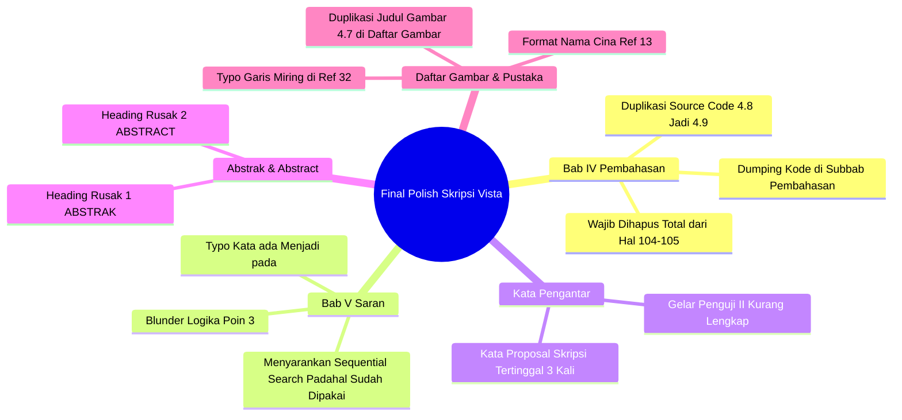

# 📋 LAPORAN AUDIT FORENSIK HASIL REVISI DRAF SKRIPSI PENDADARAN (PDD TAHAP 2)

**Mahasiswa Bimbingan:** Vista Mellyna Atsfi  
**NIM:** 2209106096  
**Program Studi:** S1 Informatika, Fakultas Teknik, Universitas Mulawarman  
**Dosen Pembimbing I:** Anton Prafanto, S.Kom., M.T. (NIP: 199310222019031016)  
**Dosen Pembimbing II:** Ir. Novianti Puspitasari, S.Kom., M.Eng. (NIP: 198811062015042002)  
**Dosen Penguji I:** Prof. Dr. Anindita Septiarini, S.T., M.Cs. (NIP: 197809182003122001)  
**Dosen Penguji II:** Andi Tejawati, S.Kom., M.Si., M.Kom. (NIP: 197103232001122001)  
**Judul Skripsi:** *Sistem Pengelolaan Data Praktikan dengan Algoritma Merge Sort dan Sequential Search Berbasis Web*  
**Naskah yang Diaudit:** `rev_Draft Skripsi Vista Mellyna Atsfi 2209106096_PDD.pdf` (142 Halaman / 112 Halaman Bernomor Arab)  
**Tanggal Audit:** 29 September 2026  
**Status Evaluasi:** 🟢 **ACC PRA-JILID DENGAN PERBAIKAN MINOR TEKNIS / TYPO / DUPLIKASI KODE (SIAP TANDA TANGAN SETELAH 5 BUTIR DIKOREKSI)**

---

> [!NOTE]
> **Petunjuk Mahasiswa:** Laporan ini merupakan audit forensik akademik lanjutan terhadap naskah revisi kedua (142 halaman) yang kamu serahkan. Secara substansi komputasi dan metodologi, **kamu telah bekerja sangat keras dan berhasil memperbaiki hampir seluruh catatan revisi Dewan Penguji dan Dosen Pembimbing**. Laporan ini memetakan hasil evaluasi perbaikan tersebut serta menyajikan panduan konkret untuk membersihkan **5 butir kelalaian teknis/redaksional terakhir** agar naskahmu sempurna, profesional, dan siap ditandatangani serta dijilid *hard cover*.

---

## 🌟 1. Resume Evaluasi Hasil Revisi & Apresiasi Dosen Pembimbing

Tim Pembimbing memberikan apresiasi tinggi kepada Saudari **Vista Mellyna Atsfi** karena menunjukkan tanggung jawab akademik dan ketelitian rekayasa perangkat lunak yang sangat baik dalam merespons catatan revisi sidang pendadaran:

### Kemajuan Sangat Signifikan yang Berhasil Dituntaskan:
1. **Repositori GitHub Berhasil Menjadi Publik (ACC):** Tautan repositori kode sumber [https://github.com/VistaAtsfi/praktikum-fisdas](https://github.com/VistaAtsfi/praktikum-fisdas) yang sebelumnya berstatus *Private (Error 404)* kini telah diubah menjadi **PUBLIC** dan dapat diakses bebas oleh dewan penguji maupun akademisi luar.
2. **Restrukturisasi Total DFD Level 2 (ACC):** Seluruh kelemahan struktural pada DFD Level 2 (Gambar 3.5, 3.6, dan 3.7) telah digambar ulang secara rapi:
   * Entitas luar ganda di bagian bawah Gambar 3.5 telah dihapus dan jalurnya disatukan ke bagian atas.
   * Subproses login yang keliru pada Gambar 3.6 telah diubah menjadi proses fungsional `2.5 Pengelolaan Profil/Data Pengguna`, serta nama *data store* diselaraskan menjadi `TB_PRAKTIKAN`, `TB_KOOR_PRAKTIKUM`, dan `TB_ASISTEN`.
   * Simbol data store melayang pada Gambar 3.7 telah dihilangkan dan relasi data store diselaraskan dengan DFD Level 1 (`PENILAIAN` dan `NILAI`).
3. **Penyempurnaan Grafik Memori ke Skala Logaritmik (ACC):** Grafik Gambar 4.31 telah diperbarui menggunakan **Skala Logaritmik (*Logarithmic Scale*)**, sehingga kurva penggunaan memori *Sequential Search* (~0,5 KB) berwarna hijau kini terlihat nyata perbandingannya dan tidak lagi terhimpit di garis dasar nol.
4. **Perluasan Spesifikasi Dataset pada Bagian Saran (ACC):** Saran penelitian telah dilengkapi rentang dataset bertingkat berskala besar (**10.000, 25.000, 50.000, hingga 100.000 entri**) dan urgensi pengujian ambang batas *memory exhaustion*.
5. **Pembersihan Layout Ekstrim Daftar Pustaka (ACC):** Spasi menganga ekstrim, judul referensi yang terpotong satu kata per baris, dan duplikasi awalan `https://doi.org/https://doi.org/` telah berhasil dirapikan secara drastis.

---

## 📊 2. Matriks Verifikasi Pemenuhan Catatan Dewan Penguji & Pembimbing

Berikut adalah rekapitulasi status verifikasi terhadap catatan revisi asli masing-masing penguji dan pembimbing:

| Dosen Penilai | Bagian Naskah | Catatan Revisi Asli | Status Verifikasi | Hasil Evaluasi Audit Draf Terbaru |
| :--- | :--- | :--- | :---: | :--- |
| **Prof. Dr. Anindita Septiarini**<br>*(Penguji I)* | **BAB III** | Perbaiki DFD Level 2 | 🟢 **TUNTAS (ACC)** | Seluruh DFD Level 2 (Gambar 3.5, 3.6, 3.7) telah digambar ulang mengikuti kaidah baku *Data Flow Diagram*. Anomali entitas duplikat, login proses, dan *data store* melayang telah bersih. |
| **Andi Tejawati, S.Kom., M.Si., M.Kom.**<br>*(Penguji II)* | **BAB V (Saran)** | Lebih spesifik berapa dataset yang disarankan untuk penelitian selanjutnya | 🟢 **TUNTAS (ACC)** | Mahasiswa telah menambahkan variasi bertingkat spesifik: 10k, 25k, 50k, hingga 100k entri serta analisis *memory exhaustion threshold* pada server PHP/Laravel. |
| **Anton Prafanto, S.Kom., M.T.**<br>*(Pembimbing I)* | **Lampiran 1** | Tambahkan link GitHub di lampiran | 🟢 **TUNTAS (ACC)** | Tautan repositori GitHub telah aktif, berstatus *Public*, dan memuat kode sumber Laravel 10 lengkap beserta seeder dan artisan command pengujian. |
| **Anton Prafanto, S.Kom., M.T.**<br>*(Pembimbing I)* | **BAB III (Gambar)** | Perbaiki resolusi gambar supaya terlihat lebih jelas, 800 DPI | 🟡 **Cukup (Perlu Cek Cetak)** | DFD sudah beresolusi tajam (1.300 px). Namun beberapa tangkapan wireframe (Gambar 3.12–3.17) masih beresolusi 72–96 DPI (~500–700 px). Pastikan saat cetak fisik A4 teksnya terbaca jelas. |
| **Ir. Novianti Puspitasari, S.Kom., M.Eng.**<br>*(Pembimbing II)* | **BAB IV (Grafik)** | Ubah grafik batang di Penggunaan Memori menjadi grafik lain agar Sequential Search dan warnanya hijau terlihat | 🟢 **TUNTAS (ACC)** | Gambar 4.31 telah menggunakan grafik garis dengan skala logaritmik dan warna hijau cerah yang terlihat jelas pada kisaran 0,37–0,50 KB. |
| **Ir. Novianti Puspitasari, S.Kom., M.Eng.**<br>*(Pembimbing II)* | **Daftar Pustaka** | Perbaiki menjadi rata kanan kiri | 🟢 **TUNTAS (ACC)** | Format rata kanan-kiri (Justify) dan *hanging indent* telah rapi, tidak ada lagi kalimat pecah per kata. Hanya menyisakan 2 typo kecil pada URL Ref 32 dan Ref 13. |
| **Ir. Novianti Puspitasari, S.Kom., M.Eng.**<br>*(Pembimbing II)* | **BAB III & IV** | Perbaiki caption urutan gambar | 🟡 **90% Tuntas** | Sebagian besar gambar telah menyatu dengan naskah. Masih terdapat sedikit pergeseran pada Gambar 3.8 dan duplikasi judul Gambar 4.7 di Daftar Gambar. |

---

## 🚨 3. 5 Temuan Kritis Kelalaian Teknis (*Final Polish Checklist*)

Meskipun substansi skripsi sudah sangat baik, terdapat **5 butir kesalahan teknis dan kelalaian redaksional** yang wajib kamu perbaiki di Microsoft Word sebelum berkas dicetak final:



---

### 🔴 1. [FATAL] Duplikasi Source Code 4.8 Menjadi 4.9 di Tengah Subbab Pembahasan (Hal. 104–105 / PDF 126–127)

* **Fakta Temuan:**
  * Pada Subbab 4.2.4 (Hal. 70–71 / PDF 92–93), kamu telah memuat **Source Code 4.8** (`Pencatatan Hasil Pengujian dan Status Warm-up`) yang berisi mekanisme penyimpanan data ke tabel `performance_logs`, `log_sortings`, dan `log_searches`.
  * Namun, pada Subbab 4.5 Pembahasan (Hal. 104–105 / PDF 126–127), secara tiba-tiba muncul potongan kode yang **sama persis** yang kamu beri nama **Source Code 4.9** (`Pencatatan Hasil Pengujian Algoritma pada Tabel Log`), lengkap dengan teks penjelasan di bawahnya yang juga merupakan hasil *copy-paste* identik!
* **Dampak Akademik:**
  1. Meletakkan potongan *source code* kodingan mentah di dalam **Subbab Pembahasan (Discussion)** merupakan pelanggaran struktur karya ilmiah. Pembahasan berisi interpretasi hasil, sintesis teori, dan analisis perbandingan, bukan tempat menaruh kodingan.
  2. Duplikasi kode yang sama persis menunjukkan kecerobohan *copy-paste* saat pengeditan dokumen.
* **Instruksi Tindakan Wajib:**
  1. **HAPUS TOTAL** blok kode `Source Code 4.9` beserta paragraf penjelasnya di Hal. 104–105 (PDF Hal. 126–127).
  2. Buka halaman **DAFTAR KODE** di bagian depan (Hal. xiii / PDF Hal. 15), hapus baris `Source Code 4.9 Pencatatan Hasil Pengujian Algoritma pada Tabel Log ... 104`. Daftar Kode kini hanya berakhir pada **Source Code 4.8**.

---

### 🔴 2. [FATAL] Blunder Logika di Saran Poin 3 & Typo Poin 1 (Bab V, Hal. 107 / PDF Hal. 129)

* **Fakta Temuan Blunder Logika (Poin 3):**
  Kamu menuliskan teks saran nomor 3 sebagai berikut:
  > *"3. Pengembangan sistem selanjutnya dapat menambahkan perbandingan dengan algoritma pengurutan lain (seperti Bubble Sort) dan **algoritma pencarian lain (seperti Sequential Search)** untuk memperkaya analisis efisiensi pada sistem informasi berbasis web."*
  
  > [!WARNING]
  > **BLUNDER LOGIKA:** Skripsimu sendiri sudah mengimplementasikan dan meneliti **Sequential Search**! Bagaimana mungkin di bagian Saran kamu menyarankan peneliti selanjutnya untuk menguji *"algoritma pencarian lain seperti Sequential Search"*? Jika penguji membaca kalimat ini, kamu akan dinilai tidak fokus atau asal menyalin teks!

* **Fakta Typo (Poin 1):**
  Pada kalimat saran nomor 1 baris ke-5:
  > *"...penurunan performa algoritma O(n log n) pada Merge Sort dan **O(n) ada Sequential Search**..."*  
  > Kata **"ada"** seharusnya adalah kata depan **"pada"**.

* **Teks Perbaikan Resmi Bab V Subbab 5.2 (Tinggal Disalin):**
  Ganti butir saran nomor 1 dan nomor 3 menjadi teks berikut:
  > **1.** Penelitian selanjutnya disarankan untuk memperluas pengujian performa menggunakan variasi dataset skala besar secara bertingkat dan spesifik, seperti 10.000, 25.000, 50.000, hingga 100.000 data entri. Rentang pengujian yang lebih luas ini diperlukan untuk mengamati secara nyata titik infleksi (*divergence point*) penurunan performa algoritma *O(N log N)* pada Merge Sort dan *O(N)* **pada** Sequential Search, serta mendeteksi ambang batas kehabisan alokasi memori (*memory exhaustion threshold*) pada server berbasis PHP/Laravel sebelum sistem mengalami kegagalan proses (*fatal error*).  
  > ...  
  > **3.** Pengembangan sistem selanjutnya dapat menambahkan perbandingan dengan algoritma pengurutan lain (seperti Quick Sort, Heap Sort, atau Tim Sort) serta **algoritma pencarian lain (seperti Binary Search, Interpolation Search, atau Hash Table Search)** untuk memperkaya analisis efisiensi pengolahan data pada sistem informasi berbasis web.

---

### 🟠 3. [MAYOR] Teks "Proposal Skripsi" Tertinggal 3 Kali di Kata Pengantar (Hal. vii / PDF Hal. 8)

* **Fakta Temuan:**
  Pada Kata Pengantar, naskah ini masih memuat sisa kata dari masa seminar proposal:
  * Paragraf 1 baris ke-2: *"...sehingga dapat menyelesaikan **proposal skripsi** dengan judul..."*
  * Paragraf 1 baris ke-4: *"...**Proposal ini** disusun sebagai salah satu tahapan dalam menyelesaikan skripsi..."*
  * Paragraf 2 baris ke-3: *"...selama proses penyusunan **proposal skripsi**, kepada:..."*
* **Instruksi Tindakan Wajib:**
  Ganti seluruh kata tersebut menjadi **skripsi** sehingga berbunyi:
  * *"...sehingga penulis dapat menyelesaikan **skripsi** dengan judul..."*
  * *"**Skripsi ini** disusun sebagai salah satu syarat untuk memperoleh gelar Sarjana Komputer pada Fakultas Teknik, Universitas Mulawarman."*
  * *"...selama proses penyusunan **skripsi ini**, kepada:..."*
* **Koreksi Tambahan Gelar Dosen Penguji II (Butir 7):**
  * Tertulis: `7. Ibu Andi Tejawati, M.Si., selaku Penguji II...`
  * Lengkapi gelarnya sesuai SK resmi Fakultas: **Ibu Andi Tejawati, S.Kom., M.Si., M.Kom.**

---

### 🟠 4. [MAYOR] Glitch Penomoran Heading Otomatis di Abstrak & Abstract (Hal. v & vi / PDF Hal. 6 & 7)

* **Fakta Temuan:**
  Karena penomoran otomatis (*Heading 1*) di Microsoft Word masih aktif saat membuat halaman ringkasan naskah, muncul baris judul ganda yang rusak:
  * Di halaman Abstrak (Hal. v):
    ```text
    ABSTRAK
    1 ABSTRAK
    ```
  * Di halaman Abstract berbahasa Inggris (Hal. vi):
    ```text
    ABSTRACT
    2 ABSTRACT
    ```
* **Instruksi Tindakan Wajib:**
  1. Hapus teks `1 ABSTRAK` pada halaman v.
  2. Hapus teks `2 ABSTRACT` pada halaman vi.
  3. Pastikan judul halaman hanya satu kata: **ABSTRAK** (cetak tebal, huruf kapital, posisi tengah) dan **ABSTRACT** (cetak tebal, huruf kapital, miring, posisi tengah).

---

### 🟡 5. [SEDANG] Duplikasi Judul di Daftar Gambar & Typo URL Referensi

#### A. Duplikasi di Daftar Gambar (Hal. xii / PDF Hal. 13)
* Pada halaman Daftar Gambar masih tertulis:
  ```text
  Gambar 4.7 Halaman Materi Praktikum Praktikan ........................................ 76
  Gambar 4.8 Halaman Materi Praktikum Praktikan ........................................ 76
  ```
* Faktanya, di naskah Bab IV hal 76 (PDF Hal. 98), Gambar 4.7 adalah **Halaman Beranda Praktikan**.
* **Solusi di Word:** Buka halaman Daftar Gambar -> Klik kanan pada tabel daftar gambar -> Pilih **Update Field** -> Pilih **Update entire table** (Perbarui seluruh tabel) agar judul Gambar 4.7 otomatis terkoreksi.

#### B. Crop Tombol UI pada Gambar 4.31 (Hal. 99 / PDF Hal. 121)
* Gambar 4.31 skala logaritmiknya sudah sangat bagus dan jelas. Namun di bagian atas gambar masih terdapat tombol filter dashboard web: `[Semua Metode] [Sorting] [Searching] [Skala Logaritmik: Aktif]`.
* **Saran Estetika:** Lakukan *crop* (pemotongan) sekitar 1–1,5 cm pada bagian atas gambar untuk membuang tombol-tombol navigasi tersebut sehingga yang tampil di skripsi murni hanya grafik garis dan legendanya.

#### C. Sedikit Typo pada Daftar Pustaka (Hal. 110 & 112 / PDF Hal. 132 & 134)
1. **Referensi No. 13 (Liu Peike):**
   * *Naskah:* `Liu Peike. (2024). An in-depth study of sorting algorithms...`
   * *Koreksi:* Sesuai kaidah penulisan nama ilmiah, nama keluarga diletakkan di depan. Ubah menjadi:  
     **Liu, P. (2024).** *An in-depth study of sorting algorithms.* ... Dan pada sitasi di Bab II hal 14 ubah `(Liu Peike, 2024)` menjadi **(Liu, 2024)**.
2. **Referensi No. 32 (Werner et al.):**
   * *Naskah:* Ada tanda garis miring di depan URL: `/https://github.com/wernerth94/...`
   * *Koreksi:* Hapus garis miring di depan URL sehingga menjadi: **https://github.com/wernerth94/A-Cross-Domain-Benchmark-for-Active-Learning**.

---

## 📋 4. Matriks Checklist Eksekusi Final Mahasiswa (*Action Plan Pra-Jilid*)

Gunakan daftar centang (*checklist*) berikut saat kamu membuka berkas `.docx` di Microsoft Word. Seluruh proses perbaikan ini **hanya membutuhkan waktu sekitar 30–60 menit**:

| No | Lokasi Halaman | Tindakan Koreksi Mahasiswa | Status |
| :---: | :--- | :--- | :---: |
| **1** | **Hal. v & vi (PDF 6 & 7)** | Hapus teks angka otomatis `1 ABSTRAK` dan `2 ABSTRACT`. | [ ] |
| **2** | **Hal. vii (PDF 8)** | Ganti 3 kata "proposal skripsi" menjadi **skripsi**; lengkapi gelar Bu Andi: `Andi Tejawati, S.Kom., M.Si., M.Kom.`. | [ ] |
| **3** | **Hal. xii (PDF 13)** | *Update entire table* pada Daftar Gambar agar judul Gambar 4.7 berubah menjadi *Halaman Beranda Praktikan*. | [ ] |
| **4** | **Hal. xiii (PDF 15)** | Hapus baris `Source Code 4.9` dari Daftar Kode. | [ ] |
| **5** | **Hal. 99 (PDF 121)** | *(Opsional/Disarankan)* Crop tombol filter UI web di bagian atas grafik Gambar 4.31. | [ ] |
| **6** | **Hal. 104–105 (PDF 126–127)** | **HAPUS TOTAL** potongan kode duplikat `Source Code 4.9` beserta narasi penjelasnya dari Subbab Pembahasan. | [ ] |
| **7** | **Hal. 107 (PDF 129)** | Koreksi Saran butir 1 (`ada` → `pada`) dan perbaiki blunder Saran butir 3 (ganti Sequential Search dengan *Binary/Interpolation Search*). | [ ] |
| **8** | **Hal. 110 & 112 (PDF 132 & 134)** | Hapus slash `/` di awal link Ref 32 dan ubah nama Ref 13 menjadi `Liu, P. (2024)`. | [ ] |
| **9** | **Hal. iii (PDF 4)** | Isi tanggal ujian riil pada Halaman Pengesahan (misal: *Samarinda, 18 September 2026*). | [ ] |

---

## ⚖️ 5. Rekomendasi Keputusan Pembimbing I

Berdasarkan evaluasi forensik terhadap draf revisi kedua Saudari **Vista Mellyna Atsfi (NIM: 2209106096)**:

> [!TIP]
> **REKOMENDASI KELAYAKAN: ACC REVISI PENDADARAN PRA-JILID (SIAP TANDA TANGAN FINAL)**  
> 1. Dosen Pembimbing I menyatakan bahwa **substansi teknis, koding, pengujian algoritma, dan perbaikan DFD naskah ini SUDAH MEMENUHI SYARAT KELULUSAN S1 INFORMATIKA**.
> 2. Saudari Vista Mellyna Atsfi diwajibkan menyelesaikan **9 butir checklist perbaikan redaksional/teknis di atas** dalam dokumen Word.
> 3. Setelah 9 butir tersebut diperbaiki dan diekspor ke PDF final, mahasiswa dapat langsung menemui Tim Pembimbing dan Penguji untuk **meminta tanda tangan basah / pengesahan digital pada Lembar Pengesahan**, kemudian melanjutkan proses penjilidan *hard cover* (jilid lux) sesuai ketentuan Fakultas Teknik Universitas Mulawarman.

---
*Dokumen audit akademik ini diterbitkan di Samarinda, 29 September 2026 oleh Dosen Pembimbing I (Anton Prafanto, S.Kom., M.T.).*
