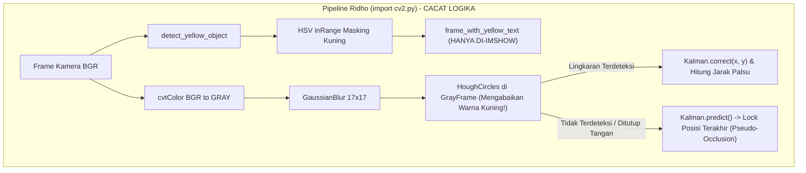
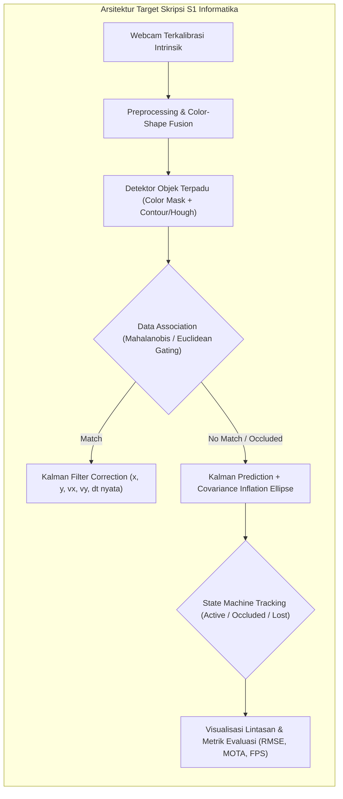

# 📋 LAPORAN AUDIT AKADEMIK & FORENSIK TEKNIS
## Penilaian Draf Tugas Akhir D3 & Evaluasi Eksperimen Awal Skripsi S1

**Mahasiswa:** Ridho Putra Darma  
**NIM S1 Informatika UNMUL:** 2509106133 (Mahasiswa Program Alih Jenjang Angkatan 2025)  
**NIM Asal D3 Polnes:** 216201028 (D3 Teknik Komputer, Jurusan Teknologi Informasi, Politeknik Negeri Samarinda)  
**Dosen Pembimbing / Pendamping:** Anton Prafanto, S.Kom., M.T.  
**Dokumen yang Diaudit:**
1. Laporan Tugas Akhir D3: `Ridho Putra Darma 216201028 TK6B Deteksi Bola menggunakan opencv (1).pdf` (60 Halaman, 2024)
2. Berkas Kode Eksperimen Python: `import cv2.py` (Kode uji pelacakan bola + Kalman Filter)
3. Log Komunikasi & Bukti Pengujian: Tangkapan layar chat WhatsApp & foto uji coba mandiri mahasiswa  

**Status Evaluasi:** **PERLU REKONSTRUKSI TOTAL (MAJOR RESTRUCTURING & RIGOROUS METHODOLOGY REDESIGN)**  
*Draf TA D3 tidak memenuhi standar kelayakan Skripsi S1 Informatika. Kode eksperimen awal menunjukkan pemahaman parsial (*pseudo-tracking*) yang perlu diluruskan secara metodologis sebelum penyusunan Proposal Skripsi S1.*

---

## 🧭 1. Latar Belakang & Konteks Akademik

Ridho Putra Darma adalah mahasiswa jalur alih jenjang (transfer dari D3 Politeknik Negeri Samarinda ke S1 Informatika Universitas Mulawarman) dengan NIM `2509106133`. Mahasiswa bermaksud melanjutkan topik Tugas Akhir D3-nya (*Deteksi Bola Menggunakan OpenCV*) untuk dijadikan Skripsi S1 dengan bimbingan Anton Prafanto, S.Kom., M.T.

Berdasarkan komunikasi awal:
1. Dosen Pembimbing telah menegaskan bahwa laporan TA D3 **tidak dapat digunakan apa adanya** karena S1 mensyaratkan *novelty* (kebaruan ilmiah), metodologi komputasional yang kokoh, serta pengujian yang komprehensif.
2. Dosen Pembimbing menawarkan tiga opsi pengembangan:
   - *Opsi A:* Deteksi Deep Learning (YOLOv8/v11 Nano vs Metode Klasik).
   - *Opsi B:* Integrasi Tracking Dinamis & Kalman Filter untuk mengatasi oklusi (*occlusion handling*).
   - *Opsi C:* Implementasi sistem fisik (kamera pan-tilt / robotika).
3. Mahasiswa memilih **Opsi B (Kalman Filter)** dan telah menyerahkan purwarupa kode awal (`import cv2.py`) serta tangkapan layar pengujian mandiri.

Laporan audit ini menyajikan evaluasi mendalam atas dua komponen: **(1) Kualitas Naskah TA D3 Asal**, dan **(2) Validitas Logika & Algoritma Kode `import cv2.py`**.

---

## 🔍 2. Audit Forensik Naskah Tugas Akhir D3 (60 Halaman)

Pemeriksaan komparatif terhadap berkas PDF 60 halaman memperlihatkan bahwa naskah tersebut memiliki banyak kelemahan substansial dan cacat editorial yang fatal jika dipandang dari kacamata karya ilmiah jenjang sarjana (S1).

### 2.1. Cacat Integritas Dokumen & Ketidaktelitian Ekstrem
* **Anomali Template Program Studi Lain (Halaman iv / Halaman 4):**  
  Pada lembar pengesahan judul bahasa Inggris (*A Final Project Report*), tertulis secara gamblang:
  > *"In Partial Fulfillment of a Three-Year Diploma Program of Business English of State Polytechnic of Samarinda"*  
  Hal ini mengindikasikan mahasiswa melakukan *copy-paste* draf format dari jurusan **Bahasa Inggris Bisnis (Business English)** tanpa membaca dan memeriksa kembali naskahnya sebelum dicetak/disahkan.
* **Kerusakan Formula Matematis (Halaman 25):**  
  Pada sub-bab 2.5 ("Rumus Kartasia" — maksudnya Sistem Koordinat Kartesius), formula lingkaran tertulis rusak akibat kesalahan encoding simbol font:
  $$\text{Tertulis di naskah: } (? \; ? \; ?)^2 + (? \; ? \; ?)^2 = ?^2$$
* **Duplikasi Teks Paragraf (Halaman 28):**  
  Pada sub-bab 3.6 ("Jangkauan Penelitian"), seluruh isi paragraf pertama di-copy-paste ulang persis dua kali berturut-turut pada halaman yang sama.
* **Gaya Bahasa & Typo Masif:**  
  Naskah dipenuhi kesalahan ketik yang mengganggu standar akademik, antara lain: `indetefikasi`, `koordinaatnya`, `dignakan`, `dapa didapatkan`, `se b agai`, `fra me_with_yellow_text`, serta spasi acak sebelum tanda baca.

### 2.2. Kelemahan Metodologis Mendasar
* **Kekeliruan Identifikasi Variabel (Halaman 26–27):**  
  Mahasiswa menuliskan Variabel Bebas adalah *"Deteksi"* dan Variabel Kontrol adalah *"Bola"*. Ini mencerminkan miskonsepsi fundamental terkait metodologi penelitian sains/rekayasa informatika. Variabel bebas seharusnya mencakup parameter pencahayaan (Lux), kecepatan gerak objek (m/s), jarak fisik ($d$), dan persentase oklusi ($0\%\dots 100\%$), sedangkan variabel terikat adalah performa deteksi (IoU, Euclidean Error, FPS, Recall).
* **Kesimpulan Berisi Potongan Kode Sintaks (Halaman 55–56):**  
  Bab V ("Kesimpulan") bukannya memaparkan temuan ilmiah kuantitatif dari hasil eksperimen, melainkan meng-copy-paste potongan baris kode fungsi Python (`def calculate_distance(...)`, `if circles is not None...`).

### 2.3. Tingkat Kesulitan Rendah (Sub-Standar untuk S1)
Substansi TA D3 tersebut hanya menerapkan fungsi bawaan pustaka OpenCV (`cv2.HoughCircles` dan `cv2.inRange`) di atas webcam laptop statis. Tidak ada pembuktian *state-of-the-art*, tidak ada pembanding model, dan tidak ada evaluasi statistik. **Naskah ini mutlak harus ditulis ulang dari nol dengan kerangka metodologi penelitian S1 Informatika UNMUL.**

---

## 💻 3. Audit Kritis Kode Eksperimen (`import cv2.py`)

Mahasiswa telah berusaha memodifikasi kodenya dengan menambahkan pustaka `cv2.KalmanFilter(4, 2)`. Namun, audit terhadap source code `import cv2.py` dan bukti visual yang dikirimkan menemukan **4 kegagalan logika kritis**:



### 🚨 Isu 1: Pipeline Terputus (*Fatally Decoupled Pipeline*)
Perhatikan baris 24–30 dan baris 57–71:
```python
# Fungsi warna dibuat:
def detect_yellow_object(frame):
    lower_yellow = np.array([20, 100, 100])
    upper_yellow = np.array([30, 255, 255])
    hsv_frame = cv2.cvtColor(frame, cv2.COLOR_BGR2HSV)
    yellow_mask = cv2.inRange(hsv_frame, lower_yellow, upper_yellow)
    yellow_result = cv2.bitwise_and(frame, frame, mask=yellow_mask)
    return yellow_result

# Di dalam loop utama:
frame_with_yellow_text = detect_yellow_object(frame) # HANYA DISIMPAN DI VARIABEL
grayFrame = cv2.cvtColor(frame, cv2.COLOR_BGR2GRAY)   # PROSES DILAKUKAN DARI FRAME UTUH
blurFrame = cv2.GaussianBlur(grayFrame, (17, 17), 0)
circles = cv2.HoughCircles(blurFrame, cv2.HOUGH_GRADIENT, ...)
```
* **Kecacatan:** Hasil segmentasi masker kuning (`yellow_result` / `yellow_mask`) sama sekali **tidak pernah dimasukkan** ke dalam deteksi lingkaran! `cv2.HoughCircles` dijalankan langsung pada citra grayscale biasa (`grayFrame`).
* **Dampak Fatal:** Algoritma akan mendeteksi lingkaran apapun di ruangan (bola warna lain, roda, kepala, piring, tutup botol putih). Masker kuning hanya menjadi hiasan jendela visualisasi sampingan (`cv2.imshow("Deteksi Warna Kuning", ...)`).

### 🚨 Isu 2: Ilusi Pelacakan Oklusi (*Pseudo-Occlusion Fallacy*)
Pada chat WhatsApp, mahasiswa mengirim foto memegang **tutup botol obat kecil** dalam keadaan diam di depan webcam, lalu menutupinya dengan telapak tangan, dan berseru bangga karena muncul label *"Predicting (Occluded)"*.

* **Fakta Matematika di Balik Kode:**
  1. Objek dipegang **statis/diam** dengan tangan. Kecepatan estimasi Kalman adalah $v_x \approx 0, v_y \approx 0$.
  2. Saat objek ditutup telapak tangan, `circles is None` (deteksi hilang).
  3. Baris 74 memanggil `predicted = kalman.predict()`.
  4. Karena matriks transisi adalah:
     $$\mathbf{x}_{t+1} = \begin{bmatrix} 1 & 0 & 1 & 0 \\ 0 & 1 & 0 & 1 \\ 0 & 0 & 1 & 0 \\ 0 & 0 & 0 & 1 \end{bmatrix} \begin{bmatrix} x_t \\ y_t \\ v_{xt} \\ v_{yt} \end{bmatrix} = \begin{bmatrix} x_t + v_{xt} \\ y_t + v_{yt} \\ v_{xt} \\ v_{yt} \end{bmatrix}$$
     Dengan $v_{xt} \approx 0, v_{yt} \approx 0$, maka posisi prediksi adalah:
     $$x_{t+1} \approx x_t, \quad y_{t+1} \approx y_t$$
  5. Akibatnya, titik prediksi Kalman **terpaku diam persis di koordinat terakhir**.
  6. Mahasiswa mengira Kalman Filter telah "sukses melacak saat terhalang", padahal itu hanyalah retensi memori koordinat statis (*last known coordinate lock*).
* **Ketiadaan Uji Dinamis Riil:** Jika objek dilemparkan atau menggelinding melewati penghalang (misal bergerak dari kiri ke kanan lalu tertutup papan rintangan), kode mahasiswa akan gagal memprediksi karena:
  - $\Delta t$ diasumsikan konstan integer $1$, tidak berbasis waktu fisik riil (`dt = current_time - prev_time`).
  - Tidak ada validasi inersia, perlambatan gesek (*damping*), maupun lintasan balistik/parabola.

### 🚨 Isu 3: Ketiadaan *Track Lifecycle Management* (*Ghost Tracking*)
* Pada baris 112–117:
  ```python
  if not ball_detected and kalman_initialized:
      cv2.circle(frame, (pred_x, pred_y), 25, (255, 255, 0), 2)
      cv2.putText(frame, "Predicting (Occluded)", ...)
  ```
* Jika bola dipindahkan atau disembunyikan selama 1 jam, lingkaran prediksi akan terus digambar selamanya (*ghost tracking*).
* Tidak ada mekanisme `max_lost_frames` (misal setelah 30 frame hilang, status menjadi *LOST* dan tracker di-reset).
* Tidak ada mekanisme *Data Association* (Hungarian algorithm atau Distance Gating). Jika ada bola lain atau noise lingkaran muncul di sudut lain, filter akan langsung meloncat tanpa verifikasi.

### 🚨 Isu 4: Perhitungan Jarak Geometris Tanpa Kalibrasi Kamera
* Pada fungsi `calculate_distance`:
  ```python
  actual_ball_diameter_cm = 10.0  # Asumsi bola 10 cm
  focal_length = 500.0            # Angka tebakan asal
  distance = (actual_ball_diameter_cm * focal_length) / (2 * radius_in_pixels)
  ```
* Nilai $f = 500.0$ hanyalah angka fiktif yang tidak melalui prosedur kalibrasi kamera (matriks intrinsik $\mathbf{K}$ via metode papan catur Zhang).
* Objek yang diuji mahasiswa adalah botol obat berdiameter $\approx 3$ cm, bukan bola 10 cm. Maka output teks `Distance: XX.XX cm` pada layar 100% salah secara ilmiah.

---

## 🏗️ 4. Rekomendasi Restrukturisasi Menuju Skripsi S1

Agar topik ini layak menjadi Skripsi S1 Informatika di Universitas Mulawarman, mahasiswa wajib diarahkan untuk melakukan transformasi riset yang terukur dan terstruktur.



### 4.1. Usulan Judul Skripsi S1 yang Representatif & Ilmiah
1. **Opsi 1 (Fokus Pelacakan Dinamis & Oklusi):**  
   *"Rancang Bangun Sistem Pelacakan Bola Dinamis Real-Time Menggunakan Kombinasi Segmentasi Citra dan Filter Kalman Terhadap Variasi Oklusi"*
2. **Opsi 2 (Fokus Komparasi & Optimasi):**  
   *"Analisis Kinerja Algoritma Kalman Filter dalam Memprediksi Lintasan Objek Bergerak Cepat Berbasis Computer Vision pada Kondisi Oklusi Sementara"*

### 4.2. Perbaikan Teknis pada Pipeline Kode (Prasyarat Revisi)
1. **Penyatuan Pipeline Warna & Bentuk (*Coupled Pipeline*):**  
   `HoughCircles` atau `findContours` harus dijalankan **pada citra hasil masking warna**, bukan pada citra grayscale mentah.
2. **Implementasi $\Delta t$ Fisik Riil:**  
   Menghitung waktu delta per frame:
   $$\Delta t = t_{\text{sekarang}} - t_{\text{sebelumnya}}$$
   dan memperbarui matriks transisi $\mathbf{F}(\Delta t)$ secara dinamis di setiap iterasi.
3. **Mekanisme *Track Lifecycle* & *Occlusion State Machine*:**  
   - `ACTIVE`: Objek terdeteksi dan terasosiasi dengan measurement.
   - `OCCLUDED` (*Coasting*): Objek tidak terdeteksi, posisi diproyeksikan oleh Kalman, counter $N_{\text{missed}} \le N_{\text{max}}$.
   - `LOST`: Objek hilang melebihi ambang batas frame ($N_{\text{missed}} > N_{\text{max}}$), tracker di-reset.
4. **Visualisasi Kovariansi (*Uncertainty Ellipse*):**  
   Saat oklusi terjadi, radius lingkaran ketidakpastian harus digambar membesar sesuai pertambahan nilai matriks kovariansi kesalahan $\mathbf{P}_t$, membuktikan pemahaman matematika Kalman Filter secara nyata.
5. **Kalibrasi Kamera Formal:**  
   Menggunakan modul `cv2.calibrateCamera()` dengan pola papan catur (*checkerboard*) untuk menentukan nilai *focal length* ($f_x, f_y$) dan titik pusat optik ($c_x, c_y$) yang presisi.

### 4.3. Desain Pengujian Eksperimental S1
Mahasiswa tidak boleh lagi menguji dengan memegang botol di depan wajah. Pengujian wajib memenuhi standar eksperimen:
* **Pengujian Lintasan Gerak:** Bola digulirkan pada bidang miring atau lintasan rel horizontal dengan kecepatan terukur.
* **Pengujian Oklusi Berjenjang:** Menggunakan papan penghalang dengan variasi lebar rintangan dan durasi oklusi (0.5 detik, 1.0 detik, 2.0 detik).
* **Metrik Evaluasi Kuantitatif:**
  - *Tracking Accuracy / Euclidean Error:* Jarak selisih antara koordinat prediksi Kalman saat oklusi dengan posisi riil bola saat muncul kembali (*re-acquisition error*).
  - *Latency & Throughput:* FPS pemrosesan pada resolusi $640\times 480$ dan $1280\times 720$.

---
*Laporan audit ini disusun sebagai dokumen evaluasi resmi dan arsip akademik Program Studi S1 Informatika, Fakultas Teknik, Universitas Mulawarman.*

